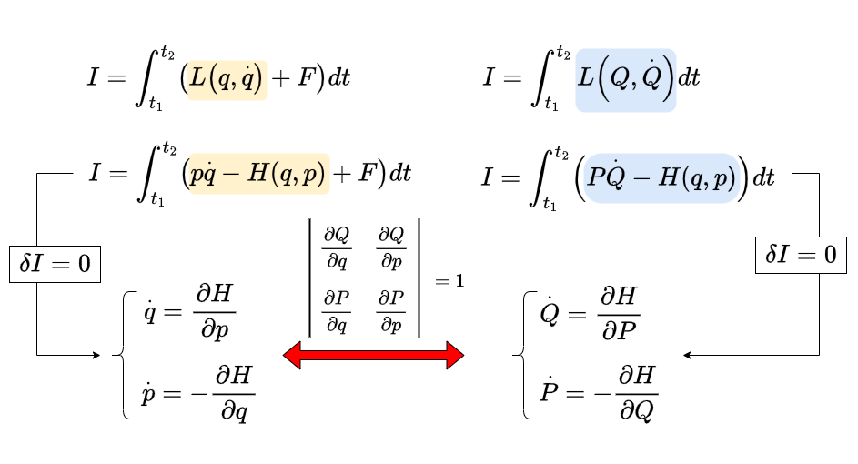

# 正準変換

* 正準変換
* 母関数

## 本章で学ぶこと

ニュートンの運動方程式からラグランジュ形式の運動方程式に移ったのは、点変換という任意の座標変換について運動方程式の形が共変となるからであった。さらに、ラグランジアンをルジャンドル変換することによってハミルトニアンを作ると、座標と運動量が混ざるような、より広い変数変換を許容することになる。この、ハミルトンの運動方程式を共変に保つような変数変換を正準変換と呼ぶ。以下では正準変換を様々な角度から考察する。

## 正準変換

オイラー・ラグランジュ方程式は一般化座標について任意の変換(点変換)を行っても方程式の形が変わらなかった。ハミルトンの運動方程式は、点変換のみならず、$p$ と$q$ を混ぜるような、より広い範囲の変換について共変となる。しかし、その変換は完全に任意というわけではなく、その変換規則には制限がつく。いま、変数変換 $(q,p) \rightarrow (Q, P)$ により、ハミルトンの運動方程式が共変に保たれるためには、どのような条件が必要であるかを調べてみよう。

新たな変数$(Q, P)$は、元の変数 $(q,p)$の関数である。例えば、関数$f,g$ を用いて

$$
\begin{aligned}
Q &= f(q,p) \\
P &= g(q,p)
\end{aligned}
$$

などと表せる時、この$f, g$を$Q, P$と同一視し、

$$
\begin{aligned}
Q &= Q(q,p) \\
P &= P(q,p)
\end{aligned}
$$

と同じ記号を使って書く。$P$ は新たな変数でもあるし、変換を表す関数でもある。また、$(p,q) \rightarrow (P,Q)$ の逆変換 $(P,Q) \rightarrow (p,q)$ を考える。やはりこの場合も関数$F,G$を用いて

$$
\begin{aligned}
q &= F(Q,P) \\
p &= G(Q,P)
\end{aligned}
$$

と書ける時に、$F,G$を$q,p$と同一視する。

このような記号の節約が混乱しがちなのは、同じ関数を別の変数で表現したときだ。例えば $(q,p)$で表されたハミルトニアン $H(q,p)$を考える。このハミルトニアンを$(Q,P)$を使って書き直すには、$q = F(Q,P), p=G(Q,P)$を使って$q,p$に代入し

$$
H(q,p) = H(F(Q,P), G(Q,P))
$$

と書ける。右辺は変数 $(Q,P)$の関数であるから、

$$
H(q,p) = H(Q,P)
$$

と略記することもある。

問題となるのは、$(q,p)$ で記述されたハミルトニアンを $(Q,P)$ の関数だと思って微分する場合である。その際、変換と変数を同一視して、

$$
H(q,p) = H(q(Q,P), p(Q,P))
$$

と書いておき、

$$
\frac{\partial H}{\partial Q} = \frac{\partial H}{\partial q}\frac{\partial q}{Q}
+  \frac{\partial H}{\partial p}\frac{\partial p}{Q}
$$

と合成関数の偏微分ルールにより計算が可能となる。

このような記号の節約は混乱を招くこともあるが、記号を区別すると式が煩雑になるので、「これは変数であるから、関数であるか」を意識しながら計算を追って欲しい。

我々が調べたいことは、元の変数 $(q,p)$がハミルトンの運動方程式

$$
\begin{aligned}
\dot{q} &= \frac{\partial H}{\partial p} \\
\dot{p} &= -\frac{\partial H}{\partial q} \\
\end{aligned}
$$

を満たす時、新たな変数 $(Q,P)$ が同じ形の運動方程式

$$
\begin{aligned}
\dot{Q} &= \frac{\partial H}{\partial P} \\
\dot{P} &= -\frac{\partial H}{\partial Q} \\
\end{aligned}
$$

を満たすための条件、すなわちハミルトンの運動方程式が変数変換に対して共変となる条件である。まず、ハミルトニアンを$(Q,P)$で書いておく。そして$(Q,P)$を$(q,p)$の関数だと思って偏微分しよう。

$$
\begin{aligned}
\dot{q} &= \frac{\partial H}{\partial p} \\
&= \frac{\partial H(Q(q,p),P(q,p))}{\partial p} \\
&= \frac{\partial H}{\partial Q}\frac{\partial Q}{\partial p}
+ \frac{\partial H}{\partial P}\frac{\partial P}{\partial p}
\end{aligned}
$$

同様に、

$$
\begin{aligned}
\dot{p} &= -\frac{\partial H}{\partial q} \\
&= -\frac{\partial H}{\partial Q}\frac{\partial Q}{\partial q}
- \frac{\partial H}{\partial P}\frac{\partial P}{\partial q}
\end{aligned}
$$

次に、新たな変数$Q$の時間微分を考えよう。計算がごちゃごちゃしがちなので、丁寧に計算する。

$$
\begin{aligned}
\dot{Q} &= \frac{d}{dt} Q(q,p) \\
&= \frac{\partial Q}{\partial q}\dot{q} +\frac{\partial Q}{\partial p} \dot{p} \\
&= \frac{\partial Q}{\partial q} \underbrace{\left( \frac{\partial H}{\partial Q}\frac{\partial Q}{\partial p}
+ \frac{\partial H}{\partial P}\frac{\partial P}{\partial p} \right)}_{\dot{q}} \\
&- \frac{\partial Q}{\partial p} \underbrace{\left( \frac{\partial H}{\partial Q}\frac{\partial Q}{\partial q} + \frac{\partial H}{\partial P}\frac{\partial P}{\partial q} \right)}_{\dot{p}}\\
&=\cancel{\frac{\partial Q}{\partial q} \frac{\partial H}{\partial Q}\frac{\partial Q}{\partial p}} + \frac{\partial Q}{\partial q}\frac{\partial H}{\partial P}\frac{\partial P}{\partial p} \\
&- \cancel{\frac{\partial Q}{\partial p}\frac{\partial H}{\partial Q}\frac{\partial Q}{\partial q}} - \frac{\partial Q}{\partial p}\frac{\partial H}{\partial P}\frac{\partial P}{\partial q} \\
&= \frac{\partial H}{\partial P}\left(\frac{\partial Q}{\partial q}\frac{\partial P}{\partial p} - \frac{\partial Q}{\partial p}\frac{\partial P}{\partial q}   \right)
\end{aligned}
$$

詳細は省略するが$\dot{P}$も全く同様に計算できる。合わせて書くと、

$$
\begin{aligned}
\dot{Q} &=\frac{\partial H}{\partial P}\left(\frac{\partial Q}{\partial q}\frac{\partial P}{\partial p} - \frac{\partial Q}{\partial p}\frac{\partial P}{\partial q} \right) \\
\dot{P} &= -\frac{\partial H}{\partial Q}\left(\frac{\partial Q}{\partial q}\frac{\partial P}{\partial p} - \frac{\partial Q}{\partial p}\frac{\partial P}{\partial q} \right)
\end{aligned}
$$

したがって、変数変換$(p,q) \rightarrow (P,Q)$により、ハミルトンの運動方程式が共変であるためには、この変数変換が以下の条件を満たす必要がある。

$$
\frac{\partial Q}{\partial q}\frac{\partial P}{\partial p} - \frac{\partial Q}{\partial p}\frac{\partial P}{\partial q} = 1
$$

この条件を満たす変数変換を **正準変換(canonical transform)** と呼ぶ。先程の条件は、行列式の形にまとめることができる。

$$
\begin{vmatrix}
\partial_q Q & \partial_p Q \\
\partial_q P & \partial_p P
\end{vmatrix}
=1
$$

これは、変換$(p,q) \rightarrow (P,Q)$のヤコビアンに他ならない。すなわち、正準変換とは、変換のヤコビアンが1となるような変換のことである。逆に言えば、ヤコビアンが1でありさえすれば、どのような変換を行おうとハミルトンの運動方程式は共変である。点変換しか許容しなかったラグランジアンに比べて、変換の幅が広がったことがわかる。

いくつか正準変換の例を挙げよう。まずは座標を$Q=Q(q)$と変換する点変換を考えよう。もともとの系がラグランジアン$L(q, \dot{q})$に従っていたとすると、運動量の定義から

$$
p = \frac{\partial L}{\partial \dot{q}}
$$

である。ここで、$Q=Q(q)$を$Q$について解いて$q=q(Q)$とする。$\dot{q}$を計算すると

$$
\begin{aligned}
\dot{q} &= \frac{d q(Q)}{dt} \\
&= \frac{dq}{dQ}\dot{Q}
\end{aligned}
$$

$dq/dQ$は$Q$の関数であるから、$\dot{q}$は$Q$と$\dot{Q}$の両方に依存している。したがって、$\dot{q}(Q,\dot{Q})$と書ける。以上から、もとのラグランジアンを$(Q,\dot{Q})$の関数として表現すると、$L(q(Q), \dot{q}(Q,\dot{Q})$と書ける。

新たな運動量$P$は

$$
\begin{aligned}
P &= \frac{\partial}{\partial \dot{Q}} L(q(Q), \dot{q}(Q,\dot{Q}) \\
&= \underbrace{\frac{\partial L}{\partial \dot{q}}}_{=p}  \underbrace{\frac{d \dot{q}}{d \dot{Q}}}_{dq/dQ} \\
&= \frac{p}{Q'}
\end{aligned}
$$

と書ける。

$P$と$Q$の $(q,p)$依存性がわかったのでヤコビアンを計算してみよう。

$$
\begin{vmatrix}
\partial_q Q & \partial_p Q \\
\partial_q P & \partial_p P
\end{vmatrix} =
\begin{vmatrix}
Q' & 0 \\
\partial_q P & 1/Q'
\end{vmatrix}
=1
$$

すなわち、点変換は正準変換である。

次に以下の変換を考えよう。

$$
\begin{aligned}
Q &= p \\
P &= -q
\end{aligned}
$$

これは座標と運動量を入れ替えて、片方に負符号をつけたものだ。ヤコビアンは簡単に計算できて、

$$
\begin{vmatrix}
\partial_q Q & \partial_p Q \\
\partial_q P & \partial_p P
\end{vmatrix} =
\begin{vmatrix}
0 & 1 \\
-1 & 0
\end{vmatrix}
=1
$$

となるから、これは正準変換である。

もともと

$$
\begin{aligned}
\dot{q} &= \frac{\partial H}{\partial p} \\
\dot{p} &= -\frac{\partial H}{\partial q}
\end{aligned}
$$

が成り立っている時、$\dot{Q}, \dot{P}$を計算すると、

$$
\begin{aligned}
\dot{Q} &= \dot{p} = -\frac{\partial H}{\partial q} = \frac{\partial H}{\partial P} \\
\dot{P} &= -\dot{q} = - \frac{\partial H}{\partial p} =- \frac{\partial H}{\partial Q}
\end{aligned}
$$

と、新たな変数 $(Q,P)$も、ハミルトンの運動方程式に従うことがわかる。このように、正準変換は座標と運動量が入れ替わるような変換を許容する。

より一般に、座標と運動量を混ぜるような変換を考えよう。

$$
\begin{aligned}
Q &= \sqrt{2q} \cos p \\
P &= \sqrt{2q} \sin p
\end{aligned}
$$

ヤコビアンを計算すると、

$$
\begin{aligned}
\begin{vmatrix}
\partial_q Q & \partial_p Q \\
\partial_q P & \partial_p P
\end{vmatrix}
&=
\begin{vmatrix}
\displaystyle\frac{\cos p}{\sqrt{2q}} & - \sqrt{2q} \sin p \\
\displaystyle\frac{\sin p}{\sqrt{2q}} &  \sqrt{2q} \cos p
\end{vmatrix}\\
& = \cos^2 p + \sin^2 p\\
&=1
\end{aligned}
$$

すなわち、先程の変換は正準変換である。

## 母関数

ある変換$(q,p) \rightarrow (Q, P)$が正準変換であるとは、それぞれが正準方程式を満たす、すなわちこの変換が正準方程式を共変に保つことを指すのであった。一方、正準共役な変数$(q,p)$が満たす正準方程式は

$$
\begin{aligned}
\dot{q} &= \frac{\partial H}{\partial p} \\
\dot{p} &= -\frac{\partial H}{\partial q}
\end{aligned}
$$

であるが、これはもともと作用積分

$$
I = \int_{t_1}^{t_2} (p\dot{q} - H(q,p))dt
$$

の変分から得られたものであった。同様に変換後の変数$(Q,P)$が正準方程式を満たすならば、やはり作用積分

$$
I = \int_{t_1}^{t_2} (P\dot{Q} - H(Q,P))dt
$$

の変分$\delta I = 0$から得られる。したがって、正準方程式と作用積分は等価である。$N$ 自由度系の正準方程式では$2N$ 自由度の変数の間の関係を調べる必要があったが、変分原理まで戻ればスカラー関数一つについての等価性を調べれば良い。作用積分の被積分関数はスカラー関数であるから、正準変換$(q,p) \rightarrow (Q,P)$も、変分原理まで戻ればスカラー関数だけで考えられるはずである。すなわち、ハミルトニアンになんらかの関数$F$を加えた$H+F$について作用積分

$$
I = \int_{t_1}^{t_2} (p\dot{q} - H(q,p) + F(q,p))dt
$$

を考え、これを改めて新たな変数$(Q,P)$で

$$
I = \int_{t_1}^{t_2} (P\dot{Q} - H(Q,P))dt
$$

と書き直せたとする。後者については変分原理から$(Q,P)$に関する正準方程式を導くため、前者として正準方程式を変えないような$F$を探すことができれば、この変換は正準変換を導くことになる。

まず、自明な例として、ハミルトニアンに定数を加えても結果は変わらない。もう少し非自明な例として、作用積分に$q\dot{q}$という量を加えたものに対して変分を考えてみよう。

$$
\begin{aligned}
\delta(p\dot{q} - H + q \dot{q}) &= \delta(p\dot{q} - H ) + \delta(q\dot{q}) \\
&= \delta(p\dot{q} - H) + \dot{q}\delta q + q \delta \dot{q} \\
&= \delta(p\dot{q} - H) + \underbrace{\dot{q}\delta q - \dot{q} \delta q}_{=0}
\end{aligned}
$$

と、部分積分により付け加えた項がゼロになるため、項をつけわえる前と同じ正準方程式が得られる。すなわち、ハミルトニアン$H$に対して$H \rightarrow H - q\dot{q}$という変換は正準方程式を共変に保つため、正準変換を導く。

全く同様にして、$q$に関する任意の関数$W(q)$について、作用積分にその時間微分$dW/dt$を加えても正準方程式を変えないことがわかる。実際に

$$
\begin{aligned}
\delta\left(p\dot{q} - H + \frac{dW}{dt}\right)  &= \delta (p\dot{q} - H + W'(q) \dot{q})\\
&= \delta(p\dot{q} - H) + \delta (W'(q) \dot{q}) \\
&= \delta(p\dot{q} - H) + W''(q) \dot{q} \delta q + W'(q) \delta \dot{q} \\
&= \delta(p\dot{q} - H) + \underbrace{W''(q) \dot{q} \delta q - W''(q) \dot{q}\delta q}_{=0} \\
\end{aligned}
$$

となり、部分積分で消えてしまう。$W$が$p$のみの関数の場合も同様である。したがって、ハミルトニアンに加える項として$F = dW/dt$を考えれば正準変換を導けそうである。ただし、$W$が$q,p$のどちらにも依存する場合、$W$が正準変換を導くには条件がつく。

いま、$(q,p)$で記述されたハミルトニアン$H(q,p)$に、任意の関数$W(q,p)$を考え、その時間微分$F=dW/dt$を加えたものの変分を考えよう。

$$
\delta\left(p\dot{q} - H + \frac{dW}{dt}\right)  = \delta (p\dot{q} - H) + \delta \left(\frac{dW}{dt} \right)
$$

であるから、$\delta \dot{W} = 0$であれば元の正準方程式を導く。計算してみると、

$$
\begin{aligned}
\delta \dot{W} &= \delta \left(\frac{\partial W}{\partial q}\dot{q} + \frac{\partial W}{\partial p}\dot{p} \right) \\
&= \underbrace{\delta \left(\frac{\partial W}{\partial q}\right)\dot{q} + \frac{\partial W}{\partial q} \delta \dot{q}}_{\bigstar}
+ \delta \left(\frac{\partial W}{\partial p}\right)\dot{p} + \frac{\partial W}{\partial p} \delta \dot{p} \\
\end{aligned}
$$

右辺の第一項、第二項を計算すると、

$$
\begin{aligned}
\bigstar &= \delta \left(\frac{\partial W}{\partial q}\right)\dot{q} - \frac{d}{dt}\left(\frac{\partial W}{\partial q}\right) \delta q \\
&= \cancel{\frac{\partial^2 W}{\partial q^2} \dot{q} \delta q}
+ \frac{\partial^2 W}{\partial q \partial p} \dot{q} \delta p
- \cancel{\frac{\partial^2 W}{\partial q^2} \dot{q} \delta q}
- \frac{\partial^2 W}{\partial q \partial p} \dot{p} \delta q
\end{aligned}
$$

したがって、$W(q,p)$が

$$
\frac{\partial^2 W}{\partial q \partial p} = 0
$$

という条件を満たせば、この項は消える。残りの$\dot{p}$に関する項も同様である。以上から、2つの引数両方に関する偏微分がゼロであるような関数$W$の時間微分をハミルトニアンに加えても正準方程式を変えない、すなわちこの関数が以下の正準変換を導くことがわかった。

$$
p\dot{q} - H(q,p) + \frac{dW}{dt} = P \dot{Q} - H(Q,P)
$$

ここから変数の間の変換公式を得るため、$dW/dt$について整理しよう。また、後のために時間微分をニュートン表記からライプニッツ表記で書き直す。ハミルトニアン$H$は(時間非依存であれば)変数を書き直しただけで値は変わらないため、両辺でキャンセルする。

$$
\frac{dW}{dt} = p\frac{dq}{dt} - P \frac{dQ}{dt}
$$

両辺に形式的に$dt$をかけると

$$
dW = p dq - P dQ
$$

これは、関数$W$が自由変数を$q, Q$とみなした時の全微分の表式となっている。全微分の定義から

$$
dW(q, Q) = \frac{\partial W}{\partial q} dq + \frac{\partial W}{\partial Q}dQ
$$

であるから、両者を比較すると、

$$
\begin{aligned}
p &= \frac{\partial W}{\partial q} \\
P &= - \frac{\partial W}{\partial Q}
\end{aligned}
$$

を得る。すなわち、先程の条件を満たす任意の関数$W(q,Q)$を考えると、 $(q,Q)$から新たな変数の組$(p(q,Q),P(q,Q))$が得られる。これを$(P,Q)$について解き直せば

$$
\begin{aligned}
Q &= Q(q,p) \\
P &= P(q,p)
\end{aligned}
$$

という正準変換$(q,p) \rightarrow (Q,P)$を作ることができる。このように、$W$は正準変換を生み出す関数となっているため、 **母関数(generating function)** と呼ぶ。

母関数は、変換前後の変数をそれぞれ含んでなければならない。先程の正準変換の母関数$W(q,Q)$は、新旧の一般化座標を引数としていた。これをType 1と呼び、慣習的に$W_1$と表す。ここからルジャンドル変換により自由変数を取り直そう。

$$
W_2 = W_1 + PQ
$$

により新たな関数$W_2$を考えると、

$$
\begin{aligned}
d W_2 &= d W_1 + QdP + PdQ \\
&= pdq - \cancel{PdQ} + QdP + \cancel{PdQ}\\
&= pdq + QdP
\end{aligned}
$$

ここから、$W_2$の自由変数は$q, P$であり、変換則は

$$
\begin{aligned}
p &= \frac{\partial W_2}{\partial q}\\
Q &= \frac{\partial W_2}{\partial P}\\
\end{aligned}
$$

で与えられる。

同様に、$W_3 = W_1 - pq$とすることで、

$$
d W_3 = -qdp - PdQ
$$

となるため、変換則は

$$
\begin{aligned}
q &= -\frac{\partial W_3}{\partial p}\\
P &= -\frac{\partial W_3}{\partial Q}\\
\end{aligned}
$$

さらに、$W_4 = W_3+PQ$とすることで、

$$
d W_4 = -qdp + QdP
$$

から、変換則は

$$
\begin{aligned}
q &= -\frac{\partial W_4}{\partial p}\\
Q &= \frac{\partial W_4}{\partial P}\\
\end{aligned}
$$

となる。以上をまとめると以下のような図となる。

図で見ると複雑に感じるかもしれないが、以下のルールを知ればさほど難しくはない。

* 母関数は新旧の変数を一つずつ含む
* その組み合わせは$W_1(q,Q), W_2(q,P), W_3(p, Q), W_4(p, P)$の四種類ある
* 変換則は母関数を自由変数で偏微分することで、正準共役な変数が得られる
* 偏微分した際の符号は、全微分からわかる
* 母関数同士はルジャンドル変換で繋がっている

これらはの母関数は、以下の条件さえ満たせば任意に選ぶことができる。

$$
\begin{aligned}
\frac{\partial^2 W_1}{\partial q \partial Q} &= 0 \\
\frac{\partial^2 W_2}{\partial q \partial P} &= 0 \\
\frac{\partial^2 W_3}{\partial p \partial Q} &= 0 \\
\frac{\partial^2 W_4}{\partial p \partial P} &= 0
\end{aligned}
$$

逆に言えば、この母関数から作られる変換は正準変換となる。

母関数による正準変換について、いくつか簡単な例を挙げておこう。

まず、$W_2(q,P)=qP$を採用すると

$$
\begin{aligned}
p &= \frac{\partial W_2}{\partial q} = P\\
Q &= \frac{\partial W_2}{\partial P} = q\\
\end{aligned}
$$

となり、これは恒等変換を表す。

$W_1(q, Q) = qQ$を採用すると

$$
\begin{aligned}
p &= \frac{\partial W_1}{\partial q} = Q\\
P &= -\frac{\partial W_1}{\partial Q} = -q
\end{aligned}
$$

となるので、改めて$(Q,P)$を$(q,p)$の関数として書き直すと、

$$
\begin{aligned}
Q &= p \\
P &= -q
\end{aligned}
$$

つまり、座標と運動量と入れ替えて負符号をつける変換になっている。同様に、$W_1(q,Q) = -qQ$を採用すれば、

$$
\begin{aligned}
Q &= -p \\
P &= q
\end{aligned}
$$

と、符号が逆転する。このように正準変換においては座標と運動量を自由に入れ替えることができる。

## 微小変換とネーターの定理

繰り返しになるが、系の運動はハミルトニアンというスカラー関数一つだけから全て決まる。したがって、ハミルトニアンには、系の運動の情報、特に対称性や保存則についての情報が含まれている。そのうち、最も簡単なものは循環座標であり、ハミルトニアンが、ある一般化座標$q^i$に依存しなければ、対応する正準共役な運動量$p_i$が保存量となる。ここでは、その逆、ハミルトニアンと交換する物理量があれば、その量と共役な座標の変換に対してそれが不変量となることを見よう。

例えば、ハミルトニアンが時間を陽に含んでいなければ、時間の基準を変える変換$t \rightarrow t + h$について、ハミルトニアンは形を変えない。これを時間並進対称性と呼ぶ。この時、$t$と共役な量であるエネルギーが保存量となる。

多数の粒子が相互作用している時、その粒子間にかかる力が相対距離にのみ依存する場合、位置に関する並進移動$x \rightarrow x + h$についてハミルトニアンは形を変えない。これを空間並進対称性と呼ぶ。この時、位置$x$と共役な量である運動量$p_x$が保存量となる。

全く同様にして、系が回転対称性を持っていれば、回転角に共役な角運動量が保存量となる。

ポアソン括弧の章で述べたように、なんらかの連続変換は、その変換量が小さい時、「変換の向き」と「変換の大きさ」に分けることができる。さて、正準変換は、その変換が小さい場合、あやはり「変換の向き」と「変換の大きさ」に分けることができる。この時、ハミルトニアンの持つ保存量は、微小変換の「変換の向き」と密接な関係があることがわかる。以下、これを見ていこう。

まず、微小な正準変換とはどういうものであるかを考えよう。そのため、恒等変換を与える母関数$W_2(q,P)=qP$に対して、

$$
W = qP + \varepsilon J(q,P)
$$

と、$O(\varepsilon)$だけ何かを加えた母関数を考える。すると、これは$O(\varepsilon)$の微小正準変換を引き起こすことが期待される。この母関数による正準変換は以下のようになる。

$$
\begin{aligned}
p &= \frac{\partial W}{\partial q} = P + \varepsilon \frac{\partial}{\partial q}J(q,P) \\
Q &= \frac{\partial W}{\partial P} = q + \varepsilon \frac{\partial}{\partial P}J(q,P) \\
\end{aligned}
$$

これを$(Q,P)$を$(q,p)$で表す形に変形したい。

まず、

$$
P = p - O(\varepsilon)
$$

であるから、

$$
\begin{aligned}
J(q,P) &= J(q,p - O(\varepsilon)) \\
&= J(q,p) - O(\varepsilon)
\end{aligned}
$$

また、$P$が$(q,p)$の関数であることから、$J$は$J(q,P(q,p))$と書けるので、

$$
\begin{aligned}
\frac{\partial}{\partial p}J(q,P(q,p)) &=
\frac{\partial J}{\partial P}\frac{\partial P}{\partial p} \\
&= \frac{\partial J}{\partial P} \left(1 - O(\varepsilon)\right) \\
&= \frac{\partial J}{\partial P} - O(\varepsilon)
\end{aligned}
$$

つまり、$J(q,P)$を$J(q,p)$で置き換えたり、$\partial_P J$を$\partial_p J$で置き換えたりすると、$O(\varepsilon)$の誤差が生じるのであるから、先程の変換則に代入して整理すると、

$$
\begin{aligned}
Q &= q + \varepsilon \frac{\partial}{\partial p}J(q,p) + O(\varepsilon^2)\\
P &= p - \varepsilon \frac{\partial}{\partial q}J(q,p) + O(\varepsilon^2)\\
\end{aligned}
$$

を得る。すなわち、「現時点」での変数$(q,p)$に対して、その変数で表現されたスカラー関数$J(q,p)$がある時、そのスカラー関数により生成される微小正準変換は上記で与えられる。

この変換が正準変換を与えることを確認しておこう。

$$
\begin{aligned}
\begin{vmatrix}
\partial_q Q & \partial_p Q \\
\partial_q P & \partial_p P
\end{vmatrix}
&=
\begin{vmatrix}
1 + \varepsilon \displaystyle\frac{\partial^2 J}{\partial q \partial p} &  \varepsilon \displaystyle\frac{\partial^2 J}{\partial q \partial p}\\
-\varepsilon \displaystyle\frac{\partial^2 J}{\partial q \partial p}  &
1 - \varepsilon \displaystyle\frac{\partial^2 J}{\partial q \partial p}
\end{vmatrix} \\
&= 1
\end{aligned}
$$

すなわち、この変換は$O(\varepsilon)$までの範囲で正準変換を与える。

さて、母関数$J$によって生成される微小正準変換により、ハミルトニアンが変化しないならば、その母関数$J$は時間不変量となることが示される。

以下の微小正準変換$(q,p) \rightarrow (Q,P)$を考えよう。

$$
\begin{aligned}
Q &= q + \varepsilon \frac{\partial J}{\partial p}\\
P &= p - \varepsilon \frac{\partial J}{\partial q}\\
\end{aligned}
$$

この変換により、ハミルトニアンが$H(q,p)$から$H(Q,P)$に変化する。この時、

$$
\begin{aligned}
H(Q, P) &= H\left(q + \varepsilon \frac{\partial J}{\partial p}, p - \varepsilon \frac{\partial J}{\partial q} \right) \\
&= H(q,p) + \varepsilon \frac{\partial H}{\partial q}\frac{\partial J}{\partial p} - \varepsilon \frac{\partial H}{\partial p}\frac{\partial J}{\partial q} + O(\varepsilon^2)\\
&= H(q,p) + \varepsilon \{H,J\} + O(\varepsilon^2)
\end{aligned}
$$

すなわち、この微小正準変換において、ハミルトニアンの変化分は高次の項を無視すると、

$$
\delta H = H(Q,P) - H(q,p) = \varepsilon \{H,J\}
$$

となる。この差がゼロであるならば

$$
\{H,J\} = 0
$$

ハミルトニアンとのポアソン括弧は時間微分を意味するのであったから、

$$
\dot{J} = \{J, H\} = 0
$$

すなわち、母関数$J$が時間不変量であることが示された。以上をまとめると、何か連続的な変化を引き起こす操作がある時、その変化が小さい場合にハミルトニアンの変化分が高次となるならば、その操作に対応する保存量が存在することになる。この事実を　**ネーターの定理(Noether's theorem)**　と呼ぶ。

以後、母関数J$に様々なものを入れてみよう。

まず、$J$としてハミルトニアン$H$を入れてみよう。

$$
\begin{aligned}
Q &= q + \varepsilon \frac{\partial H}{\partial p} = q + \varepsilon \dot{q} \\
P &= p - \varepsilon \frac{\partial H}{\partial q} = p + \varepsilon \dot{p} \\
\end{aligned}
$$

これと、時刻$t+\varepsilon$における正準変数を比較しよう。

$$
\begin{aligned}
q(t+\varepsilon) &= q + \varepsilon \dot{q} + O(\varepsilon^2)\\
p(t+\varepsilon) &= p + \varepsilon \dot{p} + O(\varepsilon^2)\\
\end{aligned}
$$

すなわち、ハミルトニアンを母関数とする微小正準変換は、時間並進操作、つまり時間発展を表している。

ハミルトニアンは、当然ハミルトニアン自身と可換である。

$$
\{H, H\} = 0
$$

したがって、ハミルトニアンは時間の並進操作$t \rightarrow t + \varepsilon$に対して保存量となる。これは、正準方程式が、時間を連続パラメータとして、ハミルトニアンを母関数とする正準変換を表していることを意味する。

次に、空間並進操作を考えよう。相対距離に依存する相互作用をする二粒子系を考える。

$$
H = \frac{1}{2m}(p_1^2 + p_2^2) + U(r)
$$

ただし$r = |q^1 - q^2|$とする。

ここで、母関数として二粒子の運動量の和を考える。

$$
J = p_1 + p_2
$$

この母関数による微小正準変換は以下のようになる。

$$
\begin{aligned}
Q^1 &= q^1 + \varepsilon \\
P^1 &= p^1\\
Q^2 &= q^2 + \varepsilon \\
P^2 &= p^2\\
\end{aligned}
$$

要するに、座標を正の方向に$\varepsilon$だけずらす、空間並進操作となっている。今、ハミルトニアンは座標の相対距離にしか依存しないから、この変換においてハミルトニアンは変化しない。したがって、この変換を生み出す母関数$J = p^1+p^2$、すなわち重心の運動量は保存量となる。

回転に対しても、全く同様に理解することができる。系に回転対称性がある場合、その回転角に共役な角運動量が保存量となる。

## まとめ

ニュートンの運動方程式からラグランジュ形式の力学に移ったのは、もともと変数変換に強いから、という目的があった。ハミルトン形式の力学に移ると、ラグランジュ形式の力学よりもさらに広い形の変数変換を許容するようになった。この変数変換を正準変換と呼ぶ。しかし、これは単に問題を解くために便利なように変数変換をするという目的を超え、そもそも時間発展とは正準変換である、ということが示された。さらに、系に連続的な変化を及ぼす操作を行った場合、その操作でハミルトニアンが変化しない(変化が高次となる)場合、その操作に対応する保存量が存在することがわかった(ネーターのの定理)。この定理は非常に一般的かつ強力であり、例えば操作として時間変化を選ぶとエネルギー保存則が、空間並進を選ぶと運動量保存則が、回転を選ぶと角運動量保存則が得られる。すなわち、ネーターの定理は、系が持つ連続対称性と保存量の関係を極めて一般的に結びつけている。位相空間の章で、時間発展がまるで回転のように見えた。この章でもやはり、時間発展、空間並進、回転が全て同じように見えることは驚きである。
