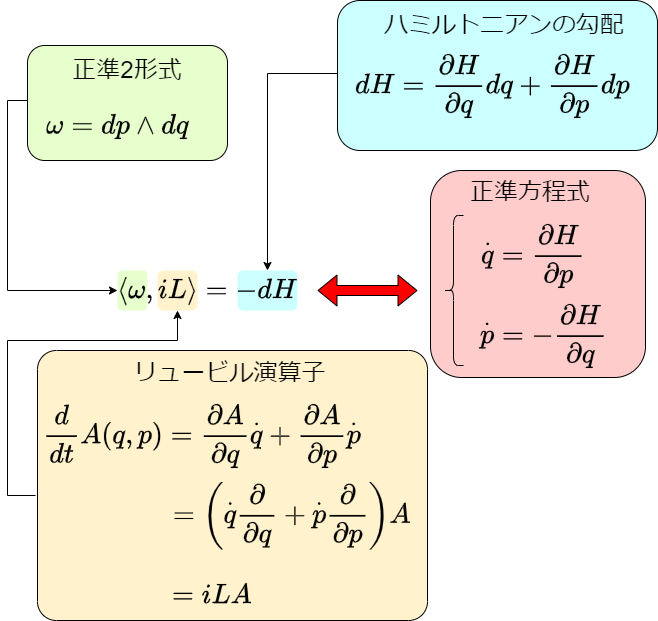

# 微分形式

<!--- abstract --->
本章では微分形式を導入し、最終的に運動方程式を微分形式で記述する。微分形式はベクトル解析を一般化したものであり、様々な概念をシンプルに記述することができる。この記法により、運動方程式の局所座標に依らない表現を記述できるようになる。
<!--- end --->

## 全微分とベクトル

座標変換において、基底と同じ変換を受けるベクトルを共変ベクトル、逆向きの変換を受けるベクトルを反変ベクトルと呼ぶのであった。具体的には、ある基底$\{\mathbf{e}_i\}$から$\{\tilde{\mathbf{e}}_i\}$への変換が

$$
\tilde{\mathbf{e}}_i = A_i^j \mathbf{e}_j
$$

で与えられている時、このベクトルで展開されたベクトルの成分

$$
\mathbf{u} = u^i \mathbf{e}_i = \tilde{u}^i \tilde{\mathbf{e}}_i
$$

には、

$$
u^i = A_j^i \tilde{u}^j
$$

の関係があり、これは基底の変換と逆向きの変換であるので、反変ベクトルとなる。また、

$$
(\mathbf{e}^i, \mathbf{e}_j) = (\tilde{\mathbf{e}}^i, \tilde{\mathbf{e}}_j) = \delta^i_j
$$

の関係を満たす双対ベクトル$\{\mathbf{e}^i\}, \{\tilde{\mathbf{e}}^i\}$の間には

$$
\mathbf{e}^i = A^i_j \tilde{\mathbf{e}}^j
$$

という関係があるため、やはり反変ベクトルであった。

さて、$(x,y)$空間における物理量$u(x,y)$の全微分を考えよう。

$$
du = \frac{\partial u}{\partial x} dx + \frac{\partial u}{\partial y} dy
$$

これは、あたかも$du$というベクトルを、$dx, dy$という基底で展開しているように見える。そこで、以下の極座標表示を例に、基底の変換則を見てみよう。

$$
\begin{aligned}
x &= r \cos \theta \\
y &= r \sin \theta
\end{aligned}
$$

まずは具体的な$r, \theta$依存性を忘れ、$x(r, \theta), y(r,\theta)$として一般論を考える。
それぞれ全微分すると、

$$
\begin{aligned}
dx &= \frac{\partial x}{\partial r} dr + \frac{\partial x}{\partial \theta} d\theta\\
dy &= \frac{\partial y}{\partial r}dr + \frac{\partial y}{\partial \theta} d\theta
\end{aligned}
$$

これを行列で書けば

$$
\begin{aligned}
\begin{pmatrix}
dx \\ dy
\end{pmatrix} &=
\underbrace{
\begin{pmatrix}
\displaystyle \frac{\partial x}{\partial r} & \displaystyle \frac{\partial x}{\partial \theta}  \\
\displaystyle \frac{\partial y}{\partial r} & \displaystyle \frac{\partial y}{\partial \theta}
\end{pmatrix}}_A
\begin{pmatrix}
dr \\ d\theta
\end{pmatrix}
 \\
&= A
\begin{pmatrix}
dr \\ d\theta
\end{pmatrix}
\end{aligned}
$$

これは、ヤコビ行列$A$を用いた$\{dr, d\theta\}$という基底から$\{dx, dy\}$という基底への変換則のように見える。つまり、$dr = \mathbf{e}_1, d\theta = \mathbf{e}_2, dx = \tilde{\mathbf{e}_1}, dy = \tilde{\mathbf{e}_2}$として、

$$
\tilde{\mathbf{e}}_i = A_i^j \mathbf{e}_j
$$

という変換が与えられたと解釈できる。

この基底変換において、$u(x,y) = u(r, \theta)$の全微分を調べて見よう。

$$
\begin{aligned}
du &= \frac{\partial u}{\partial x}dx +\frac{\partial u}{\partial y}dy \\
&=\frac{\partial u}{\partial r}dr +\frac{\partial u}{\partial \theta}d\theta
\end{aligned}
$$

これは、

$$
\mathbf{u} = u^i \mathbf{e}_i = \tilde{u}^i \tilde{\mathbf{e}}_i
$$

という表式に対応する。

ここで、各成分について、

$$
\begin{aligned}
\frac{\partial u}{\partial r} &= \frac{\partial u}{\partial x}\frac{\partial x}{\partial r} + \frac{\partial u}{\partial y}\frac{\partial y}{\partial r} \\
\frac{\partial u}{\partial \theta} &= \frac{\partial u}{\partial x}\frac{\partial x}{\partial \theta} + \frac{\partial u}{\partial y}\frac{\partial y}{\partial \theta}
\end{aligned}
$$

が成り立つので、これを行列形式で書くと、

$$
\begin{pmatrix}
\partial_r u \\ \partial_\theta u
\end{pmatrix} =
\begin{pmatrix}
\displaystyle \frac{\partial x}{\partial r} & \displaystyle \frac{\partial y}{\partial r}  \\
\displaystyle \frac{\partial x}{\partial \theta} & \displaystyle \frac{\partial y}{\partial \theta}
\end{pmatrix}
\begin{pmatrix}
\partial_x u \\ \partial_y u
\end{pmatrix}
$$

これは、$dr, d\theta$から$dx, dy$への座標変換と逆の変換を受けているため、$u$の全微分の係数$\partial_x u, \partial_y u$などは反変ベクトルであることがわかる。

これは、$u$を除くと

$$
\begin{aligned}
\begin{pmatrix}
\partial_r \\ \partial_\theta
\end{pmatrix} &=
\begin{pmatrix}
\displaystyle \frac{\partial x}{\partial r} & \displaystyle \frac{\partial y}{\partial r}  \\
\displaystyle \frac{\partial x}{\partial \theta} & \displaystyle \frac{\partial y}{\partial \theta}
\end{pmatrix}
\begin{pmatrix}
\partial_x\\ \partial_y
\end{pmatrix}\\
&= {}^tA
\begin{pmatrix}
\partial_x\\ \partial_y
\end{pmatrix}
\end{aligned}
$$

となるため、$dx, dy$ と $\partial_x, \partial_y$ 、$dr, d\theta$ と $\partial_r, \partial_\theta$ が互いに双対ベクトルの関係にあり、変換も逆向きであること、すなわち、 $\partial_r = \mathbf{e}^1, \partial_\theta = \mathbf{e}^2, \partial_x = \tilde{\mathbf{e}}^1, \partial_y = \tilde{\mathbf{e}}^2$ として、

$$
\mathbf{e}^i = A^i_j \tilde{\mathbf{e}}^j
$$

が成り立っていることがわかる。

この行列表示を利用すると、普通に計算すると面倒な$\partial_x \theta$や$\partial_y \theta$などが簡単に計算できる。

まずは直接求めて見よう。

$$
\tan \theta = \frac{y}{x}
$$

として$r$を消去し、両辺を$x$で偏微分すると

$$
\frac{1}{\cos^2 \theta} \frac{\partial \theta}{\partial x} = -\frac{y}{x^2}
$$

ここで、$\cos \theta = x/r$であることから以下のように求めることができる。

$$
\begin{aligned}
\frac{\partial \theta}{\partial x} &=  - \frac{x^2}{r^2} \frac{y}{x^2}\\
&= \frac{-y}{x^2+y^2} \\
&= -\frac{\sin \theta}{r}
\end{aligned}
$$

$\partial_y \theta$も同様に求めなくてはならない。

一方、 $\partial_r x$ や $\partial_\theta x$ などの計算が簡単であることから、以下のように行列形式で書く。

$$
\begin{aligned}
\begin{pmatrix}
dx \\ dy
\end{pmatrix} &=
\begin{pmatrix}
\partial_r x & \partial_\theta x  \\
\partial_r y & \partial_\theta y
\end{pmatrix}
\begin{pmatrix}
dr \\ d\theta
\end{pmatrix} \\
&=
\underbrace{
\begin{pmatrix}
\cos \theta & -r \sin \theta \\
\sin \theta & r \cos \theta
\end{pmatrix}}_A
\begin{pmatrix}
dr \\ d\theta
\end{pmatrix}\\
&=
A
\begin{pmatrix}
dr \\ d\theta
\end{pmatrix}
\end{aligned}
$$

両辺に$A$の逆行列をかけると

$$
\begin{aligned}
\begin{pmatrix}
dr \\ d\theta
\end{pmatrix}
&= A^{-1}
\begin{pmatrix}
dx \\ dy
\end{pmatrix}\\
&= \frac{1}{r}
\begin{pmatrix}
r \cos \theta &  r \sin \theta \\
 -\sin \theta &  \cos \theta
\end{pmatrix}
\begin{pmatrix}
dx \\ dy
\end{pmatrix}
\end{aligned}
$$

これと、

$$
\begin{pmatrix}
dr \\ d\theta
\end{pmatrix} =
\begin{pmatrix}
\displaystyle \frac{\partial r}{\partial x} & \displaystyle \frac{\partial r}{\partial y} \\
\displaystyle \frac{\partial \theta}{\partial x} & \displaystyle \frac{\partial \theta}{\partial y}
\end{pmatrix}
\begin{pmatrix}
dx \\ dy
\end{pmatrix}
$$

を見比べれば、

$$
\frac{\partial \theta}{\partial x} = -\frac{\sin \theta}{r},\frac{\partial \theta}{\partial y} = \frac{\cos \theta}{r}
$$

と求めることができる。多変数、例えば3次元の極座標などでは計算が煩雑になるが、それでもヤコビ行列を使えば発見法的に計算する必要がなく、系統的に計算ができるようになる。

## 外積と外微分

全微分による$dx, dy, dz$がベクトルの基底のように見え、その双対基底が$\partial_x, \partial_y, \partial_z$であることを見た。このルールをもう少しきちんと論じるため、微分形式を導入しよう。

任意の次元の空間で議論できるが、わかりやすさのために3次元空間$(x,y,z)$で考えよう。この空間に定義されたスカラー関数$f(x,y,z)$を考える。この関数の全微分を以下のように定義する。

$$
df \equiv \frac{\partial f}{\partial x}dx + \frac{\partial f}{\partial y}dy + \frac{\partial f}{\partial z}dz
$$

先ほど見たように、これは$dx, dy, dz$を基底としたベクトルとみなすことができる。スカラー関数を全微分したものを1次微分形式、もしくは単純に **1形式**(1-form) と呼ぶ。また、微分する前のスカラー関数を **0形式**(0-form) と呼ぶ。

ここで、外積記号$\wedge$により、以下の性質を持つ外積を定義する。

* 同じ基底の外積はゼロ
* 外積の両辺を入れ替えると負符号がつく

すなわち、

$$
\begin{aligned}
dx \wedge dx &= 0 \\
dx \wedge dy &= - dy \wedge dx
\end{aligned}
$$

である(他の基底も同様)。この外積記号を用いて、任意の$1$形式の間の外積を考えよう。
以下のように2つの1形式が与えられたとする。

$$
\begin{aligned}
du &= u_x dx + u_y dy + u_z dz\\
dv &= v_x dx + v_y dy + v_z dz
\end{aligned}
$$

この2つの$1$形式の外積は、先程の外積の性質を用いると以下のように計算できる。

$$
\begin{aligned}
du \wedge dv &= (u_x dx + u_y dy + u_z dz) \wedge (v_x dx + v_y dy + v_z dz) \\
&=
(u_x v_y  - u_y v_x ) dx \wedge dy
+(u_y v_z  - u_z v_y ) dy \wedge dz
+(u_z v_x  - u_x v_z ) dz \wedge dx
\end{aligned}
$$

さて、外積を用いて外微分を定義しよう。いま、$1$形式が

$$
\omega_1 = f_x dx +  f_y dy +  f_z dz
$$

と書かれている時、この外微分を

$$
d \omega_1 = df_x \wedge dx + df_y \wedge dy + df_z \wedge dz
$$

と定義する。

$f_x$はスカラー関数、すなわち$0$形式であり、一般に$x,y,z$の関数であるから、その外微分は

$$
df_x = \frac{\partial f_x}{\partial x} dx + \frac{\partial f_y}{\partial y} dy + \frac{\partial f_z}{\partial z} dz
$$

で与えられる。$f_y, f_z$も同様である。したがって、

$$
d\omega_1 =
\left(\frac{\partial f_x}{\partial y} - \frac{\partial f_y}{\partial x}\right) dx \wedge dy + (\frac{\partial f_y}{\partial z} - \frac{\partial f_z}{\partial y}) dy \wedge dz + (\frac{\partial f_z}{\partial x} - \frac{\partial f_x}{\partial x}) dz \wedge dx
$$

となる。$dx\wedge dy$など、$1$形式の外積で作られた新たな基底で表現されたものを$2$形式と呼ぶ。すなわち$1$形式を外微分することで$2$形式を作ることができた。同様にして、$p$形式を外微分することで$p+1$形式を作ることができる。

$1$形式の基底$dx$に対しては、偏微分演算子$\partial_x$が双対基底となり、以下のような自然な内積を考えることができる。

$$
\begin{aligned}
\left<dx, \frac{\partial}{\partial x} \right> &= \frac{\partial x}{\partial x} = 1\\
\left<dy, \frac{\partial}{\partial x} \right> &= \frac{\partial y}{\partial x} = 0\\
\end{aligned}
$$

すなわち、対応する双対基底と内積をとったら1、そうでなければ0となるため、$dx, dy, dz$と、$\partial_x, \partial_y, \partial_z$は正規直交基底をなす。

2形式との内積については、一番左のものと内積をとると約束する。すなわち、

$$
\begin{aligned}
\left<dx \wedge dy, \frac{\partial}{\partial x} \right> & \equiv
\left<dx, \frac{\partial}{\partial x} \right> dy\\
&= dy
\end{aligned}
$$

対応する双対ベクトルが一番左になかった場合は、入れ替えることで一番左に持ってくる。その際、入れ替えた回数だけ負符号がつく。

$$
\begin{aligned}
\left<dy \wedge dx, \frac{\partial}{\partial x} \right> & = \left<dx \wedge dy, \frac{\partial}{\partial x} \right> \\
&= -\left<dx, \frac{\partial}{\partial x} \right> dy
&= -dy
\end{aligned}
$$

この全微分と外積のルールは、多変数間の変換のヤコビアンを一般化したものになっている。簡単な例を挙げよう。

二次元の極座標表示を考える。

$$
\begin{aligned}
x &= r \cos \theta \\
y &= r \sin \theta
\end{aligned}
$$

$x, y$を$r, \theta$の関数だと思って、それぞれ全微分してみよう。

$$
\begin{aligned}
dx &= \cos \theta dr - r\sin \theta d\theta\\
dy &= \sin \theta dr + r\cos \theta d\theta
\end{aligned}
$$

定義に従って$dx \wedge dy$を計算する。

$$
\begin{aligned}
dx \wedge dy &= (\cos \theta dr - r\sin \theta d\theta) (\sin \theta dr + r\cos \theta d\theta) \\
&= r \cos^2 \theta dr \wedge d\theta - r \sin^2 \theta d\theta \wedge dr \\
&= r dr \wedge d\theta
\end{aligned}
$$

途中で$dr \wedge dr = d\theta\wedge d\theta =0$及び$d\theta \wedge dr = - dr \wedge d\theta$を用いた。これが、積分におけるヤコビアン

$$
\begin{aligned}
dx dy &= \frac{\partial (x,y)}{\partial (r, \theta)} dr d\theta\\
&= r dr d\theta
\end{aligned}
$$

に対応することがわかる。

## 微分形式とベクトル解析

微分形式は、ベクトル解析で習った$\mathrm{grad}$や$\mathrm{div}$、$\mathrm{rot}$などを一般化する概念となっている。

例えば3次元空間におけるスカラー場$f$の外微分は

$$
df = \frac{\partial f}{\partial x}dx + \frac{\partial f}{\partial y}dy + \frac{\partial f}{\partial z}dz
$$

であるが、$dx, dy, dz$を、$\mathbf{e}_x, \mathbf{e}_y, \mathbf{e}_z$とみなせば

$$
df =
\begin{pmatrix}
\partial_x f \\
\partial_y f \\
\partial_z f
\end{pmatrix}
= \mathrm{grad} f
$$

すなわち、これは勾配を表している。また、1形式$\omega_1$が

$$
\omega_1 = B_x dx + B_y dx + B_z dz
$$

で与えられている時、

$$
d\omega_1 =  dB_x \wedge dx + B_y \wedge dx + B_z \wedge dz
$$

となる。ここで

$$
dB_x = \frac{\partial B_x}{\partial x} dx +\frac{\partial B_x}{\partial y} dy +\frac{\partial B_x}{\partial z} dz
$$

であるから、

$$
\begin{aligned}
dB_x \wedge dx &= \left(\frac{\partial B_x}{\partial x} dx +\frac{\partial B_x}{\partial y} dy +\frac{\partial B_x}{\partial z} dz \right) \wedge dx \\
&= \frac{\partial B_x}{\partial y} dy \wedge dx + \frac{\partial B_x}{\partial z} dz \wedge dx \\
&= - \frac{\partial B_x}{\partial y} dx \wedge dy + \frac{\partial B_x}{\partial z} dz \wedge dx
\end{aligned}
$$

ただし、$dx \wedge dx = 0$、$dy \wedge dx = - dx \wedge dy$を用いた。他の成分も同様に計算すると、

$$
dB = \left(\frac{\partial B_z}{\partial y} - \frac{\partial B_y}{\partial z} \right) dy \wedge dz + \left(\frac{\partial B_x}{\partial z} - \frac{\partial B_z}{\partial x} \right) dz \wedge dx + \left(\frac{\partial B_y}{\partial x} - \frac{\partial B_x}{\partial y} \right) dx \wedge dy
$$

ここで、以下の性質を満たすホッジ作用素$\ast$を定義する。

$$
\begin{aligned}
\ast dx &= dy \wedge dz \\
\ast dy &= dz \wedge dx \\
\ast dz &= dx \wedge dy
\end{aligned}
$$

ホッジ作用素は、微分形式を裏返す演算子になっており、$d$次元空間における$p$形式を、$d-p$形式に対応させる。これは双対変換であり、もう一度作用させると元に戻る。

$$
\begin{aligned}
\ast (dy \wedge dz) &= dx \\
\ast (dz \wedge dx) &= dy \\
\ast (dx \wedge dy) &= dz
\end{aligned}
$$

また、ベクトルが張る次元と等しい微分形式($p=d$の場合)に作用させるとスカラーとなる。

$$
\ast (dx \wedge dy \wedge dz) = 1
$$

ホッジ作用素を用いると、

$$
\begin{aligned}
\ast (d\omega_1) &= \left(\frac{\partial B_z}{\partial y} - \frac{\partial B_y}{\partial z} \right) dx + \left(\frac{\partial B_x}{\partial z} - \frac{\partial B_z}{\partial x} \right) dy + \left(\frac{\partial B_y}{\partial x} - \frac{\partial B_x}{\partial y} \right) dz \end{aligned}
$$

これはベクトル場

$$
\mathbf{B} =
\begin{pmatrix}
B_x \\ B_y \\ B_z
\end{pmatrix}
$$

に対する回転$\mathrm{rot} \mathbf{B}$に対応する。

また、以下の2形式を定義する。

$$
\omega_2 = E_x dy \wedge dz + E_y dz \wedge dx + E_z dx \wedge dy
$$

この外微分を計算すると、

$$
d \omega_2 = \left(\frac{\partial E_x}{\partial x} + \frac{\partial E_y}{\partial y} +  \frac{\partial E_z}{\partial z} \right) dx \wedge dy \wedge dz
$$

さらにホッジ作用素を作用させると、

$$
\ast (d \omega_2) = \left(\frac{\partial E_x}{\partial x} + \frac{\partial E_y}{\partial y} +  \frac{\partial E_z}{\partial z} \right)
$$

これは、ベクトル場

$$
\mathbf{E} =
\begin{pmatrix}
E_x \\ E_y \\ E_z
\end{pmatrix}
$$

に対する発散$\mathrm{div} \mathbf{E}$に対応する。

微分形式の定義から、任意の微分形式$\omega$について

$$
d(d\omega) = 0
$$

が成り立つ。一般に証明するのは煩雑なので、$\omega$が$0$形式、すなわちスカラー場$f$である場合を見ておこう。座標を$x,y,z$で書くと煩雑なので、$\{q^i\}$で記述すると、

$$
df = \frac{\partial f}{\partial q^i}dq^i
$$

であるから、

$$
\begin{aligned}
d(df) &= \sum_i d \left(\frac{\partial f}{\partial q^i}dq^i \right) \\
&= \sum_i\left(\frac{\partial^2 f}{\partial q^i \partial q^j} dq^j\right) \wedge dq^i\\
&= \sum_i\frac{\partial^2 f}{\partial q^i \partial q^j} dq^j \wedge dq^i \\
&= \sum_{i<j} \left(\frac{\partial^2 f}{\partial q^i \partial q^j} - \frac{\partial^2 f}{\partial q^j \partial q^i} \right) dq^j \wedge dq^i \\
&=0
\end{aligned}
$$

これは、よく知られた以下の公式を一般化したものになっている。

$$
\mathrm{rot} (\mathrm{grad} f) = 0
$$

また、$\omega$として$1$形式を採用した場合は

$$
\mathrm{div} (\mathrm{rot} \mathbf{v}) = 0
$$

に対応する。

## 微分形式による正準方程式の表式

前置きが長かったが、これでようやく解析力学を微分形式で表現する準備が整った。まず、正準変換の条件を微分形式で表現しよう。今、変数$(q,p)$から$(Q,P)$に変数変換をしたとする。この時、$2$形式$dP \wedge dQ$を考える。$Q$、$P$は$(q,p)$の関数であるから、

$$
\begin{aligned}
dQ &= \frac{\partial Q}{\partial q}dq + \frac{\partial Q}{\partial p}dp\\
dP &= \frac{\partial P}{\partial q}dq + \frac{\partial P}{\partial p}dp
\end{aligned}
$$

$dP \wedge dQ$に代入して計算すると、

$$
\begin{aligned}
dP \wedge dQ &= \left(\frac{\partial P}{\partial q}dq + \frac{\partial P}{\partial p}dp \right)
\left(\frac{\partial Q}{\partial q}dq + \frac{\partial Q}{\partial p}dp\right) \\
&= \left(\frac{\partial P}{\partial p}\frac{\partial Q}{\partial q} - \frac{\partial P}{\partial q}\frac{\partial Q}{\partial p} \right) dp\wedge dq
\end{aligned}
$$

すなわち、$(q,p)$から$(Q,P)$への変換のヤコビアンが現れる。正準変換の条件はヤコビアンが1であることであったから、

$$
dP \wedge dQ = dp \wedge dq
$$

が成り立つことが正準変換の条件となる。このように、正準共役な変数同士を結んだ2形式を **正準2形式**(canonical 2-form) と呼び、一般に$\omega$で表すことが多い。

$$
\omega = dp \wedge dq = dP \wedge dQ
$$

すなわち、正準2形式は正準変換で不変である。

正準2形式を使うと、正準方程式を内積の形で書くことができる。正準方程式のリュービル演算子を考えよう。リュービル演算子とは、任意の物理量の時間微分を与える演算子であった。

$$
\frac{dA}{dt} = i\mathcal{L}A
$$

$A$が$(q,p)$の関数であり、$(q,p)$が時間の関数であるなら

$$
\begin{aligned}
\frac{dA}{dt} &= \frac{\partial A}{\partial q} \dot{q} +
\frac{\partial A}{\partial p} \dot{p}\\
&= \underbrace{\left(\dot{q}\frac{\partial }{\partial q} + \dot{q} \frac{\partial}{\partial p}\right)}_{i\mathcal{L}}A
\end{aligned}
$$

したがって、

$$
i\mathcal{L} = \dot{q} \frac{\partial}{\partial q} + \dot{p} \frac{\partial}{\partial p}
$$

であることがわかる。このリュービル演算子と正準2形式の内積を取る。

$$
\begin{aligned}
\left<\omega, i\mathcal{L}  \right>  &= \left<dp\wedge dq, \dot{q} \frac{\partial}{\partial q} + \dot{p} \frac{\partial}{\partial p} \right> \\
&= \dot{p}dq - \dot{q}dp
\end{aligned}
$$

ハミルトニアン$H(q,p)$の全微分は

$$
dH = \frac{\partial H}{\partial q}dq + \frac{\partial H}{\partial p}dp
$$

であるから、

$$
\left<\omega, i\mathcal{L} \right> = -dH
$$

が、正準方程式を与える。

多自由度の場合も同様であり、正準2形式

$$
\omega = dp_i \wedge dq^i
$$

と、リュービル演算子

$$
i\mathcal{L} = \dot{q}^i\frac{\partial}{\partial q^i}+\dot{p}_i\frac{\partial}{\partial p_i}
$$

を用いて

$$
\left<\omega, i\mathcal{L}\right> = -dH
$$

が正準方程式を与える。

ここで、リュービル演算子がポアソン括弧を使って、

$$
\frac{dA}{dt} \equiv i\mathcal{L}A = \{A, H\}
$$

と書けていたことを思い出そう。ポアソン括弧は局所座標に依らない表現であったから、リュービル演算子も局所座標に依らない。さらに、正準2形式は正準変換で不変であるから、局所基底の取り方に依らない正準方程式の表式が得られたことになる。

## まとめ

ニュートンの運動方程式から始まり、局所座標に依らない正準方程式までたどり着いた。ここまでの長い旅路を振り返って置こう。

我々は、力と加速度が比例する、というニュートンの運動方程式からスタートした。

$$
F = ma
$$

ここで、$F$がポテンシャル力であり、$F(x) = -U'(x)$と書けるならば、

$$
m \ddot{x} = -U'(x)
$$

と書ける。ここで、$x$の代わりに一般化座標$q$と、一般化速度$\dot{q}$を用いて、ラグランジアン

$$
L(q, \dot{q}) = K(\dot{q}) - U(q)
$$

を定義すると、オイラー・ラグランジュの運動方程式

$$
\frac{d}{dt}\left(\frac{\partial L}{\partial \dot{q}} \right) - \frac{\partial L}{\partial q} = 0
$$

を得る。ここで、

$$
\begin{aligned}
p &= \frac{\partial L}{\partial \dot{q}} \\
H &= p \dot{q} - L
\end{aligned}
$$

というルジャンドル変換により、自由変数を一般化速度$\dot{q}$から一般化運動量$p$に取り直すと、オイラー・ラグランジュの運動方程式は、以下の正準方程式に書き換わる。

$$
\begin{aligned}
\dot{q} &= \frac{\partial H}{\partial p}\\
\dot{q} &= -\frac{\partial H}{\partial q}
\end{aligned}
$$

$(q,p)$で表現された物理量$A$の時間微分は

$$
\dot{A} = \frac{\partial A}{\partial q} \frac{\partial H}{\partial p} - \frac{\partial A}{\partial p} \frac{\partial H}{\partial q}
$$

と書けるため、リュービル演算子を

$$
\dot{A} \equiv i \mathcal{L} A
$$

と定義すると、

$$
i \mathcal{L} = \frac{\partial H}{\partial p}\frac{\partial}{\partial q} -\frac{\partial H}{\partial q}\frac{\partial}{\partial p}
$$

となるため、リュービル演算子の正準2形式$\omega = dp \wedge dq$との内積は、ハミルトニアンの全微分を用いて

$$
\left<\omega, i\mathcal{L} \right> = -dH
$$

という、局所座標に依らない運動方程式が得られた。

2つの式を並べて見ても、とても同じ現象を表現しているようには見えない。

$$
\begin{aligned}
m \ddot{x} &= -U'(x) \\
\left<\omega, i\mathcal{L} \right> &= -dH
\end{aligned}
$$

しかし、ずっと等式変形をしてきたのだから、これは紛れもなく等価な式である。これは等式変形であるから、式の予言能力は変わらない。しかし、これまで見てきたように、「同じものが異なるように見える」「異なるものが同じように見える」という新たな視点を与えることが学問の真髄である。

解析力学を学んだことが、読者の世界を広げたなら幸いである。

## コラム：二次方程式は必要か

中学、高校時代、数学に苦しんだ人は多いであろう。「大事だから」と教師に諭され、必死に勉強したにもかかわらず、実際に社会に出てみると、あれだけ苦労して学んだ数学の諸概念が全く出てこない。そこでSNSでうっかり「数学は役に立たない」などと言おうものなら、数学ガチ勢に袋叩きにされ、ますます数学が嫌いになってしまう。やり玉に上がりやすいのは三角関数であるが、以前、二次方程式なんて必要か？という問題的がなされ、やはり荒れているのを見かけた。無論、二次方程式は役に立つが、それ以前に面白いものなので、少しその話をしたい。

一次方程式から始めよう。

$$
y = a x + b
$$

ここで係数$a, b$や、$y$の値がわかっている時に、この式を満たす$x$を求める作業を「方程式を解く」と言う。

さて、我々がゼロと自然数しか知らないとしよう。当然、一次方程式の係数もゼロか自然数しか出てこないが、この解は自然数以外の数が出てくる。例えば$a=b=1, y = 0$を代入すると、方程式は

$$
x + 1 = 0
$$

となる。答えは$x=-1$と負の数になる。負の数は当たり前のようでいて、不思議な数だ。先程の式が負の数の定義になっている。すなわち、「1を足したら0になる量」が$-1$だ。つまり、一次方程式を解くためには、係数に0か自然数しか使わなくても、負の数を導入する必要がある。自然数とゼロに加えて、負の数をあわせた数を整数と呼ぶ。

さらに、$a = 1, b=1, y = 1$を代入すると、

$$
2x = 1
$$

という式になり、この方程式の解は$x = 1/2$、すなわち分数になる。分数という数も「一個、二個、三個」と数える数としては使えない不思議な数であり、先ほどの式が定義となっている。一般に整数$m,n$を用いて$n/m$と表現できる数を有理数と呼ぶ。こうして、一次方程式は、係数としてゼロと自然数だけからスタートしても、解を得るために整数、有理数と世界を広げなければならないことがわかった。逆に、一次方程式は、係数が有理数であれば、有理数を使えば必ず解を表現できる。

さて、二次方程式を考えよう。

$$
y = ax^2+bx+c
$$

自然数係数の一次方程式が負の数と有理数を要求したように、二次方程式も新たな数を二種類要求する。

例えば$y=2, a=1, b=c=0$とすると、

$$
x^2 = 2
$$

という式になり、この解は$x = \pm \sqrt{2}$となる。やはり式がこの新しい数$\sqrt{2}$の定義になっており「自分自身を二度かけると2になる数」である。$\sqrt{2}$は整数$m,n$を使って$n/m$の形に表せない。すなわち有理数では表現できないので無理数と呼ばれる。

さらに$y=-1, a=1, b=c=0$とすると、方程式は

$$
x^2 = -1
$$

となる。これは虚数の定義である。すなわち、二次方程式を解くためには虚数が必要となる。実数と虚数を組み合わせた数を複素数と呼ぶ。こうして、自然数から負の数を含めた整数へ、分数を含めた有理数へ、さらに無理数、複素数と世界が広がった。

では、3次方程式、4次方程式と次数を上げていったら、さらに新しい数が要求されるのだろうか？実はそうではなく、複素数を係数とする$n$次方程式は、重根も含めるとちょうど$n$個の複素数解を持つことがわかっている。これを **代数学の基本定理** と呼ぶ。代数学の基本定理は、いくら高次の方程式であろうとも、解が複素数の範囲に収まることを主張する。つまり、一次方程式、二次方程式と広がってきた数の世界が、ここで止まる。100次方程式であろうが1000次方程式であろうが、複素数さえあれば解を表現できる。

中学で出てきた二次方程式は、解の公式や判別式、放物線の接線を求める問題など「なんでこんなことを学ぶ必要があるんだ！」と言いたくなるような面倒な奴だが、我々を複素数に導いてくれる式でもある。以上の知識は日常生活を送る上では全く役に立たないであろう。しかし、深く考えると我々が当たり前だと思ってきた負の数や分数がさほど自明なものではない気がしてきて、逆にそれらが自明なら同じくらい無理数や虚数も不思議でない量である気がしてくる。二次方程式は数の世界を広げてくれる、そう思うと、少しは苦手意識が軽減するかもしれない。
