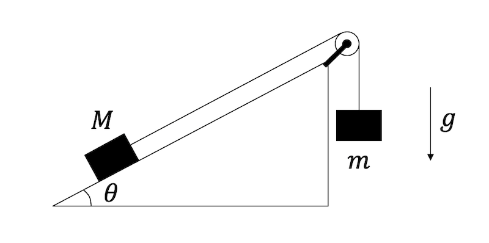

# 演習問題

## ニュートンの運動方程式：運動量保存則

### 問題

3次元空間に2つの質点A, Bがある。これらの質点の座標をそれぞれ$\boldsymbol{r}_A = (x_A,y_A,z_A), \boldsymbol{r}_B = (x_B,y_B,z_B)$とする時、これらが相対距離$r$に依存するポテンシャル$U(r)$により相互作用をしている。ただし$r$は以下のように定義する。

$$
\begin{aligned}
r &= \sqrt{(\boldsymbol{r}_A -\boldsymbol{r}_B})^2\\
&= \sqrt{(x_A-x_B)^2+(y_A-y_B)^2+(z_A-z_B)^2}
\end{aligned}
$$

質点の質量をどちらも$m$とする時、以下の問いに答えよ。

### (1)

2つの物体に働く力が、作用・反作用の法則を満たすことを示せ($x$成分のみ示せば良い)。

### (2)

この系の$x$方向の重心の運動量

$$
p_x = m(\dot{x}_1 + \dot{x}_1) 
$$

が運動により保存することを示せ。

### 解答例

(1) 

$$
r^2 = (x_A-x_B)^2+(y_A-y_B)^2+(z_A-z_B)^2
$$

であることから、

$$
\frac{\partial r}{\partial x_A} = \frac{(x_A-x_B)}{r}
$$

同様に、$r$の$x_B$による偏微分は

$$
\frac{\partial r}{\partial x_B} = -\frac{(x_A-x_B)}{r}
$$

以上を用いると、物体Aの$x$成分の運動方程式は

$$
\begin{aligned}
m \ddot{x}_A &= - \frac{\partial U(r)}{\partial x_A} \\
&=- \frac{d U(r)}{d r} \frac{\partial r}{\partial x_A} \\
&= -U' \frac{(x_A-x_B)}{r}
\end{aligned}
$$

同様に、物体Bに働く$x$成分の運動方程式は

$$
m \ddot{x}_B = U'\frac{(x_A-x_B)}{r}
$$

以上から、物体AB間に働く力は、大きさは同じで向きが逆である、すなわち作用・反作用の法則が成り立つことがわかる。

(2)

物体A,Bの運動方程式は

$$
\begin{aligned}
m\ddot{x}_A &= -U' \frac{x_A - x_B}{r}\\
m\ddot{x}_B &= U' \frac{x_A - x_B}{r}\\
\end{aligned}
$$

両辺の和を取ると、

$$
m (\ddot{x}_A + \ddot{x}_B) = 0
$$

ここで、$p_x$の時間微分を計算すると、

$$
\begin{aligned}
\dot{p}_x &= m (\ddot{x}_A+\ddot{x}_B) \\
&= 0
\end{aligned}
$$

以上から、$p_x$は保存量となる。

## ニュートンの運動方程式：角運動量保存則

### 問題

二次元平面上に、質量$m$の質点が中心力$U(r)$を受けて運動している(ただし$r=\sqrt{x^2+y^2})$。この時、角運動量$L=m(y\dot{x} - x\dot{y})$が保存量であることを示せ。

### 解答例

$$
r = \sqrt{x^2+y^2}
$$

であるから、

$$
\begin{aligned}
\frac{\partial r}{\partial x} & = \frac{x}{r} \\
\frac{\partial r}{\partial y} & = \frac{y}{r} 
\end{aligned}
$$

これを用いると、運動方程式は

$$
\begin{aligned}
m \ddot{x} &= - \partial_x U(r) = -U'(r) \frac{\partial r}{\partial x}= - U'(r) \frac{x}{r} \\
m \ddot{y} &= - \partial_y U(r) = -U'(r) \frac{\partial r}{\partial y}= - U'(r) \frac{y}{r} 
\end{aligned}
$$

従って、

$$
m \dot{x} y - m\ddot{y} x = 0
$$

角運動量の時間微分$\dot{L}$は

$$
\begin{aligned}
\dot{L} &= m \frac{d}{dt} (\dot{x} y - \dot{y} x) \\
&= m (\ddot{x} y + \cancel{\dot{x}\dot{y}} - \ddot{y}x - \cancel{\dot{y}\dot{x}}) \\
&= m \ddot{x} y - m \ddot{y} x \\
&=0
\end{aligned}
$$

以上から、角運動量$L$が保存量であることが示された。

## 仮想仕事の原理

### 問題

図のように、摩擦の無い角度$\theta$の斜面上に質量$M$の物体があり、その質点と滑車を通じて質量$m$の物体が紐で繋がれてぶら下がっている。この2つの物体に働く力が釣り合っているとき、2つの質量の間に成り立つ条件を仮想仕事の原理を用いて求めよ。ただし紐は滑車によりなめらかに動くことができ、紐の重さは無視できるものとする。重力加速度は$g$とする。

### 解答例

質量$m$の物体を$\delta l$だけ仮想的に下に動かすことを考える。物体$m$には下方向に重力による力$mg$がかかっているため、$m$が受ける仕事は$-mg \delta l$となる。

一方、斜面の上の物体は$\delta l$だけ斜面を登る。物体$M$には斜面を下る方向に$Mg \sin \theta$の力が加わっており、それに逆らう方向に動くから、$M$が受ける仕事は$Mg \sin \theta \delta l$である。

仮想仕事の原理より、釣り合いの位置からの仮想変位による仕事はゼロであるから、

$$
-mg \delta l + Mg \sin \theta \delta l = 0
$$

以上から、

$$
m = M\sin \theta
$$

## 変分原理：ベルトラミの公式

### 問題

関数$f(x)$及びその微分$f'(x)$に依存する関数$F(f(x), f'(x))$を考える。ただし、$F$は$x$には陽に依存しない、すなわち

$$
\partial F/\partial x = 0
$$

であるとする。この関数$F$についてオイラー・ラグランジュ方程式

$$
\frac{d}{dt} \left(\frac{\partial L}{\partial f'} \right)
- \frac{\partial F}{\partial f} = 0
$$

が成り立っているとき、以下の量

$$
B = F - f' \frac{\partial F}{\partial f'}
$$

が時間に対して不変になる、すなわち

$$
\frac{dB}{dt} = 0
$$

となることを示せ(ベルトラミの公式)。

### 解答例

$$
\begin{aligned}
\frac{dB}{dt} &= \frac{d}{dt} \left( F - f' \frac{\partial F}{\partial f'}\right) \\
&= \frac{dF}{dt} - f'' \frac{\partial F}{\partial f'}
-  f' \underbrace{\frac{d}{dt}\left(\frac{\partial F}{\partial f'}\right)}_{=\partial L/\partial f}\\
&= \frac{\partial F}{\partial f}f' + \frac{\partial F}{\partial f'}f''
- f'' \frac{\partial F}{\partial f'} - f' \frac{\partial F}{\partial f}\\
&= 0
\end{aligned}
$$

以上から、$dB/dt = 0$が示された。

## ラグランジアン: 振り子の運動

### 問題

二次元平面の原点に長さ$l$の棒に繋がれた質量$m$の質点がある。棒は原点を中心として摩擦なく自由に回転できる。また、棒は質量が無視でき、かつ運動により長さが変化しないものとする。棒が鉛直下方向からなす角度を$\theta$、重力加速度を$g$とする。この時、以下の問にこたえよ。

### (1) 

角速度が$\dot{\theta}$である時、この系の運動エネルギーを求めよ。

### (2) 

$\theta=0$の状態を基準とした時のこの系のポテンシャルエネルギーを求めよ。

### (3) 

この系のラグランジアンを$\theta, \dot{\theta}$の関数として求め、オイラー・ラグランジュの式から運動方程式を導出せよ。ただし、結果は

$$
\ddot{\theta} = 
$$

の形に整理すること。

### 解答例

(1) 速度が$l\dot{\theta}$であるから、運動エネルギーは以下で与えられる。

$$
K= \frac{1}{2}m l^2 \dot{\theta}^2
$$

(2) 角度$\theta$の時、$\theta=0$の時に比べて高さが$l(1-\cos\theta)$だけ高くなるため、ポテンシャルエネルギーは以下で与えられる。

$$
U = mgl (1- \cos \theta)
$$

(3) ラグランジアンは$L=K-U$で与えられるため、

$$
L(\theta, \dot{\theta}) = \frac{1}{2}m l^2 \dot{\theta}^2 - mlg (1- \cos \theta)
$$

$$
\begin{aligned}
\frac{\partial L}{\partial \dot{\theta}} &= ml^2 \dot{\theta} \\
\frac{d}{dt}\left(\frac{\partial L}{\partial \dot{\theta}}\right) &= ml^2 \ddot{\theta} \\
\frac{\partial L}{\partial \theta} &= - mlg\sin \theta
\end{aligned}
$$

オイラー・ラグランジュ方程式は

$$
\begin{aligned}
\frac{d}{dt}\left(\frac{\partial L}{\partial \dot{\theta}}\right)  - \frac{\partial L}{\partial \theta}
&= ml^2 \ddot{\theta} + mlg\sin \theta \\
&= 0
\end{aligned}
$$

整理すると、以下の運動方程式を得る。

$$
\ddot{\theta} = -\frac{g}{l} \sin \theta
$$

## ラグランジアン：中心力による運動

### 問題

二次元空間において、質量$m$の質点が中心力$U(r)$を受けて運動をしている。ただし、質点の位置を$(x,y)$とした時、$r=\sqrt{x^2+y^2}$である。この質点の運動を、以下の極座標表示で表したい。

$$
\begin{aligned}
x &= r\cos \theta\\
y &= r\sin \theta
\end{aligned}
$$

この時、以下の問に答えよ。

### (1)

この系の運動エネルギー$K$を、$r, \theta, \dot{r}, \dot{\theta}$の関数として求めよ。

### (2)

この系のラグランジアンを求めよ。

### (3)

この系の運動を記述するオイラー・ラグランジュの方程式を書き下し、$r, \theta$が従う運動方程式を求めよ。

### 解答例

(1) 

極座標表示を時間微分する

$$
\begin{aligned}
\dot{x} &= \dot{r}\cos \theta - r \dot{\theta} \sin \theta\\
\dot{y} &= \dot{r}\sin \theta + r \dot{\theta} \cos \theta
\end{aligned}
$$

この系の運動エネルギーは$m(\dot{x}^2 + \dot{y}^2)/2$であることから、

$$
K = \frac{1}{2}m(\dot{r}^2 + r^2 \dot{\theta}^2)
$$

(2)

$$
\begin{aligned}
L &= K - U \\
&= \frac{1}{2}m(\dot{r}^2 + r^2 \dot{\theta}^2) - U(r)
\end{aligned}
$$

(3)

$r$に関するオイラー・ラグランジュ方程式は、

$$
\begin{aligned}
\frac{d}{dt}\left(\frac{\partial L}{\partial \dot{r}}\right) - \frac{\partial L}{\partial r}
&= m \ddot{r} - mr\dot{\theta}^2 + \frac{\partial U}{\partial r}\\
&= 0
\end{aligned}
$$

整理すると、

$$
m(\ddot{r} - r \dot{\theta}^2)= -\frac{\partial U}{\partial r}
$$

同様に、$\theta$に関するオイラー・ラグランジュ方程式は、

$$
\begin{aligned}
\frac{d}{dt}\left(\frac{\partial L}{\partial \dot{\theta}}\right) - \frac{\partial L}{\partial \theta} &= \frac{d}{dt}(r^2\dot{\theta}) \\
&= 0
\end{aligned}
$$

以上をまとめると、運動方程式は

$$
\begin{aligned}
m(\ddot{r} - r \dot{\theta}^2) &= -\frac{\partial U}{\partial r} \\
\frac{d}{dt}(r^2\dot{\theta}) &= 0
\end{aligned}
$$
