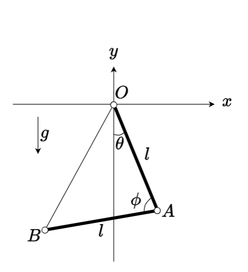

# 演習問題

## 【1】

2次元空間中を運動する質点について時間不変量をすべて選び、記号で答えよ。ただし、選択肢に時間不変量が存在しない場合は「なし」と答えること。質点の質量は$m$、質点の座標は$(x,y)$とする。

* (1) 力を受けずに等速直線運動をする場合。
  * (ア) $\dot{x}^2 + \dot{y}^2$
  * (イ) $\dot{x}$
  * (ウ) $x\dot{y} - y\dot{x}$
* (2) 中心力ポテンシャル$U(r)$を受けて運動する場合。ただし$r=\sqrt{x^2+y^2}$。
  * (ア) $\displaystyle\frac{m}{2}(\dot{x}^2 + \dot{y}^2) + U(r)$
  * (イ) $\displaystyle\frac{m}{2}(\dot{x}^2 + \dot{y}^2) - U(r)$
  * (ウ) $x\dot{y} - y\dot{x}$
* (3) $y$軸負の方向に一様な重力(重力加速度$g$)がかかっている場合。
  * (ア) $\dot{x}^2 + \dot{y}^2$
  * (イ) $\dot{y}$
  * (ウ) $mgy$

## 【2】

2次元空間において、原点$O$を中心に自由に回転できる長さ$l$の棒$OA$がある。さらに、棒$OA$の先端の点$A$を中心に自由に回転できる長さ$l$の棒$AB$が接続されている。$OB$間を質量が無視できる糸で繋いだら、棒$OA$は鉛直下方向($y$軸の負の方向)から角度が$\theta$、2つの棒の間の角度$\angle OAB$が$\phi$となって静止した。棒は一様であり、質量はそれぞれ$m$とする。重力は鉛直下方向にかかっており、重力加速度を$g$とする。点$A$の座標を$(x,y)$、点$B$の座標を$(X,Y)$とする時、以下の問いに答えよ。

* (1) 2つの棒をあわせた系の重心の座標$(x_g, y_g)$を$x, y, X, Y$を用いて表せ。
* (2) $x, y, X, Y$をそれぞれ$l, \sin \theta, \cos \theta, \sin (\theta+\phi), \cos (\theta + \phi)$で表せ。
* (3) $\phi$を固定したまま$\theta \rightarrow \theta + \delta \theta$と変化させた時、この系に$W = F_\theta \delta \theta$だけの仕事がなされた。$F_\theta$を$m,l,g,\theta, \phi$を用いて表せ。
* (4) $W = 0$の条件から、$\theta$と$\phi$の間に成り立つ関係式を示せ。

## 【3】

関数$f(x)$及びその微分$f'(x)$に依存する関数$F(f(x), f'(x))$を考える。ただし、$F$は$x$には陽に依存しない、すなわち $\partial F/\partial x = 0$ を満たすとする。この関数$F$についてオイラー・ラグランジュ方程式
$$
    \frac{d}{dx} \left(\frac{\partial F}{\partial f'} \right)
    - \frac{\partial F}{\partial f} = 0
$$
が成り立っているとき、以下の量
$$
    B = F - f' \frac{\partial F}{\partial f'}
$$
を考えると、
$$
    \frac{dB}{dx} = 0
$$
を満たすことを示せ(ベルトラミの公式)。
