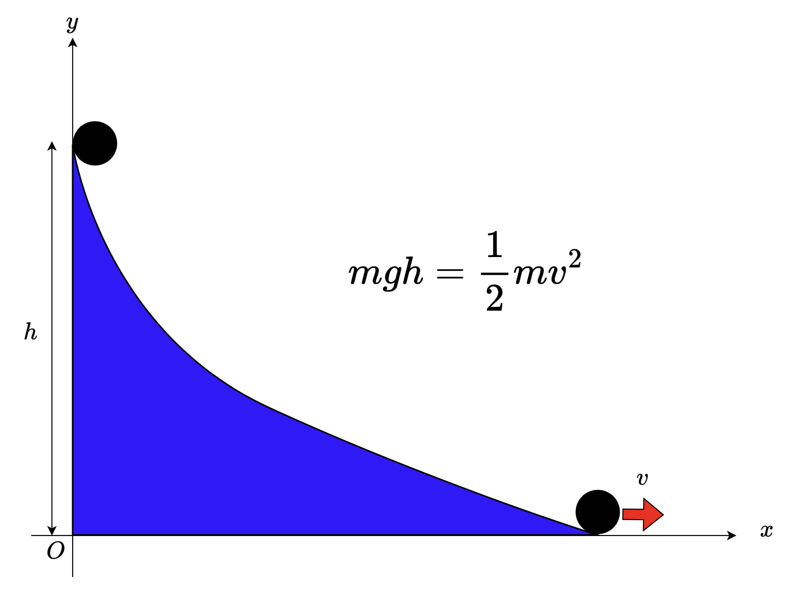

# 図一覧

## はじめに

図なし

## 解析力学の概観

* 
* 

## 数学的準備

図なし

## ニュートンの運動方程式

* 
  * 作ってもらう
* 
  * 作った
* 
  * 作った
* 
  * 作った
* 
  * これは作ってもらう

## 仮想仕事の原理(virtual_work)

* 
* 
* 
* 
* 
* 
* 

## ハミルトンの原理(hamilton_principle)

* 
* 

## 変分原理(variational_principle)

* 
* 
* 
* 
* 
* 

## ラグランジュ形式の力学(laglangian)

* 
* 

## ハミルトン形式の力学(hamiltonian)

* 
* 
* 

## 位相空間おリュービルの定理(phasespace)

* 
* 
* 
* 
* 
* 

## 正準変換(canonical_transformation)

* 
* 

## ポアソン括弧(poisson)

* [非可換性](/poisson/fig/noncommutative.png)
* 

## 微小正準変換とネーターの定理

図なし

## 微分形式(differential_form)

* 

## 演習問題(exercise)

* 
