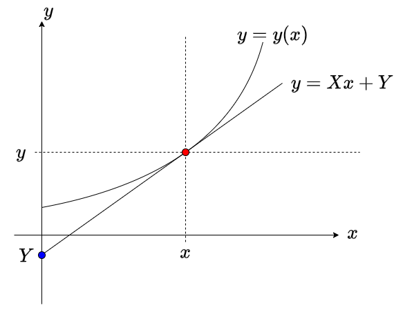

# ハミルトン形式の力学

<!--- abstract --->
本章ではラグランジアンをルジャンドル変換することにより、ハミルトニアンという新しい量が得られること、これがエネルギーに対応していること、さらにハミルトン形式の力学が得られることを見る。
<!--- end --->

## 一般化運動量とハミルトニアン

ニュートンの運動方程式を、ラグランジアンを使ってオイラー・ラグランジュの式で書いてやると、ニュートンの運動方程式よりも広い変数変換に対して運動方程式が不変となることを見た。これにより変数変換が楽になる。しかし、オイラー・ラグランジュの式で許される変換は座標のみを対象としたものであり、例えば運動量と座標を混ぜるような変換に対しては形を変えてしまう。そこで、ラグランジアンを変数変換することで、より広い変数変換について形を変えないような運動方程式を作ることにしよう。

系のラグランジアンが$L(q, \dot{q})$で与えられている。一般化座標$q$と一般化速度$\dot{q}$が時間依存する時、ラグランジアンを時間積分したものを作用積分と呼ぶ。

$$
I = \int L dt
$$

この作用積分の変分がゼロとなる条件($\delta I = 0$)より、オイラー・ラグランジュ方程式が導かれるのであった。

$$
\frac{d}{dt}\left(\frac{\partial L}{\partial \dot{q}} \right) - \frac{\partial L}{\partial q} = 0
$$

さて。ラグランジアン$L$が時間に陽に依存しない場合、すなわち$\partial_t L = 0$が成り立つ時、ベルトラミの公式により、以下の量が時間不変量になるのであった。

$$
B = L - \dot{q} \frac{\partial L}{\partial \dot{q}}
$$

ラグランジアンが

$$
L = \frac{1}{2}m \dot{q}^2 - U(q)
$$

という形でかけている時、

$$
\begin{aligned}
B &=  L - \dot{q} \frac{\partial L}{\partial \dot{q}} \\
&=  \frac{1}{2}m \dot{q}^2 - U(q) - m \dot{q}^2 \\
&= -\frac{1}{2}m \dot{q}^2 -U(q) \\
&= -(K+U)\\
&= -E
\end{aligned}
$$

すなわち、この時間不変量はエネルギーに負符号をつけたものである。そこで、

$$
H = -B = \dot{q} \frac{\partial L}{\partial \dot{q}} - L
$$

という量を考えよう。この時、ラグランジアンを一般化速度$\dot{q}$で偏微分したものを$p$とする。

$$
p \equiv \frac{\partial L}{\partial \dot{q}}
$$

ラグランジアンはエネルギーの次元を持っているため、もし一般化座標$q$が長さの次元を持っていれば、$p$は運動量の次元を持つことがわかる。そこで、$p$を**一般化運動量**(generalized momentum)と呼ぶ。

一般化運動量$p$を用いると、先程の量は以下のように書ける。

$$
H = \dot{q}p - L
$$

この量を **ハミルトニアン**(Hamiltonian) と呼ぶ。

両辺の全微分をとって見よう。

$$
\begin{aligned}
dH &= p d\dot{q} + \dot{q} dp - dL \\
&= p d\dot{q} + \dot{q} dp - \underbrace{\frac{\partial L}{\partial q}}_{\dot{p}}dq - \underbrace{\frac{\partial L}{\partial \dot{q}}}_{p}d\dot{q} \\
&= \cancel{p d\dot{q}} + \dot{q} dp  - \dot{p}dq - \cancel{pd\dot{q}}\\
&= \dot{q} dp - \dot{p}dq
\end{aligned}
$$

ただし、途中でオイラー・ラグランジュの方程式から

$$
\frac{\partial L}{\partial q} = \frac{d}{dt} \underbrace{\left(\frac{\partial L}{\partial \dot{q}}\right)}_{p} = \dot{p}
$$

であることを使った。$H(q,p)$を全微分すると、

$$
dH = \frac{\partial H}{\partial q} dq + \frac{\partial H}{\partial p} dp
$$

これと、

$$
dH = \dot{q} dp - \dot{p}dq
$$

を見比べることで、以下の運動方程式が得られる。

$$
\begin{aligned}
\dot{q} &= \frac{\partial H}{\partial p} \\
\dot{p} &= -\frac{\partial H}{\partial q} \\
\end{aligned}
$$

これを**ハミルトンの運動方程式**(Hamilton's equation)、もしくは **正準方程式**(canonical equation) と呼ぶ。多変数の場合、ラグランジアンからハミルトニアンへの変換は以下のように書ける。

$$
H = p_i \dot{q}^i - L
$$

ここで、アインシュタイン記法による和を取っていることに注意。また、後にわかるように一般化運動量は共変ベクトルであるので、添字を下につけている。

一変数の場合と同じ議論から、運動方程式は以下のように書ける。

$$
\begin{aligned}
\dot{q}^i &= \frac{\partial H}{\partial p_i} \\
\dot{p}_i &= -\frac{\partial H}{\partial q^i} \\
\end{aligned}
$$

つまり、$q^i$と$p_i$は互いにペアになっており、自分の時間微分は、ハミルトニアンを相手で偏微分することで得られる。ただし、運動量は負符号がつくことに注意。オイラー・ラグランジュ方程式に比べて、方程式が対称性の良い形になっていることがわかるであろう。この運動方程式を用いて運動を議論する形式をハミルトン形式と呼ぶ。また、$q^i$と$p_i$の関係を正準共役、もしくは単に共役と呼ぶ。

ハミルトニアンは、ベルトラミの公式の保存量に対応しているから、時間に陽に依存しなければ時間不変量となる。それを見てみよう。一般的なハミルトニアン$H(p,q)$に対して時間微分を計算すると

$$
\begin{aligned}
\dot{H} &= \frac{\partial H}{\partial q}\dot{q} +\frac{\partial H}{\partial p}\dot{p} \\
&= \frac{\partial H}{\partial q}\frac{\partial H}{\partial p}
- \frac{\partial H}{\partial p}\frac{\partial H}{\partial q} \\
&= 0
\end{aligned}
$$

すなわち、ハミルトニアンの時間微分は(ハミルトニアンが時間に陽に依存しない限り)必ずゼロとなる。これはエネルギー保存則に他ならない。ニュートンの運動方程式や、オイラー・ラグランジュ方程式に比べ、正準方程式はエネルギー保存則が見えやすい形となっている。

## ルジャンドル変換

ラグランジアン$L(q,\dot{q})$からハミルトニアン$H(q,p)$への変換は、自由変数を$\dot{q}$から$p$に取り直すものであり、これは **ルジャンドル変換**(Legendre transformation) と呼ばれるものの一種である。ルジャンドル変換は双対変換の一種であり、双対変換とは「2回行うと元に戻る操作」のことである。元に戻せるのであるから、ルジャンドル変換により情報は増えたり減ったりしない。しかし、ルジャンドル変換により目的に応じて自由変数を取り直すことで、見通しがよくなったり計算が楽になったりする。ルジャンドル変換は特に熱力学において主要な役割を果たすが、なかなかその直感的な意味を理解しづらい。以下ではルジャンドル変換の意味について様々な角度から見てみよう。

### 全微分とルジャンドル変換

まず、自由変数を取り直す、ということの意味について考える。簡単のために、一変数関数$y = f(x)$を考えよう。この関数の全微分は

$$
dy = \frac{dy}{dx} dx
$$

と記述できる(また$y$と$f$を同一視している)。また、右辺に$dx$しか現れないのは、この関数$y$が$x$にのみ依存する関数であることを表している。すなわち、$x$が自由変数であり、$dy/dx$がその微係数である。さて、ここで、自由変数と微係数を入れ替えることを考える。つまり、

$$
X = \frac{dy}{dx}
$$

とおいて、$x$のかわりに$X$を自由変数に取り直す。そのために、$xX$という量の全微分を考える。あとのために$y$の全微分を並べて書いておく。

$$
\begin{aligned}
d(xX) &= x dX + X dx\\
dy &= X dx
\end{aligned}
$$

辺々引くと

$$
d(xX - y) = x dX
$$

ここで、$Y = xX -y$という量を考えると、

$$
dY = x dX
$$

これは、新しい関数$Y$の自由変数は$X$になっていることを示す。すなわち、自由変数が$x$から$X$に入れ替わった。これをルジャンドル変換と呼ぶ。

ラグランジアンでは多変数のルジャンドル変換を行うので、二変数のルジャンドル変換も見ておこう。$x,y$に依存する関数$f(x,y)$を考える。その全微分は

$$
df = \frac{\partial f}{\partial x} dx + \frac{\partial f}{\partial y} dy
$$

と書ける。ここで

$$
Y \equiv \frac{\partial f}{\partial y}
$$

として、$Y$と$y$を入れ替える。そのために、$yY$の全微分を考える。$f$の全微分と並べて書くと

$$
\begin{aligned}
d(yY) &= ydY + Ydy \\
df &=  \frac{\partial f}{\partial x} dx + Ydy
\end{aligned}
$$

辺々引くと、

$$
d(yY - f) = -\frac{\partial f}{\partial x} dx + ydY
$$

ここで$F=yY -f$とおくと、$F$の自由変数は$x$と$Y$になっている、すなわち$F(x,Y)$となっていることがわかる。今回は第二引数に対してルジャンドル変換をしたが、もちろん任意の引数についてルジャンドル変換を行うことができる。

では、ラグランジアンに対してルジャンドル変換を適用しよう。もともとラグランジアンは$q$と$\dot{q}$の関数であり、$L(q,\dot{q})$と書けた。従って、その全微分は

$$
dL = \frac{\partial L}{\partial q} dq + \frac{\partial L}{\partial \dot{q}} d\dot{q}
$$

と書ける。ここでは変数を省略して書いたが、実際には微分係数は「どこにおける微分係数であるか」の情報が必要である。ここでは、点$(q_0, \dot{q}_0)$での微分を考えたことにしよう。変数を省略せずに書くと、

$$
dL(q_0, \dot{q}_0) =\left.\frac{\partial L}{\partial q}\right|_{q=q_0,\dot{q}=\dot{q}_0} dq + \left.L \frac{\partial L}{\partial \dot{q}}\right|_{q=q_0,\dot{q}=\dot{q}_0} d\dot{q}
$$

これは、$L(q,\dot{q})$で表現される二次元局面において、$(q_0, \dot{q}_0)$点での接平面を考えていることに対応する。接平面は平面であるから、基底が二つあれば全ての点を表現できる。この基底にあたるのが$dq$と$d\dot{q}$である。つまり、先程の式は

$$
\mathbf{v} = v^1 \mathbf{e}_1 + v^2 \mathbf{e}_2
$$

のような、基底によるベクトルの展開に他ならない。

さて、ルジャンドル変換とは、基底と展開係数の入れ替えに対応している。すなわち、

$$
\mathbf{v} = v^1 \mathbf{e}_1 + v^2 \mathbf{e}_2
$$

と書けている時、例えば$\mathbf{e}_2$の代わりに$v_2$を基底として扱うのがルジャンドル変換である。そのために、先程のラグランジアンの全微分をもう一度見てみよう。

$$
dL = \frac{\partial L}{\partial q} dq + \frac{\partial L}{\partial \dot{q}} d\dot{q}
$$

このうち、右辺第二項の$\partial_{\dot{q}} L$と$d\dot{q}$を入れ替えたい。そのために$p=\partial_{\dot{q}} L$とすると、として、$p \dot{q}$の全微分を考える。

$$
d(p \dot{q}) = \dot{q}dp + p d\dot{q}
$$

従って$d(p \dot{q}) - dL$を計算すると、

$$
d(p \dot{q} - L) = \dot{q}dp + \cancel{p d\dot{q}} - \frac{\partial L}{\partial q} dq - \cancel{p d\dot{q}} = \dot{q}dp - \frac{\partial L}{\partial q} dq
$$

ようするに、$L$を全微分して出てくる$d\dot{q}$を消して$dp$を足すために、その積$p\dot{q}$の全微分$d(p\dot{q})$から$dL$を引いているだけである。$p \dot{q} - L$をあらためて$H$という名前をつけると、$(q, \dot{q})$の関数であった$L$が、$(q,p)$の関数である$H$に変わったことがわかる。

### ルジャンドル変換の幾何学な意味

ルジャンドル変換の説明には、接線型と面積型の二種類がある。好きな方で理解して良いが、逆変換の符号が異なるので注意して欲しい。

$(x,y)$平面における曲線を考える。二次元平面における曲線とは、点$(x,y)$の一次元的な集合のことである。多価関数を考えなければ、座標のどちらか一方の値を決めれば、もう一方の値が定まる。例えば$x$を自由変数とすると、曲線は$x$の関数$f(x)$を使って、$y=f(x)$と表現できる。これを$y$と$f$を同一視して、$y=y(x)$と書くことにしよう。

曲線上の点$(x,y)$における接線を考える。この接線を表す式を

$$
y = X x + Y
$$

と書こう。これは傾き$X$、切片$Y$の直線を表している。接線の定義からすぐに

$$
\begin{aligned}
X &= \frac{dy}{dx} \\
Y &= y - x\frac{dy}{dx} = y - xX
\end{aligned}
$$

であることがわかる。これは$(x,y)$から$(X,Y)$へのルジャンドル変換になっており、自由変数を$x$から$X$に取り直したことで、$x$の関数$y$ではなく、$X$の関数$Y$を考えるように変えたことを意味する。幾何学的には、点$(x,y)$の集合として表現されていた曲線を、$(X,Y)$で表現される直線の集合で表現する、すなわち「点」と「線」を入れ替えたことに対応している。

さて、ルジャンドル変換は本質的に入れ替えであるから、もう一度変換すると元に戻る。$(X,Y)$は直線の傾きと切片を表していたが、これを$(X,Y)$空間における点の集合、すなわち曲線だと思って、もう一度ルジャンドル変換をしてみよう。$Y = Y(X)$として、点$(X,Y)$での接線の傾きと切片をそれぞれ考えると、

$$
\begin{aligned}
\frac{dY}{dX} &= \frac{dY}{dx} \frac{dx}{dX} \\
&= \left(\cancel{\frac{dy}{dx}} -  \cancel{\frac{dy}{dx}} - x \cancel{\frac{d^2y}{dx^2}}\right) \frac{1}{\cancel{\frac{dX}{dx}}} \\
&= -x
\end{aligned}
$$

$$
\begin{aligned}
Y - X \frac{dY}{dX} &= y - \cancel{xX} -\cancel{Xx} \\
&=y
\end{aligned}
$$

これがルジャンドル逆変換を与える。ルジャンドル変換と逆変換を並べて書くと、

$$
\left\{
\begin{matrix}
X & = & \displaystyle\frac{dy}{dx} \\
Y & = &y - xX
\end{matrix}
\right. ,
\left\{
\begin{matrix}
x & = & - \displaystyle\frac{dY}{dX} \\
y & = &Y - xX
\end{matrix}
\right.
$$

と、$x$と$X$の間の変換と逆変換で負符号がつく。これを嫌って、接線の切片に負符号をつけて、

$$
y = xX -Y
$$

とする流儀もある。すると、

$$
\left\{
\begin{matrix}
X & = & \displaystyle\frac{dy}{dx} \\
Y & = &xX -y
\end{matrix}
\right. ,
\left\{
\begin{matrix}
x & = & \displaystyle\frac{dY}{dX} \\
y & = &xX -Y
\end{matrix}
\right.
$$

と、変換と逆変換が対称性の良い形になる。これはフーリエ変換において、$2\pi$の因子をどのように定義するかと同様、変換と逆変換が無矛盾であればどちらの流儀を採用してもかまわない。

ルジャンドル変換には、面積を用いた説明もある。いま、$(x,y)$の変数の組をルジャンドル変換により$(X,Y)$に変換することを考える。自由変数はそれぞれ$x$と$X$としよう。この時、二つの自由変数$(x,X)$で張られる空間を考え、その空間における曲線を考える。$x$を自由変数にとる時、この曲線が$X=X(x)$と表現され、$X$を自由変数にとる時、この曲線が$x=x(X)$と表現できるとする。$x$と$X$は、片方を自由変数にとると、もう片方は関数となり、$x(X)$と$X(x)$は互いに逆関数の関係にある。

ここで、$X(x)$を積分したものを$y$、$x(X)$を積分したものを$Y$と定義する。

$$
\begin{aligned}
y &= \int_0^x X(x)dx\\
Y &= \int_0^X x(X)dX
\end{aligned}
$$

両辺を微分すると、

$$
\begin{aligned}
\frac{dy}{dx} &= X\\
\frac{dY}{dX} &= x
\end{aligned}
$$

また、図から明らかに

$$
y+Y = xX
$$

が成り立つ。ここから、$(x,y)$と$(X,Y)$の間のルジャンドル変換、ルジャンドル逆変換の関係式、

$$
\left\{
\begin{matrix}
X & = & \displaystyle\frac{dy}{dx} \\
Y & = &xX -y
\end{matrix}
\right. ,
\left\{
\begin{matrix}
x & = & \displaystyle\frac{dY}{dX} \\
y & = &xX -Y
\end{matrix}
\right.
$$

が得られる。

以上、$(x,y)$の変数の組から$(X,Y)$への変数の組へのルジャンドル変換について、接線表式と面積表式のそれぞれの導出を見た。ラグランジアンからハミルトニアンへのルジャンドル変換では、$q$を無視すれば$(\dot{q}, L)$の組から$(p, H)$の組への変換になっていることから、その変換公式が以下で与えられることが理解できたであろう。

$$
\begin{aligned}
p &= \frac{\partial L}{d \dot{q}} \\
H &= p\dot{q} - L
\end{aligned}
$$

面積表式では、自然に変換が対称となること、$(x,y)$と $(X,Y)$ が満たす関係式 $y+Y=xX$ の解釈がわかりやすいというメリットがある。一方、我々が知りたい物理量は $(x,y)$ 平面もしくは $(X,Y)$ 平面上に表現されることが多いため、$(x,X)$ 平面を考える面積表式ではイメージがつかみにくいかもしれない。どちらでも好きな方で理解すれば良い。

## ハミルトニアンと変分原理

ラグランジアンとハミルトニアンの関係を見ておこう。まず、変分原理を確認する。

元々、$q$と$\dot{q}$の変数であったラグランジアンの作用積分

$$
I[q] = \int L dt
$$

について、変分がゼロ、すなわち$\delta I = 0$を要求することで、オイラー・ラグランジュ方程式

$$
\frac{d}{dt}\left(\frac{\partial L}{\partial \dot{q}} \right) - \frac{\partial L}{\partial q} = 0
$$

が導かれた。全く同様にして、ハミルトニアン$H(q,p)$について作用積分

$$
I[p,q] = \int (\dot{q}p - H) dt
$$

について、変分を考えてみよう。両辺の変分をとると

$$
\delta I = \int \left(\dot{q}\delta p +p \delta \dot{q} - \frac{\partial H}{\partial q}\delta q + \frac{\partial H}{\partial p} \delta p \right)dt
$$

ここで、$p \delta \dot{q}$の項目について部分積分すると

$$
\begin{aligned}
\delta I &= \int \left(\dot{q}\delta p -\dot{p} \delta q - \frac{\partial H}{\partial q}\delta q + \frac{\partial H}{\partial p} \delta p \right)dt \\
&= \int \left( \left(\dot{q} - \frac{\partial H}{\partial p}\right)\delta p
- \left(\dot{p} + \frac{\partial H}{\partial q}\right)\delta q
\right)dt \\
&=0
\end{aligned}
$$

これが任意の$\delta p, \delta q$について成り立たなければならないことから、以下の正準方程式が得られる。

$$
\begin{aligned}
\dot{q} &= \frac{\partial H}{\partial p} \\
\dot{p} &= -\frac{\partial H}{\partial q} \\
\end{aligned}
$$

したがって、作用積分の中身をラグランジアン$L$の代わりに、ハミルトニアンを使って$p\dot{q} - H$としても変分原理が適用できる。

## ラグランジアンからハミルトニアンへの変換の例

最後に、ラグランジアンからハミルトニアンへの変換例をいくつか見ておこう。

まず、二次元極座標のラグランジアンを考える。

$$
L = \frac{1}{2}m(\dot{r}^2 + r^2\dot{\theta}^2) - U
$$

一般化座標$r,\theta$に対応する一般化運動量は

$$
\begin{aligned}
p_r &= \frac{\partial L}{\partial \dot{r}} = m \dot{r} \\
p_\theta &= \frac{\partial L}{\partial \dot{\theta}} = m r^2 \dot{\theta} \\
\end{aligned}
$$

となる。ここで、一般化座標$\theta$が座標の次元を持っていないことに対応して、一般化運動量$p_\theta$も運動量の次元を持っていないことに注意。

ハミルトニアンは

$$
\begin{aligned}
H &= p_r \dot{r} + p_\theta \dot{\theta} - L \\
&= m(\dot{r}^2 + r^2 \dot{\theta}^2) -L \\
&= 2 K - K + U \\
&= K + U
\end{aligned}
$$

となり、やはり全エネルギーに対応する。

ハミルトニアンを一般化運動量と一般化座標で書くと

$$
H = \frac{1}{2m}\left(p_r^2 + \frac{p_\theta^2}{r^2} \right) + U
$$

となる。ここで、$p_\theta$の次元に注意しよう。$\theta$が無次元量であるから、$p_\theta$は$[M L^2/T]$の次元を持つ。したがって、

$$
\begin{aligned}
\left[\frac{p_\theta^2}{2mr^2}\right] &= \left[\frac{M^2L^4}{T^2} \frac{1}{ML^2} \right] \\
& = \left[\frac{M L^2}{T^2} \right]
\end{aligned}
$$

と、エネルギーになっている。

次に、座標変換に対するラグランジアンとハミルトニアンの変換性を見ておこう。

ラグランジアンが

$$
L(q, \dot{q}) = \frac{1}{2}m \dot{q}^2 - U(q)
$$

で与えられる一自由度系を考える。対応する一般化運動量は

$$
p = \frac{\partial L}{\partial \dot{q}} = m \dot{q}
$$

である。ここで、座標を定数倍する

$$
Q = a q
$$

という変数変換を考える。一般化速度はそのまま

$$
\dot{Q} = a \dot{q}
$$

となるから、新しいラグランジアンは

$$
L(Q, \dot{Q}) = \frac{m\dot{Q}^2}{2a^2} - U(Q/a)
$$

となる。対応する一般化運動量$P$は

$$
\begin{aligned}
P &= \frac{\partial L}{\partial \dot{Q}} \\
  &= \frac{m\dot{Q}}{a^2} \\
  &= \frac{m\dot{q}}{a}\\
  &= \frac{p}{a}
\end{aligned}
$$

すなわち、

$$
Q = a q
$$

という変換$q \rightarrow Q$において、一般化運動量$p \rightarrow P$の変換は

$$
P = \frac{p}{a}
$$

と、逆になる。これにより、一般化運動量が一般化座標とは逆向きの変換則に従うこと、すなわち共変ベクトルであることがわかるであろう。

## ハミルトニアンと不変量

もう一度正準方程式を見てみよう。

$$
\begin{aligned}
\dot{q}^i &= \frac{\partial H}{\partial p_i} \\
\dot{p}_i &= -\frac{\partial H}{\partial q_i}
\end{aligned}
$$

自分の時間微分が、自分の「相方」による偏微分で得られている。したがって、例えばハミルトニアンが$q^i$依存性を持たなければ、直ちに共役な運動量$p_i$が保存量となることがわかる。

例えば二次元空間において、ポテンシャル$U(r)$による中心力により運動する系を考えよう。デカルト座標では、この系のラグランジアンは

$$
L(x,y, \dot{x}, \dot{y}) = \frac{1}{2}(\dot{x}^2 + \dot{y}^2) - U(r)
$$

であるから、対応するハミルトニアンは

$$
H(x,y, p_x, p_y) = \frac{1}{2m} (p_x^2+p_y^2) + U(r)
$$

となる。正準方程式は

$$
\begin{aligned}
\dot{x} &= \frac{\partial H}{\partial p_x} = \frac{p_x}{m} \\
\dot{y} &= \frac{\partial H}{\partial p_y} = \frac{p_y}{m} \\
\dot{p_x} &= -\frac{\partial H}{\partial x} = - \frac{\partial U}{\partial x} \\
\dot{p_y} &= -\frac{\partial H}{\partial y} = - \frac{\partial U}{\partial y} \\
\end{aligned}
$$

と、ニュートンの運動方程式と等価な式が現れ、特にご利益はない。そこで、極座標表示をしてみよう。極座標でのラグランジアンは

$$
L = \frac{1}{2}m (\dot{r}^2 + r^2\dot{\theta}^2) - U(r)
$$

で表される。したがって、$r, \theta$に対応する一般化運動量$p_r, p_\theta$は

$$
\begin{aligned}
p_r &\equiv \frac{\partial L}{\partial \dot{r}} = m\dot{r} \\
p_\theta &\equiv \frac{\partial L}{\partial \dot{\theta}} = mr^2\dot{\theta} \\
\end{aligned}
$$

となる。したがって、ハミルトニアンの極座標表示は

$$
\begin{aligned}
H &= p_r \dot{r} + p_\theta \dot{\theta}  - L \\
&= \frac{1}{2m}\left(p_r^2 + \frac{p_\theta^2}{r^2}\right) + U(r)
\end{aligned}
$$

で与えられる。もしくは、$\dot{r}, \dot{\theta}$を

$$
\begin{aligned}
\dot{r} &= \frac{p_r}{m} \\
\dot{\theta} &= \frac{p_\theta}{mr^2}
\end{aligned}
$$

と$p_r, p_\theta$で表し、運動エネルギーに代入すると、

$$
K =  \frac{1}{2}m (\dot{r}^2 + r^2\dot{\theta}^2) = \frac{1}{2m}\left(p_r^2 + \frac{p_\theta^2}{r^2}\right)
$$

となることから、

$$
H = K + U =  \frac{1}{2m}\left(p_r^2 + \frac{p_\theta^2}{r^2}\right) + U(r)
$$

で求めることもできる。

さて、ハミルトニアンの極座標表示には$\theta$を含まないことがわかる。したがって$\partial_\theta H = 0$である。正準方程式から

$$
\dot{p}_\theta = -\frac{\partial H}{\partial \theta} = 0
$$

すなわち、$\theta$に共役な運動量が時間保存量となることが、ハミルトニアンの形を見るだけでわかる。このように、ニュートンの運動方程式に比べて、保存則が非常に見やすいのがハミルトニアンの特徴である。この事実は後により一般的に議論する。

## まとめ

ラグランジアンの引数である一般化速度に対してルジャンドル変換を施したものが一般化運動量であり、ラグランジアンの代わりにハミルトニアンを得る。物理的には、ハミルトニアンは系の全エネルギーに対応する量となる。ラグランジアンと同様に、ハミルトニアンというただひとつのスカラー関数から全ての自由度に関する運動方程式が得られるが、ラグランジアンが$N$自由度系にたいして$N$本の時間に関する二階微分方程式を生み出すのに対して、ハミルトニアンは$2N$本の一階微分方程式を生み出す。ラグランジアンは変分原理に直接関係する量である一方、ハミルトニアンはエネルギーに対応する量となっている。しかし、どちらを用いても変分原理による議論は可能である。ラグランジアンとハミルトニアンはルジャンドル変換を通じて等価であるが、ハミルトニアンの方がより広い変換に対して共変となる他、対称性と保存則の議論の見通しが良くなる。これらについては後に議論する。

## コラム：双対変換

双対変換とは要するに「2回行うと元にもどる変換」のことである。例えば鏡に映る自分は左右が逆になるが、もう一度鏡に映すと元にもどる。すなわち鏡映変換は双対変換である。こういった双対変換の中で興味深いのは、正多面体の双対性である。

正多面体は、ある頂点にどんな多角形が何個接しているかで特徴づけることができる。そこで、それぞれの頂点に正$m$角形が$n$個接している正多面体を$(m,n)$と表記してみよう。例えば立方体は、一つの頂点に正方形が3つ接しているから$(4,3)$と表記できる。さて、最小の多角形は三角形であるから$m \geq 3$でなければならない。また、立体を構成するためには一つの頂点に最低でも3つの図形を繋げなくてはならないから$n \geq 3$である。正六角形を3つなげてしまうと平面になってしまうから、正多面体に使えるのは正三角形、正方形、正五角形に限られる。正三角形は一つの頂点に3個、4個、5個つなげることができる。これにより$(3,3)$、$(3,4)$、$(3,5)$の組み合わせが可能であり、それぞれ正四面体、正八面体、正二十面体に対応する。正方形は4つなげると平面になってしまうために3個だけしかつなげることができない。すなわち$(4,3)$だけが可能であり、立方体に対応する。同様に正五角形も3個しかつなげることができず、$(5,3)$は正十二面体に対応する。以上のように、一つの頂点に正$m$角形を$n$個つないで正多面体を作る組み合わせは$(3,3)$、
$(3,4)$、$(3,5)$、$(4,3)$、$(5,3)$の5種類しかなく、それが正多面体が5種類しかないことに対応する。

さて、立方体には面が6枚あるが、それぞれの面の重心を結んでみると正八面体になる。これを$(m,n)$の言葉で書くと、$(4,3)$が$(3,4)$になっている。逆に正八面体の面の重心を結ぶと立方体に戻る。すなわち、面と点を入れ替える変換は双対変換になっており、これは$(m,n)$の$m$と$n$を入れ替える変換になっている。これにより、立方体$(4,3)$と正八面体$(3,4)$、正十二面体$(5,3)$と正二十面体$(3,5)$がそれぞれ双対であることがわる。なお、正四面体$(3,3)$は双対変換で形を変えない。これを自己双対という。

大学で習う双対変換のうち、特に重要なのはフーリエ変換である。フーリエ変換は逆変換で元に戻るから双対変換の一種である。フーリエ変換により、時間で表された空間から周波数で表された空間に移ることができる。つまり時間と周波数は双対の関係にある。実空間と波数空間も同様である。微分方程式を解く手段として教わるフーリエ変換が、「何かを裏返す操作である」と認識できれば、何か世界が広がった気がしないだろうか？
