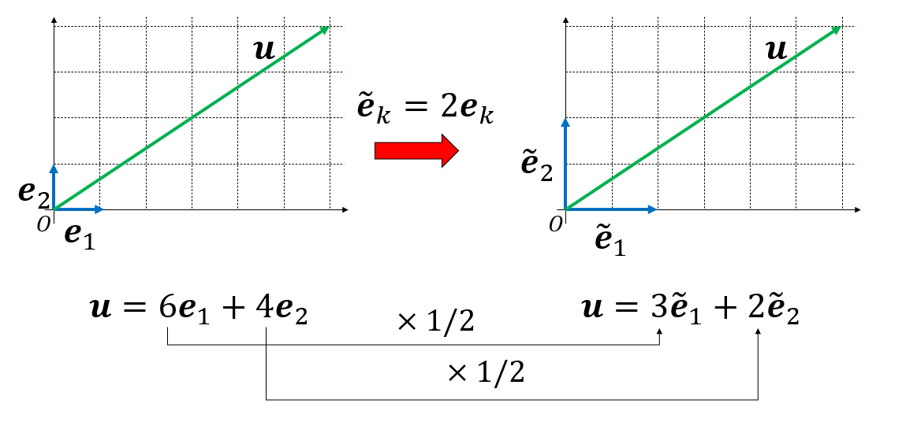

# ラグランジュ形式の力学

これから、解析力学の解析力学らしいところ、すなわち変数変換に対する運動方程式の変換について扱う。解析力学はニュートン力学を再定式化したものであるから、本質的には同じ問題を別の表示に書き換えているのに過ぎない。しかし、別の形式で書き直した方が見通しがよくなるし、ニュートン力学では見えなかった世界が見えてくる。これからニュートン力学からラグランジュ形式の力学、そしてハミルトン形式の力学へと続いていくが、その前にニュートン力学のままだと変数変換が面倒であることを見ておこう。

## 座標変換とベクトル

解析力学とは、座標変換の学問である。そこで、座標変換について簡単にまとめておこう。一般に、ベクトルは適当な基底を選ぶことで成分表示できる。同じベクトルでも、別の基底を選ぶと成分が変わる。この成分の変化のし方により、ベクトルは反変ベクトルと共変ベクトルに分類される。

例を挙げよう。基底$\{\boldsymbol{e}_1, \boldsymbol{e}_2\}$で張られる二次元空間があり、あるベクトル$\boldsymbol{u}$がこの基底により

$$
\boldsymbol{u} = 6 \boldsymbol{e}_1 + 4 \boldsymbol{e}_2
$$

と展開されているとしよう。この時、ベクトルの成分表示は$\boldsymbol{u} = (6,4)$となる。さて、基底の長さを2倍にしてみよう。

$$
\begin{aligned}
\tilde{\boldsymbol{e}}_1 &= 2 \boldsymbol{e}_1 \\
\tilde{\boldsymbol{e}}_2 &= 2 \boldsymbol{e}_2
\end{aligned}
$$

新しい基底$\{\tilde{\boldsymbol{e}}_1, \tilde{\boldsymbol{e}}_2\}$で$\boldsymbol{u}$を展開すると、

$$
\boldsymbol{u} = 3 \tilde{\boldsymbol{e}}_1 + 2 \tilde{\boldsymbol{e}}_2
$$

となる。この時、ベクトルの成分表示は$\boldsymbol{u} = (3,2)$と、元の半分になる。このように、基底の長さを2倍にした時、成分が半分となるようなベクトルを、基底と反対向きの変換を受けるという意味で **反変ベクトル(contravariant vector)** と呼ぶ。

この事実を一般化しておこう。いま、あるベクトル$\boldsymbol{u}$が正規直交基底$\{\boldsymbol{e}_i\}$により、以下のように成分表示されているとしよう。

$$
\boldsymbol{u} = u^i \boldsymbol{e}_i
$$

同じ記号が現れた場合(今回は$i$)はその記号について和を取るというアインシュタイン規約を用いている。さて、なにか適当な行列$T$を用いて、基底が$\{\boldsymbol{e}_i\}$から、別の正規直交基底$\{\tilde{\boldsymbol{e}}_i\}$に以下のように変換されたとする。

$$
\tilde{\boldsymbol{e}}_i = T^k_{\,i} \boldsymbol{e}_k
$$

ベクトル$\boldsymbol{u}$を新しい基底$\{\tilde{\boldsymbol{e}}_i\}$で展開すると、

$$
\begin{aligned}
\boldsymbol{u} &= \tilde{u}^k \tilde{\boldsymbol{e}}_k \\
&= \tilde{u}^k T^j_{\,k} \boldsymbol{e}_j
\end{aligned}
$$

両辺について$\boldsymbol{e}^i$と内積をとると、

$$
\begin{aligned}
u^i &= \tilde{u}^k T^j_{\,k} (\boldsymbol{e}^i,\boldsymbol{e}_j),\\
&= \tilde{u}^k T^j_{\,k} \delta^i_{\,j}, \\
&= T^i_{\,k} \tilde{u}^k.
\end{aligned}
$$

基底の変換と並べてみると、

$$
\begin{aligned}
\tilde{\boldsymbol{e}}_i &= T^k_{\,i} \boldsymbol{e}_k \\
u^i &= T^i_{\,k} \tilde{u}^k
\end{aligned}
$$

チルダが現れる項が左右逆になっていることがわかる。これが反変ベクトルの定義である。

反変ベクトルは逆に、チルダが同じ側に現れるのが共変ベクトルである。先程のベクトルを縦ベクトルとすると、横ベクトルが共変ベクトルとなる。$\{\boldsymbol{e}_i\}$や$\{\tilde{\boldsymbol{e}}_i\}$が張っていた縦ベクトルの空間と共役な空間を張る、横ベクトルの基底$\{\boldsymbol{e}^i\}$や$\{\tilde{\boldsymbol{e}}^i\}$を考えよう。以下のように、共役なベクトルとの直交性を課す。

$$
\begin{aligned}
(\boldsymbol{e}^j,\boldsymbol{e}_i) &= \delta^j_{\,i} \\
(\tilde{\boldsymbol{e}}^j,\tilde{\boldsymbol{e}}_i) &= \delta^j_{\,i} \\
\end{aligned}
$$

さて、縦ベクトルが$\tilde{\boldsymbol{e}}_i = T^k_{\,i} \boldsymbol{e}_k$と変換される時、横ベクトルがどのように変換されるか見てみよう。チルダ付きの横ベクトルが、チルダの無い横ベクトルで

$$
\tilde{\boldsymbol{e}}^i = M^i_{\,k} \boldsymbol{e}^k
$$

と展開できるとする。両辺、$\boldsymbol{e}_j$との内積を取ると、

$$
\begin{aligned}
(\tilde{\boldsymbol{e}}^i, \boldsymbol{e}_j) &= M^i_{\,k} (\boldsymbol{e}^k, \boldsymbol{e}_j)
&= M^i_{\,k} \delta^k_{\,j} \\
&= M^i_{\,j}
\end{aligned}
$$

縦ベクトルのチルダ付きとチルダ無しの関係を考える。

$$
\tilde{\boldsymbol{e}}_i = T^k_{\,i} \boldsymbol{e}_k.
$$

$\tilde{\boldsymbol{e}}^j$と内積をとると、左辺は直交性から

$$
(\tilde{\boldsymbol{e}}^j, \tilde{\boldsymbol{e}}_i) = \delta^j_{\,i}.
$$

右辺は、先程求めた$(\tilde{\boldsymbol{e}}^i, \boldsymbol{e}_j) = M^i_{\,j}$を代入することで

$$
T^k_{\,i} (\tilde{\boldsymbol{e}}^j, \boldsymbol{e}_k) =   M^j_{\,k} T^k_{\,i} 
$$

以上から、

$$
M^j_{\,k} T^k_{\,i} = \delta^j_{\,i}
$$

これは、行列$M$と$T$が互いに逆行列の関係にあることを意味する。

さて、横ベクトル$\boldsymbol{v}$が、横ベクトルの基底で

$$
\boldsymbol{v} = v_i \boldsymbol{e}^i = \tilde{v}_i \boldsymbol{e}^i 
$$

と展開されているとしよう。縦ベクトルと同様な議論から、

$$
v^i = M^i_{\,k} \tilde{v}^k
$$

が成立する。両辺に行列$T$をかけると、

縦ベクトルの基底の変換の式と並べると、

$$
\begin{aligned}
\tilde{\boldsymbol{e}}_i &= T^k_{\,i} \boldsymbol{e}_k \\
\tilde{v}^k &= T^k_{\,i }v^i
\end{aligned}
$$

のように、基底の変換とベクトルの変換のチルダのある方が同じ側に来ることがわかる。このような変換をするベクトルを共変ベクトルと呼ぶ。すなわち、横ベクトルは縦ベクトルの基底変換に対して共変性を持つ。

## ニュートンの運動方程式の共変性

### ガリレイ変換

### 極座標

## 点変換とラグランジアンの共変性

ラグランジアンを一般化座標$q$と一般化速度$\dot{q}$の関数、$L(\dot{q},q)$で書いておくと、オイラー・ラグランジュの運動方程式
$$
\frac{d}{dt}\left(\frac{\partial L}{\partial \dot{q}} \right) - \frac{\partial L}{\partial q} = 0
$$
が変数変換によって形を変えない。ラグランジアンの共変性は多変数の時にこそ活きるが、かなり式変形がややこしくなるので、まずは一変数の場合について見てみよう。

ある変数$q$について、変数変換$Q = f(q)$を考える。$q$がオイラー・ラグランジュの運動方程式を満たす時、変数変換後の変数$Q$についてもオイラー・ラグランジュの運動方程式
$$
\frac{d}{dt}\left(\frac{\partial L}{\partial \dot{Q}} \right) - \frac{\partial L}{\partial Q} = 0
$$
を満たす、というのが証明したいことである。

そのために、まず$Q = f(q)$を$Q$について逆に解いて
$$
q = f^{-1}(Q)
$$
と書く。ここで、$f^{-1}$を$q$と同一視し、以後は$q(Q)$と書く。すると、$\dot{q}$は、
$$
\dot{q} = \frac{dq}{dQ} \dot{Q}
$$
と書ける。ここで$dq/dQ$は$Q$の関数であることから、$\dot{q}$は$Q$と$\dot{Q}$両方の関数である。

以上から、変数変換後のラグランジアンの$Q$、$\dot{Q}$依存性を明示すると

$$
L(\dot{q}, q) = L(\dot{q}(\dot{Q},Q), q(Q))
$$
となる。

さて、このラグランジアン$L$の$Q$や$\dot{Q}$による偏微分を考えよう。$Q$依存性は、$\dot{q}$、$q$の両方の箇所に入っているから、
$$
\frac{\partial L}{\partial Q} =
\frac{\partial L}{\partial \dot{q}} \frac{d\dot{q}}{dQ}
+
\frac{\partial L}{\partial q} \frac{dq}{dQ}
$$

一方、$\dot{Q}$は$\dot{q}$の場所にしか現れないので、

$$
\frac{\partial L}{\partial \dot{Q}}  = \frac{\partial L}{\partial \dot{q}} \frac{d\dot{q}}{d\dot{Q}}.
$$

ここで、合成関数の微分公式から

$$
\frac{d\dot{q}}{d\dot{Q}} = \frac{dq}{dt}\frac{dt}{dQ} = \frac{dq}{dQ}.
$$

以上より、

$$
\frac{\partial L}{\partial \dot{Q}} = \frac{\partial L}{\partial \dot{q}}\frac{dq}{dQ}
$$

オイラー・ラグランジュの運動方程式を作るためにこれを時間で微分すると、

$$
\frac{d}{dt}\left(\frac{\partial L}{\partial \dot{Q}}\right) =
\frac{d}{dt}\left(\frac{\partial L}{\partial \dot{q}}\right) \frac{dq}{dQ} + \frac{\partial L}{\partial \dot{q}} \frac{d \dot{q}}{dQ}
$$

以上から、

$$
\begin{aligned}
\frac{d}{dt}\left(\frac{\partial L}{\partial \dot{Q}}\right) - \frac{\partial L}{\partial Q}
&= \frac{d}{dt}\left(\frac{\partial L}{\partial \dot{q}}\right) \frac{dq}{dQ}
+ \cancel{\frac{\partial L}{\partial \dot{q}} \frac{d \dot{q}}{dQ}}\\
&- \frac{\partial L}{\partial q} \frac{dq}{dQ} - \cancel{\frac{\partial L}{\partial \dot{q}} \frac{d\dot{q}}{dQ}} \\
&= \left[
\underbrace{
\frac{d}{dt}\left(\frac{\partial L}{\partial \dot{q}}\right) + \frac{\partial L}{\partial q}
}_{=0}
\right]
\frac{dq}{dQ} \\
&=0
\end{aligned}
$$

$q$を$Q(q)$に変数変換した場合、$q$がオイラー・ラグランジュの運動方程式に従うのであれば、$Q$も全く同じ形の式に従うことが証明された。

## 多変数の場合

これまで、なるべく1自由度系で議論を構築してきた。しかし、ほとんどの場合、我々の興味ある系は複数の自由度を持つ。例えば3次元空間に$n$個粒子がいれば、座標を指定するだけで$3n$個の変数が必要である。そこで、系の状態が$N$個の一般化座標$q_1, q_2, \cdots, q_N$で指定されていると考えよう。単振り子なら$N=1$、二重振り子なら$N=2$、3次元$n$粒子系なら$N=3n$だ。このような多自由度系のラグランジアンの変数変換について扱おう。

この$N$自由度系において、ラグランジアン$L(\dot{q}_1, \dot{q}_2, \cdots, \dot{q}_N, q_1, q_2, \cdots, q_N)$が与えられており、以下のオイラー・ラグランジュの式が成り立つとしよう。

$$
\frac{d}{dt}\left( \frac{\partial L}{\partial \dot{q}_i}\right) - \frac{\partial L}{\partial q_i} = 0
$$

ただし$i$は$1$から$N$までの値をとり、そのすべてにおいてこの式が成立しているとする。ここで、$(q_1, q_2, \cdots, q_N)$から$(Q_1, Q_2, \cdots, Q_N)$への変換を考える。具体的には$N$本の関数$f_i$を使って、

$$
\begin{aligned}
Q_1 &= f_1(q_1, q_2, \cdots, q_N) \\
Q_2 &= f_2(q_1, q_2, \cdots, q_N) \\
&\cdots \\
Q_N &= f_N(q_1, q_2, \cdots, q_N)
\end{aligned}
$$

と変換が与えられたとする。この時、新しい変数においても

$$
\frac{d}{dt}\left( \frac{\partial L}{\partial \dot{Q}_i}\right) - \frac{\partial L}{\partial Q_i} = 0
$$

が全ての$i$で成立することを証明したい。やることは1自由度系とほとんど同様だが、偏微分などがややこしくなる。

## 記号の節約表記について

ここで、ラグランジアンを扱う際にどの変数を独立とみなし、どの変数が独立でないのかがよくわからなくなることが多い。これは主に表記において記号の節約を行うことに起因する。例えば、ある関数$f$を使って$Q = f(q)$と変換する時、$Q$の時間微分は

$$
\frac{dQ}{dt} = \frac{df}{dq} \frac{dq}{dt}
$$

と書ける。これは単なる合成関数の微分公式であるから何も問題はない。しかし、多くの場合$f$は$Q$と同一視され、

$$
\dot{Q} = \frac{dQ}{dq} \dot{q}
$$

と書かれる。さらに、ラグランジアンにおいて$L(\dot{q}, q)$とし、$\dot{q}$と$q$は独立だとみなすが、ラグランジアンを時間積分する際には$q$と$\dot{q}$には$\dot{q} = dq/dt$の関係がある。これを記号の節約をせずにきちんと書くなら、ラグランジアンを$L(v, x)$と異なる記号で書いておけば独立であることがわかりやすく、これを時間積分する際には積分路が$s(t)$で指定されるとして、$x = s(t)$、$v = \dot{s}(t)$と表記することにすれば、$x$と$v$がどのような関係があるのかがわかりやすい。媒介変数であることがわかりやすいように$\xi$や$\eta$といった記号を使う流儀もある。しかし、このように表記すると記号が増え、かえって本質が見えづらいと感じる人もいるであろう。大多数の読者は深く考えず、なんとなく「そういうものだ」と納得するであろうし、今はそれで良いと思う。もし将来、真面目に計算して何が独立で何がそうでないか混乱した時に、混乱の原因が変数の節約にあるかもしれないと思い至ればそれで良い。どうせ解析力学をきちんと理解するのは時間がかかる。まずはざっと式変形の地図を頭にイメージできるようにして、あとで「あれ？」と思ったら別の書籍を調べて正確な理解を目指せば良い。
