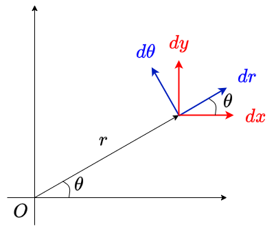

# ラグランジュ形式の力学

これから、解析力学の解析力学らしいところ、すなわち変数変換に対する運動方程式の変換について扱う。解析力学はニュートン力学を再定式化したものであるから、本質的には同じ問題を別の表示に書き換えているのに過ぎない。しかし、別の形式で書き直した方が見通しがよくなるし、ニュートン力学では見えなかった世界が見えてくる。まずは、ラグランジュ形式の力学が、ニュートン力学よりも広いタイプの変数変換に対して共変であることを見てみよう。

## 極座標の例

極座標における運動を考えよう。以下のような二次元の極座標系を考える。

$$
\begin{aligned}
x &= r\cos\theta \\
y &= r\sin \theta
\end{aligned}
$$

この系がポテンシャル$U(x,y)$による保存力により運動しているとしよう。ユークリッド座標で記述した運動方程式は、

$$
\begin{aligned}
m \ddot{x} &= F_x = -\frac{\partial U}{\partial x} \\
m \ddot{y} &= F_y = -\frac{\partial U}{\partial y} \\
\end{aligned}
$$

$r$方向の加速度$a_r$、$\theta$方向の加速度$a_\theta$、$r$方向の力$F_r$、$\theta$方向の力$F_\theta$を用いると、ニュートンの運動方程式は

$$
\begin{aligned}
m a_r &= F_r \\
m a_\theta &= F_\theta
\end{aligned}
$$

となる。この式を$r, \theta$を用いて書き下すのが目的である。図を見るとわかるように、$(dx,dy)$ の座標系から見て$(dr, d\theta)$の座標系は反時計回りに角度$\theta$ だけ回転している。したがって、

$$
\begin{aligned}
\begin{pmatrix}
a_r \\ a_\theta
\end{pmatrix}
&=
\begin{pmatrix}
\cos \theta & \sin \theta \\
-\sin \theta & \cos \theta
\end{pmatrix}
\begin{pmatrix}
\ddot{x} \\ \ddot{y}
\end{pmatrix}\\
\begin{pmatrix}
F_r \\ F_\theta
\end{pmatrix}
&=
\begin{pmatrix}
\cos \theta & \sin \theta \\
-\sin \theta & \cos \theta
\end{pmatrix}
\begin{pmatrix}
F_x \\ F_y
\end{pmatrix}
\end{aligned}
$$

が成り立つ。

まず、力について考えよう。力の$r$方向の向きの成分を考えると、

$$
\begin{aligned}
F_r &= F_x \cos \theta + F_y \sin \theta \\
&= - \frac{\partial U}{\partial x} \cos \theta - \frac{\partial U}{\partial y} \sin \theta
\end{aligned}
$$

ここで、もともと

$$
\begin{aligned}
x &= r \cos \theta\\
y &= r \sin \theta
\end{aligned}
$$

であったから、

$$
\begin{aligned}
\frac{\partial x}{\partial r} &= \cos \theta\\
\frac{\partial y}{\partial r} &= \sin \theta
\end{aligned}
$$

である。これを用いると

$$
F_r = - \frac{\partial U}{\partial x}\frac{\partial x}{\partial r} - \frac{\partial U}{\partial y}\frac{\partial y}{\partial r}
$$

ここで、$U(x,y)$について、合成関数の微分公式から

$$
\frac{\partial U}{\partial r} = \frac{\partial U}{\partial x}\frac{\partial x}{\partial r} + \frac{\partial U}{\partial y}\frac{\partial y}{\partial r}
$$

以上から、

$$
F_r = -\frac{\partial U}{\partial r}
$$

が得られる。

同様に、$\theta$方向の力についての成分を考えると

$$
F_\theta = - F_x \sin \theta + F_y \cos \theta
$$

となる。

$$
\begin{aligned}
\frac{\partial x}{\partial \theta} &= - r\sin \theta \\
\frac{\partial y}{\partial \theta} &=  r\cos \theta \\
\end{aligned}
$$

を代入すると、

$$
\begin{aligned}
F_\theta &= - \frac{1}{r}\frac{\partial U}{\partial x} \frac{\partial x}{\partial \theta} - \frac{1}{r}\frac{\partial U}{\partial y} \frac{\partial y}{\partial \theta} \\
&= -\frac{1}{r} \frac{\partial U}{\partial \theta}
\end{aligned}
$$

これで運動方程式の右辺が求まった。次は左辺である。加速度の成分も力と同様に、

$$
\begin{aligned}
a_r &= \ddot{x} \cos \theta + \ddot{y} \sin \theta \\
a_\theta &= -\ddot{x} \sin \theta + \ddot{y} \cos \theta
\end{aligned}
$$

これを求めるために、極座標の定義を時間微分する。まず一回微分。

$$
\begin{aligned}
\dot{x} &= \dot{r} \cos \theta - r \dot{\theta} \sin \theta \\
\dot{y} &= \dot{r} \sin \theta + r \dot{\theta} \cos \theta
\end{aligned}
$$

さらにもう一度微分する。

$$
\begin{aligned}
\ddot{x} &= \ddot{r} \cos \theta - 2\dot{r} \dot{\theta} \sin \theta - r\ddot{\theta} \sin \theta- r \dot{\theta}^2 \cos \theta \\
\ddot{y} &= \ddot{r} \sin \theta + 2\dot{r} \dot{\theta} \cos \theta + r\ddot{\theta} \cos \theta- r \dot{\theta}^2 \sin \theta
\end{aligned}
$$

これで$a_r$が計算できる。

$$
\begin{aligned}
a_r &= \ddot{x} \cos \theta + \ddot{y} \sin \theta\\
&= \ddot{r} - r \dot{\theta}^2
\end{aligned}
$$

次は$a_\theta$を計算しよう。

$$
\begin{aligned}
a_\theta &= -\ddot{x} \sin \theta + \ddot{y} \cos \theta \\
&= 2 \dot{r}\dot{\theta} + r \ddot{\theta} \\
&= \frac{1}{r}(2 r\dot{r}\dot{\theta} + r^2 \ddot{\theta})\\
&= \frac{1}{r}\frac{d}{dt}(r^2\dot{\theta})
\end{aligned}
$$

以上をまとめると、最終的に$r, \theta$に関する運動方程式

$$
\begin{aligned}
m (\ddot{r} - r \dot{\theta}^2) &= - \frac{\partial U}{\partial r} \\
m \frac{d}{dt} \left(r^2 \dot{\theta} \right) &= - \frac{\partial U}{\partial \theta}
\end{aligned}
$$

を得る。非常に面倒であったことがわかるであろう。

では、ラグランジアンから導出しよう。運動エネルギーを$r, \theta$で書くと、

$$
K = \frac{1}{2}m(\dot{r}^2 + r^2\dot{\theta}^2)
$$

であるから、極座標のラグランジアンは

$$
L(r, \theta, \dot{r},\dot{\theta}) = \frac{1}{2}m(\dot{r}^2 + r^2\dot{\theta}^2) - U(r, \theta)
$$

自由度$r$に関するオイラー・ラグランジュ方程式は、

$$
\frac{d}{dt}\left(\frac{\partial L}{\partial \dot{r}}\right) - \frac{\partial L}{\partial r} = m \ddot{r} - mr \dot{\theta}^2 + \frac{\partial U}{\partial r}
= 0
$$

自由度$\theta$に関するオイラー・ラグランジュ方程式は、

$$
\frac{d}{dt}\left(\frac{\partial L}{\partial \dot{\theta}}\right) - \frac{\partial L}{\partial \theta} = m\frac{d}{dt}(r^2 \dot{\theta}) + \frac{\partial U}{\partial r} = 0
$$

それぞれ整理すると、先程得られた式と全く同じ運動方程式が得られる。

$$
\begin{aligned}
m (\ddot{r} - r \dot{\theta}^2) &= - \frac{\partial U}{\partial r} \\
m \frac{d}{dt} \left(r^2 \dot{\theta} \right) &= - \frac{\partial U}{\partial \theta}
\end{aligned}
$$

このように、一度ラグランジアンを書いてしまえば、ラグランジアンだけを変数変換することで、後はオイラー・ラグランジュの方程式を書き下すだけで新しい変数が従う運動方程式が得られる。3次元の極座標や、より一般の変数変換をニュートンの運動方程式で扱うのは極めて面倒だが、ラグランジアンを用いればかなり見通しよく計算ができる。以下では、オイラー・ラグランジュ方程式が任意の座標変換に対して共変であることを証明しよう。

なお、この証明を覚える必要はまったくない。しかし、「証明できる」ということと「証明には数学のツールとして合成関数の偏微分くらいしか使わない」ということをなんとなく知っておくのは大事である。

## 点変換とラグランジアンの共変性

これから証明したいことは、一般の変数変換$(q^1, q^2, \cdots, q^N) \rightarrow (Q^1, Q^2, \cdots, Q^N)$において、元の変数がオイラー・ラグランジュ方程式

$$
\frac{d}{dt}\left(\frac{\partial L}{\partial \dot{q}^i} \right) -
\frac{\partial L}{\partial q^i} = 0 \quad (i = 1,2,\cdots, N)
$$

に従うならば、新しい変数も

$$
\frac{d}{dt}\left(\frac{\partial L}{\partial \dot{Q}^i} \right) -
\frac{\partial L}{\partial Q^i} = 0 \quad (i = 1,2,\cdots, N)
$$

に従う、という命題である。このような変換を **点変換(point transformation)** と呼ぶ。オイラー・ラグランジュ方程式は任意の点変換に対して共変である。しかし、この導出はかなり複雑であるため、まずは一自由度系で証明しよう。

ある変数$q$について、変数変換$Q = f(q)$を考える。$q$がオイラー・ラグランジュの運動方程式

$$
\frac{d}{dt}\left(\frac{\partial L}{\partial \dot{q}} \right) - \frac{\partial L}{\partial q} = 0
$$

を満たす時、変数変換後の変数$Q$についてもオイラー・ラグランジュの運動方程式

$$
\frac{d}{dt}\left(\frac{\partial L}{\partial \dot{Q}} \right) - \frac{\partial L}{\partial Q} = 0
$$

を満たす、というのが証明したいことである。

そのために、まず$Q = f(q)$を$Q$について逆に解いて

$$
q = f^{-1}(Q)
$$

と書く。ここで、$f^{-1}$を$q$と同一視し、以後は$q(Q)$と書く。すると、$\dot{q}$は、

$$
\dot{q} \equiv \frac{d}{dt}q(Q) =  \frac{dq}{dQ} \dot{Q}
$$

と書ける。ここで$dq/dQ$は$Q$の関数であるから、$\dot{q}$は$Q$と$\dot{Q}$両方の関数である。そこで、$\dot{q} = \dot{q}(Q,\dot{Q})$と表現する。後のために、いくつか関係式を導出しておく。$\dot{q}$は$Q$及び$\dot{Q}$の関数であるから、それらが独立だと思って$Q$や$\dot{Q}$で偏微分する。まず、$\dot{q}$を$Q$で偏微分すると、

$$
\frac{\partial \dot{q}}{\partial Q} = \frac{d^2q}{dQ^2} \dot{Q}
$$

次に、$\dot{q}$を$\dot{Q}$で偏微分すると、

$$
\frac{\partial \dot{q}}{\partial \dot{Q}} = \frac{dq}{dQ}
$$

更に時間微分すると、

$$
\frac{d}{dt}\left(\frac{\partial \dot{q}}{\partial \dot{Q}}\right) = \frac{d^2q}{dQ^2} \dot{Q}
$$

従って、

$$
\frac{d}{dt}\left(\frac{\partial \dot{q}}{\partial \dot{Q}}\right) = \frac{\partial \dot{q}}{\partial Q}
$$

が証明された。さて、ラグランジアンの$Q, \dot{Q}$依存性をあらわに書くと

$$
L(\dot{q}, q) = L(\dot{q}(\dot{Q},Q), q(Q))
$$

このラグランジアン$L$の$\dot{Q}$による偏微分を考えよう。$\dot{Q}$は$\dot{q}$の場所にしか現れないため

$$
\frac{\partial L}{\partial \dot{Q}}  = \frac{\partial L}{\partial \dot{q}} \frac{\partial \dot{q}}{\partial \dot{Q}} = \frac{\partial L}{\partial \dot{q}}\frac{dq}{dQ}
$$

ただし、先程導いた関係式 $\partial \dot{q}/\partial \dot{Q} = dq/dQ$を用いた。$Q, \dot{Q}$に関するオイラー・ラグランジュ方程式を作りたいので、さらに時間で微分すると、

$$
\begin{aligned}
\frac{d}{dt}\left(\frac{\partial L}{\partial \dot{Q}} \right) &= \frac{d}{dt} \left(\frac{\partial L}{\partial \dot{q}} \right) \underbrace{\frac{\partial \dot{q}}{\partial \dot{Q}}}_{d q/d Q} + \frac{\partial L}{\partial \dot{q}} \underbrace{\frac{d}{dt}\left(\frac{dq}{dQ}\right)}_{\partial \dot{q}/\partial Q} \\
&=\frac{d}{dt} \left(\frac{\partial L}{\partial \dot{q}} \right) \frac{d q}{d Q} + \frac{\partial L}{\partial \dot{q}} \frac{\partial \dot{q}}{\partial Q}
\end{aligned}
$$

次にラグランジアンの$Q$偏微分を考える。$\dot{q}$、$q$は両方とも$Q$依存性を持つため、

$$
\frac{\partial L}{\partial Q} =
\frac{\partial L}{\partial \dot{q}} \frac{\partial \dot{q}}{\partial Q}
+
\frac{\partial L}{\partial q} \frac{dq}{dQ}
$$

以上から、

$$
\begin{aligned}
\frac{d}{dt}\left(\frac{\partial L}{\partial \dot{Q}}\right) - \frac{\partial L}{\partial Q}
&= \frac{d}{dt}\left(\frac{\partial L}{\partial \dot{q}}\right) \frac{dq}{dQ}
+ \cancel{\frac{\partial L}{\partial \dot{q}} \frac{\partial \dot{q}}{\partial Q}}\\
&- \frac{\partial L}{\partial q} \frac{dq}{dQ} - \cancel{\frac{\partial L}{\partial \dot{q}} \frac{\partial \dot{q}}{\partial Q}} \\
&= \left[
\underbrace{
\frac{d}{dt}\left(\frac{\partial L}{\partial \dot{q}}\right) + \frac{\partial L}{\partial q}
}_{=0}
\right]
\frac{dq}{dQ} \\
&=0
\end{aligned}
$$

$q$を$Q(q)$に変数変換した場合、$q$がオイラー・ラグランジュの運動方程式に従うのであれば、$Q$も全く同じ形の式に従うことが証明された。

以上の変換を図解しておこう。

## 多変数の場合

これまで、なるべく1自由度系で議論を構築してきた。しかし、ほとんどの場合、我々の興味ある系は複数の自由度を持つ。例えば3次元空間に$n$個粒子がいれば、座標を指定するだけで$3n$個の変数が必要である。そこで、系の状態が$N$個の一般化座標$q_1, q_2, \cdots, q_N$で指定されていると考えよう。単振り子なら$N=1$、二重振り子なら$N=2$、3次元$n$粒子系なら$N=3n$だ。このような多自由度系のラグランジアンの変数変換について扱おう。

この$N$自由度系において、ラグランジアン$L(\dot{q}_1, \dot{q}_2, \cdots, \dot{q}_N, q_1, q_2, \cdots, q_N)$が与えられており、以下のオイラー・ラグランジュの式が成り立つとしよう。

$$
\frac{d}{dt}\left( \frac{\partial L}{\partial \dot{q}^i}\right) - \frac{\partial L}{\partial q^i} = 0
$$

ただし$i$は$1$から$N$までの値をとり、そのすべてにおいてこの式が成立しているとする。ここで、一般的な点変換$(q^1, q^2, \cdots, q^N) \rightarrow (Q^1, Q^2, \cdots, Q^N)$を考える。具体的には$N$本の関数$f_i$を使って、

$$
\begin{aligned}
Q^1 &= Q^1(q^1, q^2, \cdots, q^N) \\
Q^2 &= Q_2(q^1, q^2, \cdots, q^N) \\
&\cdots \\
Q^N &= Q_N(q^1, q^2, \cdots, q^N)
\end{aligned}
$$

と変換が与えられたとする(変数と変換の関数を同一視していることに注意)。この時、新しい変数においても

$$
\frac{d}{dt}\left( \frac{\partial L}{\partial \dot{Q}^i}\right) - \frac{\partial L}{\partial Q^i} = 0
$$

が全ての$i$で成立する。すなわち、オイラー・ラグランジュ方程式は多自由度系の一般の点変換において共変である。以後、参考のために多自由度系における証明を記載するが、この証明を追う必要はない。証明の流れは一自由度系とほとんど同様だが、偏微分などがややこしくなるだけである。

まず、変数変換$\{q^i\} \rightarrow \{Q^i\}$を逆に解いて

$$
q^i = q^i(Q^1, Q^2, \cdots, Q^N) \quad (i = 1,2,\cdots, N)
$$

という関係が得られたとしよう。これを時間微分すると、

$$
\dot{q}^i = \frac{\partial q^i}{\partial Q^k} \dot{Q}^k
$$

となる。ここで、アインシュタイン規約を使っており、実際には$k$について和を取っていることに注意。これを$\dot{Q}^k$で偏微分すると、和のうち$k$のインデックスに関するものだけが残るため、

$$
\frac{\partial \dot{q}^i}{\partial \dot{Q}^k} = \frac{\partial q^i}{\partial Q^k}
$$

を得る。これをさらに時間微分すると、

$$
\frac{d}{dt}\left(\frac{\partial \dot{q}^i}{\partial \dot{Q}^k}\right) = \frac{\partial^2 q^i}{\partial Q^k \partial Q^j} \dot{Q}^j
$$

となる。ここで、また$\dot{q}^i$の表式に戻る。ただし、後の都合のために和を$j$で取っておく。

$$
\dot{q}^i = \frac{\partial q^i}{\partial Q^j} \dot{Q}^j
$$

これを$Q^k$で偏微分すると、

$$
\frac{\partial \dot{q}^i}{\partial Q^k} = \frac{\partial^2 \dot{q}^i}{\partial Q^j\partial Q^k} \dot{Q}^j
$$

先程得た式と比べることで、

$$
\frac{d}{dt}\left(\frac{\partial \dot{q}^i}{\partial \dot{Q}^k}\right) = \frac{\partial \dot{q}^i}{\partial Q^k}
$$

を得た。さて、ラグランジアンを新しい変数で偏微分していこう。適宜、途中で得た関係式を代入している。

$$
\frac{\partial L}{\partial \dot{Q}^k} = \frac{\partial L}{\partial \dot{q}^i}\frac{\partial \dot{q}^i}{\partial \dot{Q}^k}
$$

さらにこれを時間微分すると、

$$
\begin{aligned}
\frac{d}{dt} \left(\frac{\partial L}{\partial \dot{Q}^k}\right) &=
\frac{d}{dt} \left(\frac{\partial L}{\partial \dot{q}^i}\right) \frac{\partial \dot{q}^i}{\partial \dot{Q}^k} + \frac{\partial L}{\partial \dot{q}^i} \frac{d}{dt} \left( \frac{\partial \dot{q}^i}{\partial \dot{Q}^k} \right) \\
&= \frac{d}{dt} \left(\frac{\partial L}{\partial \dot{q}^i}\right)  \frac{\partial q^i}{\partial Q^k} + \frac{\partial L}{\partial \dot{q}^i} \frac{\partial \dot{q}^i}{\partial Q^k}
\end{aligned}
$$

一方、$L$を$Q^k$で偏微分すると、

$$
\begin{aligned}
\frac{\partial L}{\partial Q^k} &= \frac{\partial L}{\partial q^i}\frac{\partial q^i}{\partial Q^k} + \frac{\partial L}{\partial \dot{q}^i}\frac{\partial \dot{q}^i}{\partial Q^k}
\end{aligned}
$$

先程求めた式と差を取ると、

$$
\frac{d}{dt} \left(\frac{\partial L}{\partial \dot{Q}^k}\right) + \frac{\partial L}{\partial Q^k} = \underbrace{\left(\frac{d}{dt} \left(\frac{\partial L}{\partial \dot{q}^i}\right)  - \frac{\partial L}{\partial \dot{q}^i}\right)}_{=0} \frac{\partial q^i}{\partial Q^k}
$$

以上から、元の変数でオイラー・ラグランジュ方程式が成り立つと、新しい変数でもオイラー・ラグランジュ方程式が成り立つ、すなわち、オイラー・ラグランジュ方程式が任意の点変換において共変であることが示された。繰り返しになるが、この証明を追う必要はない。しかし「面倒ではあるが、基本的な微分の公式だけで証明できる」ということは頭に入れておいて欲しい。

## 電磁場中の粒子の運動

電磁場中を荷電粒子が運動すると、電磁場からの力を受ける。いま、電荷$q$の粒子が、電場$\mathbf{E}$、磁束密度$\mathbf{B}$の中を速度$\mathbf{v}$で運動すると、

$$
\mathbf{F} = q(\mathbf{E} + \mathbf{v}\times\mathbf{B})
$$

の力を受ける。この力に対応するポテンシャルが

$$
U = q \left( \phi - \dot{\mathbf{r}} \cdot \mathbf{A} \right)
$$

と書けることを、ラグランジアンから導出しよう。

まず、電場$\mathbf{E}$のみを考える。スカラーポテンシャル$\phi(x,y,z)$を用いて

$$
\mathbf{E} = - \nabla \phi
$$

と書けているとしよう。ポテンシャルエネルギーを

$$
U = q \phi
$$

で定義すると、この系のラグランジアンは

$$
L = \frac{1}{2}m(\dot{x}^2+\dot{y}^2+\dot{z}^2) + q \phi(x,y,z)
$$

となる。$x$成分についてオイラー・ラグランジュ方程式を作ってみよう。

$$
\begin{aligned}
\frac{d}{dt}\left(\frac{\partial L}{\partial \dot{x}} \right) + \frac{\partial L}{\partial x}
&= m\ddot{x} +q \frac{\partial \phi}{\partial x} \\
&= 0
\end{aligned}
$$

$y, z$成分も同様であるから、

$$
\begin{aligned}
m\ddot{x} &= -q \frac{\partial \phi}{\partial x} \\
m\ddot{y} &= -q \frac{\partial \phi}{\partial y} \\
m\ddot{z} &= -q \frac{\partial \phi}{\partial z}
\end{aligned}
$$

したがって、位置ベクトル

$$
\mathbf{r} =
\begin{pmatrix}
x \\ y \\z
\end{pmatrix}
$$

を用いると、

$$
m \ddot{\mathbf{r}} =  - q \nabla \phi = q \mathbf{E}
$$

となる。これは、これまでニュートン力学で扱ってきたポテンシャルそのままである。

次に、磁束密度$\textbf{B}$のみがある中での運動を考える。磁束密度が時間非依存のベクトルポテンシャル$\mathbf{A}$を用いて

$$
\textbf{B} = \nabla \times \textbf{A}
$$

と書こう。後のために成分を書き下しておく。

$$
\begin{aligned}
B_x &= \frac{\partial A_z}{\partial y} - \frac{\partial A_y}{\partial z}\\
B_y &= \frac{\partial A_x}{\partial z} - \frac{\partial A_z}{\partial x}\\
B_z &= \frac{\partial A_y}{\partial x} - \frac{\partial A_x}{\partial y}
\end{aligned}
$$

この時、ポテンシャルエネルギーを

$$
\begin{aligned}
U &= - q \dot{\mathbf{r}}  \cdot \mathbf{A}\\
&= -q (\dot{x}A_x  +  \dot{x}A_y  + \dot{x}A_z)
\end{aligned}
$$

で定義する。今度はポテンシャルに速度成分が含まれるため、計算がややこしくなる。この系のラグランジアンは

$$
L(\mathbf{r}, \dot{\mathbf{r}}) = \frac{1}{2}m(\dot{x}^2+\dot{y}^2+\dot{z}^2) + q (\dot{x}A_x  +  \dot{x}A_y  + \dot{x}A_z)
$$

まず、両辺を$\dot{x}$で偏微分する。

$$
\frac{\partial L}{\partial \dot{x}} = m\dot{x} + q A_x
$$

$A_x(x,y,z)$であり、$(x,y,z)$が時間依存することに注意して、さらに時間微分すると、

$$
\frac{d}{dt}\left(\frac{\partial L}{\partial \dot{x}} \right)
= m \ddot{x} + q \left(\dot{x} \frac{\partial A_x}{\partial x} + \dot{y} \frac{\partial A_x}{\partial y} + \dot{z} \frac{\partial A_x}{\partial z}\right)
$$

次に、ラグランジアンを$x$で偏微分すると、

$$
\frac{\partial L}{\partial x} = q \left(\dot{x}\frac{\partial A_x}{\partial x}+ \dot{y}\frac{\partial A_y}{\partial x}+\dot{z}\frac{\partial A_z}{\partial x}\right)
$$

辺々引くと、

$$
\begin{aligned}
\frac{d}{dt}\left(\frac{\partial L}{\partial \dot{x}} \right) - \frac{\partial L}{\partial x} &= m\ddot{x} - q \left\{\dot{y} \underbrace{\left(\frac{\partial A_y}{\partial x} - \frac{\partial A_x}{\partial y} \right)}_{B_z} - \dot{z} \underbrace{\left(\frac{\partial A_x}{\partial z} - \frac{\partial A_z}{\partial x} \right)}_{B_y}\right\} \\
&= m\ddot{x} - q (\dot{y}B_z - \dot{z}B_y)\\
&= 0
\end{aligned}
$$

したがって、

$$
m \ddot{x} = q (\dot{y} B_z - \dot{z} B_y) \\
$$

他の成分も同様に求めることができ、結果として以下の運動方程式を得る。

$$
\begin{aligned}
m \ddot{x} &= q (\dot{y} B_z - \dot{z} B_y) \\
m \ddot{y} &= q (\dot{z} B_y - \dot{x} B_z) \\
m \ddot{z} &= q (\dot{x} B_x - \dot{y} B_x)
\end{aligned}
$$

ベクトル表記すると、

$$
m \ddot{\mathbf{r}} = q \dot{\mathbf{r}} \times \mathbf{B}
$$

以上から、電磁場中を荷電粒子が運動する際、その荷電粒子が感じるポテンシャルエネルギーは

$$
U(\textbf{r}, \dot{\textbf{r}}) = q (\phi - \dot{\mathbf{r}}\cdot \mathbf{A})
$$

であることがわかった。このポテンシャルエネルギーはスカラー関数とベクトル関数を含んでいるため、それぞれスカラーポテンシャル、ベクトルポテンシャルと呼ぶ。

電磁気学でベクトルポテンシャルをならった時に「スカラーポテンシャルを考える理由はまだわかるが、ベクトルポテンシャルというものをなぜ考えなければならないのだろう？」と疑問に思ったことはないだろうか？上記の議論がその答えの一部を与えている。

スカラーポテンシャルのように、ポテンシャル関数が位置のみに依存する場合は、単にその勾配が力を与えていた。しかし、速度にも依存する場合は、オイラー・ラグランジュ方程式から、すなわち変分原理から計算しないと力を求めることができない。逆にいえば、速度に依存するポテンシャルを考えれば、変分原理から磁場による力も表現できるということである。変分原理の考え方に基づけば、「なぜ磁場中を運動する荷電粒子は、磁場と直交する向きに力を受けるのか」という問に対して「あるベクトルポテンシャルと速度の内積でポテンシャルエネルギーが与えられている時、それを含めたラグランジアンを最小化するように運動を決めるとそうなるから」と答えることができる。このように、まずスカラーポテンシャルやベクトルポテンシャルを用いてラグランジアンを定義し、変分原理により運動方程式を導出すると、その運動方程式に電場は磁束密度による力が現れる、という流れを見ると、電場は磁束密度よりもスカラーポテンシャルやベクトルポテンシャルが「より根源的な量」である気がしてくるであろう。もちろんそれは「そんな気がしてくる」というだけであって、変分原理は「我々が適切なラグランジアンを見つけると、適切な運動方程式を生み出す」という以上の意味はないが、何が本質であるかに思いを馳せること自体は、解析力学の学習に有用であろうと思う。

## 記号の節約表記について

ラグランジアンを扱う際、どの変数を独立とみなし、どの変数が独立でないのかがよくわからなくなることが多い。これは主に表記において記号の節約を行うことに起因する。例えば、ある関数$f$を使って$Q = f(q)$と変換する時、$Q$の時間微分は

$$
\frac{dQ}{dt} = \frac{df}{dq} \frac{dq}{dt}
$$

と書ける。これは単なる合成関数の微分公式であるから何も問題はない。しかし、多くの場合$f$は$Q$と同一視され、

$$
\dot{Q} = \frac{dQ}{dq} \dot{q}
$$

と書かれる。さらに、ラグランジアンにおいて$L(q,\dot{q})$とし、$\dot{q}$と$q$は独立だとみなすが、ラグランジアンを時間積分する際には$q$と$\dot{q}$には$\dot{q} = dq/dt$の関係がある。これを記号の節約をせずにきちんと書くなら、ラグランジアンを$L(x, v)$と異なる記号で書いておけば独立であることがわかりやすく、これを時間積分する際には積分路が$s(t)$で指定されるとして、$x = s(t)$、$v = \dot{s}(t)$と媒介変数表示をすれば、$x$と$v$がどのような関係があるのかがわかりやすい。媒介変数であることがわかりやすいように$\xi$や$\eta$といった記号を使う流儀もある。しかし筆者は、このように表記すると記号が増え、かえって本質が見えづらくなると感じる。大多数の読者は深く考えず、なんとなく「そういうものだ」と納得するであろうし、今はそれで良いと思う。もし将来、真面目に計算して何が独立で何がそうでないか混乱した時に、混乱の原因が変数の節約にあるかもしれないと思い至ればそれで良い。どうせ解析力学をきちんと理解するのは時間がかかる。まずはざっと式変形の地図を頭にイメージできるようにして、あとで「あれ？」と思ったら別の書籍を調べて正確な理解を目指せば良い。

## まとめ

ニュートンの運動方程式がガリレイ変換という限られた座標変換でのみ共変であったのに対して、オイラー・ラグランジュ方程式は、任意の非線形変換を含む点変換に対して共変であることが証明された。点変換の典型例は極座標表示である。二次元でもかなり面倒であるのだが、三次元の極座標が従う運動方程式を、ニュートン力学から導出するのは極めて面倒である(少なくとも私はやりたくない)。ラグランジアンを使ってもまだ面倒であるが、それでもかなり労力を減らすことができる。これは、単に計算が楽になるというだけでなく、系に内在する性質を見やすくするという、運動の本質をえぐり出すことにも繋がる。ここでは、座標を任意に混ぜる変換を考えた。次は運動量と座標も混ぜるような変換にたいして共変であるような運動方程式の表式が欲しくなる。それがハミルトンの運動方程式である。

## 余談：公式の証明

数学や物理には様々な公式が現れる。その代表例が三角関数であり、大量に現れる煩雑な公式に嫌になってしまう人も多いであろう。ネットで検索できる時代、公式は覚える必要はまったくない。しかし、自分で使う公式は、一度はすべて手で導出しておいたほうが良い。例えば三角関数の加法定理で、

$$
\begin{aligned}
\sin(\alpha + \beta) &= \sin \alpha \cos \beta + \cos \alpha \sin \beta\\
\cos(\alpha - \beta) &= \cos \alpha \cos \beta - \sin \alpha \sin \beta\\
\end{aligned}
$$

のような公式を「咲いたコスモス…」のように覚えた人もいるだろう。しかしこの公式は、オイラーの等式

$$
\exp(i\theta) = \cos \theta + i \sin \theta
$$

と、指数関数の性質

$$
\exp(i(\alpha + \beta)) = \exp(i \alpha) + \exp(i \beta)
$$

から容易に導出できる。ここで、これらの導出を知っていること、すなわち「知識」が大事なのではない。複素平面の幾何学的な解釈と、三角関数とは本質的に指数関数である、という「感覚」が大事である。こういった感覚の積み上げが物理や数学の理解につながっていく。結局、手を動かすことなく何かを理解できることはない。今回のラグランジアンの共変性も、その導出そのものが大事なのではなく、オイラー・ラグランジュ方程式が変分原理から導かれたから変数変換に強いのだ、という感覚を身につける方が良い。
