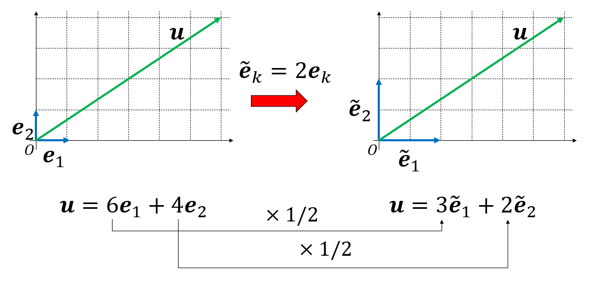
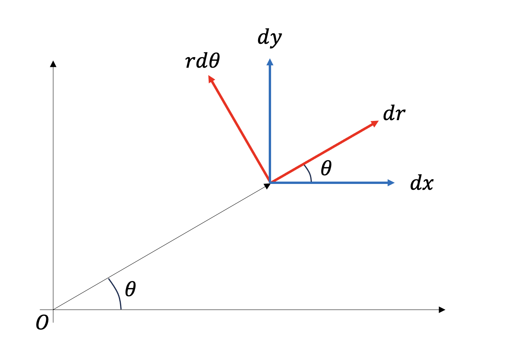

# ニュートンの運動方程式

解析力学を学ぶ前に、ニュートンの運動方程式がどのような性質を持っているかを確認しよう。まず、ニュートン力学について復習し、次にニュートンの運動方程式がガリレイ変換に対する共変性を持っていることを確認する。そのために、反変ベクトル、共変ベクトルの区別について学び、その後、座標変換に対する運動方程式の共変性について調べる。

## 力学の復習

### 原理と法則

これまでに力学を学んだはずである。これから学ぶ解析力学と区別するため、これまでに学んだ力学をニュートン力学と呼ぼう。ニュートン力学は「慣性の法則」「運動の法則」「作用・反作用の法則」の、運動の三法則を原理とする。「法則を原理とする」という言葉により、この三法則は原理なのか法則なのか混乱するかもしれない。ここで法則と原理について定義しておこう。

まず、物理において **法則 (law)** とは観測事実である。様々な実験により、一般的に成り立っていると信じられる事実を法則と呼ぶ。例えばケプラーが太陽系について発見した、

* ケプラーの第一法則：惑星は太陽を焦点とする楕円軌道を描く
* ケプラーの第二法則：惑星と太陽を結ぶ線分が単位時間に描く面積は一定である
* ケプラーの第三法則：惑星の公転周期の2乗は、軌道長半径の3乗に比例する

などが法則の例である。これはケプラーが、ティコ・ブラーエの残した天文観測データから発見したものだ。すなわち観測事実である。

ニュートンは、ケプラーの残したデータから、「物体の間には互いに引き合う力が存在し、その力は質量に比例し、距離の2乗に反比例する」という万有引力の法則を発見する。ニュートンの運動方程式と、万有引力の法則を組み合わせることで、ケプラーの三法則を導くことができる。

さて、観測事実である法則を説明するためには、別の根拠が必要になる。その根拠を説明するためには、また別の根拠が必要になる。このようなことを繰り返していくと、どこかで「これ以上遡ることができない、議論の出発点」に到達する。この議論の出発点のことを **原理 (principle)** と呼ぶ。原理は、我々が議論の余地なく認めるもので、それさえ認めてしまえば、世界の様々な観測事実をうまく説明できるものだ。ニュートンは、様々な観測事実から、運動の三法則が成り立っていることを確信した。そこで、この三法則を原理として要請することで、ニュートン力学が構築された。

原理は議論の出発点であるから、原理が正しいことについて別に根拠を求めることができない。そこで、我々はその原理から導かれる知識を使って、何かを予測する。例えば、もしニュートン力学と万有引力が正しければ、未知の天体についてもその軌道を予測することができるはずだ。18世紀、火星と木星の間に大きな隙間があることが知られており、そこに未知の惑星があることが予想されていた。その惑星はケレスと名付けられ、1801年1月1日に発見されたが、その後、位置を見失っていた。ガウスはケレスの正確な位置を計算することに成功し、それにより同年12月31日、予測された位置でケレスは再発見された。このように、原理からの予測が未知の現象を説明できたならば、我々はその原理を正しいと信じていくことになる。この「観測事実→法則(経験的事実)→原理→法則(導出)→予測」という一連の流れは、物理学において極めて普遍的に見られる営みである。

### 運動の三法則

力学は物体の運動を扱う学問である。一般に物体は大きさを持つ。物体の質量が一点に集まっているとして運動が記述できる場合、その物体を質点と呼ぶ。物体の大きさが無視できないが、物体が十分に硬く、その変形が無視できる場合を剛体と呼ぶ。物体の変形まで考慮する場合、加えている力を取り除くと元に戻る物体を弾性体、変形が有限のまま残る物体を塑性体と呼ぶ。さらに、無限小の力で有限の変形を引き起こせる物体を流体と呼び、それを扱う学問が流体力学である。

本講義では、質点の運動のみを扱うことにする。なお、有限の大きさを持つ物体の運動も扱うが、その物体の回転などを扱わないため、質点の運動として記述できる。

さて、改めてニュートンの運動の三法則を見てみよう。

* 運動の第一法則(慣性の法則)
  * 他から力が働いていない質点は、等速直線運動を行う。
* 運動の第二法則(運動の法則)
  * 質点に力が働く時、質点は力の方向に、力に比例、質量に反比例する大きさの加速度を持つ。
* 運動の第三法則(作用・反作用の法則)
  * 2つの質点の間に力が働く時、両者の大きさは等しく、向きは逆向きとなる。

第一法則は、「他から力が作用していない質点は、等速直線運動をする」と表現される。質点が静止している場合も、速度ゼロの等速直線運動とみなす。これを慣性の法則と呼び、慣性の法則が成り立つ系を **慣性系 (inertial frame of reference)** と呼ぶ。第一法則は、この慣性系が存在する(我々が慣性系を採用できる)ことを主張する。慣性系とは、ひらたく言えば「止まっている座標系」である。全ての運動はこの座標系から見た相対運動として表現することができる。第一法則は、しばしば第二法則の加速度がゼロの場合の特殊なケースであるとよく誤解されるが、第二法則は慣性系を定義しなければ意味を持たないため、第一法則とは別の法則である。

第二法則は、いわゆる$F=ma$を指す。しかし、質点の運動、特に加速度を定義するためには、「何に対して動いているのか」を考えなければならない。第二法則をより正確に記述するなら「質点に力が働く時、質点は **慣性系に対して** 力の方向に、力に比例、質量に反比例する加速度を持つ」となる。加速度運動を定義するためには、静止した座標系が必要となる。第一法則は、その静止した座標系が定義できることを主張する。

ここで、静止した座標系と書いたが、実際には、ある静止した座標系に対して等速直線運動をしているような座標系もやはり慣性系となるため、こちらを「静止している」とみなすこともできる。ニュートンは絶対静止空間を考えたが、現在では特別な慣性系は存在せず、無数にある慣性系の中から計算に便利な慣性系を選んで採用していると解釈する。

第三法則は、力は必ずペアで、大きさが同じで、かつ逆向きに発生することを主張する。これは観測事実であり、なぜそうであるかは説明してくれない。今、第三法則を破る物体があるとしよう。たとえば同じ符号の電荷のように互いに反発するが、一方から一方への力が、逆向きに働く力よりも強いとする。すると、一方に力を加え、もう一方を間接的に動かすと、加えた力以上の力が得られることになる。これを利用して仕事を取り出すことが可能であるから永久機関を作ることができる(第一種永久機関)。第三法則はこのようなことができないことを主張する。

## 座標変換と運動方程式の共変性

同じ物体の運動を別の人が観測しているとする。それぞれの観測者は異なる座標から物体の運動を観測している。この時、観測者によって物理法則が異なるように見えては困る。そこで、どの観測者から見ても成立するような法則を物理法則と呼ぶことにする。これは、どこかに絶対的な代表がいて、その人にとっての運動法則だけが正しいわけではなく、全ての観測者は相対的であり、誰にとっても運動法則は同じように見えて欲しい、という要請である。この要請を相対性原理と呼ぶ。

力学は空間の中の物体の軌跡を追いかける学問であり、異なる座標系を用いれば、軌跡も異なって見える。その中で何が形を変えないものが物理法則である。そこで、座標変換によって物理法則がどのように変換されるかを知る必要がある。その準備として、座標変換によりスカラーやベクトルがどのように変換を受けるかを調べ、改めてスカラー、ベクトルを定義しよう。

### スカラー

地図を思い浮かべて欲しい。地図には等高線が書いてあり、その場所での標高がわかるようになっている。この地図を使って、現在自分がいる地点の標高を調べたとしよう。さて、目的地に向かうため、道の方向に合わせて地図を向きを回転させたとしよう。これは座標変換したことに対応するが、座標変換しても現時点の高さは変わらない。このように、座標変換により変換を受けない量を **スカラー(scolar)** と定義する。

地図の例でいえば、座標$(x,y)$に対して、高さ$h(x,y)$が定義されており、変数変換$(x,y)\rightarrow (\tilde{x}, \tilde{y})$をしても、そこが同じ場所であるならば高さの値$h(\tilde{x}, \tilde{y})$は変わらないことを意味する。

### ベクトル

座標変換により値が変わらないのがスカラーであった。一方、座標変換で値が変わるのがベクトルである。一般に、ベクトルは適当な基底を選ぶことで成分表示できる。同じベクトルでも、別の基底を選ぶと成分が変わる。この成分の変化のし方により、ベクトルは反変ベクトルと共変ベクトルに分類される。

例を挙げよう。基底$\{\boldsymbol{e}_1, \boldsymbol{e}_2\}$で張られる二次元空間があり、あるベクトル$\boldsymbol{u}$がこの基底により

$$
\boldsymbol{u} = 6 \boldsymbol{e}_1 + 4 \boldsymbol{e}_2
$$

と展開されているとしよう。この時、ベクトルの成分表示は$\boldsymbol{u} = (6,4)$となる。さて、基底の長さを2倍にしてみよう。

$$
\begin{aligned}
\tilde{\boldsymbol{e}}_1 &= 2 \boldsymbol{e}_1 \\
\tilde{\boldsymbol{e}}_2 &= 2 \boldsymbol{e}_2
\end{aligned}
$$

新しい基底$\{\tilde{\boldsymbol{e}}_1, \tilde{\boldsymbol{e}}_2\}$で$\boldsymbol{u}$を展開すると、

$$
\boldsymbol{u} = 3 \tilde{\boldsymbol{e}}_1 + 2 \tilde{\boldsymbol{e}}_2
$$

となる。この時、ベクトルの成分表示は$\boldsymbol{u} = (3,2)$と、元の半分になる。このように、基底の長さを2倍にした時、成分が半分となるようなベクトルを、基底と反対向きの変換を受けるという意味で **反変ベクトル(contravariant vector)** と呼ぶ。このように、基底で展開した成分は反変ベクトルとなる。反変ベクトルの正確な定義は後に与える。

この事実を一般化しておこう。いま、あるベクトル$\boldsymbol{u}$が正規直交基底$\{\boldsymbol{e}_i\}$により、以下のように成分表示されているとしよう。

$$
\boldsymbol{u} = u^i \boldsymbol{e}_i
$$

ここで、後の都合のためにベクトルの成分の添字を上付きにしている。さらに、同じ記号が現れた場合(今回は$i$)はその記号について和を取るというアインシュタイン規約を用いている。さて、なにか適当な行列$T$を用いて、基底が$\{\boldsymbol{e}_i\}$から、別の正規直交基底$\{\tilde{\boldsymbol{e}}_i\}$に以下のように変換されたとする。

$$
\tilde{\boldsymbol{e}}_i = T^k_{\,i} \boldsymbol{e}_k
$$

ベクトル$\boldsymbol{u}$を新しい基底$\{\tilde{\boldsymbol{e}}_i\}$で展開すると、

$$
\begin{aligned}
\boldsymbol{u} &= \tilde{u}^k \tilde{\boldsymbol{e}}_k \\
&= \tilde{u}^k T^j_{\,k} \boldsymbol{e}_j
\end{aligned}
$$

両辺について$\boldsymbol{e}^i$と内積をとると、

$$
\begin{aligned}
u^i &= \tilde{u}^k T^j_{\,k} (\boldsymbol{e}^i,\boldsymbol{e}_j),\\
&= \tilde{u}^k T^j_{\,k} \delta^i_{\,j}, \\
&= T^i_{\,k} \tilde{u}^k.
\end{aligned}
$$

基底の変換と並べてみると、

$$
\begin{aligned}
\tilde{\boldsymbol{e}}_i &= T^k_{\,i} \boldsymbol{e}_k \\
u^i &= T^i_{\,k} \tilde{u}^k
\end{aligned}
$$

チルダが現れる項が左右逆になっていることがわかる。$\boldsymbol{u}$は基底の変換と反対の変換を受けるから反変ベクトルである。

逆に、基底と同じ形の変換を受けるベクトル、すなわちチルダが同じ側に現れるのが共変ベクトルである。定義から、基底自身は共変ベクトルとなる。さらに、先程、反変ベクトルであることがわかった成分ベクトルを縦ベクトルとすると、その双対である横ベクトルは共変ベクトルとなる。

$\{\boldsymbol{e}_i\}$や$\{\tilde{\boldsymbol{e}}_i\}$が張っていた空間と双対な空間を張る基底$\{\boldsymbol{e}^i\}$や$\{\tilde{\boldsymbol{e}}^i\}$を考えよう。$\{\boldsymbol{e}_i\}$で張られる空間のベクトルを縦ベクトルとするので、$\{\boldsymbol{e}_i\}$と添字が下についている基底を縦ベクトルの基底と呼ぼう。すると、その双対ベクトル$\{\boldsymbol{e}^i\}$で展開されるベクトルは横ベクトルとなるため、$\{\boldsymbol{e}^i\}$と上付きの添字を持つ基底を横ベクトルの基底と呼ぶことにする。

以下のように、共役なベクトルとの直交性を課す。

$$
\begin{aligned}
(\boldsymbol{e}^j,\boldsymbol{e}_i) &= \delta^j_{\,i} \\
(\tilde{\boldsymbol{e}}^j,\tilde{\boldsymbol{e}}_i) &= \delta^j_{\,i} \\
\end{aligned}
$$

さて、縦ベクトルの基底が$\tilde{\boldsymbol{e}}_i = T^k_{\,i} \boldsymbol{e}_k$と変換される時、横ベクトルの基底がどのように変換されるか見てみよう。変換の前後で

$$
\tilde{\boldsymbol{e}}^i = M^i_{\,k} \boldsymbol{e}^k
$$

と展開できるとする。両辺、$\boldsymbol{e}_j$との内積を取ると、

$$
\begin{aligned}
(\tilde{\boldsymbol{e}}^i, \boldsymbol{e}_j) &= M^i_{\,k} (\boldsymbol{e}^k, \boldsymbol{e}_j)
&= M^i_{\,k} \delta^k_{\,j} \\
&= M^i_{\,j}
\end{aligned}
$$

縦ベクトルの基底の変換は以下で与えられているとする。

$$
\tilde{\boldsymbol{e}}_i = T^k_{\,i} \boldsymbol{e}_k.
$$

両辺、$\tilde{\boldsymbol{e}}^j$と内積をとると、左辺は直交性から

$$
(\tilde{\boldsymbol{e}}^j, \tilde{\boldsymbol{e}}_i) = \delta^j_{\,i}.
$$

右辺は、先程求めた$(\tilde{\boldsymbol{e}}^i, \boldsymbol{e}_j) = M^i_{\,j}$を代入することで

$$
T^k_{\,i} (\tilde{\boldsymbol{e}}^j, \boldsymbol{e}_k) =   M^j_{\,k} T^k_{\,i} 
$$

以上から、

$$
M^j_{\,k} T^k_{\,i} = \delta^j_{\,i}
$$

これは、行列表示すれば$MT = I$、すなわち行列$M$と$T$が互いに逆行列の関係にあることを意味する。

さて、横ベクトル$\boldsymbol{v}$が、横ベクトルの基底で

$$
\boldsymbol{v} = v_i \boldsymbol{e}^i = \tilde{v}_i \boldsymbol{e}^i 
$$

と展開されているとしよう。縦ベクトルと同様な議論から、

$$
v^i = M^i_{\,k} \tilde{v}^k
$$

が成立する。両辺に行列$T$をかけると、

$$
\begin{aligned}
T^j_{\,i} v^i &= T^j_{\,j} M^j_{\,k} \tilde{v}^k \\
&= \delta^j_{\,k} \tilde{v}^k \\
&= \tilde{v}^j
\end{aligned}
$$

縦ベクトルの基底の変換の式と並べると、

$$
\begin{aligned}
\tilde{\boldsymbol{e}}_i &= T^k_{\,i} \boldsymbol{e}_k \\
\tilde{v}^k &= T^k_{\,i }v^i
\end{aligned}
$$

のように、基底の変換とベクトルの変換のチルダのある方が同じ側に来ることがわかる。このような変換をするベクトルを共変ベクトルと呼ぶ。すなわち、横ベクトルは縦ベクトルの基底変換に対して共変性を持つ。

解析力学においては線形でない基底変換も考慮するが、非線形な変換であってもある点の近傍で展開すれば線形変換とみなすことができる。非線形な座標変換の典型例がデカルト座標から極座標への変換である。例えば$(x,y)$と$(r,\theta)$の変換を考えよう。

$$
\begin{aligned}
x &= r \cos\theta \\
y &= r \sin \theta
\end{aligned}
$$

この変換は非線形だが、全微分を考えるとベクトルとみなすことができる。

$$
\begin{aligned}
dx &= \cos \theta dr - r \sin \theta d\theta \\
dy &= \sin \theta dr + r \cos \theta d\theta \\
\end{aligned}
$$

これは、基底$\{dr, d\theta\}$から、$\{dx, dy\}$への線形変換と見ることができる。後で見やすいように、$(r,\theta)$を$(x^1,x^2)$、$(x,y)$を$\tilde{x}^1, \tilde{x}^2$と表記すると、先程の全微分の式は、

$$
d\tilde{x}^i = \frac{\partial \tilde{x}^i}{\partial x^k} dx^k
$$

とまとめることができる。例えば

$$
\frac{\partial \tilde{x}_1}{\partial x_2} \equiv \frac{\partial x}{\partial \theta}
$$

である。このように、座標の微分$dx, dy$や$dr, d\theta$は自然に反変ベクトルとなる。

この変換がどのような幾何学的な意味を持つか見てみよう。二次元平面上の点$P(\sqrt{3}/2, 1/2)$を考える。この点における極座標変換を考えよう。点$P$における値を添え字$P$で表すと

$$
\begin{aligned}
dx &= \left(\frac{\partial x}{\partial r}\right)_P dr +\left(\frac{\partial x}{\partial \theta}\right)_P dr  \\
dy &= \left(\frac{\partial y}{\partial r}\right)_P dr +\left(\frac{\partial y}{\partial \theta}\right)_P dr  
\end{aligned}
$$

点$P$において$(r, \theta) = (1, \pi/3)$であるので、

$$
\begin{aligned}
\left(\frac{\partial x}{\partial r}\right)_P &= (\cos \theta)_P = \frac{\sqrt{3}}{2} \\
\left(\frac{\partial x}{\partial \theta}\right)_P &= (-r \sin \theta)_P = -\frac{1}{2}\\
\left(\frac{\partial y}{\partial r}\right)_P &= (\sin \theta)_P = \frac{\sqrt{1}}{2} \\
\left(\frac{\partial y}{\partial \theta}\right)_P &= (r \cos \theta)_P = \frac{\sqrt{3}}{2}
\end{aligned}
$$

以上を行列形式でまとめると

$$
\begin{pmatrix}
dx\\dy
\end{pmatrix}
= 
\begin{pmatrix}
\sqrt{3}/2 & -1/2 \\
1/2 & \sqrt{3}/2
\end{pmatrix}
\begin{pmatrix}
dr \\ d\theta
\end{pmatrix}
$$

これは、点$P$における$(-\theta)$回転に他ならない。このように、どのような非線形変換であっても、適当な点の近傍で展開することで線形変換にすることができる。

一般に、$\{x^i\}$から$\{\tilde{x}^i\}$への座標変換において、

$$
\tilde{A}^i = \frac{\partial \tilde{x}^i}{\partial x^j} A^j
$$

のように変換を受けるベクトル$\boldsymbol{A}$を反変ベクトルと定義し、添字を右上につける。チルダのある量を左辺に持ってきた時、右辺の変換行列の偏微分の分子にチルダが現れるのが反変ベクトルである。この変換公式が反変ベクトルの定義を与える。

逆に、

$$
\tilde{B}_i = \frac{\partial x^i}{\partial \tilde{x}^j} B_j
$$

のように変換を受けるベクトル$\boldsymbol{B}$を **共変ベクトル (covariant vector)** と呼び、添字を右下につける。チルダのある量を左辺に持ってきた時、右辺の変換行列の偏微分の分母にチルダが現れるのが反変ベクトルである。この変換公式が共変ベクトルの定義を与える。

数学的準備の章にて、$dx$を縦ベクトルとみなすと、$\partial_x$が自然な双対基底であり、横ベクトルとみなせることを見た。従って、$\partial_x, \partial_y$は共変ベクトルとなることが期待される。

いま、$(x^1, x^2)$で張られる空間に、スカラー関数$f(x^1, x^2)$があるとしよう。この関数の勾配(gradient)が、変数変換$(x^1, x^2) \rightarrow (\tilde{x}^1, \tilde{x}^2)$でどのように変換されるか見てみよう。合成関数の偏微分の公式から、

$$
\begin{aligned}
\frac{\partial f}{\partial \tilde{x}^1} &= 
\frac{\partial f}{\partial x^1} \frac{\partial x^1}{\partial \tilde{x}^1}+ 
\frac{\partial f}{\partial x^2} \frac{\partial x^2}{\partial \tilde{x}^1}\\
\frac{\partial f}{\partial \tilde{x}^2} &= 
\frac{\partial f}{\partial x^1} \frac{\partial x^1}{\partial \tilde{x}^2}+ 
\frac{\partial f}{\partial x^2} \frac{\partial x^2}{\partial \tilde{x}^2}\\
\end{aligned}
$$

これが任意の$f$について成り立つので、

$$
\tilde{\partial}_i = \frac{\partial x^k}{\partial \tilde{x}^i} \partial_k
$$

ここで、$\partial_i \equiv \partial_{q_i}$、$\tilde{\partial}_i \equiv \partial_{\tilde{q}_i}$という表記を用いた。右辺に現れる偏微分の分母にチルダのある量が現れているため、$\{\partial_i\}$は共変ベクトルであることがわかる(そのため、添字を下に書いている)。

二つ並べると共変性、反変性がわかりやすい。

$$
\begin{aligned}
d\tilde{x}^i &= \frac{\partial \tilde{x}^i}{\partial x^k} dx^k\\
\tilde{\partial}_i &= \frac{\partial x^k}{\partial \tilde{x}^i} \partial_k
\end{aligned}
$$

チルダなしの量からチルダ付きの量に変換した時、偏微分の上下どちらにチルダが現れるかが逆になっていることがわかる。このように、座標変換により変換を受ける量を一般にベクトル、変換を受けない(値が変わらない)量をスカラーと呼ぶ。

反変ベクトルと共変ベクトルは、スカラーを掛けたり割ったりしても反変性や共変性は変わらない。微分は割り算の極限として定義されるから、スカラーによる微分でも反変性や共変性は変わらない。また、反変ベクトルと共変ベクトルは内積を取ることでスカラー量となる。また、ベクトルが等式で結ばれている時、片方が反変ベクトルであるなら、もう片方も反変ベクトルでなければならない。

### ニュートンの運動方程式の共変性

物理学は自然法則を記述する学問である。何かの現象を記述する際、どのような座標系を選ぶかは任意であるから、物理法則が座標系に依存してはならない。一般に速度や位置はベクトル量であるから座標変換によりその値を変えるが、その関係を示す運動法則は変わってはならない。このような性質を **共変性(covariance)** と呼ぶ。以下では、ニュートンの運動方程式が座標変換に対してどのように変換を受けるか見てみよう。

ニュートンの運動方程式は以下のように書ける。

$$
m\frac{d \boldsymbol{v}}{dt} = \boldsymbol{F}
$$

上記では質量は一定としたが、燃料を消費しながら飛ぶロケットなど、運動に従って質量が変化する場合もあるため、質量と速度をまとめた運動量を導入しよう。

$$
\boldsymbol{p} = m \boldsymbol{v}
$$

するとニュートンの運動方程式は、運動量の時間変化が、加えられた力と一致する、という意味となる。

$$
\dot{\boldsymbol{p}} = \boldsymbol{F}
$$

さて、このベクトルを成分表示にあたり、$\boldsymbol{p}$や$\boldsymbol{F}$が反変ベクトルであるか、共変ベクトルであるかを調べなければならない(そうでなければ添字を上付きにすべきか下付きにすべきかわからない)。まず、通常の位置ベクトル$\boldsymbol{r}$は、定義から明らかに反変ベクトルである。時間はスカラー量であるから、位置ベクトルの時間微分である速度ベクトルは反変ベクトルである。さらに、質量はスカラー量であるから、速度ベクトルに質量をかけた運動量も反変ベクトルであり、その時間微分も反変ベクトルであるから、等式で結ばれている力ベクトル$\boldsymbol{F}$も反変ベクトルとなる。

さて、運動量も力も反変ベクトルであることがわかったので、上付きの添字で成分表示しよう。

$$
\dot{p}^i = F^i
$$

となる。今、座標変換$(x^1, x^2,x^3)\rightarrow (\tilde{x}^1,\tilde{x}^2,\tilde{x}^3)$により、$\boldsymbol{p} \rightarrow \tilde{\boldsymbol{p}}$に変換されたとしよう。反変ベクトルの定義から、変換則は

$$
\tilde{p}^i = \frac{\partial \tilde{x}^i}{\partial x^k} p^k
$$

で与えられる。ここで、成分が

$$
T^i_{\,k} \equiv \frac{\partial \tilde{x}^i}{\partial x^k}
$$

で与えられる行列$T$を用意すると、運動量ベクトルは以下のように変換される。

$$
\tilde{\boldsymbol{p}} = T \boldsymbol{p}
$$

力ベクトル$\boldsymbol{F}$も同様な変換を受ける。以上から、

$$
\begin{aligned}
\dot{\tilde{p}^i} - \tilde{F}^i &= T (\dot{p}^i - F^i) \\
\end{aligned}
$$

となる。もともとのニュートンの運動方程式から$\dot{p}^i - F^i = 0$であるから右辺がゼロとなるため、左辺もゼロとなる。すなわち、運動方程式

$$
\dot{p}^i = F^i
$$

が成立している時、変換後の成分においても

$$
\dot{\tilde{p}^i} =\tilde{F}^i
$$

が成り立つ。すなわち、ニュートンの運動方程式は座標の線形変換に対して形を変えない。このような事実を「ニュートンの方程式は、座標の線形変換に対して **共変(covariant)** である」と表現する。このように、右辺がゼロとなるような形で運動方程式を書いておき、新しい座標系で運動方程式を書いて、元の座標系で運動方程式が成り立つ(ゼロになる)から、新しい座標系でも運動方程式が成り立つ(ゼロになる)という証明の仕方は今後も出てくるので覚えておいてほしい。

ここで、 **共変性(covaiance)** は **不変性(invariance)** とは異なることに注意したい。例えばスカラー量は座標変換で値そのものを変えないので不変(invariant)である。一方、運動方程式は、座標変換によりベクトルの値は変更を受けるが、形を変えない。従って、線形変換で移ることができる異なる座標系に住む人にとって、同じ形の法則が成り立つ。これを共変(covariant)であると呼ぶ。

同様に、ニュートンの運動方程式はある座標に対して等速直線運動する座標系から見ても形を変えない。これは、以下の座標変換に対応する。

$$
\tilde{\boldsymbol{x}} = \boldsymbol{x} + \boldsymbol{u}t + \boldsymbol{c}
$$

ただし$\boldsymbol{u}$は定ベクトルである。この変換を等速度推進、もしくはガリレイ・ブースト(Galilei boost)と呼ぶ。

両辺を時間微分すると

$$
\tilde{\boldsymbol{v}} = \boldsymbol{v} + \boldsymbol{u}
$$

両辺に質量$m$をかけて、さらに時間微分すると

$$
\dot{\tilde{\boldsymbol{p}}} = \dot{\boldsymbol{p}}
$$

運動量の時間微分が形を変えないため、(力が時間や速度を陽に含まない限り)運動方程式も同じ形となることがわかる。

ニュートンの運動方程式は座標の一般の線形変換に対して共変であるが、系のスケールを変える変換はエネルギースケールを変えてしまうため、スケール変換を伴わない線形変換のみを考慮することが多い。スケール変換を伴わない線形変換は、回転と鏡映変換に分離できる。この、回転、鏡映変換、平行移動、等速度推進の変換をまとめて **ガリレイ変換(Galilean transformation)** と呼ぶ。ニュートンの運動方程式は、ガリレイ変換に対して共変である。

ガリレイ変換は、ある慣性系に対して加速度を持たない別の慣性系への座標変換を表現している。ニュートンの運動方程式がガリレイ変換により共変であるとは、ニュートンの運動方程式がすべての慣性系において同じ形をしていることを意味する。これは逆に、「どの慣性系から見ても同じ運動法則が成り立つようにニュートンの運動方程式が構成されている」と考えることもできる。「どの慣性系から見ても同じ運動法則が成り立つ」という要請をガリレイの相対性原理と呼ぶ。一方、電磁場の基礎方程式であるマクスウェルの方程式は、ガリレイ変換に対して共変ではないが、ローレンツ変換に対して共変性を持つ。ローレンツ変換において、物体の速度が光速に対して無視できるという近似をするとガリレイ変換に帰着する。アインシュタインは運動方程式やマクスウェル方程式を含む全ての物理法則が、あらゆる慣性系から同じように見えなければならないという原理を要請することで、特殊相対性理論を用いた。この要請を特殊相対性原理と呼ぶ。

一般に、物理法則を記述する支配方程式がどのような変換に対して共変であるかを議論するのは重要である。例えば二次元空間を$(x^1, x^2)$を考えた時、座標変換$(x^1, x^2) \rightarrow (\tilde{x}^1, \tilde{x}^2)$がガリレイ変換であれば、変換後の座標においてもニュートンの運動方程式の形は変わらない。

$$
\begin{aligned}
m \frac{d^2 \tilde{x}^1}{dt^2} &= - \frac{d U}{d y}
\end{aligned}
$$

しかし、極座標への変換においては、ニュートンの運動方程式は共変ではない。二次元平面における等速直線運動という簡単な例でそれを見ておこう。物体に力が働いていない場合、運動方程式は以下のように書ける。

$$
\begin{aligned}
m\ddot{x} &= 0\\
m\ddot{y} &= 0\\
\end{aligned}
$$

ここで、極座標への変換$(x,y) \rightarrow (r, \theta)$を考える。もしもニュートンの運動方程式がこの変換で共変であれば、新しい座標系で運動方程式は以下のように書けるはずだ。

$$
\begin{aligned}
m\ddot{r} &= 0\\
m\ddot{\theta} &= 0\\
\end{aligned}
$$

しかし、明らかに上の式は誤りである。では、$\ddot{r}$や$\ddot{\theta}$がどのような式を満たすべきか導出してみよう。以下の計算を追う必要は全くないが、「面倒そうだな」と思えば良い。

極座標変換の定義から始める。

$$
\begin{aligned}
x &= r \cos \theta \\
y &= r \sin \theta
\end{aligned}
$$

両辺を時間で微分しよう。

$$
\begin{aligned}
\dot{x} &= \dot{r} \cos \theta - r \dot{\theta} \sin \theta \\
\dot{y} &= \dot{r} \sin \theta + r \dot{\theta} \cos \theta
\end{aligned}
$$

両辺を自乗して足すと、以下の関係式を得る。

$$
\dot{x}^2 + \dot{y}^2 = \dot{r}^2 + r^2 \dot{\theta}^2
$$

次に、$x^2 + y^2 = r^2$の関係式を用いて、この両辺を2回時間微分する。

$$
\begin{aligned}
x \dot{x} + y \dot{y} = r \dot{r} \\
\dot{x}^2 + \dot{y}^2 = r \ddot{r} + \dot{r}^2
\end{aligned}
$$

ただし、途中で$\ddot{x} = \ddot{y} = 0$を用いた。先程求めた$\dot{x}^2 + \dot{y}^2 = \dot{r}^2 + r^2 \dot{\theta}^2$を代入して整理すると、

$$
\ddot{r} = r \dot{\theta}^2
$$

先程もとめた関係式$\dot{x}^2 + \dot{y}^2 = \dot{r}^2 + r^2 \dot{\theta}^2$を、さらに両辺時間微分しよう。左辺は

左辺は$\ddot{x} = \ddot{y} = 0$よりゼロとなる。右辺は

$$
\begin{aligned}
\frac{d}{dt}\left( \dot{r}^2 + r^2 \dot{\theta}^2 \right) &= 
2 \dot{r} \underbrace{\ddot{r}}_{r \dot{\theta}^2} + 2 r \dot{r} \dot{\theta}^2 + 2 r^2 \dot{\theta} \ddot{\theta} \\
&= 4 r \dot{r} \dot{\theta}^2 + 2 r^2 \dot{\theta} \ddot{\theta}
\end{aligned}
$$

以上から

$$
2 r \dot{r} \dot{\theta}^2 + r^2 \dot{\theta} \ddot{\theta} = 0
$$

後の便利のために整理すると、

$$
\frac{d}{dt} \left(r^2 \dot{\theta}^2 \right) = 0
$$

以上から、$(r, \theta)$で表示した運動方程式は以下のようになる。

$$
\begin{aligned}
m \ddot{r} &= m r \dot{\theta}^2 \\
m \frac{d}{dt} \left(r^2 \dot{\theta}^2 \right) &= 0
\end{aligned}
$$

ただし、運動方程式であることがわかりやすいように、両辺に質量$m$をかけて、運動量の時間微分の次元に揃えた。

二次元の、しかも力が働いていない系においてこれだけ面倒な計算が要求されるのであれば、一般の座標変換で、力も働く系では如何に面倒であるか想像できるであろう。例えば3次元空間において中心力が働くような系(ケプラー問題)を3次元極座標で表示するなどが典型例である。

異なる座標系に移るのは、その方が便利であるからだ。中心力が働く系であれば、極座標で表示した方が式が簡略化される。しかし、座標変換に伴い、いちいち運動方程式を発見法的に変形するのは面倒である。そこで、なるべく広い座標変換に対して形を変えない運動方程式の表式があれば便利だ。今後学ぶラグランジュ形式の力学、ハミルトン形式の力学は、ニュートンの運動方程式よりも広いタイプの座標変換に対して共変であることを見ていく。

## 保存則

ニュートンの運動方程式から得られる帰結として、いくつかの保存則を発見法的に導いておこう。

### エネルギー保存則

バネでつながれた質点の運動方程式を考えよう。

$$
m \frac{d^2 x}{dt^2} = - kx
$$

以下、面倒なので微分をドットで表現する。両辺に$x$の時間微分、すなわち速度をかける。

$$
m \dot{x} \ddot{x} = - k x \dot{x}
$$

この式の左辺を眺めると、$m\dot{x}^2/2$を時間微分したものであることがわかる。同様に右辺も$-kx^2/2$を時間微分したものである。そこで、

$$
\frac{d}{dt}\left(\frac{1}{2}m\dot{x}^2 \right) = - \frac{d}{dt}\left( \frac{1}{2} k x^2\right)
$$

右辺を左辺に移行すると、

$$
\frac{d}{dt}\left(\frac{1}{2}m\dot{x}^2 + \frac{1}{2} k x^2\right) =0
$$

すなわち、運動方程式

$$
m \frac{d^2 x}{dt^2} = - kx
$$

に従う系には、必ず時間不変量

$$
E = \frac{1}{2}m\dot{x}^2 + \frac{1}{2} k x^2
$$

が存在する。微分方程式において、時間不変量、すなわち時間微分してゼロとなる量を保存量(Conserved value)と呼ぶ。この$E$をエネルギーと呼び、エネルギーが時間変化しないことをエネルギー保存則と呼ぶ。すなわち、エネルギーとは運動方程式の保存量の一つであり、エネルギー保存則は運動方程式の持つ性質の一つに過ぎない。

ここで、

$$
-kx = - \frac{d}{dx} \left( \frac{kx^2}{2}\right)
$$

であることに注意しよう。このように、力$F(x)$がスカラー関数$U(x)$を使って

$$
F(x) = -U'(x)
$$

と書ける時、このスカラー関数をポテンシャル、この力を保存力と呼ぶ。運動方程式の力が全てポテンシャルから引き出される場合、すなわち運動方程式が以下のような形をしている時、

$$
m\ddot{x} = -U'(x)
$$

先程と全く同様に両辺に$\dot{x}$をかけることにより、以下のエネルギーが保存することを示すことができる。

$$
E = \frac{1}{2} m \dot{x}^2 + U(x)
$$

このうち、右辺第一項を運動エネルギー(Kinetic Energy)と呼び、$K$で表すことが多い。左辺第二項をポテンシャルエネルギーと呼び、$U$で表すことが多い。一般的、物体に働く力が全てポテンシャルから引き出される場合、運動エネルギーとポテンシャルエネルギーの和である全エネルギーが必ず保存量となる。

TODO: 図解

エネルギー保存則を用いると、微分方程式を明示的に解くことなく問題が解ける場合がある。例えば摩擦のない斜面で静止させていた物体の手を離し、物体が高さ$h$だけ滑りおりてから水平運動を始めたとする。水平運動の場合と比べて、静止時のポテンシャルエネルギーは$mgh$だけ高く、かつ静止時には運動エネルギーはゼロであるから、水平運動の速度を$v$とすると、エネルギー保存則より

$$
\frac{1}{2}mv^2 = mgh
$$

であり、ここから速度を求めることができる。当たり前だと思うであろうが、ここで斜面の形状の情報を全く使っていないことに注意。斜面の形状を変えると、落下を開始してから高さ$h$だけ落ちるまでの時間が変化する。にもかかわらず、斜面がどのような形状であったとしても、最終的な速度は高さの差にしか依存しないことをエネルギー保存則は主張する。

ここで、エネルギーは運動方程式から発見法的に求められた保存量であったが、解析力学ではこの量を積極的に使って理論を構築する。

### 運動量保存則

2つの物体が、お互いに距離に依存する力により相互作用をする系を考えよう。簡単のために、一次元系を考えよう。例えば、摩擦のないレールに固定された電荷の運動を考えればよい。2つの物体に$1$、$2$と番号をつけ、それぞれの位置を$x_1$、$x_2$としよう。物体$1$から物体$2$に働く力を$F_{12}$、物体$2$から物体$1$に働く力を$F_{21}$とすると、運動方程式は

$$
\begin{aligned}
m \ddot{x}_1 &= F_{21} \\
m \ddot{x}_2 &= F_{12}
\end{aligned}
$$

作用反作用の法則から$F_{21} = - F_{12}$である。したがって、両辺を加えると、

$$
m (\ddot{x}_1 + \ddot{x_2}) = 0
$$

ここから、

$$
\frac{d}{dt}\left( m\dot{x}_1 + m \dot{x}_2\right) = 0
$$

が導かれる。質量と速度の積$m \dot{x}_1$を運動量と呼び、その総和の時間変化がゼロである、すなわち保存量となっていることを運動量保存則と呼ぶ。

ここでは一次元系でのみ示したが、一般に作用反作用が成り立ち、外力がない系では、$x$,$y$,$z$の全方向でそれぞれ運動量が保存する。例えば$z$方向に重力のような外力がかかっている場合は、$z$方向には運動量は保存しないが、$x$、$y$方向には保存する。

### 角運動量保存則

地球と太陽の間には万有引力が働いている。万有引力は、距離の自乗に反比例する力であった。太陽は地球に対して十分に重いために静止していると考え、地球の公転運動のみ考えよう。地球の質量を$m$、太陽の質量を$M$、万有引力定数を$G$とする。

公転面を$xy$平面にとり、太陽を原点とし、地球の座標を$(x,y$)とすると、地球の運動方程式は

$$
\begin{aligned}
m \ddot{x} &= \frac{mMG}{r^2} \frac{x}{r}\\
m \ddot{y} &= \frac{mMG}{r^2} \frac{y}{r}\\
\end{aligned}
$$

ただし、$r = \sqrt{x^2+y^2}$は地球と太陽の距離である。

さて、$x$成分の運動方程式の両辺に$y$を、$y$成分の運動方程式の両辺に$x$をかける。

$$
\begin{aligned}
m y\ddot{x} &= \frac{mMG}{r^2} \frac{xy}{r}\\
m x\ddot{y} &= \frac{mMG}{r^2} \frac{xy}{r}\\
\end{aligned}
$$

両辺引くと、右辺は等しいから、

$$
m y \ddot{x} - m x \ddot{y} = 0
$$

$m\dot{x} \dot{y} - m\dot{x} \dot{y} $を足すと、

$$
m \left(y \ddot{x} + m\dot{x} \dot{y} - \dot{x} \dot{y} - x \ddot{y}\right) = 0
$$

この式をじっと眺めると

$$
m \frac{d}{dt}\left( y\dot{x} - x \dot{y} \right) =0
$$

ここで、位置ベクトルとして

$$
\boldsymbol{r} =
\begin{pmatrix}
x \\y
\end{pmatrix}
$$

を導入すると、

$$
\frac{d}{dt}\left( \boldsymbol{r} \times m\dot{\boldsymbol{r}} \right) =0
$$

ここで、$m\dot{\boldsymbol{r}}$は運動量ベクトルである。すなわち、位置ベクトルと運動量ベクトルの外積は時間不変量になっている。この量を角運動量と呼び、角運動量が保存することを角運動量保存則と呼ぶ。一般に中心力が働く系においては角運動量が保存量となる。

### 保存則のまとめ

運動エネルギー、運動量、角運動量は、特定の条件を満たすような運動方程式における時間不変量であった。それらが保存することを導く際、両辺に速度をかけたり、ゼロとなる量を足したり引いたりした上に、式をじっと眺めて時間微分の形に持っていくなど、発見法的な方法に頼っていた。もっとシステマティックに保存量を見つけることはできないだろうか？また、保存量が存在するような特定の条件とはどのようなものであろうか？これらに答えを与えるのがこれから学ぶ解析力学である。
