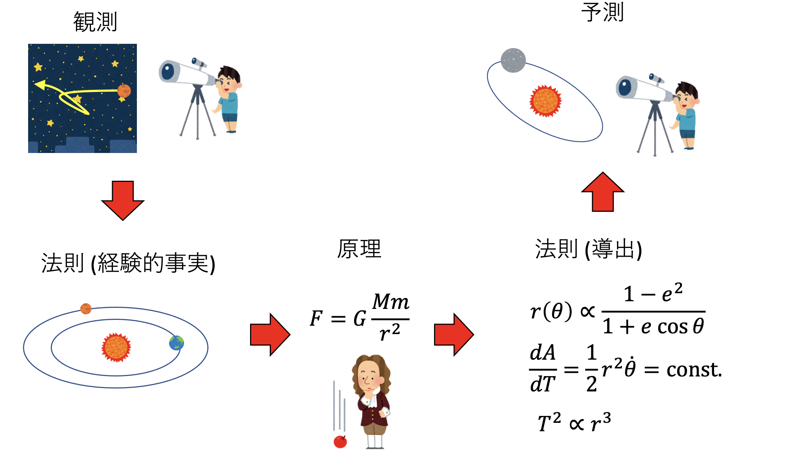

# 力学の復習

## ニュートン力学

### 原理と法則

これまでに力学を学んだはずである。これから学ぶ解析力学と区別するため、これまでに学んだ力学をニュートン力学と呼ぼう。ニュートン力学は「慣性の法則」「運動の法則」「作用・反作用の法則」の、運動の三法則を原理とする。「法則を原理とする」という言葉により、この三法則は原理なのか法則なのか混乱するかもしれない。ここで法則と原理について定義しておこう。

まず、物理において **法則 (law)** とは観測事実である。様々な実験により、一般的に成り立っていると信じられる事実を法則と呼ぶ。例えばケプラーが太陽系について発見した、

* ケプラーの第一法則：惑星は太陽を焦点とする楕円軌道を描く
* ケプラーの第二法則：惑星と太陽を結ぶ線分が単位時間に描く面積は一定である
* ケプラーの第三法則：惑星の公転周期の2乗は、軌道長半径の3乗に比例する

などが法則の例である。これはケプラーが、ティコ・ブラーエの残した天文観測データから発見したものだ。すなわち観測事実である。

ニュートンは、ケプラーの残したデータから、「物体の間には互いに引き合う力が存在し、その力は質量に比例し、距離の2乗に反比例する」という万有引力の法則を発見する。ニュートンの運動方程式と、万有引力の法則を組み合わせることで、ケプラーの三法則を導くことができる。

さて、観測事実である法則を説明するためには、別の根拠が必要になる。その根拠を説明するためには、また別の根拠が必要になる。このようなことを繰り返していくと、どこかで「これ以上遡ることができない、議論の出発点」に到達する。この議論の出発点のことを **原理 (principle)** と呼ぶ。原理は、我々が議論の余地なく認めるもので、それさえ認めてしまえば、世界の様々な観測事実をうまく説明できるものだ。ニュートンは、様々な観測事実から、運動の三法則が成り立っていることを確信した。そこで、この三法則を原理として要請することで、ニュートン力学が構築された。

原理は議論の出発点であるから、原理が正しいことについて別に根拠を求めることができない。そこで、我々はその原理から導かれる知識を使って、何かを予測する。例えば、もしニュートン力学と万有引力が正しければ、未知の天体についてもその軌道を予測することができるはずだ。18世紀、火星と木星の間に大きな隙間があることが知られており、そこに未知の惑星があることが予想されていた。その惑星はケレスと名付けられ、1801年1月1日に発見されたが、その後、位置を見失っていた。ガウスはケレスの正確な位置を計算することに成功し、それにより同年12月31日、予測された位置でケレスは再発見された。このように、原理からの予測が未知の現象を説明できたならば、我々はその原理を正しいと信じていくことになる。この「観測事実→法則(経験的事実)→原理→法則(導出)→予測」という一連の流れは、物理学において極めて普遍的に見られる営みである。

### 運動の三法則

力学は物体の運動を扱う学問である。一般に物体は大きさを持つ。物体の質量が一点に集まっているとして運動が記述できる場合、その物体を質点と呼ぶ。物体の大きさが無視できないが、物体が十分に硬く、その変形が無視できる場合を剛体と呼ぶ。物体の変形まで考慮する場合、加えている力を取り除くと元に戻る物体を弾性体、変形が有限のまま残る物体を塑性体と呼ぶ。さらに、無限小の力で有限の変形を引き起こせる物体を流体と呼び、それを扱う学問が流体力学である。

本講義では、質点の運動のみを扱うことにする。なお、有限の大きさを持つ物体の運動も扱うが、その物体の回転などを扱わないため、質点の運動として記述できる。

さて、改めてニュートンの運動の三法則を見てみよう。

* 運動の第一法則(慣性の法則)
  * 他から力が働いていない質点は、等速直線運動を行う。
* 運動の第二法則(運動の法則)
  * 質点に力が働く時、質点は力の方向に、力に比例、質量に反比例する大きさの加速度を持つ。
* 運動の第三法則(作用・反作用の法則)
  * 2つの質点の間に力が働く時、両者の大きさは等しく、向きは逆向きとなる。

第一法則は、「他から力が作用していない質点は、等速直線運動をする」と表現される。質点が静止している場合も、速度ゼロの等速直線運動とみなす。これを慣性の法則と呼び、慣性の法則が成り立つ系を **慣性系 (inertial frame of reference)** と呼ぶ。第一法則は、この慣性系が存在する(我々が慣性系を採用できる)ことを主張する。慣性系とは、ひらたく言えば「止まっている座標系」である。全ての運動はこの座標系から見た相対運動として表現することができる。第一法則は、しばしば第二法則の加速度がゼロの場合の特殊なケースであるとよく誤解されるが、第二法則は慣性系を定義しなければ意味を持たないため、第一法則とは別の法則である。

第二法則は、いわゆる$F=ma$を指す。しかし、質点の運動、特に加速度を定義するためには、「何に対して動いているのか」を考えなければならない。第二法則をより正確に記述するなら「質点に力が働く時、質点は **慣性系に対して** 力の方向に、力に比例、質量に反比例する加速度を持つ」となる。加速度運動を定義するためには、静止した座標系が必要となる。第一法則は、その静止した座標系が定義できることを主張する。

ここで、静止した座標系と書いたが、実際には、ある静止した座標系に対して等速直線運動をしているような座標系もやはり慣性系となるため、こちらを「静止している」とみなすこともできる。ニュートンは絶対静止空間を考えたが、現在では特別な慣性系は存在せず、無数にある慣性系の中から計算に便利な慣性系を選んで採用していると解釈する。

第三法則は、力は必ずペアで、大きさが同じで、かつ逆向きに発生することを主張する。これは観測事実であり、なぜそうであるかは説明してくれない。今、第三法則を破る物体があるとしよう。たとえば同じ符号の電荷のように互いに反発するが、一方から一方への力が、逆向きに働く力よりも強いとする。すると、一方に力を加え、もう一方を間接的に動かすと、加えた力以上の力が得られることになる。これを利用して仕事を取り出すことが可能であるから永久機関を作ることができる(第一種永久機関)。第三法則はこのようなことができないことを主張する。

## 次元解析

物理において最も重要なことは、全ての量に単位があるということである。単位は、例えば長さ(メートル)だったり、重さ(キログラム)だったりするであろう。このような単位を、物理では **次元 (dimension)** と呼ぶ。解析力学とは直接関係ないが、次元の概念は力学を学ぶ際に重要であるので、ここで簡単に触れておこう。

次元の異なる量を足したり引いたりすることはできない。1メートルのものと3キログラムのものを足す、という操作は全くのナンセンスである。次元の異なる量の加減算をしないように気をつけるだけで、計算ミスをかなり減らすことができる。また、次元の異なる量の加減算はできないが、それらを掛けたり割ったりすることはできる。その場合、結果の次元も、元の物理量の次元を掛けたり割ったりしたものになる。

一般に、次元は基本となる量を組み合わせて作る。例えば速度を考えよう。速度とは、単位時間あたりに進む距離、すなわち、ある距離を進むのにかかった時間で割ったものであるから、距離の単位をメートル$[m]$、時間の単位を秒$[s]$に選べば、速度の次元はメートル毎秒$[m/s]$となる。このように、物理の単位や次元は角括弧$[]$で囲んで表現する。速度の次元は、基本となる量である距離と時間の組み合わせで作ることができる。

さて、ここでは長さの単位としてメートルを選んだが、キロメートルを採用した方が便利であることもあるだろう。または、国によっては長さの単位としてフィートを使いたいかもしれない。国によって基本となる量の定義が異なると不便であるため、国際的に基本となる量が定められている。それが国際単位系(International System of Units, SI)[^si]であり、時間、長さ、質量、電流、温度、物質量、光度の7種類が基本となる量として採用し、これらを基本単位と呼ぶ。この基本単位の組み合わせから作られる単位系をSI単位系と呼ぶ。

さて、SI単位系では、長さの基本単位はメートル、時間の基本単位は秒であるが、宇宙空間を考える場合は、長さの単位として天文単位(太陽から地球までの距離、1億5000万キロメートル)や、光年(光が一年に進む距離、約9.5兆キロメートル)を採用したほうが便利かもしれない。また、時間も、秒や時間、年など、様々な単位を使う可能性がある。しかし、速度という概念が「距離割る時間」の次元を持っていることは共通である。そこで、長さの次元を代表する記号として$L$を、時間の次元を代表する記号として$T$を採用する。$L$はメートルかもしれないし、キロメートルかもしれないが、とにかく長さの次元を持つなにかである。この表記を用いると、速度の次元は $[L/T]$ と表すことができる。

SI単位系において、基本単位は7種類あるが、力学において現れる基本単位は主に長さ、時間、質量である。そこで、質量の次元を代表する記号として$M$を採用する。力学に現れる量、例えば力やエネルギー、力積などは、全てこの3つの基本単位、長さ$[L]$、時間$[T]$、質量$[M]$の組み合わせで表現できる。

物理量の次元に注目して解析することを **次元解析 (Dimensional Analysis)** と呼ぶ。異なる次元の量を足したり引いたりすることはできないため、次元を見ると計算ミスに気づくことができる。これも次元解析の一種だが、より高度な解析もできる。

### 次元解析の例：一次元調和振動子

例を挙げよう。バネ定数$k$に繋がれた質量$m$の物質が、つりあいの位置から長さ$x$だけずれているとする。この物質にかかる力$F$は

$$
F = -kx
$$

である。このバネは単振動をするので、その周期$T$を求めてみよう。

釣り合いの位置を原点、初期位置を$x_0$とする時、時刻$t$における位置$x(t)$として、以下の形を仮定する。

$$
x(t) = x_0 \cos(\omega t)
$$

運動方程式は

$$
m\frac{d^2x}{dt^2} = - kx
$$

であるから、先程の解を代入して整理すると

$$
-m\omega^2 = k
$$

つまり

$$
\omega = \sqrt{\frac{k}{m}}
$$

である。周期$T = 2\pi/\omega$であるから、周期は

$$
T = \frac{2\pi}{\omega}  = 2\pi \sqrt{\frac{m}{k}}
$$

と求められる。この周期の振る舞いを、運動方程式を解くことなく推定しよう。まず、バネ定数$k$の次元を求める。バネ定数が含まれる式は

$$
F = -kx
$$

であった。長さ$x$の次元は$[L]$であるから、力の次元がわかれば、バネ定数の次元もわかる。力の次元は、ニュートンの運動方程式、

$$
F = ma
$$

からわかる。加速度は時間あたりの速度の変化量であるから、その次元は$[L/T^2]$である。質量は基本単位であり、次元は$[M]$である。以上から、力の次元は

$$
\frac{L}{T^2} \times M = \frac{LM}{T^2}
$$

とわかる。先程の$F=-kx$の$F$と$x$にそれぞれの次元を代入すると

$$
\frac{LM}{T^2} = k L
$$

であるから、バネ定数の次元は$[M/T^2]$であることがわかる。さて、周期$T$はバネ定数と質量に依存するであろう。その依存の仕方がベキ的であるとして

$$
T \propto k^\alpha m^\beta
$$

という形を仮定する。この式において、左辺と右辺の次元は一致していなければならない。時間、ばね定数、質量の次元それぞれを代入すると、

$$
[T] = \left[\frac{M^\alpha}{T^{2\alpha}}\right] \left[M^{\beta}\right]
= \left[M^{\alpha+\beta} T^{-2\alpha}\right]
$$

両辺を見比べると

$$
\begin{aligned}
\alpha + \beta &= 0 \\
-2\alpha &= 1
\end{aligned}
$$

より、$\alpha = -1/2, \beta = 1/2$と求まる。以上から$T$の$k$,$m$依存性が

$$
T \propto \sqrt{\frac{m}{k}}
$$

と求められる。これは先程求めた厳密解と定数倍を除いて一致する。

以上のように次元解析を用いれば、運動方程式を解かずとも、「フックの法則に従うバネにつながれた物質の振動の周期は、重さの平方根に比例、ばね定数の平方根に反比例する」ということがわかる。

### 次元解析の例：一次元調和振動子の別の見方

次元を持つ変数を用いると計算ミスなどに気づきやすいという利点はあるが、式が複雑になったり、変数変換が面倒であったりといったデメリットもある。そこで、系に特徴的な長さや時間を使って変数を無次元化することがよく行われる。

先程の質点に繋がれたバネの運動をもう一度考えよう。

$$
m\frac{d^2x}{dt^2} = - kx
$$

この式に現れる$m$や$x$、$t$といった物理量は、全て次元を持つ量である。例えば長さはメートルかもしれないし、ヤードかもしれない。質量の単位もキログラムかもしれないし、ポンドかもしれない。いちいちそれを意識するのは面倒であるため、基準となる量を決め、その量を使ってこの方程式に現れる変数を全て次元を持たない量にしよう。

まず、長さの基準として$l_0$、重さの基準として$m_0$、時間の基準として$t_0$を決めよう。MKSA単位系を採用するなら、$l_0$は1メートルを、$m_0$は1キログラムを、$t_0$は1秒を表す。これらを使って無次元化した変数にチルダをつけて表す。

$$
\begin{aligned}
\tilde{x} &= \frac{x}{l_0} \\
\tilde{t} &= \frac{t}{t_0} \\
\end{aligned}
$$

それぞれ、次元を持つ量を同じ次元の物理量で割っているため、無次元量となっている。なお、時間微分も$t$ではなく$\tilde{t}$による微分になるため注意が必要である。

$$
\begin{aligned}
\frac{d^2 \tilde{x}}{d \tilde{t}^2} &=  \frac{1}{l_0} \frac{d^2 x}{d \tilde{t}^2} \\
&= \frac{1}{l_0} \frac{d^2 x}{d t^2} \frac{dt^2}{d \tilde{t}^2} \\
&= \frac{t_0^2}{l_0} \frac{d^2 x}{d t^2}.
\end{aligned}
$$

例えば$x=l_0 \tilde{x}$などとして、先程の運動方程式に代入すると、$\tilde{x}$と$\tilde{t}$に関する運動方程式が得られる。

$$
m_0 \tilde{m}  \frac{t_0^2}{l_0} \frac{d^2 \tilde{x}}{d \tilde{t}^2} = -k l_0 \tilde{x}
$$

整理すると、

$$
\tilde{m}  \frac{d^2 \tilde{x}}{d \tilde{t}^2} = - \frac{t_0^2}{m_0} k \tilde{x}
$$

左辺も、$\tilde{x}$も無次元量であるから、右辺の係数$t_0^2 k/m_0$は無次元量でなくてはならない。これを改めて無次元化されたバネ定数$\tilde{k}$とすると、

$$
\tilde{m}  \frac{d^2 \tilde{x}}{d \tilde{t}^2} = - \tilde{k} \tilde{x}
$$

と、運動方程式が元の形に戻った。これを微分方程式の無次元化と呼ぶ。物理の問題を解くために微分方程式を数値的に解くことが多いが、この時に現れる微分方程式は全て同様な手続きにより無次元化されていると約束することが多い。したがって、数値計算結果を解釈し、現実の値に戻す際には、自分がどのような基準量を用いるかを決めなくてはならない。

なお、無次元化されたバネ定数は

$$
\tilde{k} = \frac{t_0^2}{m_0} k
$$

であった。これは、先程求めたようにバネ定数$k$の次元が$[M/T^2]$であることと整合する。

### 特徴的な物理量

次元についてもう少し補足しておこう。異なる次元の量を加減算してはならないということから、指数関数や対数といった初頭超越関数の引数は無次元でなければならないという制限がつく。例えば、三角関数は以下のようにテイラー展開される。

$$
\sin(x) = x - \frac{x^3}{6} + \cdots
$$

もし$x$が長さの次元をもつ場合、右辺第一項は$[L]$の、第二項は$[L^3]$の次元を持つため、足し算が定義できない。したがって、三角関数の引数は無次元でなければならない。指数関数、対数関数も同様である。

これにより、初頭超越関数の引数に次元を持つ量を入れる場合、必ずそれを打ち消す量とセットで入れなければならない。先程の単振動の解をもう一度見てみよう。

$$
x(t) = x_0 \cos(\omega t)
$$

$\cos$の引数として時間の次元を持つ量$t$が入っているが、時間の逆数の次元を持つ量である$\omega$とセットになっており、合わせて$\omega t$は無次元量となっている。周期で書くと、次元を打ち消していることがわかりやすい。

$$
x(t) = x_0 \cos\left(\frac{2\pi t}{T}\right)
$$

例えば、速度と質量に比例する摩擦がかかる系を考えよう。運動方程式は

$$
F = -\gamma m v
$$

となる。この運動方程式の解は

$$
v(t) = v(0)\exp(-\gamma t)
$$

となる。次元解析から$\gamma$が$[T^{-1}]$の次元を持っており、$t$の次元をキャンセルしていることがわかるであろう。$\gamma$の逆数を$\tau$と書くと

$$
v(t) = v(0)\exp(-t/\tau)
$$

となる。この$\tau$は緩和時間と呼ばれ、系の特徴的の時間スケールを決めている。同様に、$\exp(-x/\lambda)$のような形をしている場合、$\lambda$は相関長と呼ばれ、系の特徴的な長さスケールを表している。

以上のように、初頭超越関数の引数は無次元量でなくてはならないという制約から、次元を持つ量を入れる場合には必ずその次元を打ち消す量とセットとなるが、これは単に次元を打ち消すという役目だけでなく、その系の特徴的な長さや時間などを表すことが多い。これも、運動方程式を解くことなく推定が可能である。例えば、摩擦の運動方程式において$\gamma$は時間の逆数の次元を持つことから、その逆数$\tau = 1/\gamma$が時間の次元を持ち、これが系に特徴的な時間スケールを決めていそうだな、ということが、式を見ただけで推定できる。

一般に運動方程式は厳密な解を得ることが難しい。しかし、運動方程式をよく見ると、微分方程式を解かなくても、解の性質がある程度わかることがある。運動エネルギー保存則や、運動量保存則がその代表例である。系の性質から微分方程式を解くことなく解の性質を推定するのは、解析力学の主要な目的の一つである。

### 次元解析のまとめ

* 物理量はすべてなんらかの単位を持っており、それを次元と呼ぶ。
* 異なる次元を持つ量は、加減算ができない。
* 異なる次元を持つ量の乗除算はできる。この際、新しくできる量の次元は、元の量の次元の積や商となる。
* 指数関数や三角関数、対数関数といった初頭超越関数の引数は、必ず無次元量でなくてはならない。次元のある量を入れる場合は、必ずその次元をキャンセルする量とセットとなり、その量は系に特徴的なスケールを決める。

[^si]: 英語表記ではInternational System of Unitsと、素直に略すとISUであるにも関わらず、SIと略すのは、フランス語のSystème International d'unitésに由来する。

## 余談：独り歩きする格言たち

物体の運動を記述する時、我々は適当な座標系を考える。普通、座標軸は直交するように選ぶが、このような座標系を直交座標系、もしくは提案者であるルネ・デカルトの名前をとってデカルト座標系(Cartesian coordinates)と呼ぶ。デカルトは書籍「方法序説」において座標の概念を確立した。方法序説は「我思う故に我あり」の出典として有名である。

さて、ある大学の式辞で、ある人が方法序説を引用しておおよそ以下のようなことを言ったそうだ。曰く、「方法序説には『優れた人がこの世にいるとしたら、彼らのためにできることは、 必要とする実験の費用を負担し、かつ自由に時間を使えるようにすること以外にはない』とある。つまり、研究者の人材育成のためには、自由な研究時間と研究費の確保が重要である。デカルトが数百年も前に明確に指摘していることが、今持ってまったく色あせていない。我々は歴史に学ぶべし。云々」つまり、デカルトが「優秀な人には時間とお金を与えて放って置くのが良い」と言ったことを受けて、人材育成のためには時間と研究費が必要なのだという主張である。後段の結論には全く同意するのであるが、デカルトが言ったという前段には違和感がある。

方法序説は、デカルトがどのようにして科学を考えるべきかといった哲学的な考察をつらつらと書いた、エッセイのようなものであった。当該文章はその第六部にかかれている。方法序説の第六部とは、大雑把にいえばデカルトが、なぜ自分が方法序説の出版に至ったかを語るところである。この文章の前には、真理を探求するのに人の力を借りるのは多くの場合無駄である、と書いてある。 そして該当文章の直後には「私は自分がそんな『特別優秀な人間である』と思うほどには自惚れていない」といったことが書かれている。原文ではさらに「しかし自分が全く無価値であるということを受け入れられるような魂も持っていない」とある。要するに「自分の考えを出版すべきである(＝自分は優秀な人間である)」とも思えないが「自分の考えなど出版するに値しない(＝自分は無価値な人間である)」とも思えない、という葛藤の表現のように思える。さらにその次のパラグラフには「そんなことを考えてたので三年間出版をためらっていた」的なことが書いてある。

ここまで来て、また引用された部分を読み返すと「本当に優秀な人であればお金と暇だけ与えて放っておけば良いが、自分はそこまで優秀な人間ではない」という、一種の謙遜表現であることわかる。少なくともデカルトはここで「優秀な人はお金と暇だけを与えて放っておけば良いのに、多くの場合無駄な義務を課して邪魔するばかりである」ということは主張していないように読める。

僕は「だからこの引用は間違っている」と主張したいわけではない。ほとんどの格言は、本来それが生まれた時代背景に強く依存しているはずだが、その文脈から切り離されて語り継がれるようになった際、異なる意味を持つようになるのは自然なことだ。こうして格言は、それぞれの時代、場所、人にあった解釈がなされ、元の意図を離れて独立した「なにか」として生き続けるのであろう。
