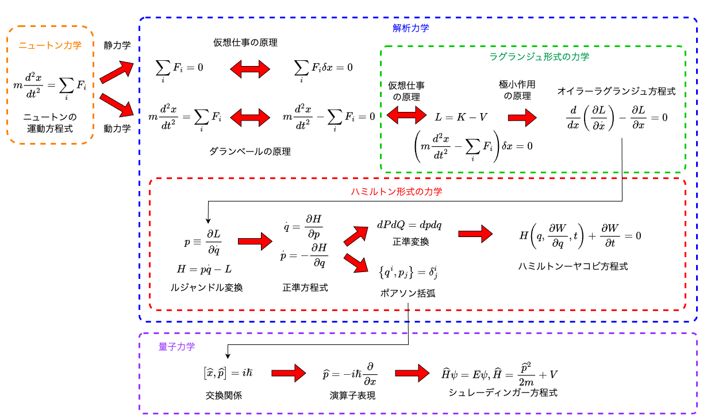

# 解析力学の概観

## 本章で学ぶこと

解析力学は、ニュートンの運動方程式と本質的に等価なことを延々と式変形していく学問である。その結果、仮想仕事の原理や変分原理、ラグランジアン、ハミルトニアンといった概念が生まれ、ニュートン力学が最定式化されるのみならず、量子力学へとつながる。多くの学問がそうであるように、解析力学はニュートン力学を抽象化する。その過程で「いま、ポアソン括弧を学んでいるけど、なんのためだっけ？」と迷子になりがちである。そこで、最初に本書で学ぶ全体像をざっと概観ておこう。

## 式の見方について

解析力学は、言ってしまえばニュートンの運動方程式をひたすら変数変換するだけの学問だ。それにより問題を見通しよく定式化し、場合によっては簡単に解けるようになる。本講義でも運動方程式が解けるようになることを目標の一つとはするが、本書を通じて本当に学んで欲しいのは、解析力学を通してこれまでとは異なるものの見方ができることを実感することである。そこで、本格的に解析力学を学ぶ前に、式の視点の変え方についていくつか例を挙げておこう。

ニュートンの運動方程式からはじめよう。

$$
F = ma
$$

この式の意味を考えよう。 単純には「質量$m$の物体に、力$F$を加えると、加速度$a$が生まれる」と解釈できる。この見方では力が既知である時、物体がどのように運動するかを規定する式であるとみなすことができる。この場合、力が原因であり、加速度が結果である。そして、同じ力を加えるのであれば、質量が大きければ大きいほど加速度は小さくなる。すなわち、質量とは力に対する物体の動きにくさを表している。まとめると、

* 外から与える操作の大きさ: 力$F$
* 対象の応答: 加速度$a$
* 対象の応答のしにくさ: 質量$m$

となっている。

同様に、世の中には「外から何か操作した時に、対象が応答し、その係数が応答のしやすさを表す」という式が多いことがわかる。例えばバネに対する力と長さの関係式

$$
F = k x
$$

を考えよう。これは「バネ定数$k$のバネに、力$F$を加えると、$x$だけ伸びる」という関係を表している(フックの法則)。これも、

* 外から与える操作の大きさ: 力$F$
* 対象の応答: バネの伸び$x$
* 対象の応答のしにくさ: ばね定数$k$

とみなすことができる。

電流と電圧の関係を表すオームの法則についても同じことが言える。抵抗$R$の物体に電圧$V$をかけると、電流$I$が流れるという式は

$$
V = R I
$$

とかける。これも、

* 外から与える操作の大きさ: 電圧$V$
* 対象の応答: 電流$I$
* 対象の応答のしにくさ: 抵抗$R$

と分類できる。

外から与える操作の大きさは制御可能であり、対象の応答は観測可能であるとしよう。すると、これらの式は「対象になんらかの操作をして、その応答を測定することで、対象の個性を調べる」という意味を持つ。つまり、$F=ma$という式は「質量$m$の物体に力$F$を加えると加速度$a$が生じる」とも理解できるし、「物体に力$F$を加えた時に加速度$a$が生じた場合、その比$F/a$が物体の動かしにくさであり、それを質量$m$と呼ぶ」という、質量の定義式とみなすこともできる。世の中の物理法則はほとんど「外からの操作と、対象の応答が比例し、その比例係数が対象の性質を決める」という形をしている。

さて、先程は力を操作、加速度を応答と考えたが、力を応答と考える立場も可能である。通常、我々は質量の大きさを重量で判断する。これは一様な重力加速度$g$が働く世界においては、

$$
F = mg
$$

により、質量$m$の物体には$mg$という力がかかり、その力の大きさ(重量)をもって質量の大小を感じていることになる。この式も本質的には$F=ma$と同じ式であるが、重力加速度が外からの操作、力が応答(観測量)である点で、入力と出力が逆転している。

我々が日常で感じる質量は$F=mg$を通じた力、すなわち重量であることが多いが、それでは無重量空間において質量が定義できない。しかし、$F=ma$によって質量を定義すれば、無重量空間でも質量が測定できるため、例えば宇宙飛行士が宇宙ステーションで体重の測定をすることができる。質量が重力の有無に依存しない、物体の個性であるとするならば、$F=ma$により質量を定義する方が本質的であると思えるであろう。

さらに、$F=ma$は、$ma$により$F$を定義している、とみなすこともできる。すなわち、質量が既知の物体の加速度運動の様子から、物体にかかっている力を推定するというものだ。例えば惑星の運動から星同士に働く力を推定し、万有引力の法則の発見につながったのはこの見方である。

以上のように、$F=ma$という式は、

* 力と質量が既知である時、どのように物体が運動するか、運動を規定する式
* 力と加速度が既知である時、物体の質量を定義する式
* 質量と加速度が既知である時、物体に働く力を定義する式

のいずれともみなすことができる。このうちどれが正しい、正しくないという議論は意味がない。様々な見方ができるというのが大事な点である。

$F=ma$という式について、さらに別の見方をしてみよう。$ma$を右辺に移項して、こんな式を作ってみる。

$$
F - ma = 0
$$

これは、もともと物体にかかっていた力$F$と、仮想的な力$ma$が釣り合っている、ということを表している。$F$も$ma$、同じ「力」の次元を持っている。物理においては、同じ次元を持つ量は自由に足したり引いたりできる。そうして式を変形すると、式が持つ物理的な意味も異なって見える。

例えば、長さ$r$の紐で結ばれた石が速度$v$で回転しているとしよう。運動方程式は以下のようになる。

$$
F = \frac{mv^2}{r}
$$

この式は、紐の張力によって、常に物体の進行方向と90度傾いた方向に力$F$が作用しており、その結果として加速度$mv^2/r$が生じている、ということを意味している。

さて、この式の右辺を左辺に移項してみよう。

$$
F - \frac{mv^2}{r} = 0
$$

紐の張力$F$に対して、仮想的な力$mv^2/r$が働き、それが釣り合っている、という式になった。この仮想的な力が遠心力である。

遠心力とは、観測者の座標が回転することにより生じる見かけの力(慣性力)である。座標変換によって見かけ上の力が生じると聞くと難しそうであるが、要するに等号の右から左に何かを移項し、それに物理的な意味を与えたに過ぎない。例えば動いている電車にのっている時、駅に近づいてブレーキをかけると、乗客は前に力を感じる。外から見れば、乗客は力をうけて減速をしているように見えるが、電車と一緒に運動する乗客の「自分が止まっている」という立場から見ると、見かけ上の力を感じることになる。式の上では単なる移項であるが、その物理的な意味は観測する立場を変えたことに対応する。

以上のように、同じ式でも異なる見方ができたり、単なる移項が新たな物理的な意味を持ったりする。これを積極的に利用して、ニュートンの運動方程式を変数変換、式変形し、見通しを良くする学問が解析力学である。

## 解析力学の概観

解析力学とは、言ってしまえば変数変換の学問である。力学は物体の運動を扱う学問であり、その目的は、様々な条件下で物体の運動の軌跡を決定することである。運動は微分方程式で記述されているため、微分方程式を解くことで運動を決定することになる。ニュートン力学では、系の状態を運動方程式に落とし、微分方程式の初期値問題として問題を解いていた。一方、解析力学では座標変換に注目し、時間発展を多次元空間における座標変換として捉える。また、その定式化は量子力学へとつながっていく。

これから解析力学を学ぶが、そのまえに解析力学の全体像を概観しよう。これから学ぶことであるから理解できなくてもかまわない。理論の構築がどのような流れであり、これからどんな式が出てきて、最終的にどんなことを理解すればよいか、大まかな「地図」をつかんで欲しい。

ニュートンの運動方程式、$F=ma$から始めよう。$F$が力、$m$が質量、$a$が加速度である。いま、座標を$x$とし、力が保存力であるとして、$F=-V'(r)$と書ける場合を考えると、運動方程式は

$$
m \frac{d^2 x}{dt^2} = - V'(x)
$$

となる。この方程式の初期値問題を解くのがニュートン力学の目的であった。もし物体が静止している場合、左辺はゼロであるから、

$$
F = -V'(x) = 0
$$

となる。これは、物体に働く力の総和$F$が釣り合っている状態($F=0$)を表している。このように静止状態にある物体に働く力を調べる学問を静力学という。我々は後に、力が釣り合っているならば、拘束条件を破らないような変位を引き起こす力のする仕事はゼロであるという、仮想仕事の原理を学ぶ。

物体が力をうけて運動している場合、加速度はゼロではなくなる。この状態を動力学と呼ぶ。動力学を表す運動方程式は二階の微分方程式である。ここで、新たな変数$v$を導入して、一階の連立微分方程式に変形しよう。

$$
\begin{aligned}
m \frac{d v}{dt} &= - V'(x) \\
\frac{dx}{dt} &= v
\end{aligned}
$$

最初の式の両辺に$v = dx/dt$をかけてみよう。左辺に$v$を、右辺に$dx/dt$をかける。

$$
m v \frac{dv}{dt} = - V'(x) \frac{dx}{dt}
$$

これを見ると、合成関数の微分則により、以下のように変形できる.

$$
\frac{d}{dt} \left( \frac{1}{2}mv^2\right)
= -\frac{dV}{dt}
$$

ここで、新たな物理量$K$を

$$
K = \frac{1}{2}mv^2
$$

として導入すると、

$$
\frac{d}{dt} \left( K+V \right) = 0
$$

となる。これがエネルギー保存則である。

運動方程式は、運動量の時間変化と力を結ぶ等式である。等式であるから移項することができる。すると、

$$
F = - m\frac{dv}{dt} -V'(x) = 0
$$

と、運動量の変化をあたかも力のように扱うことができ、力の釣り合いの式とみなすことができる。これをダランベールの原理と呼ぶ。

さて、右辺第二項はポテンシャルエネルギーを位置で微分したものだ。同様に、右辺第一項も、運動エネルギーを速度で偏微分した上で、さらに時間微分したものであるとみなすことができる。

$$
m\frac{dv}{dt} = \frac{d}{dt}\left(\frac{d K}{d v}\right)
$$

すると、運動方程式は以下のように書き直すことができる。

$$
\frac{d}{dt}\left(\frac{d K}{d v}\right) + \frac{d V}{dx} = 0
$$

ここで、後の都合のために$v=\dot{x}$と表記する。$K$と$V$の差を考え、それを二変数関数$L(x, \dot{x})$とみなす。

$$
L(x, \dot{x}) \equiv K(\dot{x}) - V(x)
$$

この量をラグランジアンと呼ぶ。先程の運動方程式はラグランジアンを用いると

$$
\frac{d}{dt}\left( \frac{\partial L}{\partial \dot{x}} \right) = \frac{\partial L}{\partial x}
$$

と書きなおすことができる。これをオイラー・ラグランジュ方程式と呼び、この式を使う力学をラグランジュ形式の力学と呼ぶ。静力学で力が釣り合っている時、ポテンシャル関数を考え、それを最小にする場所として位置が決まった。同様に動力学においてもなんらかのポテンシャルがあり、それを最小にするように運動が決まると考えることができる。そのポテンシャルにあたるのがラグランジアンであり、それを積分したものを極小にするように運動が決まると主張するのがハミルトンの原理である。

ラグランジュ形式の力学はニュートンの運動方程式を変形したものであるから、特に情報は増えていない。しかし、この形で書いておいた方が座標変換や変数変換に便利である。例えば極座標や、二重振り子など複雑な拘束がある系においてニュートンの運動方程式の導出は面倒であることが多い。しかし、ラグランジュ形式では簡便に運動方程式を導出できる。後に、点変換と呼ばれる任意の非線形変換において、オイラー・ラグランジュ方程式の形が変わらない(方程式が座標変換に対して共変である)ことを見る。

力学では、自由に動くなにかを「自由度」と呼ぶ。質点の位置などは最も基本的な自由度であるが、拘束条件がある系において何を自由度とするかは自明ではない。例えば振り子の自由度としては、鉛直方向からの角度$\theta$を採用するのが自然である。ここでは、座標の代わりに、そのような自由度として一般化座標$q$を使おう。ラグランジアンは$x$と$\dot{x}$の代わりに$q$と$\dot{q}$を使って

$$
L(q, \dot{q}) = K(\dot{q}) - V(q)
$$

と書ける。ここで一般化座標の時間微分$\dot{q}$は一般化速度と呼ばれる。この一般化速度$\dot{q}$についてルジャンドル変換をしよう。つまり、新たな変数$p$を

$$
p = \frac{\partial L}{\partial \dot{q}}
$$

により導入し、さらに

$$
H = p\dot{q} - L
$$

により、新たな量$H$を導入すると、運動方程式は以下のように書き直すことができる。

$$
\begin{aligned}
\dot{q} &= \frac{\partial H}{\partial p} \\
\dot{p} &= -\frac{\partial H}{\partial q}
\end{aligned}
$$

これをハミルトンの運動方程式、もしくは正準方程式と呼び、この方程式で記述する力学をハミルトン形式の力学と呼ぶ。

ハミルトン形式の力学はラグランジュ形式の力学からルジャンドル変換により変数変換したものであり、ラグランジュ形式の力学はニュートン力学を式変形して得られたものであるから、本質的には同じ問題を記述しており、運動方程式の予言能力は変わらない。しかし、ハミルトン形式で書いておくことで、ラグランジュ形式よりも広い形の変数変換が可能となる。この形式では、系の変数が$(q,p)$で記述されている。ここで新たな変数$(Q,P)$を定義する。$Q$は$(p,q)$の関数、つまり$Q(p,q)$と書ける量であり、$P$も同様である。この時、$(q,p)$がハミルトンの運動方程式に従い、かつ$(Q,P)$の$(q,p)$に関するヤコビアンについて

$$
\begin{aligned}
\frac{\partial(Q,P)}{\partial(q,p)} & \equiv
\begin{vmatrix}
\partial_q Q & \partial_q P \\
\partial_p Q & \partial_p P
\end{vmatrix} \\
&= \frac{\partial Q}{\partial q}
\frac{\partial P}{\partial p} -
\frac{\partial Q}{\partial p}
\frac{\partial P}{\partial q}\\
&=1
\end{aligned}
$$

が満たされる時、変換後の変数$(P,Q)$の時間発展も、ハミルトンの運動方程式

$$
\begin{aligned}
\dot{Q} &= \frac{\partial H}{\partial P} \\
\dot{P} &= -\frac{\partial H}{\partial Q}
\end{aligned}
$$

に従う、すなわち運動方程式の解であることが示される。従って、「運動方程式を解く」という微分方程式の初期値問題は、「変数$(q,p)$が一定時間後に変数$(Q,P)$になっているとき、それを$(q,p)$で記述する」という変数変換の問題に帰着される。このような変換を正準変換と呼ぶ。最初に述べたように、ハミルトン形式の力学、すなわち解析力学は変数変換の学問であり、時間発展すらも変数変換とみなす見方を提供する。正準変換を与える母関数について考えることで、ハミルトン・ヤコビの偏微分方程式が得られる。

最後に、解析力学から量子力学への接続を見ておこう。正準方程式に従う系において、物理量$A$が$(p,q)$の関数として得られる時、その時間微分は

$$
\begin{aligned}
\frac{dA}{dt} &= \frac{\partial A}{\partial q}\dot{q} + \frac{\partial A}{\partial p}\dot{p} \\
&= \frac{\partial A}{\partial q}\frac{\partial H}{\partial p} - \frac{\partial A}{\partial p}\frac{\partial H}{\partial q}
\end{aligned}
$$

で得られる。そこで、

$$
\left\{X, Y\right\} =  \frac{\partial X}{\partial q}\frac{\partial Y}{\partial p} - \frac{\partial X}{\partial p}\frac{\partial Y}{\partial q}
$$

という括弧を定義すると、先程の時間微分は

$$
\frac{dA}{dt} = \{A,H\}
$$

と記述できる。この括弧をポアソン括弧と呼ぶ。このポアソン括弧について、

$$
\begin{aligned}
\{q, p\}&=1 \\
\{p, p\}&=0 \\
\{q, q\}&=0
\end{aligned}
$$

が成り立つ。これを量子力学に持っていこう。量子力学では一般化座標ではなく通常の座標を使うことが多いので、座標と運動量の組として$(x, p)$を採用しよう。興味ある系のハミルトニアンが、

$$
H(x, p) = \frac{p^2}{2m} + V(x)
$$

と与えられているとする。この時、座標$x$と運動量$p$を演算子とみなし、ハットをつけて$\hat{x}$、$\hat{p}$と表現する。ポアソン括弧と同様に、以下の交換関係を課す。

$$
\begin{aligned}
\left[\hat{x}, \hat{p}\right] &\equiv \hat{x}\hat{p} - \hat{p}\hat{x} = i\hbar \\
\left[\hat{x}, \hat{x}\right] &\equiv \hat{x}\hat{x} - \hat{x}\hat{x} = 0\\
\left[\hat{p}, \hat{p}\right] &\equiv \hat{p}\hat{p} - \hat{p}\hat{p} = 0
\end{aligned}
$$

ここで$\hbar \equiv h/2\pi$であり、$h$はプランク定数である。なぜこんなことをするかは本書では問わない。定義から同じものを括弧にいれた場合にゼロとなることは明らかであろう。以下では$\left[\hat{x}, \hat{p}\right] = i\hbar$について考える。このような交換関係を満たす演算子の選び方はいろいろあるが、例えば

$$
\begin{aligned}
\hat{x} &= x\\
\hat{p} &= -i\hbar \frac{d}{dx}\\
\end{aligned}
$$

と選んでみよう。これらは演算子であるから、なにかに演算しなければ意味を持たない。そこで、適当な微分可能な関数$f(x)$を用意し、$[\hat{x},\hat{p}]f$を計算してみよう。

$$
\begin{aligned}
[\hat{x},\hat{p}]f &= (\hat{x}\hat{p} - \hat{p}\hat{x})f \\
&= -i x\hbar \frac{df}{dx} + i \hbar \frac{d}{dx}(xf) \\
&= \cancel{-i x\hbar \frac{df}{dx}} + i \hbar f + \cancel{i x\hbar \frac{df}{dx}}\\
&= i \hbar f
\end{aligned}
$$

すなわち、

$$
[\hat{x},\hat{p}]f = i \hbar f
$$

という関係が得られた。$f$は任意の関数であったから、これは形式的に

$$
[\hat{x},\hat{p}] = i \hbar
$$

と書ける。これが最初に課した交換関係であった。

さて、この表現をハミルトニアンに代入しよう。するとハミルトニアンも演算子$\hat{H}$となる。

$$
\begin{aligned}
\hat{H} &= \frac{\hat{p}^2}{2m} +V(\hat{x})\\
&= \frac{1}{2m} \left( -i\hbar \frac{d}{dx} \right)^2 + V(x) \\
&= - \frac{\hbar^2}{2m} \frac{d^2}{dx^2} + V(x)
\end{aligned}
$$

ハミルトニアン演算子$\hat{H}$の固有関数を$\psi(x)$とし、その固有値を$E$とすると、

$$
\hat{H} \psi = E\psi
$$

が成り立つ。$\hat{H}$を微分演算子で表現したものを代入すると、

$$
- \frac{\hbar^2}{2m} \frac{d^2 \psi}{dx^2} + V\psi = E\psi
$$

これが時間非依存のシュレーディンガー方程式であり、量子力学的な現象を記述する基礎方程式である。

## まとめ

本章では、ニュートンの運動方程式からラグランジュ形式の力学を経由してハミルトン形式の力学に到達し、さらに量子力学へと続く道を概観した。本講義は、なぜそんな変数変換をするのか、変数変換をすると何がうれしいのか、そしてなにより、「そのような変換によって見える新たな世界」を知ることを目的とする。また、解析力学は延々と式変形していく学問であるが、その時に単に等式変形をするにとどまらず、式の見方や解釈が変わっていく。その例として、$F=ma$ という単純な式ひとつとっても、それが力をかけたら加速度が生じるという法則を表した式なのか、それとも力を操作、加速度を観測量として質量を定義した式なのかの二通りの見方ができることを見た。加速度と質量の積を見かけ上の力とみなし、物体が加速しているにもかかわらず「力の釣り合いの式」を作ることもできる。このように、物理においては、議論の出発点と帰結が入れ替わったり、同じ数式でも、見方を変えることで異なる物理現象を表現しているかのようにすることができる。解析力学においては、このような「異なる見方」を積極的に用いて理論を構成する。そのため、議論や式変形で迷子になりやすい。しかし、最終的に完成する理論は非常に美しいものである。是非がんばってついてきて欲しい。
