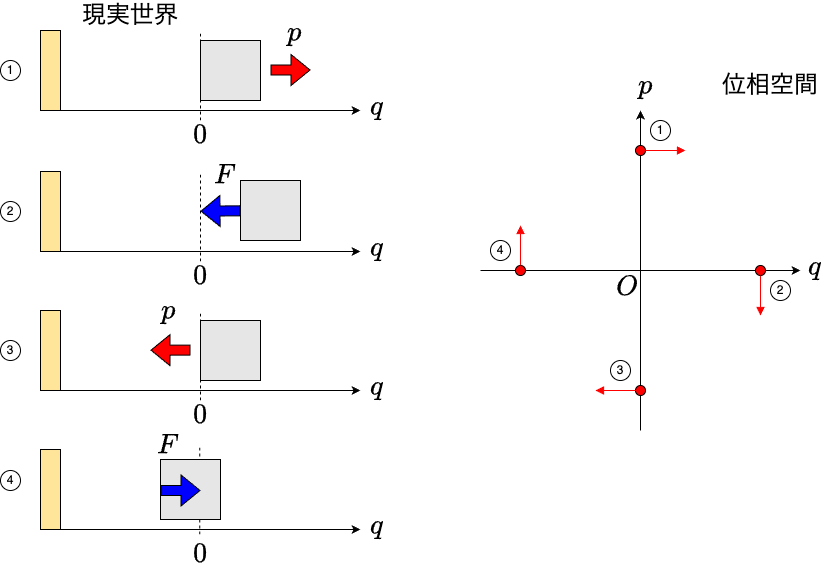
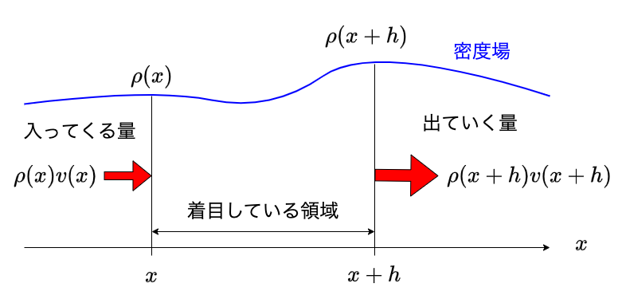
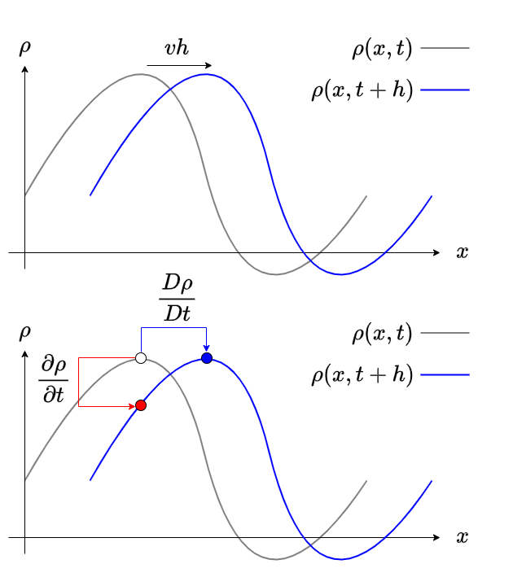
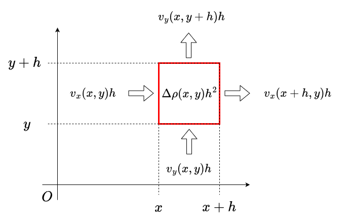

# 位相空間とリュービルの定理

## 本章で学ぶこと

本章では位相空間を扱う。位相空間を考えることで、これまでの「物体の運動を追いかける」というラグランジュ的な描像から、「運動全体を流れ場として考える」というオイラー的描像に移り変わる。また、勾配や発散といったベクトル解析の言葉で運動が表現されるのも面白いところである。さらに、正準方程式に支配される運動が生み出す流れ場が非圧縮であるというリュービルの定理を導く。

## 位相空間

質量$m$、ばね定数$k$の一次元調和振動子の運動を考えよう。ニュートンの運動方程式は

$$
m\ddot{q} = -kq
$$

となる。ここで、

$$
\sqrt{\frac{k}{m}} t \rightarrow t
$$

として時間を無次元化すると、運動方程式は

$$
\ddot{q} = -q
$$

となる。対応するラグランジアンは

$$
L(q,\dot{q}) = \frac{1}{2}\dot{q}^2 - \frac{1}{2}q^2
$$

となる。

$$
p = \frac{\partial L}{\partial \dot{q}}
$$

による運動量を定義し、

$$
H = p\dot{q} - L
$$

とルジャンドル変換することで、以下のハミルトニアンを得る。

$$
H(q,p) = \frac{1}{2}p^2 + \frac{1}{2}q^2
$$

このハミルトニアンの正準方程式は以下のようになる。

$$
\begin{aligned}
\dot{q} &= p \\
\dot{p} &= - q
\end{aligned}
$$

これは二変数の一階微分方程式であるから、この運動は初期条件として$(q,p)$の2つの変数を与えると、それ以後の運動が全て決まる。運動方程式を解くとは、$(q(t), p(t))$の時間発展を決めることだ。そこから$t$を消去すると、$(q,p)$空間の曲線となる。これを運動の軌道と呼ぶ。自由度が1の系では、二次元空間を用意すれば過不足なく運動の軌道を記述できる。自由度が$N$の系であれば$2N$次元の空間が必要である。例えば、3次元空間で$N$個の質点が相互作用しているような系は$6N$次元の空間が必要となる。運動を過不足無く記述できるような空間を **位相空間(phase space)** と呼ぶ。一次元の調和振動子であれば、$(q,p)$で表現される二次元空間が位相空間である。なお、物理で使う位相空間は、数学で使う位相空間(topological space)とは異なる概念なので注意。

ここで、系の自由度と配位空間、位相空間の関係についてまとめておこう。系の自由度とは、系の配位を一意に決めることができる変数の数である。何かの系を写真に撮った、その写真の状態を説明することを考えよう。たとえば調和振動子なら、釣り合いの位置からどれだけ離れているか、振り子なら鉛直方向からの角度のみを指定すれば、写真の状態を指定できる。このように、系を写真に撮った状態を配位(configuration)、その配位を指定するための変数を一般化座標、その一般化座標の数を自由度と呼ぶ。一般化座標が住む空間を配位空間と呼び、その次元は自由度に等しい。しかし、先程の写真からは運動を決定することができない。調和振動子なら、釣り合いの位置に戻っていくところなのか、離れていくところなのかが写真からはわからない。そこで、この系の一般化座標に対応する一般化速度も指定することで系の運動を一意に決めることができる。この、一般化座標と一般化速度が住む空間を **状態空間(state space)** と呼ぶことがある。さらに、一般化速度をルジャンドル変換することで得られた一般化運動量を考え、一般化座標と一般化運動量を指定することでも運動を決めることができる。この一般化座標と一般化運動量が住む世界が本章で扱う位相空間である。

さて、この運動方程式が支配する運動について、特徴的な点についていくつか見てみよう。

まず、現在の状態が$(q,p) = (0,1)$であるとしよう。この時の運動量と位置の時間微分は$(\dot{q},\dot{p}) = (1,0)$となる。これは、質点が原点にあるためにバネからの力はかかっておらず、したがって$\dot{p}=0$であること、正の方向に速度$1$を持っているため、次の瞬間に$q$が増加しようとしていることを表している。つまり、系の状態が$(0,1)$である時、次の瞬間には$(1,0)$の方向に移動するということを意味している。そこで位相空間の$(0,1)$の場所に、移動の向きとして$(1,0)$のベクトルを書いておこう。

次に、現在の状態が$(q,p) = (1,0)$であるとしよう。この時の運動量と位置の時間微分は$(\dot{q},\dot{p}) = (0,-1)$となる。これはバネが伸び切って、速度がゼロである状態であるため、あとは縮む一方であることを意味する。そこで先程と同様に位相空間の$(1,0)$の点に、$(0,-1)$のベクトルを書いておこう。

同様な手続きで、$(0,-1)$の場所には$(-1,0)$のベクトルが、$(-1,0)$の場所には$(0,1)$のベクトルを置くことになる。こうして$(q,p)$空間の様々な場所に、その地点での$(\dot{q},\dot{p})$の値をベクトルとして書き込んでいくと、全体で回転するようなベクトル場が得られる。すなわち、運動方程式は位相空間にベクトル場を定義する写像であると考えることができる。

もともとの運動方程式は二変数の連立一階微分方程式であるから、初期条件として$(q,p)$の組を与えると、以後の運動が全てきまる。最初に$(q,p)$の状態であった質点は、微小な時間$\delta t$だけ経過すると、$(p + \dot{p} \delta t, q + \dot{q} \delta t)$に移動するであろう。移動先を新たな初期条件と考えると、次はその場所でのベクトル$(\dot{p}, \dot{q})$に従って進んでいく。運動方程式は、位相空間という地図に、「次はどこに進むべきか」という情報を与えている。

## ラグランジュ描像とオイラー描像

ここで、運動方程式を「運動を規程するもの」という見方から「位相空間に速度場を定義するもの」という見方に移ったことに注意したい。これは、ラグランジュ描像からオイラー描像に移ったことに対応する。

今、流れる川の中に葉っぱが落ちたとしよう。その葉っぱをずっと追いかけると、その葉っぱは水から押されて右にいったり左にいったりしながら流れていく様子が見えるだろう。このように観測者が運動する物体に並走し、その物体の軌跡を観察するのがラグランジュ描像である。ニュートンの運動方程式は、ラグランジュ描像により運動を記述する。

一方、流れに関しては、媒質の運動をおいかけるよりも、その場にとどまって、その場所での流れがどのように変化していくかに興味があることが多い。例えば天気予報においては、ある特定の雲の運動を追いかけるよりも、ある地点において雲がどう入ってきてどう出ていくかの方が重要である。このように観測者の場所を固定し、その場所での流れを観察し続けるのがオイラー描像である。

オイラー描像では、空間に固定された座標系を考え、物理量をその座標系における場の量として捉える。**場(field)** とは、物理量を空間や時間の関数として捉えることである。例えば等高線のある地図を考えよう。例えば緯度と経度のような適当な座標を指定すると、その場所での標高が決まる。この地図は、二次元座標$(x,y)$を決めると、その場所での高さ$h(x,y)$を与えている。このように、座標を決めるとスカラー量が与えられるような場をスカラー場と呼ぶ。例えば温度や密度はスカラー量であるから、温度場や密度場はスカラー場である。

同様に、場所を決めるとベクトルが決まるような場をベクトル場と呼ぶ。例えば流れるプールでは、場所が決まれば流れる向きが決まる。この流れの速度場はベクトル場である。正準方程式は、$(q,p)$という位相空間に、$(\dot{p}, \dot{q})$というベクトル場を対応させる写像であると考えることができる。場所を指定すると、そこに住むテンソルを返すテンソル場も定義できる。材料力学などで重要となる応力場などもテンソル場である。

さて、ベクトル場が定義された位相空間の一点にトレーサーを置こう。トレーサーはその場所のベクトルの向きに移動する。そして、移動先のベクトルの向きに動き……ということを繰り返す。川にインクを少量ずつたらしていくとそのインクにより流れ場が可視化されるように、トレーサーは位相空間における軌跡を可視化する。すなわち、位相空間におけるベクトル場とは、系の時間発展の流れを表す流れ場となっている。この流れ場の性質を調べるのが本章の目的である。

## 位相空間とベクトル場

一自由度系のハミルトニアン$H(q,p)$に支配される正準方程式を考えよう。

$$
\begin{aligned}
\dot{q} &= \frac{\partial H}{\partial p} \\
\dot{p} &= - \frac{\partial H}{\partial q}
\end{aligned}
$$

これを、$(q,p)$で張られる位相空間に$(\dot{q}, \dot{p})$という速度場を定義する式であると考える。位相空間の座標をまとめて$\mathbf{z}$で表そう。すなわち、

$$
\mathbf{z} =
\begin{pmatrix} q\\ p
\end{pmatrix},
\dot{\mathbf{z}} =
\begin{pmatrix}
\dot{q} \\
\dot{p}
\end{pmatrix}
$$

ハミルトニアンに関して$q$や$p$の偏微分があるので、ハミルトニアンをスカラー場と思って$\mathbf{z}$で微分してみよう。

$$
\frac{\partial H}{\partial \mathbf{z}} \equiv \nabla H =
\begin{pmatrix}
\partial_q H \\
\partial_p H
\end{pmatrix}
$$

ベクトル$\nabla H$の要素を見ると、正準方程式に現れる偏微分と上下が逆で、かつ片方に負符号がついていることがわかる。そこで、正準方程式に合うように変換するために、以下のような行列を導入しよう。

$$
\Omega=
\begin{pmatrix}
0 & 1\\
-1 & 0
\end{pmatrix}
$$

すると、正準方程式は以下のように表現できる。

$$
\dot{\mathbf{z}} = \Omega \nabla H
$$

ベクトル場$\dot{\mathbf{z}}$は、位相空間にハミルトニアンが作るベクトル場であるため、 **ハミルトニアンベクトル場(Hamiltonian vector field)** と呼ばれる。この式から、ただちに

$$
\dot{\mathbf{z}} \cdot \nabla H = 0
$$

がわかる。すなわち、ハミルトニアンベクトル場はハミルトニアンの勾配と直交している。

この式の幾何学的な意味を考えていこう。右辺の一番左から順番に考えていく。

$H(q,p)$はスカラー場である。つまり、場所を指定するとスカラーが返ってくる。ハミルトニアンは系の全エネルギーであるから、$H(q,p)$は、位相空間上の点$(q,p)$におけるエネルギーを表している。同じエネルギーの場所をつないでいくと、エネルギーに関する等高線を描くことができる。

次に、$\nabla H$は、スカラー場$H(q,p)$から作られるベクトル場である。ベクトル場であるから、場所を指定するとベクトル量が返ってくる。このベクトルは、最もエネルギーが高くなる方向を向き、かつエネルギー勾配が急であればあるほど絶対値が大きくなるという性質を持っている。それを簡単に説明しておこう。

あるスカラー関数$f(x,y)$があるとする。この地点$(x,y)$から、微小距離 $\varepsilon > 0$だけ移動するという条件で、最も$f$の値を大きくする場所を探したい。これは、$\varepsilon^2 = \varepsilon_x^2+\varepsilon_y^2$という条件の下、$f(x+\varepsilon_x, y+\varepsilon_y) - f(x,y)$を最大化するような方向ベクトル$(\varepsilon_x, \varepsilon_y)$を探しなさい、という問題になっている。テイラー展開により、

$$
\begin{aligned}
f(x+\varepsilon_x, y+\varepsilon_y) - f(x,y) &= \frac{\partial f}{\partial x} \varepsilon_x + \frac{\partial f}{\partial y} \varepsilon_y + O(\varepsilon_x^2)+O(\varepsilon_y^2)\\
&=
\begin{pmatrix}
\partial_x f \\
\partial_y f
\end{pmatrix}
\cdot
\begin{pmatrix}
\varepsilon_x \\
\varepsilon_y
\end{pmatrix}
+O(\varepsilon_x^2)+O(\varepsilon_y^2)
\end{aligned}
$$

いま、方向ベクトル$(\varepsilon_x, \varepsilon_y)$の大きさを固定したまま、左辺を最大化するためには、内積を最大化する必要がある。つまり、方向ベクトルは$(\partial_x f,\partial_y f)$と平行でなければならない。故に、$\nabla f \equiv (\partial_x f,\partial_y f)$は、スカラー場$f$の最大傾斜の方向を表すベクトルである。そのため、$\nabla f$はスカラー場の勾配(gradient)と呼び、$\mathrm{grad} f$とも表す。

さて、$\nabla H$が位相空間におけるエネルギー勾配ベクトル場を表すことがわかった。それに行列$\Omega$をかけたものが運動方程式となる。

行列$\Omega$は以下の形であった。

$$
\Omega=
\begin{pmatrix}
0 & 1\\
-1 & 0
\end{pmatrix}
$$

今、原点を中心に反時計回りに$\theta$だけ回転させる行列を$U(\theta)$とすると、

$$
U(\theta) =
\begin{pmatrix}
\cos \theta & -\theta\\
\sin \theta & \cos \theta
\end{pmatrix}
$$

であるから、$\Omega = U(-\pi/2)$、すなわち$\Omega$は時計回りに90度回転させる回転行列となっている。以上をまとめると、ハミルトニアンベクトルは以下のようにして作られる。

1. ハミルトニアン$H$により位相空間にエネルギー場が定義される
1. $\nabla H$により、エネルギーの勾配ベクトル場が定義される
1. $\Omega \nabla H$により、勾配ベクトル場を反時計回りに90度回転させたものがハミルトニアンベクトル場である

正準方程式のベクトル表現の式から、ただちに以下の関係式が満たされることがわかる。

$$
\dot{\mathbf{z}} \cdot \nabla H = 0
$$

すなわち、ハミルトニアンベクトル場と、ハミルトニアンの勾配ベクトルは直交している。我々の目的は運動方程式を解くことであった。運動方程式の解は、位相空間上ではハミルトニアンベクトル場に沿って「流れて」いく流線に対応しており、これを解曲線と呼ぶ。ハミルトニアンベクトル場が、エネルギーの勾配ベクトルと直交していることから、解曲線は$H(q,p)$の等高線上を運動する。すなわち、運動によりエネルギーが保存する。ハミルトニアンベクトル場は、「なぜ運動によりエネルギーが保存するか？」という問いに対して「運動方程式が位相空間に作る流れの方向が、エネルギーが変化する向きと常に直交しているから」という答えを用意する。

先ほどの調和振動子の位相空間を思い起こそう。運動方程式は位相空間に回転するような速度場を定義する。回転半径は回転によって変化しない。この回転半径がエネルギーにあたり、回転角度が時間にあたる。すなわち、時間発展とは位相空間における回転である。また、ニュートンの運動方程式は一つの調和振動子の振動する様子を記述しているが、位相空間は、この運動方程式で記述可能な運動を一度に全て記述している。このように、解析力学では居所的なものの見方から、大域的なものの見方へ視点を変化させる。

## リュービルの定理

さて、ハミルトニアンベクトル場は、もう一つ重要な性質を持っている。ハミルトニアンベクトル場が作る速度場$\dot{\mathbf{z}}$を考えよう。この速度場と$\nabla$の内積を考える。ベクトル同士の内積であるから、結果はスカラー量になる。

$$
\begin{aligned}
\nabla \dot{\mathbf{z}} &=
\begin{pmatrix}
\partial_q\\
\partial_p
\end{pmatrix}
\cdot
\begin{pmatrix}
\dot{q}\\
\dot{p}
\end{pmatrix}
\\
&=
\begin{pmatrix}
\partial_q\\
\partial_p
\end{pmatrix}
\cdot
\begin{pmatrix}
\partial_p H\\ -\partial_q H
\end{pmatrix}\\
&= \frac{\partial^2 H }{\partial p \partial q} - \frac{\partial^2 H }{\partial p \partial q}\\
&=0
\end{aligned}
$$

すなわち、ハミルトニアンベクトル場と$\nabla$との内積は常にゼロとなる。この、$\nabla \dot{\mathbf{z}}=0$の幾何学的な意味を考えてみよう。

一次元の流れを考える。位置$x$において、密度場$\rho(x)$と速度場$v(x)$が定義されている。この時、位置$x$近傍の微小区間における物質の収支を考えよう。$x$軸を右方向にとる。

この微小区間左から流入してくる単位時間あたりの物質量は、密度と速度の積であるから$\rho(x)v(x)$である。同様に、右から流出する物質量は$\rho(x+h)v(x+h)$である。時刻$t$における位置$x$の物質量は$h\rho(x)$であるから、単位時間あたりの変化量は$h \partial_t \rho(x)$である。

以上から、単位時間あたりの$x$軸方向の収支は

$$
\begin{aligned}
\frac{\partial \rho}{\partial t} &= \frac{\rho(x)v(x) - \rho(x+h)v(x+h)}{h} \\
&= - \frac{\partial}{\partial x}\left(\rho v \right) + O(h^2)\\
&= - v \frac{\partial \rho}{\partial x} - \rho \frac{\partial v}{\partial x}
\end{aligned}
$$

ここで、以下の **物質微分(material derivative)** を定義する。

$$
\frac{D}{Dt} \equiv \frac{\partial}{\partial t} + v \frac{\partial}{\partial x}
$$

物質微分とは、流れに沿って物理量の変化を追いかけた時の変化量、すなわちラグランジュ描像に立った微分であるから、ラグランジュ微分とも呼ばれる。

オイラー微分とラグランジュ微分は、時刻$t$から$h$後に、どこの場所の値と比較しているかの違いを表している。オイラー微分は、同じ場所において、異なる時間の変化を追いかけている。

$$
\rho(x,t+h)-\rho(x,h) \sim \frac{\partial \rho}{\partial t}h + O(h^2)
$$

ラグランジュ微分は、流れ(速度場)に沿って移動する観測者が感じる変化を追いかける。時刻$t$において観測者が位置$x(t)$におり、その場所における速度場が$v(x)$であったなら、時刻$t+h$後には、この観測者は$x + vt$の場所に移動しているため、その差を取ると

$$
\begin{aligned}
\rho(x+vh,t+h) - \rho(x,h) &= \rho(x+vh,t+h) - \rho(x+vh,t) +\rho(x+vh,t)- \rho(x,h) \\
&= v \frac{\partial \rho}{\partial x}h + \frac{\partial \rho}{\partial t}h +O(h^2)
\end{aligned}
$$

ラグランジュ微分を使うと、先程の式は以下のようにまとめられる。

$$
\frac{D \rho}{D t} = -\rho \frac{\partial v}{\partial x}
$$

ここまでは一次元を考えたが、高次元の場合でも全く同様に計算できる。

例えば2次元の密度場$\rho(x,y)$と流れ場$\mathbf{v}(x,y)$を考えよう。$(x,y)$から$(x+h, y+h)$の正方形の領域における物質の収支を考える。$x$方向の収支$J_x$は、左から$v_x(x,y)$の速度かつ$\rho(x,y)$の密度で流入し、右から$v_x(x+h,y)$の速度かつ$\rho(x+h,y)$の密度で流出するから、

$$
\begin{aligned}
J_x &= \left(v_x(x,y)\rho(x,y) - v_x(x + h,y)\rho(x,y) \right)h \\
&= - h^2 \frac{\partial}{\partial x} \left(v_x \rho \right) + O(h^2)
\end{aligned}
$$

同様に$y$方向の収支は

$$
\begin{aligned}
J_y &= \left(v_y(x,y)\rho(x,y) - v_y(x,y)\rho(x,y+h) \right)h \\
&= - h^2 \frac{\partial}{\partial y} \left(v_y \rho \right) + O(h^2)
\end{aligned}
$$

その結果、単位時間あたり正方形の領域内の密度が$\Delta \rho(x,y)$だけ変化したならば、密度に面積をかけたものが物質量であるから、

$$
\Delta \rho h^2 = J_x + J_y
$$

$\Delta \rho = \partial \rho/ \partial t$だと思えば、

$$
\begin{aligned}
\Delta \rho &= - \frac{\partial}{\partial x} \left(v_x \rho \right) - \frac{\partial}{\partial y} \left(v_y \rho \right) \\
&= - \nabla \left(\rho \mathbf{v} \right)
\end{aligned}
$$

$$
\frac{D}{D t} \equiv \frac{\partial}{\partial t} + \mathbf{v} \cdot \nabla
$$

として多次元のラグランジュ微分を定義すれば

$$
\frac{D \rho}{D t} = -\rho (\nabla \cdot \mathbf{v})
$$

と同じ式が得られる。

ここで、右辺に現れた$\nabla \cdot \mathbf{v}$の項の意味を考えよう。簡単のために一次元で考える。

いま、一列に並んだ車が同じ方向に走っており、その速度$v$が位置$x$の関数として書けているとする。

一般に、速度場$\mathbf{v}$の位置による微分が正である時、流入速度よりも、流出速度の方が大きいことになる。これは、そこに何か湧き出していることを意味する。逆に、微分が負であるならば、流入速度より流出速度の方が小さく、これはそこに吸い込みがあることを意味する。

以上から、速度場の空間微分$(\nabla \cdot \mathbf{v})$を **発散(divergence)** と呼び、$\mathrm{div} \mathbf{v}$とも書く。

さて、速度場の発散がゼロ、つまり

$$
\nabla \cdot \mathbf{v} = 0
$$

としよう。この時、密度の物質微分がゼロ、すなわち流れに追いかけた場合の密度変化がゼロとなる。この流体は流れに対して密度が変わらない。このような流体を非圧縮流体と呼ぶ。

ハミルトニアンベクトル場に話を戻そう。ハミルトニアンベクトル場は、位相空間上に$\dot{\mathbf{z}}$という速度場を作る。既に見たように、その発散がゼロ、すなわち

$$
\nabla \cdot \dot{\mathbf{z}} =0
$$

であるから、この速度場が作る流れは非圧縮流体となる。位相空間の流れ場は、適当な場所にトレーサーを置くと、そのトレーサーの軌跡が運動を表すのであった。いま、位相空間の微小な領域に多数のトレーサーを置いて、その時間発展を追うことにしよう。これは、水の流れに墨汁を1滴垂らすようなイメージである。流れに沿って墨汁は流れていくが、流体が非圧縮であるならば、その面積は変わらない。同様に、ハミルトニアンベクトル場は、位相空間の微小体積要素を変化させない。これを **リュービルの定理(Liouville's theorem)** と呼ぶ。これは、位相空間における流れが本質的に回転であり、流体が圧縮されたり膨張されることはないことを表している。

運動方程式は、初期条件を与えると、以後の運動を記述するのであった。それに対して、位相空間は、運動方程式が記述するすべての運動をまとめて表現している。位相空間の微小な領域に多数のトレーサーを置き、それらの運動を追いかけることを考えよう。非常に多くの同じ物理系を用意し、それらに少しずつ違う初期条件を与えて時間発展させる。そして、しばらくたった後に無作為に一つ選び、状態を観測しよう。この時、どんな状態になっているだろうか？

これは、最初にデルタ関数的な状態の確率分布を与えておき、その確率分布がどのように時間発展するかを調べていることに対応する。位相空間における密度場とは、この確率分布に対応する。流れ場が非圧縮ということは、密度場が流れに沿って時間変化しない、ということを表すから、系が十分に混合的であるならば、長時間たてば可能なすべての状態に至るであろう。すると、与えた初期エネルギーにより許されるすべての状態が等確率で観測されることになる。

これは、一つの系を十分長時間観測し、物理量を時間平均した結果と、少しずつ初期条件を変えた(しかしエネルギーなどのマクロな物理量は同じにした)系を多数用意し、十分に時間がたったあとにそれらの平均(アンサンブル平均)をとった結果が等しい、ということを示唆する。このような性質をエルゴード性と呼ぶ。

エルゴード性については様々な議論があり、ここで深くは触れない。しかし、運動方程式は一つの運動を個別的に追いかけていたのに対して、位相空間を考えると運動全体の集合をまとめて扱っていること、運動とは位相空間における回転であること、回転であるから、流れが非圧縮となることなどは覚えて欲しい。

## まとめ

系の配位を表す変数を一般化座標と呼び、その座標が作る空間を配位空間と呼ぶのであった。一般化座標の数、すなわち配位空間の次元を自由度と呼ぶ。運動方程式は二階の微分方程式であるから、一般化座標を指定するだけでは系の状態は一意に決まらない。そこで一般化運動量を考え、$N$自由度系の二階微分方程式を$2N$自由度系の一階微分方程式で表した。これが正準方程式であった。正準方程式は一階の連立常備分微分方程式系であるから、系の変数を指定すれば、その後の時間発展は全て決まる。すなわち、正準変数の組を一つ指定すれば系の状態を決めることができる。この正準変数が住む空間を位相空間と呼ぶ。正準方程式とは、位相空間に速度場を作っており、この速度場は広い意味で回転運動を表している。位相空間を考えることで、一つの初期条件から決まる運動を追いかけるのではなく、その運動方程式に従う全ての系の性質を一度に調べることができる。初期条件とは、位相空間に置くトレーサーであり、運動方程式の解はそのトレーサーの軌跡である。また、位相空間に作られた流れ場は非圧縮であり、これをリュービルの定理と呼ぶ。解析力学では視点を変えるのが重要であると繰り返し述べた。位相空間を考えることで、運動全体が織りなす「流れ」が見えるようになっただろうか？

## 余談：理論の正しさ

量子力学や相対性理論を学ぶと、「古典力学は近似的に正しい」と思う人がいる。しかし、それを「古典力学が不正確である」という意味に理解してはならない。確かに、量子力学はプランク定数が小さい極限($\hbar \rightarrow 0$)として古典力学を含むし、ローレンツ変換は光速が速い極限($c\rightarrow \infty$)としてガリレイ変換を含む。その意味で、古典力学が量子力学や相対性理論のある種の極限をとった理論になっていることは間違いない。物理は世界を記述する学問であるが、理論が正しいかどうかは観測を行って決定する必要がある。一般に観測の精度は必ず有限であるため、その観測精度未満の現象については理論の対象外となる。例えば野球の投手の投げるボールは、早くても時速150キロ程度である。光速は時速10億7900万キロであるから、ボールの速度を$v$、光速を$c$とすると、$\varepsilon = v/c \sim 10^{-7}$である。ローレンツ変換の係数は$1/\sqrt{1 - v^2/c^2}$であるから、

$$
\frac{1}{\sqrt{1 - v^2/c^2}} = \frac{1}{\sqrt{1-\varepsilon^2}} \sim 1 + \frac{\varepsilon^2}{2}
$$

つまり、ローレンツ変換による補正は$10^{-14}$のオーダーとなる。野球のボールの直径は7cm程度であるから、ローレンツ収縮は概ね1フェムトメートル程度となる。これは典型的な原子のサイズより5桁も小さく、観測するのはまず不可能である。逆にいえば、系の特徴的な速度$v$と光速$c$の比$c/v$が十分に小さい領域であれば、観測精度範囲内において古典力学は精密に正しい。量子力学においても同様に、ド・ブロイ系波長$\lambda$と系の特徴的なサイズ$L$の比$\lambda/L$が十分に小さければ古典論が精密な結果を与える。同様なことが流体力学にも言える。流体力学は流体を連続的な場として表現するが、実際には流体は原子や分子の集まりである。しかし、よほど小さい系を考えない限り、流体は連続であるとして全く問題ない。実際、流体力学は最も成功した学問の一つであり、極めて精密に実験事実を記述できる。流れ場を連続場として扱ってよいかは、構成粒子の平均自由行程$\lambda$と系のサイズの比$\lambda/L$が十分に小さいかどうかで決まる。このように、多くの理論は適用範囲があり、適用可能かどうかを決める無次元量が存在する。繰り返しになるが、物理の理論の目的は世界を記述することであり、世界を記述するとは観測事実を説明することであり、観測は常に有限の精度を伴うのであるから、正しい理論とは **必要な精度** で観測事実を説明する理論のことである。その意味において古典力学は(適用範囲内では)正しい理論である。
