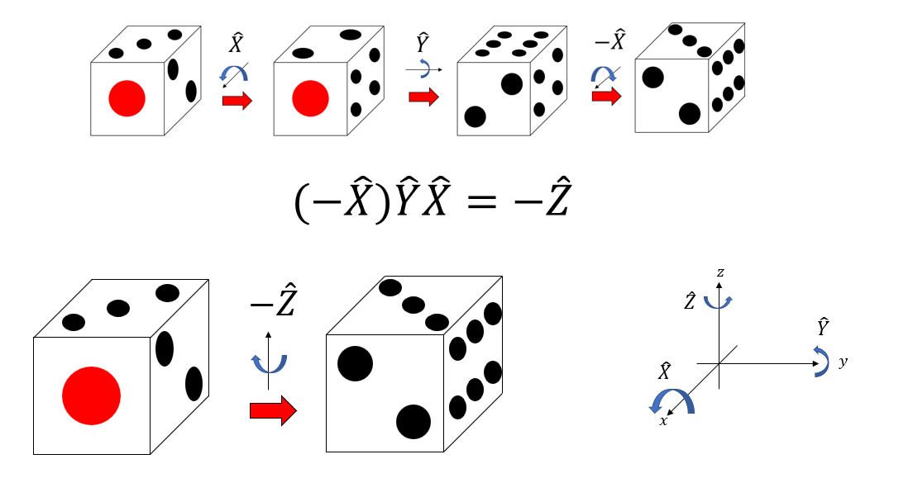

# ポアソン括弧

## 本章の目的

物理学の重要な要請の一つに、物理法則が座標の取り方に依らない、というものがある。それなら最初から座標を使わない形で運動方程式を書いてしまえばよい。ポアソン括弧は運動方程式の座標を用いない形を与える。また、ポアソン括弧はリー代数の構造を持っており、量子力学における交換関係と密接につながっている。本章では、群や環といった代数構造がなぜ、どのようにして力学に現れるかを学ぶ。

## ポアソン括弧

1自由度系における正準方程式を考えよう。

$$
\begin{aligned}
\dot{q} &= \frac{\partial H}{\partial p} \\
\dot{p} &= -\frac{\partial H}{\partial q}
\end{aligned}
$$

この系は$q,p$という正準変数によって記述されており、この系の全ての物理量は$q,p$の関数として表現される。例えば運動エネルギーなら$K(q,p) = p^2/2m$である。ある物理量$A(q,p)$を考えよう。この物理量を時間微分すると、

$$
\frac{dA}{dt} = \frac{\partial A}{\partial q}\dot{q} + \frac{\partial A}{\partial p}\dot{p}
$$

正準方程式を使って$\dot{p}, \dot{q}$を消去すると、

$$
\frac{dA}{dt} = \frac{\partial A}{\partial q}\frac{\partial H}{\partial p} -\frac{\partial A}{\partial p}\frac{\partial H}{\partial q}
$$

この式の右辺を見ると、$q,p$や$H,A$が対称な形で含まれていることがわかる。そこで、以下のような括弧式を定義する。

$$
\left\{X, Y\right\}_{q,p} \equiv \frac{\partial X}{\partial q}\frac{\partial Y}{\partial p} - \frac{\partial X}{\partial p}\frac{\partial Y}{\partial q}
$$

括弧の添字の$q,p$は、この変数で微分する、という意味である。これを用いると、物理量$A$の時間微分は

$$
\frac{dA}{dt} = \left\{A, H\right\}_{q,p}
$$

と書くことができる。この括弧を **ポアソン括弧(Poisson bracket)** と呼ぶ。

さて、変数変換$(q,p) \rightarrow (Q,P)$により運動方程式の形を変えない時、つまりハミルトンの運動方程式が共変である場合、この変換を正準変換と呼ぶ。正準変換の条件については次章で詳しく説明する。

さて、実はポアソン括弧は正準変数に対して不変であること、すなわち、ある正準変数の組$(q,p)$が、正準変換により別の正準変数の組 $(Q,P)$ に変換される時、$(q,p)$で定義したポアソン括弧式と、 $(Q,P)$ で定義したポアソン括弧式は等しいことを示すことができる。

今、$(q,p) \rightarrow (Q,P)$ が正準変換であるとする。この時、$(q,p)$によるポアソン括弧は

$$
\left\{X, Y\right\}_{q,p} \equiv \frac{\partial X}{\partial q}\frac{\partial Y}{\partial p} - \frac{\partial X}{\partial p}\frac{\partial Y}{\partial q}
$$

となる。ここで、$X, Y$を$(Q,P)$で表すと、$(q,p)$依存性は以下のように入ってくる。
$$
\begin{aligned}
X &= X(Q(q,p), P(q,p))\\
Y &= Y(Q(q,p), P(q,p))
\end{aligned}
$$

それぞれ$q,p$で偏微分すると

$$
\begin{aligned}
\frac{\partial X}{\partial q} &= \frac{\partial X}{\partial Q}\frac{\partial Q}{\partial q} + \frac{\partial X}{\partial P}\frac{\partial P}{\partial q} \\
\frac{\partial Y}{\partial p} &= \frac{\partial Y}{\partial Q}\frac{\partial Q}{\partial p} + \frac{\partial Y}{\partial P}\frac{\partial P}{\partial p} \\
\end{aligned}
$$

であるから、

$$
\begin{aligned}
\frac{\partial X}{\partial q}\frac{\partial Y}{\partial p} &=
\left(
\frac{\partial X}{\partial Q}\frac{\partial Q}{\partial q} + \frac{\partial X}{\partial P}\frac{\partial P}{\partial q}
\right)
\left(
\frac{\partial Y}{\partial Q}\frac{\partial Q}{\partial p} + \frac{\partial Y}{\partial P}\frac{\partial P}{\partial p}
\right) \\
&=
\frac{\partial X}{\partial Q}\frac{\partial Y}{\partial P}\frac{\partial Q}{\partial q}\frac{\partial P}{\partial p}
+
\frac{\partial X}{\partial P}\frac{\partial Y}{\partial Q}\frac{\partial Q}{\partial p}\frac{\partial P}{\partial q}\\
&+ \underbrace{\frac{\partial X}{\partial Q}\frac{\partial Y}{\partial Q}\frac{\partial Q}{\partial p}\frac{\partial Q}{\partial q}
+ \frac{\partial X}{\partial P}\frac{\partial Y}{\partial P}\frac{\partial P}{\partial p}\frac{\partial P}{\partial q}}_{\bigstar}
\end{aligned}
$$

後に$X$と$Y$を入れ替えたものを引くため、入れ替えても値が変わらない項目である$\bigstar$の項目が消えることに注意。以上から、

$$
\begin{aligned}
\left\{X, Y\right\}_{q,p} &=
\frac{\partial X}{\partial q}\frac{\partial Y}{\partial p}
- \frac{\partial Y}{\partial q}\frac{\partial X}{\partial p} \\
&=
\frac{\partial X}{\partial Q}\frac{\partial Y}{\partial P}
\frac{\partial Q}{\partial q}\frac{\partial P}{\partial p}
+
\frac{\partial X}{\partial P}\frac{\partial Y}{\partial Q}
\frac{\partial Q}{\partial p}\frac{\partial P}{\partial q} \\
&-
\frac{\partial X}{\partial P}\frac{\partial Y}{\partial Q}
\frac{\partial Q}{\partial q}\frac{\partial P}{\partial p}
-
\frac{\partial X}{\partial Q}\frac{\partial Y}{\partial P}
\frac{\partial Q}{\partial p}\frac{\partial P}{\partial q}\\
&=
\frac{\partial X}{\partial Q}\frac{\partial Y}{\partial P}
\underbrace{\left(
    \frac{\partial Q}{\partial q}\frac{\partial P}{\partial p}
    -
    \frac{\partial Q}{\partial p}\frac{\partial P}{\partial q}
\right)}_{=1}
\\
&- \frac{\partial X}{\partial P}\frac{\partial Y}{\partial Q}
\underbrace{\left(
    \frac{\partial Q}{\partial q}\frac{\partial P}{\partial p}
    -
    \frac{\partial Q}{\partial p}\frac{\partial P}{\partial q}
\right)}_{=1}\\
&= \frac{\partial X}{\partial Q}\frac{\partial Y}{\partial P} -
\frac{\partial X}{\partial P}\frac{\partial Y}{\partial Q} \\
&= \left\{X,Y\right\}_{Q,P}
\end{aligned}
$$

なお、ここで正準変換の条件である「変換のヤコビアンが1であること」を用いた。これについては次章で証明する。したがって、ポアソン括弧式は正準変換で移り変わることができる、いかなる正準変数の組で表現しても同じ値になるため、添字に「どの変数で定義したか」を表記する必要はない。以後、括弧式の変数を省略しよう。

$$
\left\{X, Y\right\}_{q,p} =
\left\{X, Y\right\}_{Q,P} =
\left\{X, Y\right\}
$$

多自由度系$(q^1, q^2, \cdots, q^N, p_1, p_2, \cdots, p_N)$におけるポアソン括弧は

$$
\{X, Y\} = \frac{\partial X}{\partial q^i}\frac{\partial Y}{\partial p_i} -
\frac{\partial X}{\partial p_i} \frac{\partial Y}{\partial q^i}
$$

で表される($i$による和を取っていることに注意)。

ポアソン括弧を用いると、正準方程式は

$$
\begin{aligned}
\dot{p_i} &= \left\{p_i, H\right\} \\
\dot{q^i} &= \left\{q^i, H\right\}
\end{aligned}
$$

と書くことができる。$Y$という量から$\{X, Y\}$という量を作ることを、「$Y$の左から$X$とのポアソン括弧をとる」と表現しよう。同様に$\{Y, X\}$は$Y$の右から$X$とのポアソン括弧をとったものである。すると、「ある物理量について、右からハミルトニアン$H$とのポアソン括弧をとること」が、「時間$t$で微分すること」に対応していることがわかる。

ポアソン括弧式が正準変換に対して不変である事実は重要である。前提として、物理法則は座標のとり方によって形を変えて欲しくない。より正確に言えば、座標を変換した時、物理量が全て同じ様に変換するため、変換前と後で同じ形の式が成立する時、その式は共変性を持つという。我々は既に正準方程式が正準変換に対して形を変えないことを見た。つまり、正準方程式は正準変換に対して共変である。であるならば、運動方程式を表現するのにどのような座標を採用するかは重要ではないのだから、座標を陽に書かない表現が好ましい。もう一度物理量の時間微分を見てみよう。

$$
\frac{dA}{dt} = \left\{A, H\right\}
$$

この式には、座標が陽に現れない。我々が正準変数として$(q,p)$を選んでいようが$(Q,P)$を選んでいようが、この式は形を変えないのだから、座標を気にしなくて良い。後に、この哲学をより押し進めた形の運動方程式を見る。

さて、ポアソン括弧の物理的な意味を見る前に、ポアソン括弧が満たす数学的な性質を調べておこう。

まず、括弧に入れる変数を入れ替えると負符号がつく。

$$
\left\{X, Y\right\} = - \left\{Y, X\right\}
$$

これを反対称性と呼ぶ。

また、定数は括弧の外に出すことができる。

$$
\left\{a X, Y\right\} = a \left\{X, Y\right\}
$$

$$
\left\{X, bY\right\} = b \left\{X, Y\right\}
$$

さらに分配法則がなりたつ。

$$
\left\{X + Y , Z\right\} = \left\{X, Z\right\} + \left\{X, Y\right\}
$$

$$
\left\{X, Y+Z\right\} = \left\{X, Y\right\} + \left\{X, Z\right\}
$$

定数倍を外に出せることと、分配法則をまとめると以下の式が成り立つ。

$$
\left\{a X + bY , Z\right\} = a \left\{X, Y\right\} + b  \left\{Y, Z\right\}
$$

$$
\left\{X, aY + bZ\right\} = a \left\{X, Y\right\} + b  \left\{X, Z\right\}
$$

つまり、括弧の左側や右側に入れるものは線形性が成り立つ。括弧の両側で線形性が成り立っているため、これを**双線形性(bilinearity)** と呼ぶ。

関数の積の微分は、ライプニッツ則により以下のように分解できるのであった。

$$
\frac{d}{dx} (fg) = f'g + fg'
$$

ポアソン括弧も微分を含むことから、括弧に関数の積を入れるとライプニッツ則により分解することができる。

$$
\left\{XY , Z\right\} = X \left\{Y, Z\right\} + \left\{X, Z\right\} Y
$$

$$
\left\{X , YZ\right\} = \left\{X, Y\right\}Z + Y\left\{X, Z\right\}
$$

これらの性質は定義から容易に導けるものであるが、非自明な性質として、以下の恒等式が成り立つ。

$$
\left\{X , \left\{Y, Z\right\}\right\} +
\left\{Y , \left\{Z, X\right\}\right\} +
\left\{Z , \left\{X, Y\right\}\right\} = 0
$$

この恒等式をヤコビ恒等式と呼ぶ。

以上をまとめると、ポアソン括弧は以下の性質を持っている。

* 反対称性
* 双線型性
* ヤコビ恒等式
* ライプニッツルール

このように、あるベクトル空間の要素2つを、別の要素に結びつける演算を積と呼ぶ。ポアソン括弧は積の一種である。この集合と積をあわせたものを代数と呼ぶ。積の満たす性質により様々な代数がアリ得るが、ポアソン括弧が満たす3つの性質(反対称性、双線型性、ヤコビ恒等式)を持つ積が作る代数を **リー代数 (Lie algebra)** 、もしくはリー環と呼ぶ。リー環は、リー群と密接な関係を持つ。ここで、群や環について簡単に紹介しよう。

## 代数的構造

### 群

数学は大きく分けると代数、幾何、解析の３つに分けることができる。幾何は広い意味での図形を扱う学問である。解析とは極限を扱う学問で、微分や積分などが含まれる。そして代数とは、広い意味での足し算や掛け算を調べる学問である。足し算や掛け算といった算法は演算として抽象化され、様々な演算が作る構造(これを代数的構造と呼ぶ)について調べるのが代数学である。先程出てきたポアソン括弧も、リー環という代数構造を作る。リー環がどういうものであるかを調べる前に、最も基本的な代数構造である群から見ていきたい。以下では数学的な厳密さはあまり気にせず、「だいたいこういうもの」という説明をするため、詳細な定義については専門書を参照されたい。

先程出てきたリー環は、リー群という代数構造から自然に作ることができる。リー群は群の一種であり、群とは、何か操作の対象と操作の組があり、ある操作が後から打ち消せるものを言う。簡単な例として回転するツマミを考えよう。どこか基準となる向きを決め、そこから反時計回りに測った角度を、このツマミの状態としよう。例えばこのツマミの角度が$\theta$である時、その状態を$v(\theta)$と表すことにする。

さて、このツマミを、現在の状態から反時計回りに$\phi$だけ回す操作を考えよう。この操作を$U(\phi)$と表記する。これをツマミの状態$v(\theta)$に演算すると

$$
U(\phi) v(\theta) = v(\theta+\phi)
$$

となる。これは、もともとの角度が$\theta$であったツマミが$\phi$だけ回転したので、$\theta+\phi$になった、というだけの式だ。

また、逆向きに$\phi$だけ回す、すなわち$U(-\phi)$を演算すると元の状態に戻る。

$$
U(-\phi) v(\theta+\phi) = v(\theta)
$$

つまり、操作の対象(ツマミ)があり、任意の操作に対して後からその操作を打ち消すことができるので、「ツマミを回す操作」の集合は群を作る。より正確には、以下の4つの条件を満たすものを群と呼ぶ。

1. 集合が演算について閉じている
2. 演算に対して結合法則が成り立つ
3. 演算について単位元が存在する
4. 任意の演算に逆元が存在する

つまみを回す操作全体の集合を$G$で表そう。ツマミを回す操作を、順番に$f=U(\alpha)$、$g =U(\beta)$と二度続けて行おう。すると、これはまとめて$h= U(\alpha + \beta)$という一つの操作を行ったのと等しい。これを

$$
f \circ g = h \in G
$$

と表記する。これにより、二つの操作を一つにまとめることができ、新たにできた操作も「ツマミを回す操作」に含まれる。二つの操作を続けて行う行為を$\circ$で表し、これを集合の演算と呼ぶ。集合$G$に含まれる任意の操作を、この演算によりまとめても、やはりできあがる操作は$G$の元である。これを「集合が演算について閉じている」と呼ぶ。例えば集合として自然数をとり、演算として加法をとると、任意の自然数の和は自然数であるから閉じている。しかし、演算として減法をとると、負の数が出てくる場合があるから閉じていない。

結合法則とは、$f,g,h \in G$と、要素を三つ持ってきた時

$$
(f\circ g)\circ h = f \circ (g \circ h)
$$

が成り立つことである。結合則が成り立たない例は、例えばベクトルの外積が挙げられる。

単位元とは、任意の操作と演算しても、その操作を変えないような元である。すなわち、以下を満たすものである。

$$
e \circ  f = f \circ e = f
$$

角度ゼロの操作$e \equiv U(0)$が単位元となることは明らかであろう。また、最初に示した通り、逆元の存在も明らかである。

さて、群には様々な種類があるが、ここで挙げた例では回転角$\theta$という実数により、群の要素を特徴づけることができた。回転角は実数であるから、このパラメタに対して微分を考えることができる。このように群の要素が連続パラメタで特徴づけられ、そのパラメタに対して微分することができるような群を **リー群 (Lie Group)** と呼ぶ。二次元空間における連続回転は最も簡単なリー群の例である。

次に、この操作を行列で表現することを考える。ツマミの状態$v(\phi)$を、二次元ベクトル

$$
v(\theta) =
\begin{pmatrix}
\cos \theta \\
\sin \theta
\end{pmatrix}
$$

で表現しよう。すると、これを$\phi$だけ回転する演算$U(\phi)$は、以下の2行2列の回転行列で表すことができる。

$$
U(\phi) =
\begin{pmatrix}
\cos \phi & - \sin \phi \\
\sin \phi & \cos \phi
\end{pmatrix}
$$

これを群の表現行列と呼ぶ。

### 生成子

さて、リー群は微分できるのが特徴であったから、微分してみよう。ツマミの角度が$\theta$であったとして、それを微小角$h$だけ回転する操作は以下のように表現できる。

$$
U(h) v(\theta) = v(\theta+h)
$$

今、回転角$h$が小さい($\lvert h \rvert \ll 1)$として、右辺をテイラー展開しよう。

$$
\begin{aligned}
v(\theta+ h) &= v(\theta) + v'(\theta)h+ v''(\theta)\frac{h^2}{2} + \cdots\\
&= v(\theta) + h \frac{d}{d \theta} v(\theta) + \frac{h^2}{2} \frac{d^2}{d \theta^2} v(\theta) + \cdots \\
&= \sum_{k=0}^{\infty} \frac{h^k}{k!} \frac{d^k}{d \theta^k} v(\theta)
\end{aligned}
$$

指数関数の定義

$$
\exp(ax) = \sum_{k=0}^{\infty}  \frac{(ax)^k}{k!}
$$

と見比べると、先程の式は形式的に

$$
v(\theta + h) = \exp\left(h \frac{d}{d\theta}\right) v(\theta)
$$

と書くことができる。もともと、

$$
v(\theta + h) = U(h) v(\theta)
$$

であったから、二つの式を見比べると、

$$
U(h) \equiv  \exp\left(h \frac{d}{d\theta}\right)
$$

である。すなわち、回転を表す演算は、微分を指数関数の肩に載せたものであることがわかる。

さて、$h$を使って、微分の定義を書いてみよう。

$$
\begin{aligned}
\frac{dv}{d\theta} &= \lim_{h \rightarrow 0} \frac{v(\theta+h)-v(\theta)}{h} \\
&= \lim_{h \rightarrow 0} \frac{U(h)v(\theta)-U(0)v(\theta)}{h} \\
&= \lim_{h \rightarrow 0} \left(\frac{U(h) - U(0)}{h} \right)v(\theta) \\
&= U'(0) v(\theta)
\end{aligned}
$$

両辺を見比べると

$$
\frac{d}{d\theta} = U'(0)
$$

つまり、回転演算子について、微分してから回転角をゼロと置いたものは、微分演算子とみなすことができる。具体的な形は

$$
U'(0) =
\begin{pmatrix}
0 & -1\\
1 & 0
\end{pmatrix}
$$

である。後の都合のために、これを

$$
i\mathcal{L} = \begin{pmatrix}
0 & -1\\
1 & 0
\end{pmatrix}
$$

と書いておく。虚数単位$i$をつける理由は、エルミート演算子にするためだが、今は気にしなくて良い。この演算子$i\mathcal{L}$を使うと、

$$
\frac{d}{d\theta}v = i\mathcal{L} v
$$

と書くことができる。すなわち、この行列$i\mathcal{L}$は、時間微分を表す演算子になっている。両辺を$\theta$から$\theta+h$まで積分すると、

$$
v(\theta + h) - v(\theta) = \exp(ih \mathcal{L}) v(\theta)
$$

これと、

$$
v(\theta + h) = U(h) v(\theta)
$$

を見比べると、

$$
U(h) = \exp(ih \mathcal{L})
$$

であることがわかる。左辺は$h$という有限の回転を引き起こす演算子である。それに対して、右辺は$i\mathcal{L} = U'(0)$という、どの方向に回転するかだけを表現した演算子を、指数関数の肩に載せたものだ。この$i\mathcal{L}$を、回転を生成する演算子であるという意味で **生成子(generator)** と呼ぶ。

生成子は、操作の方向を表す演算子である。いま、回転角$h$が微小だとして回転演算子をテイラー展開すると、

$$
U(h) = 1 + ih \mathcal{L} + O(h^2)
$$

となる。これは回転という操作が、回転方向$i \mathcal{L}$と、回転量$h$に分離できたことを意味する。このように、無限小の操作を考えると、操作の方向を表す演算子と、操作の量を表すスカラー量に分けることができる。

ここでは回転を例にとったが、何か連続的なパラメータを持つ対象に対して並進変換を引き起こす全ての演算子に対して同じ議論をすることができる。時間発展はその代表例だ。

今、正準変数$(q,p)$で記述できる世界を考えよう。この世界では全ての物理量を$(q,p)$の関数として表現できる。そのような物理量として$A(q,p)$を考える。いま、運動方程式に従って$(q(t),p(t))$が$(q(t+h), p(t+h))$に時間発展したとしよう。物理量$A$は$q,p$を通して時間発展を行うので、時刻$t$なら$A(q(t),p(t))$と書くべきだが、これを$A(t)$と表記する。回転の時と同様に、$A(t+h)$をテイラー展開することで、

$$
\begin{aligned}
A(t+ h) &= A(t) + A'(t)h+ A''(t)\frac{h^2}{2} + \cdots\\
&= \sum_{k=0}^{\infty} \frac{h^k}{k!} \frac{d^k}{dt^k} A(t)\\
&= \underbrace{\exp\left(h \frac{d}{dt}\right)}_{\equiv U(h)} A(t) \\
&\equiv U(h) A(t)
\end{aligned}
$$

$A$の時間微分は

$$
\begin{aligned}
\frac{dA}{dt} &= \frac{\partial A}{\partial q}\frac{\partial H}{\partial p} -\frac{\partial A}{\partial p}\frac{\partial H}{\partial q} \\
&= \left( \frac{\partial H}{\partial p}\frac{\partial }{\partial q} -\frac{\partial H}{\partial q}\frac{\partial }{\partial p}\right) A
\end{aligned}
$$

時間発展に関する生成子$i\mathcal{L}$は、時間微分を引き起こす演算子であるから、

$$
\frac{dA}{dt} \equiv i\mathcal{L}A
$$

先程の式と見比べると、

$$
i\mathcal{L} = \left( \frac{\partial H}{\partial p}\frac{\partial }{\partial q} -\frac{\partial H}{\partial q}\frac{\partial }{\partial p}\right)
$$

であることがわかる。時間発展演算子の生成子を特に **リュービル演算子(Liouville operator)** と呼ぶ。回転の時と同様な議論により、リュービル演算子を指数関数の肩に載せたものが時間発展演算子である。

$$
U(h) = \exp(ih\mathcal{L})
$$

また、リュービル演算子が、ポアソン括弧の右側にハミルトニアンを、左側を空欄にしたものになっていることにも注意。

$$
i\mathcal{L} = \{~~~~, H\}
$$

ここまでの議論をまとめておこう。

* 有限の連続的な変化を引き起こす演算子$U(h)$を考える
* その演算子に引数にゼロを代入すると、変化させない、すなわち恒等演算子$U(0)$が定義できる
* 恒等演算子から少しだけ動かした時の、「動く方向」だけを定義する演算子$U'(0)$を生成子と呼び、$i\mathcal{L}$で表現する
* 演算子$U(h)$と生成子$i\mathcal{L}$の間には$U(h) = \exp(ih \mathcal{L})$の関係がある

### 三次元回転の生成子とリー環

リー群の表現行列$U(\theta)$から、生成子という微小回転の演算子$i\mathcal{L}$が出てきた。実はこれがリー環を作るのだが、二次元回転では面白いことがおきない。そこで三次元での回転を考えよう。

三次元空間では、$x$、$y$、$z$軸の周りの回転を考えることができる。例えば$z$軸の周りに$h$だけ回転させる操作を$U_z(h)$としよう。その行列表現は

$$
U_z(h) =
\begin{pmatrix}
\cos h &  -\sin h & 0\\
\sin h & \cos h & 0\\
0 & 0 & 1
\end{pmatrix}
$$

z方向の回転の生成子は、回転角が小さい時のテイラー展開

$$
U_z(h) = 1 + ihL_z + O(h^2)
$$

で定義されるから、

$$
ihL_z = U_z'(0) -I
$$

として求められる。ただし$I$は単位行列である。以上から、

$$
iL_z =
\begin{pmatrix}
0 &  -1 & 0\\
1 & 0 & 0\\
0 & 0 & 0
\end{pmatrix}
$$

同様に、$x,y$方向の生成子も以下のように書ける。

$$
iL_x =
\begin{pmatrix}
0 & 0 & 0\\
0 & 0 & -1\\
0 & 1 & 0
\end{pmatrix}
$$

$$
iL_y =
\begin{pmatrix}
0 & 0 & 1\\
0 & 0 & 0\\
-1 & 0 & 0
\end{pmatrix}
$$

これらの生成子の積について考えよう。以下の交換関係を定義する。

$$
[X, Y ] \equiv XY - YX
$$

これを積とみなすと、リー代数の公理(反対称性、双線形性、ヤコビ恒等式)を満たすことがわかる。

回転の生成子同士の積を実際に計算してみると、

$$
\begin{aligned}
[iL_x, i L_y] &=
\begin{pmatrix}
0 & 0 & 0\\
0 & 0 & -1\\
0 & 1 & 0
\end{pmatrix}
\begin{pmatrix}
0 & 0 & 1\\
0 & 0 & 0\\
-1 & 0 & 0
\end{pmatrix}
-
\begin{pmatrix}
0 & 0 & 1\\
0 & 0 & 0\\
-1 & 0 & 0
\end{pmatrix}
\begin{pmatrix}
0 & 0 & 0\\
0 & 0 & -1\\
0 & 1 & 0
\end{pmatrix} \\
&=
\begin{pmatrix}
0 &  -1 & 0\\
1 & 0 & 0\\
0 & 0 & 0
\end{pmatrix} \\
&= iL_z
\end{aligned}
$$

つまり、

$$
[iL_x, i L_y] = i L_z
$$

が成り立つ。この式は、

* 3次元回転操作は一般に非可換である
* $x$方向の回転と$y$方向の回転を組み合わせると$z$方向の回転を作ることができる

という二つの意味を持っている。

同様に$[iL_y, iL_z], [iL_z, iL_x]$を計算し、3つの交換関係をまとめて書くと

$$
\begin{aligned}
[iL_x, i L_y] &= i L_z\\
[iL_y, i L_z] &= i L_x\\
[iL_z, i L_x] &= i L_y\\
\end{aligned}
$$

が成り立つことがわかる。このように、なんらかの演算を定義し、その結果がどうなるかを表す構造を代数的構造と呼ぶ。ここでは交換関係により積を定義しているため、作られた構造は環となっている。

さて、先程の例は生成子の間の関係であるから無限小の回転に関するものであるが、有限の回転でその意味を見てみよう。

サイコロを考える。サイコロの目のうち、1を$x$軸方向に、2を$y$軸方向に、3を$z$軸方向に揃えよう。$x$軸を回転軸として反時計回りに90度回転させる操作を$\hat{X}$とする。同様に、$y$軸回りに反時計回りに90度回転させる操作を$\hat{Y}$、$z$軸回りに反時計回りに90度回転させる操作を$\hat{Z}$とする。

まず、サイコロに$\hat{X}$を演算しよう。すると、上面に2がきて、向かって右側に4がくる。次に$\hat{Y}$を演算すると、上面に6がきて、向かって右側は4となる。

サイコロの状態を元に戻し、今度は最初に$\hat{Y}$を演算しよう。すると手前に3、上面に6がくる。さらに$\hat{X}$を演算すると、上面に2が、向かって右側は1となり、先程の状態とは異なる。すなわち、

$$
\hat{Y}\hat{X} \neq \hat{X}\hat{Y}
$$

と、演算の順序を変えると、結果が変わることがわかる。すなわち、回転操作は非可換である。ここで、先に演算する演算子が右側にくることに注意。

次に、$x$軸回転と$y$軸回転の組み合わせで$z$軸回転を構成できることを示そう。

先程と同様に、サイコロの1を$x$軸方向に、2を$y$軸方向に、3を$z$軸方向に揃えて置こう。まず$\hat{X}$を演算する。すると、上面に2、向かって右側に4がくる。さらに$\hat{Y}$を演算すると、上面に6、手前が2となる。最後に$-\hat{X}$、すなわち$x$軸を回転軸として、時計回りに90度回転させる。すると、上面が3、向かって右側が6、手前が2という状態になる。

さて、サイコロの状態を元に戻し、$z$軸を回転軸として時計回りに90度回転させよう。これは演算子としては$-\hat{Z}$になる。すると、上面が3、向かって右側が6、手前が2という状態になり、先程$x$軸回転と$y$軸回転のみで作った状態と同じ状態になった。つまり、

$$
(-\hat{X})\hat{Y}\hat{X} = -\hat{Z}
$$

である。先程見た交換関係は回転の生成子、すなわち微小回転に関するものであるから、90度回転という有限回転演算子が満たす関係式とは異なる関係式を満たすが、それでも「演算子が非可換である」「2つの演算子を合成することで別の演算子を作ることができる」ことがわかる。

## 交換関係

さて、解析力学に戻ろう。ポアソンの反対称性から、もしポアソン括弧に入れる物理量を左右入れ替えた時に値が変わらない時、すなわち

$$
\{A, B\} = \{A, B\}
$$

が成り立つ時、そのポアソン括弧の値はゼロに限られることがわかる。

$$
\{X, Y\} = \{Y, X\} \Longleftrightarrow \{X, Y\} = 0
$$

これを、ポアソン括弧の意味で交換可能、あるいは単に可換と呼ぶ。ポアソン括弧に非可換な量を入れると、何かしらの値を持つ。例えば物理量$A, B$をポアソン括弧に入れた値が物理量$C$になった時、

$$
\{A, B\} = C
$$

と書ける。このように、何かしらの物理量をポアソン括弧の入れた結果をまとめて **交換関係(commutation relation)** と呼ぶ。

特に、一般化座標$q^i$と一般化運動量$p_j$の交換関係を調べると

$$
\begin{aligned}
\{q^i, q^j\} &= \frac{\partial q^i}{\partial q^k} \underbrace{\frac{\partial q^j}{\partial p_k}}_{=0} -
\underbrace{\frac{\partial q^i}{\partial p_k}}_{=0} \frac{\partial q^j}{\partial q^k} = 0 \\
\{p_i, p_j\} &= \underbrace{\frac{\partial p_i}{\partial q^k}}_{=0} \frac{\partial p_j}{\partial p_k} -
\frac{\partial p_i}{\partial p_k} \underbrace{\frac{\partial p_j}{\partial q^k}}_{=0}  = 0\\
\{q^i, p_j\} &= \underbrace{\frac{\partial q^i}{\partial q^k}}_{\delta^i_k} \underbrace{\frac{\partial{p_j}}{\partial{p_k}}}_{\delta^k_j}-
\underbrace{\frac{\partial q^i}{\partial p_k}}_{=0}\underbrace{\frac{\partial{p_j}}{\partial{q^k}}}_{=0} \\
&= \delta^i_k \delta^k_j \\
&= \delta^i_j
\end{aligned}
$$

すなわち、正準共役な変数を入れた時にのみ1、それ以外は全てゼロとなる。これを **正準交換関係(canonical commutation relation)** と呼ぶ。

## ポアソン括弧の物理的な意味

ポアソン括弧を用いると、物理量の時間微分が以下のように書けた。

$$
\frac{dA}{dt} = \{A, H\}
$$

つまり、ポアソン括弧の右側にハミルトニアンを入れると、左側に入れた量の時間微分になった。

では、ポアソン括弧の右側に、ハミルトニアンの代わりに別の量、例えば$p$を入れてみよう。

$$
\begin{aligned}
\{A, p\} &= \frac{\partial A}{\partial q} \underbrace{\frac{\partial p}{\partial p}}_{=1} - \frac{\partial A}{\partial q} \underbrace{\frac{\partial p}{\partial q}}_{=0}\\
&= \frac{\partial A}{\partial q}
\end{aligned}
$$

すなわち、ハミルトニアンの右側に一般化運動量$p$を入れると、その変数と共役な一般化座標$q$による微分になった。

同様にして、ハミルトニアンの右側に一般化座標$q$を入れると、

$$
\{A, q\} = -\frac{\partial A}{\partial p}
$$

と、左側に入れた量の$p$偏微分(に負符号をつけたもの)になることがわかる。

さらに、今$(q,p) \rightarrow (Q,P)$が正準変換、すなわち

$$
\frac{\partial Q}{\partial q}\frac{\partial P}{\partial p} - \frac{\partial Q}{\partial p}\frac{\partial P}{\partial q} = 1
$$

を満たすとしよう。この時、ポアソン括弧の右側に新しい一般化座標$P$を入れてみると、

$$
\{A, P\} = \frac{\partial A}{\partial q}\frac{\partial P}{\partial p} -  \frac{\partial A}{\partial q}\frac{\partial P}{\partial p}
$$

ここで、物理量$A$が新しい正準変数$(Q,P)$を使って$A(Q(q,p), P(q,p))$と書けたとすると、

$$
\begin{aligned}
\frac{\partial A}{\partial q} = \frac{\partial A}{\partial Q} \frac{\partial Q}{\partial q}
+ \frac{\partial A}{\partial P} \frac{\partial P}{\partial q} \\
\frac{\partial A}{\partial p} = \frac{\partial A}{\partial Q} \frac{\partial Q}{\partial p}
+ \frac{\partial A}{\partial P} \frac{\partial P}{\partial p}
\end{aligned}
$$

これを用いてポアソン括弧を書き直すと、

$$
\begin{aligned}
\{A, P\} &= \frac{\partial A}{\partial q}\frac{\partial P}{\partial p} -  \frac{\partial A}{\partial q}\frac{\partial P}{\partial p}  \\
&= \left( \frac{\partial A}{\partial Q} \frac{\partial Q}{\partial q}
+ \frac{\partial A}{\partial P} \frac{\partial P}{\partial q}\right)\frac{\partial P}{\partial p} \\
&- \left(\frac{\partial A}{\partial Q} \frac{\partial Q}{\partial p}
+ \frac{\partial A}{\partial P} \frac{\partial P}{\partial p} \right)\frac{\partial P}{\partial q} \\
&= \frac{\partial A}{\partial Q}
\underbrace{\left(\frac{\partial Q}{\partial q}\frac{\partial P}{\partial p} - \frac{\partial Q}{\partial p}\frac{\partial P}{\partial q} \right)}_{=1} \\
& + \frac{\partial A}{\partial Q}
\underbrace{\left(\frac{\partial P}{\partial q}\frac{\partial P}{\partial p}-\frac{\partial P}{\partial p}\frac{\partial P}{\partial q} \right)}_{=0}\\
&= \frac{\partial A}{\partial Q}
\end{aligned}
$$

つまり、ポアソン括弧の右側に一般化座標$P$を入れることは、その正準共役な変数である$Q$で偏微分することになる。同様に、ポアソン括弧の右側に$Q$を入れると、$P$による偏微分に負符号がついたものとなる。

以上から、ポアソン括弧は、「ポアソン括弧の左側に入れた変数を右側に入れた変数と正準共役な変数で微分する」という意味を持つ。さて、ポアソン括弧の右側にハミルトニアンを入れたら時間微分となったのであるから、「ハミルトニアンと時間は正準共役である」ということが予想される。実際に、ハミルトニアン(エネルギー)$H$を一般化座標、時間$t$を一般化運動量として$H$と$t$が正準共役な変数とみなせることがわかる。ただし、一般化座標と一般化運動量を入れ替えて負符号をつける変換$(H,t) \rightarrow (t, -H)$が正準変換であることから、時間$t$を一般化座標、エネルギーに負符号をつけた$-H$を一般化運動量とみなすこともでき、こちらを採用する場合が多い。

ある物理量$X$が、別の物理量$Y$と可換である時、$X$を$Y$の正準共役な変数で偏微分するとゼロとなる。したがって、その変数について保存量となることがわかる。

例えば、ある物理量$A$がハミルトニアン$H$と可換であるならば、$\{A, H\}=0$である。したがって

$$
\frac{dA}{dt} = \{A, H\} = 0
$$

となり、$A$は時間に対して不変量となる。

時間以外の不変性の例として、角運動量について考えよう。いま、3次元系において、$z$軸周りの回転に対する角運動量

$$
L_z = x p_y - y p_x
$$

を考えよう。ここで、$L_z$と$z$のポアソン括弧を考える。計算の便利のために$x,y,z$を$q^1,q^2, q^3$、$p_x, p_y, p_z$を$p_1, p_2, p_3$と表し、$L_z$は$L_3$と表現しておこう。すると、

$$
\begin{aligned}
\{q^3, L_3\} &= \frac{\partial q^3}{\partial q^i} \frac{\partial L_3}{\partial p_i}
- \underbrace{\frac{\partial q^3}{\partial p_i}}_{=0} \frac{\partial L_3}{\partial q^i} \\
&= \delta^3_i \frac{\partial L_3}{\partial p_i} \\
&= \frac{\partial L_3}{\partial p_3} \\
&=0
\end{aligned}
$$

すなわち$z$と$L_z$はポアソン括弧の意味で可換である。ただし途中で、一般化座標を一般化座標で偏微分した場合は、自分自身による偏微分は1、それ以外はゼロになること、一般化座標を一般化運動量で偏微分したらゼロであること、$L_3$が$p_3$依存性をもたないことを用いた。

$L_z$は$z$軸まわりの角運動量であり、共役な一般化座標は$z$軸周りの回転角度$\phi$であるから、これは

$$
\frac{\partial z}{\partial \phi} = 0
$$

を意味する。これは「$z$軸周りの回転に対して、$z$座標は変化しない」という、ある意味当然な主張に過ぎない。しかし、そのような性質を、「括弧に放り込んでゼロになるかどうか調べる」という簡便な方法で確認することができるのがポアソン括弧の強みである。

また、ポアソン括弧を用いると、複数の時間不変量から別の時間不変量を見つけることができる。今、2つの物理量$A, B$が、時間不変量であったとしよう。すなわち、

$$
\begin{aligned}
\dot{A} &= \{A, H\} = 0 \\
\dot{B} &= \{B, H\} = 0 \\
\end{aligned}
$$

ここで、$A$と$B$がポアソン括弧に対して非可換である時、ポアソン括弧の値を$C$としよう。

$$
\{A, B\} = C
$$

ここで、ポアソン括弧はヤコビ恒等式を満たすから、

$$
\left\{H , \underbrace{\left\{A, B\right\}}_{=C}\right\} +
\left\{A , \underbrace{\left\{B, H\right\}}_{=0}\right\} +
\left\{B , \underbrace{\left\{H, A\right\}}_{=0}\right\} = 0
$$

したがって

$$
\dot{C} = \{C, H\} = 0
$$

となり、$C$も時間不変量であることがわかる。さらに$C$と$A$のポアソン括弧から新たな変数$D$を作ることができれば、$D$も時間不変量となる。このようにして、同じ変数が出てくるまで次々と不変量を作り出すことができる。

## まとめ

本章ではポアソン括弧を定義した。ポアソン括弧が作る代数構造はリー環になっており、その意味で自然に解析力学に代数的構造が入る。ポアソン括弧には、「入れた物理量と共役な変数による微分をとる」という意味があり、ハミルトニアンを入れると時間微分に、一般化運動量を入れると、対応する一般化座標による微分となる。ポアソン括弧の性質から、入れ替えても値が変わらない、すなわちポアソン括弧の意味で可換である時、対応する量による微分がゼロ、すなわち何かしらの保存則を表していることがわかる。物理量の微分が交換関係から得られる、という性質は、量子力学の行列表現へと繋がっていく。

## 余談：サイコロの雌雄と生命の選択

サイコロに雌雄があるのを知っているだろうか。サイコロは、1から6までの数字を、裏にある数字の和が7となるように正六面体の各面に割り振ったものだ。いま、サイコロの上面に1を配置すると、下面は6となる。側面には2,3,4,5のどれかが配置されるが、2を手前にしよう。すると奥が5と決まる。残りは3,4のペアだが、3を右に配置するか、左に配置するかの二通りの自由度が残る。3を右に配置したものを雌サイコロ、左に配置したものを雄サイコロと呼ぶ。3次元軸の上下を「天地」、残り東西南北に割り振る時、「天一地六東五西二南三北四」とするのが雌サイコロ、「「天一地六東五西二**南四北三**」とするのが雄サイコロだ。他にも、「1,2,3の順番にx,y,z軸を決めた時に、右手系になるのが雌、左手系になるのが雄」「1,2,3の順番に見た時、反時計回りになるのが雌、時計回りになるのが雄」という覚え方がある。

雄サイコロも雌サイコロも、サイコロとしての性質は全く変わらない。しかし現在使われているサイコロはほとんど雌サイコロである。同様に、このように、全く性質は変わらない二種類のうち、どちらかしか使われなくなる、という現象はよく見られる。例えばアミノ酸にも右手型と左手型が存在する。互いに鏡映の関係にあり、その化学的な性質はほとんど同じであるため、アミノ酸を化学合成すると右手系と左手系が同量できてしまう。にもかかわらず、地球生物はなぜか左手系のみを使うように進化した。我々は左手系のアミノ酸しか代謝できず、左手系のアミノ酸から構成されたタンパク質しか合成ことができない。「ドラえもん」に「フエルミラー」という道具がある。鏡に増やしたいものを映して、手を鏡に入れて取り出すことでものを増やすというものだが、これで食べ物を増やしても、アミノ酸の右手、左手が入れ替わるために食べることはできない(取り出したものをもう一度鏡で増やせばOKだが)。同様にSFなどで、鏡に写した自分がこの世界に飛び出してくる、というストーリーをたまに見かけるが、その生物は右手系のアミノ酸しか代謝できないため、この世界では長く生きることができないというエピソードが記述されたことがある。

糖も生命活動に重要な物質であり、アミノ酸と同様に右手型と左手型が存在するが、興味深いことに我々は右手型ばかりを使っている。なぜ我々はアミノ酸は左手型だけを、糖は右手型だけを使っているのか、その謎はおそらくまだ解明されていない。
