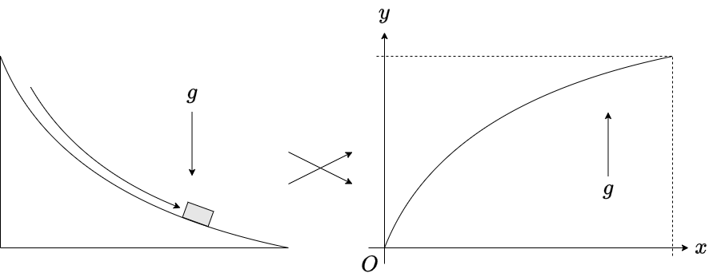

# 変分原理

<!--- abstract --->
ニュートン力学では、ニュートンの運動方程式が出発点であり、「その運動方程式はどこから来たか」に答えることができなかった。しかし、解析力学では、最小作用の原理から運動方程式を導く。これにより、運動方程式よりも一歩引いた立場から運動を記述、理解できるようになる。最小作用の原理は、変分原理と呼ばれるものの一種である。以下では、変分原理の例として最速降下曲線を挙げ、汎関数微分を導入する。解析力学は変分原理に立脚しており、その変分原理の心臓部分が関数の微分を含む汎関数の微分であるため、ここが解析力学で最も重要なパートである。
<!--- end --->

## 変分問題

我々は、何らかの制約のなかで、何かを最小化したり最大化したりしたいことがよくある。例えばレストランでご飯を注文する際、許される予算、およびカロリー上限の中で、もっとも食べたいものを選ぶであろう。このような問題を最適化問題と呼ぶ。最適化問題には様々なものがあるが、その中に選べる選択肢が連続的な場合がある。山を登る時、山の入口から山頂まで様々な道がある。傾きがきつい道ほど疲れやすいが登山時間は短くて済み、傾きが緩い道は楽だが登山時間が長くなる。この時、もっとも疲れずに登るためのルートはどのように決めれば良いか、といった問題が典型例である。この時、我々は「疲労度」という実数値を最小化するように「登山ルート」という連続的な経路を決める必要がある。このように連続的な自由度についての最適化問題を変分問題、変分問題を解く方法を変分法と呼ぶ。以下では、変分問題とその解法について説明する。以下、ややこしい計算を実施するが、計算の詳細は気にしなくて良い。

### スネルの法則

まずは簡単な例からはじめよう。A地点からB地点まで行きたいとする。ただし、A地点付近は草原で歩きやすく、B地点は歩きにくい沼地の中にある。草原と沼地が直線で接している時、A地点からB地点まで最短で到達できる経路はどのようになるだろうか？

草原の中、沼地の中など、歩きやすさが同じところでは、経路は直線となるであろう。従って、草原と沼地の境界にX地点をとり、その最適な場所を探すことを考える。なるべく草原を多く歩いたほうが得なのでAXを長くとりたいが、AXを長く取りすぎると全体としての経路が伸びてしまうために時間もかかる。どこかにちょうどよい点があるはずである。

この問題を考えるため、直線AXの長さを$l_A$、XBの長さを$l_B$とする。草原を歩く時の速度を$v_A$、沼地を歩く時の速度を$v_B$とする($v_A>v_B$)。A地点からX地点までの水平方向の距離を$x$とすると、X地点からB地点までの水平方向の距離は$L-x$となる。また、A地点、B地点から境界までの最短距離をそれぞれ$h_A$、$h_B$としよう。

全体を歩くのにかかる時間$T(x)$は、

$$
T(x) = \frac{l_A}{v_A} + \frac{l_B}{v_B}.
$$

ただし、

$$
\begin{aligned}
l_A(x) &= \sqrt{h_A^2 + x^2}, \\
l_B(x) &= \sqrt{h_B^2 + (L-x)^2}.
\end{aligned}
$$

$T(x)$を最小化する$x$は$T'(x) = 0$を満たすはずであるから、

$$
T'(x) = \frac{l_A'}{v_A} + \frac{l_B'}{v_B} = 0.
$$

ここで

$$
\begin{aligned}
l_A'(x) &= \frac{x}{\sqrt{h_A^2 + x^2}} = \frac{x}{l_A}, \\
l_B'(x) &= \frac{-(L-x)}{\sqrt{h_B^2 + (L-x)^2}} = -\frac{L-x}{l_B}
\end{aligned}
$$

である。境界の法線に対して直線AX、XBのなす角をそれぞれ$\theta_A$、$\theta_B$とすると、三角関数の定義から、

$$
\begin{aligned}
\sin \theta_A &= \frac{x}{l_A}, \\
\sin \theta_B &= \frac{L-x}{l_B}.
\end{aligned}
$$

従って、

$$
T'(x) = \frac{\sin \theta_A}{v_A} - \frac{\sin \theta_B}{v_B} = 0.
$$

以上から、

$$
\frac{\sin \theta_A}{v_A} = \frac{\sin \theta_B}{v_B}.
$$

これは、光線が平面に入射した場合、入射角と出射角(屈折角)と、その媒質中における光速との関係を表すスネルの法則にほかならない。

スネルの法則は、ホイヘンスの原理によっても説明できる。ホイヘンスの原理は、波の波面から二次波とよばれる新しい波が生じ、それらが強めあうところが次の波面となる、というもので、こちらは局所的かつ逐次的な立場から屈折を説明する。

一方、我々が求めたのは、「始点と終点が指定されている時、最も到達時間が短くなる経路」であり、大域的に問題を捉えている。光の場合、到達時間ではなく光路長を考えるのが一般的である。媒質中の光は真空中よりも速度が遅くなる。そこで、真空中での光速を媒質中の光速で割ったものを、その媒質の屈折率と呼ぶ。真空中での光速を$c$とすると、屈折率$n_A$を持つ媒質Aの中での速度$v_A$は、屈折率の定義から

$$
v_A = \frac{c}{n_A}
$$

となる。これを用いると、A地点からB地点への光の到達時間$T$は

$$
T = \frac{n_A l_A + n_B l_B}{c}
$$

となる。すなわち、実際の長さ$l_A$に対して、光が感じる実効的な長さは$n_A l_A$となっている。屈折率が大きい媒質であるほど光の速度は遅くなるため、光にとってその媒質は「進みにくい」物質となる。つまり、屈折率が大きいほど、光は実際の長さよりも長く感じることになる。この、実際の長さに屈折率をかけたものを光路長と呼び、光は光路長の総和を最小(停留)にするような経路を進む。これをフェルマーの原理と呼ぶ。

もちろん光には意思はないため、異なる媒質に入射する前に「なるべく光路長を短くする経路を選ぼう」などとは思っていない。しかし、最終的に光が通った経路を見ると、それは始点と終点を決めた時に、もっとも光路長が短くなるように選ばれている。これを原理として採用し、何かの総和が最も小さくなるように運動の経路が決まると主張するのが **変分原理**(variational principle) である。フェルマーの原理は変分原理の一種である。

ホイヘンスの原理が、ある瞬間の光の振る舞いに着目し、次の瞬間の光の位置を逐次的に決めていく、いわば局所的な原理であるのに対して、フェルマーの原理は全体を見渡し、光の経路を一度に決めてしまう大域的な原理である。このように、変分原理は全体を俯瞰する立場から振る舞いを決定する見方を与える。

### 最速降下曲線

変分原理の有名な例として、最速降下曲線を考えよう。斜面に質点をそっと置いて離し、重力により滑らせる。ただし、摩擦は無視できるものとする。質点は斜面から離れることなく、なめらかに滑るとしよう。スタート地点とゴール地点を固定する時、もっとも早くゴールするような斜面はどのような形状であるか求めよ、というものが最速降下曲線の問題である。この問題はベルヌーイが解いて、数学者への挑戦という形で出題された。しばらく誰も解くことができなかったが、ニュートンがこれを一晩で解いて返送し、ベルヌーイが悔しがった、というのは有名な話である。

問題を解くため、まず座標軸を設定しよう。質点を置く場所を原点にとる。最速降下曲線は下に落下していく問題だが、重力の働く方向を$y$軸の正の向きにとる。

さて、最速降下「曲線」というくらいだから答えは曲線となるのだが、これを折れ線で近似しよう。

運動の始点を原点にとり、終点を$(L, H)$の場所に取ろう。$L$を$N$等分し、左から$k$番目の場所を$x_k$とする。位置$x_k$から$x_{k+1}$までは速度が一定であると近似し、その速度を$v_k$としよう。

位置$x_k$における斜面の位置を$y_k$とすると、エネルギー保存則より

$$
\frac{1}{2} m{v_k}^2 = mgy_k
$$

が成り立つ。従って、

$$
v(x_k) = \sqrt{2gy_k}.
$$

また、位置$x_k$から$x+\Delta x$における曲線の長さ$l(x_k)$は

$$
\begin{aligned}
l(x_k) &=\sqrt{\Delta x^2 + (y_{k+1} - y_k)^2} \\
&\sim \Delta x \sqrt{1 + (y'_k)^2}.
\end{aligned}
$$

ただし、$y_{k+1} - y_k = y(x_k+\Delta x) - y(x_k) = y'_k \Delta x + O(\Delta x^2)$を用いた。

かかる時間の総和は

$$
\begin{aligned}
T &= \sum_{k=0}^{N-1} \frac{l(x_k)}{v(x_k)} \\
&= \sum_{k=0}^{N-1}\frac{\sqrt{1 + (y'_k)^2}}{\sqrt{2gy_k}} \Delta x
\end{aligned}
$$

であるから、$L = N\Delta$を固定したまま$N\rightarrow \infty$として連続極限をとると

$$
T= \int_0^L \frac{\sqrt{1+y'^2}}{\sqrt{2gy}} dx.
$$

関数$y(x)$は、スカラー量を入力とし、スカラー量を返すものであった。先程の$T$は関数$y(x)$を入力とし、出力としてスカラー量が決まるため、「関数の関数」とみなすことができる。それを表現して$T[y]$と書くことがある。適当な境界条件のもとで$T[y]$を最小とするような関数$y(x)$を見つけよ、というのが最速降下曲線問題である。

この問題を、汎関数微分を用いて解くというのが本章の目的だが、まずは幾何学的な考察で解いてみよう。曲線を折れ線で近似した状態を考える。$x_{k-1}$から$x_k$までの領域の速度は$v_{k-1}$であり、$x_k$から$x_{k+1}$までの速度が$v_k$であるから、入射角$\theta_{k-1}$と出射角$\theta_k$を定義するとスネルの法則と同じ議論により

$$
\frac{\sin \theta_{k-1}}{v_{k-1}} = \frac{\sin \theta_k}{v_k}.
$$

連続極限をとると、

$$
\frac{\sin \theta}{v} = C
$$

が場所に依らず成り立つ。ただし$C$は定数である。エネルギー保存則から

$$
v = \sqrt{2g y}
$$

であったから、

$$
2gC^2 y = \sin^2 \theta
$$

である。あとの便利のために$2gC^2 = 1/2a$とすると

$$
y = 2a \sin^2 \theta
$$

である。両辺$\theta$で微分すると

$$
\frac{dy}{d\theta} = 4 a \sin \theta \cos \theta
$$

となる。また、傾きと三角関数の定義から

$$
\begin{aligned}
\frac{dy}{dx} &= \tan\left(\frac{\pi}{2} - \theta \right) \\
&= \frac{\cos \theta}{\sin \theta}.
\end{aligned}
$$

ここから$x$を$\theta$の関数として求めよう。

$$
\begin{aligned}
\frac{dx}{d\theta} &= \frac{dx}{dy} \frac{dy}{d\theta} \\
&=\frac{\sin \theta}{\cos\theta}\left( 4 a \sin \theta \cos \theta\right) \\
&= 4 a \sin^2 \theta \\
&= 2 a (1 - \cos 2\theta).
\end{aligned}
$$

両辺を$\theta$で積分すると

$$
x = 2 a \left(\theta - \frac{1}{2} \sin 2\theta \right).
$$

ここで、

$$
y = 2a \sin^2 \theta = a (1 - \cos 2 \theta)
$$

であったから、$s = 2\theta$とすると

$$
\begin{aligned}
x &= a (s - \sin s), \\
y &= a (1 - \cos s).
\end{aligned}
$$

これはサイクロイド曲線を表現している。

## 汎関数微分

先程、最速降下曲線の問題を、スネルの法則を援用して幾何学的な考察で解いた。このような問題を一般的に扱うのが変分法である。変分法の説明のため、まず汎関数微分の導入を行う。

ある関数$f(x)$を考える。引数である$x$は複素数でもベクトルでもよいが、簡単のためスカラーで実数であるものとする。関数$f(x)$とは、実数$x$を入力すると、対応する実数$f(x)$を返してくれるものだ。すなわち、実数に実数を対応付ける写像になっている。一方、関数に実数を対応づける写像を **汎関数**(functional) と呼ぶ。様々な汎関数があり得るが、力学においては以下のような定積分として現れる。

$$
I[f] = \int_a^b f(x) dx.
$$

積分範囲 $(a,b)$ を固定すると、$I$は関数に実数を対応付けるため汎関数になっていることがわかる。例えば引数として$f(x) = x$を代入すると

$$
\begin{aligned}
I[x] &= \int_a^b x dx\\
&= \left[\frac{x^2}{2}\right]_a^b\\
&= \frac{b^2-a^2}{2}
\end{aligned}
$$

となるし、$f(x) = \exp(x)$とすると、

$$
\begin{aligned}
I[\exp(x)] &= \int_a^b \mathrm{e}^x dx\\
&= \left[ \mathrm{e}^x \right]_a^b \\
&= \mathrm{e}^b - \mathrm{e}^a
\end{aligned}
$$

となる。このように汎関数とは、何かしら関数を放り込むと、対応する実数を返してくれるものである。

さて、関数では、引数である実数が変化すると値が変化するのであった。汎関数では、関数の形が変わると値が変わる。関数の形がほんの少しだけ変化したとき、値がどのように変化するかを調べるのが汎関数微分である。

まず、通常の微分について考えよう。関数$f(x)$が、微小量$\varepsilon$を用いて

$$
f(x+\varepsilon) = f(x) + \frac{df}{dx} \varepsilon + O(\varepsilon^2)
$$

のように表すことができる時、$df/dx$を$f(x)$の微分と呼ぶのであった。

同様に、汎関数の微分について考えよう。関数$f(x)$に対して、何か適当な関数$\phi(x)$を考える。ただし関数$\phi(x)$は、積分の端点でゼロ、すなわち$\phi(a) = \phi(b) = 0$を満たすように選ぶ。その理由は後に説明する。$\varepsilon$を微小量として

$$
I[f+\varepsilon \phi] = I[f] +  \varepsilon \int_a^b \frac{\delta I}{\delta f}  \phi(x) dx  + O(\varepsilon^2)
$$

と表せる時、$\delta I/\delta f$を、$I$の **汎関数微分**(functional derivative) 、もしくは第一変分と呼ぶ。

解析力学では、汎関数の積分の中に関数の関数、すなわち合成関数が入ることが多い。そこで、以下のような式を考える。

$$
I[f] = \int_a^b F(f(x)) dx.
$$

$F(x)$は普通の関数である。例えば $F(x) = x^2$であるならば、$I[f]$は、「関数$f(x)$の二乗を$a < x < b$で積分した値を返しなさい」という意味になる。ここで、関数 $f(x)$を微小量$\varepsilon$ を用いて $f(x) + \varepsilon \phi(x)$と変化させた時、$I$がどのように変化するか見てみよう。

$$
I[f + \varepsilon \phi] = \int_a^b F(f(x)+ \varepsilon \phi(x) ) dx.
$$

ここで、ある$x$を固定すると、$f(x)$や$\phi(x)$は単なる値になるから $\varepsilon \phi(x)$をまとめて微小量とみなして良い。そこで

$$
F(f(x) + \varepsilon \phi(x)) = F(f(x)) + F'(f(x)) \varepsilon \phi(x) + O(\varepsilon^2)
$$

と展開できる。元の積分に代入すると、

$$
\begin{aligned}
I[f + \varepsilon \phi] &= \int_a^b F(f(x)+ \varepsilon \phi(x) ) dx \\
&= \underbrace{\int_a^b F[f(x)] dx}_{I[f]} + \varepsilon \int_a^b F'[f(x)]\phi(x) dx +O(\varepsilon^2) \\
&= I[f] + \varepsilon \int_a^b F'[f(x)]\phi(x) dx +O(\varepsilon^2).
\end{aligned}
$$

汎関数微分の定義から、

$$
\frac{\delta I}{\delta f} = F'[f(x)]
$$

となる。$\varepsilon \phi(x)$を、改めて $\delta f(x)$と表記しよう。ここで、これは$\delta$と$f(x)$の積ではなく、$\delta f$という一つの関数であることに注意。すると、

$$
\underbrace{I[f + \delta f]  - I[f]}_{\delta I} = \int_a^b F'[f(x)]\delta f dx + O(\varepsilon^2).
$$

ここで左辺を$\delta I$と書いて、$\varepsilon^2$のオーダーの項を無視すると、以下のように表記できる。

$$
\delta I = \int_a^b F'[f(x)]\delta f dx.
$$

これは、関数$f(x)$の全微分

$$
df = f'(x) dx
$$

の汎関数版である。要するに汎関数微分とは、積分の中の合成関数$F[f]$を、$f$を変数とみなして微分しろ、ということに過ぎない。

さて、解析力学では汎関数の中の積分の合成関数$F$が、関数$f(x)$と、その微分$f'(x)$に依存することが多い。すなわち、

$$
I[f] = \int_a^b F(f(x), f'(x)) dx
$$

という形を考えることが多い。なぜなら、力学は位置と速度で表現されており、速度は位置の時間微分であるためだ(現在の議論における変数$x$が、力学では時間$t$にあたることに注意)。このような場合に汎関数微分がどうなるかを見ておこう。

まず、二変数関数$F(f,g)$を考える。この関数の全微分は

$$
dF = \frac{\partial F}{\partial f} df +\frac{\partial F}{\partial g} dg
$$

で与えられる。

さて、この引数$f$、$g$がそれぞれ$x$の関数であるとしよう。この関数$F$を$a < x < b$の範囲で積分した量を$I$とすると

$$
I = \int_a^b F(f(x), g(x)) dx
$$

である。ここで、汎関数微分を行おう。$f \rightarrow f + \delta f$、$g \rightarrow g + \delta g$と変化した時、$I \rightarrow I + \delta I$と変化したならば、

$$
\delta I = \int_a^b \left(\frac{\partial F}{\partial f} \delta f(x) +  \frac{\partial F}{\partial g} \delta g(x)   \right) dx.
$$

ここまでは、二変数関数$F(f, g)$における汎関数微分の一般論である。さて、ここで$f$と$g$が常に

$$
\frac{d f}{dx} = g
$$

という関係を満たすことを要請しよう。この関係を満たしつつ、$f \rightarrow f + \delta f$と変化し、その結果$g \rightarrow g + \delta g$と変化したとする。ただし、それぞれ積分範囲の端点でゼロ、すなわち$\delta f(a) =\delta f(b) = \delta g(a) = \delta g(b)=0$を満たすように変化させる。変化後も微分の関係を満たさなければならないのだから、

$$
\frac{d}{dx} (f + \delta f) = g + \delta g.
$$

もともと$g(x) = f'(x)$であったから、両辺から引くと

$$
\frac{d}{dx} (\delta f) = \delta g
$$

となる。これを先程の汎関数微分の式に代入すると

$$
\begin{aligned}
\delta I &= \int_a^b \left(\frac{\partial F}{\partial f} \delta f +  \frac{\partial F}{\partial g} \frac{d}{dx}(\delta f)   \right) dx \\
&= \int_a^b \frac{\partial F}{\partial f} \delta f dx + \left[\frac{\partial F}{\partial g} \delta f \right]_a^b - \int_a^b \frac{d}{dx}\left(\frac{\partial F}{\partial g}\right) \delta f dx\\
&= \int_a^b \left( \frac{\partial F}{\partial f} - \frac{d}{dx} \left(\frac{\partial F}{\partial g} \right)\right) \delta f dx.
\end{aligned}
$$

最後に、$g=f'$であるから、$g$での偏微分を$f'$での偏微分で表すと

$$
\delta I = \int_a^b \left( \frac{\partial F}{\partial f} - \frac{d}{dx} \left(\frac{\partial F}{\partial f'} \right)\right) \delta f dx.
$$

これが、関数と関数の導関数に依存する汎関数

$$
I[f] = \int_a^b F(f(x), f'(x)) dx
$$

の汎関数微分となる。汎関数微分の定義は

$$
\delta I \equiv I[f+\delta f] -I[f]  = \int_a^b \frac{\delta F}{\delta f}  \delta f dx  + O(\delta f^2)
$$

であったから、

$$
\frac{\delta F}{\delta f} = \frac{\partial F}{\partial f} - \frac{d}{dx} \left(\frac{\partial F}{\partial f'} \right)
$$

である。形式的に分母を払った

$$
\delta F = \left(\frac{\partial F}{\partial f} - \frac{d}{dx} \left(\frac{\partial F}{\partial f'} \right)\right) \delta f
$$

という形で書くことも多い。

## 変分法

### 最速降下曲線

汎関数微分の導入が終わったので、これを用いて最速降下曲線の問題をもう一度考えよう。我々は、関数$y(x)$を与えると、通過時間$T$を与える以下の関係式を得たのであった。

$$
T[y] = \int_0^L \frac{\sqrt{1+y'^2}}{\sqrt{2gy}} dx.
$$

積分の中身を、$y(x)$と$y'(x)$の関数$F(y, y')$とみなすと、

$$
T[y] = \int_0^L F(y,y') dx
$$

と書くことができる。この時、

$$
F(y,y') = \frac{\sqrt{1+y'^2}}{\sqrt{2gy}}
$$

である。

この$T$を最小化するような$y(x)$を求めなさい、というのが変分問題である。いま、$T$を最小にするような$y(x)$が選ばれたとしよう。すると、そこからどのように$y(x)$を変化させても、$T$は増えるはずだ。すなわち、$y \rightarrow y + \delta y$という変化に対して、$T \rightarrow T+ \delta T$と変化するなら、

$$
\delta T = \int_0^L \frac{\delta F}{\delta y} \delta y dx  + O(\delta y^2).
$$

どのような$\delta y$に対しても一次のオーダーで$T$が変わらない、すなわち$\delta T =0$になるのであるから、

$$
\frac{\delta F}{\delta y} = 0
$$

が成り立たなければならない。$F$が$y$と$y'$の関数である時、

$$
\frac{\delta F}{\delta y} \equiv \frac{\partial F}{\partial y} - \frac{d}{dx} \left(\frac{\partial F}{\partial y'} \right)
$$

が成り立つのであるから、$F(y,y') = \sqrt{1+y'^2}/\sqrt{2gy}$ を代入して整理すると、$y$が満たすべき微分方程式が得られる。

ここで、計算の便利のためにベルトラミの公式を導出しておこう。$f(x)$および$f'(x)$に依存する関数$F(f,f')$がオイラー・ラグランジュの方程式

$$
\frac{d}{dt}\left(\frac{\partial F}{\partial f'}\right) - \frac{\partial F}{\partial f} = 0
$$

を満たし、かつ$F$が$x$に陽に依存しない、すなわち

$$
\frac{\partial F}{\partial x} = 0
$$

が成り立つとき、以下の量の$x$微分がゼロとなる。

$$
B = F - f' \frac{\partial F}{\partial f'}.
$$

証明は簡単で、$dB/dx$を計算すれば良い。

$$
\begin{aligned}
\frac{dB}{dx} &= \frac{\partial F}{\partial f} f' +  \frac{\partial F}{\partial f'} f'' - f'' \frac{\partial F}{\partial f'} - f' \underbrace{\frac{d}{dx}\left(\frac{\partial F}{\partial f'} \right)}_{=\partial F/\partial f} \\
&= \frac{\partial F}{\partial f} f' +  \frac{\partial F}{\partial f'} f'' - f'' \frac{\partial F}{\partial f'} - f' \frac{\partial F}{\partial f} \\
&= 0.
\end{aligned}
$$

すなわち、ある定数$C$を用いて$B(f,f')=C$と表現できる。

これを先程の$F(y,y') = \sqrt{1+y'^2}/\sqrt{2gy}$に適用すると、ある定数$C$を用いて

$$
F - y' \frac{\partial F}{\partial y'} = C
$$

が成り立つから、

$$
\begin{aligned}
F - y' \frac{\partial F}{\partial y'} &= \frac{\sqrt{1+y'^2}}{\sqrt{2gy}} - \frac{y'^2}{\sqrt{2gy}\sqrt{1+y'^2}} \\
&= \frac{1}{\sqrt{2gy}\sqrt{1+y'^2}} \\
&= C.
\end{aligned}
$$

$y'$について整理すると、

$$
y' =　\sqrt{\frac{1 -2gC^2y}{2gC^2y}}.
$$

$2gC^2 = 1/2a$とすると、以下の微分方程式を得る。

$$
\frac{dy}{dx} = \sqrt{\frac{2a - y}{y}}.
$$

これと、角度の定義

$$
\frac{dy}{dx} = \frac{\cos \theta}{\sin \theta}
$$

を合わせると、$y = 2a \sin^2 \theta$が結論される。これはスネルの法則

$$
\frac{\sin \theta }{v} = C
$$

に等価である。したがって、変分原理からスネルの法則が導かれた。

このように、何か連続的な経路(この場合は斜面の形を表す関数$y(x)$)を与えると実数(この場合は通過時間)が決まるような問題は汎関数の最小化問題として定式化できることが多い。このような問題を変分問題と呼ぶ。被積分関数は、目的となる関数$f(x)$とその導関数の関数$F(f,f')$であることが多い。この時、最小化したい汎関数$I$について汎関数微分を行い、第一変分がゼロとなる、という条件から$f(x)$に関する微分方程式を得る。あとはこの微分方程式を解けば、目的の関数が得られる。この一連の手続きを変分法と呼ぶ。特に、汎関数$I$について、関数を少し変化させた時の変化分$\delta I$を変分と呼び、被積分関数$F$の変化分$\delta F$を計算することを「変分をとる」と呼ぶことが多い。

## オイラー・ラグランジュ方程式

さて、解析力学に戻ろう。位置と速度の関数としてラグランジアン$L(x(t),v(t))$が与えられたとする。先程までの議論とは異なり、積分変数が$x$から$t$となり、$x(t)$は時間の関数となる。ここで、$v = \dot{x}$であるので、以後は$L(x,\dot{x})$と書こう。このラグランジアンを、適当な期間$t_1 < t < t_2$について時間積分する。

$$
I = \int_{t_1}^{t_2} L(x,\dot{x}) dt.
$$

この量$I$を作用、この積分を作用積分と呼ぶ。ここで、運動の軌道$x(t)$はこの作用が最小になるように決まることを要請するのが最小作用の原理であった。そのような軌道は汎関数微分がゼロとなるはずであるから、被積分関数である$L$について変分を取ると、

$$
\delta L = \left( \frac{\partial L}{\partial x} - \frac{d}{dt}\left(\frac{\partial L}{\partial \dot{x}} \right) \right)\delta x
$$

となる。これが任意の$\delta x$についてゼロとなるのだから、

$$
\frac{\partial L}{\partial x} - \frac{d}{dt}\left(\frac{\partial L}{\partial \dot{x}} \right) = 0
$$

が成り立つ。この式をオイラー・ラグランジュ方程式と呼ぶ。ユークリッド座標を用いた時、これがもとのニュートンの運動方程式に帰着するのは既に見た。その意味でこの式の情報量はニュートンの運動方程式と同じである。しかし、ニュートンの運動方程式がガリレイ変換に対してのみ共変であったのに対して、オイラー・ラグランジュ方程式はより広い範囲の変換に対して共変となる。これを利用すると変数変換が楽になる。

さて、ラグランジアンは運動エネルギーとポテンシャルエネルギーの差であった。ポテンシャルエネルギーが時間に依存するようなケースでない限り、ラグランジアンは時間に陽に依存しないことが多い。ラグランジアンが時間に陽に依存しない場合、ベルトラミの公式が適用できる。すなわち、

$$
B = L - \dot{x} \frac{\partial L}{\partial \dot{x}}
$$

が時間不変量となる。ここで、ラグランジアンが

$$
L(x,\dot{x}) = \frac{1}{2} m\dot{x}^2 - U(x)
$$

の形であったとすると、

$$
\begin{aligned}
B &= L - \dot{x} \frac{\partial L}{\partial \dot{x}}\\
&= \frac{1}{2} m\dot{x}^2 - U(x) - m\dot{x}^2\\
&= - \left( \frac{1}{2} m\dot{x}^2 + U(x) \right)\\
&= -E.
\end{aligned}
$$

すなわち、エネルギー保存則を表している。また、これは自由変数を$\dot{x}$から$p = \partial_{\dot{x}}L$に取り直すルジャンドル変換をしたことに対応する。

## 停留条件

これまで「力の釣り合いを与える座標は、ポテンシャル関数$U(x)$を最小にするように決まる」「運動方程式の解は、作用を最小にするように決まる」などと「最小」という言葉を雑に使ってきた。しかし、実際に我々が要請しているのは、求めたい解(釣り合いの位置や運動方程式の解)に対して、ポテンシャルの変化分が一次のオーダーでゼロであるということだけであり、その点が最小であるとは限らない。

いま、静止している物体に働く力が釣り合っているとする。すなわち、その物体の位置$x$において、力$F(x)=0$である。この時、物体の位置$x$を少しずらすとどうなるかは、$x$まわりの$F(x)$の関数形による。

例えば、磁石のS極とN極の間に、小さな磁石があり、力が釣り合っているとしよう。両側が反発するように配置した場合、釣り合いの位置からずらしたら、元に戻るような力が働く。すなわち、釣り合いの位置はポテンシャルの最小値を与える。

一方、引力がつりあうように磁石を配置すると、釣り合いの位置から少しでもずれたら力の均衡が崩れ、どちらかの磁石にくっついてしまうであろう。この場合、釣り合いの位置はポテンシャルの最大値を与える。

また、微分がゼロであるような点は最大値、最小値を与えるとも限らない。例えば、$0 \le x \le 1$で定義された以下の関数を考える。

$$
f(x) = 6 x^3 - 9x^2 + 4x.
$$

微分すると、

$$
f'(x) = 18 x^2 - 18 x +4 = 2(3x-1)(3x-2).
$$

すなわち、この関数は$x=1/3, 2/3$で微分がゼロとなる。しかし、図示してみるとわかるように、この関数は微分がゼロとなる点で最大値も最小値も与えない。

この関数の$x=1/3$の点のように、微分がゼロとなる点の近傍では最大値となるような点を **極大**(local maximum) と呼ぶ。同様に、$x=2/3$のように、その点の近傍では最小となる点を **極小**(local minimum) と呼ぶ。

この関数は以下の点において最大値、最小値、極大値、極小値を取る。

* $x=0$ において最小値 $f(0)=0$
* $x=1/3$ において極大値 $f(1/3)=5/9$
* $x=2/3$ において極小値 $f(2/3)=4/9$
* $x=1$ において最大値 $f(1)=0$

また、$f(x) = x^3$という関数を考えると、$f'(x) = 0$であるが$x=0$は極小も極大も与えない。また、二変数関数$f(x,y) = x^2 - y^2$は、原点で$x$,$y$による偏微分がいずれもゼロとなるが、極大値も極小値も与えない。このような点を **鞍点**(saddle point) と呼ぶ。このように、微分がゼロとなる点をまとめて**停留点**(stationary point) と呼ぶ。

作用積分においても、変分がゼロとなるような関数が必ずしも作用を最小にするとは限らない。極小値となることが多いので「極小作用の法則」と呼ぶこともあるが、例えば調和振動子などは作用積分が極小値を与えない。そういう意味で「停留作用の法則」と呼ぶのが最も正確である。しかし、本書では以後、最小作用の法則と呼び、あたかも運動方程式の解が作用を最小にするかのように説明する。

## 変分原理のまとめ

運動方程式から出発し、ダランベールの原理からラグランジアンという量を考え、ラグランジアンの積分を作用と呼ぶと、運動方程式の解が作用積分を最小にするように決まるということを見た。この流れを逆に考え、まず世の中にラグランジアンというものがあり、その積分を作用と呼び、作用を最小にするように運動が決まっていると要請するのが変分原理(ハミルトンの原理)である。変分原理は原理であるから、そこに理由を求めることはできない。したがって、最小作用の原理を「自然は無駄を嫌う」のように理屈をつけるのはナンセンスである。しかし、意思を持たぬはずの物体が、何かのコストを最小にしようとしているかのように見えるのこと自体は興味く、なぜ世界がそのように記述されているのか考えてみるのは有益であろう。

## コラム：最後に去るものからの手紙

神奈川県にある三崎臨海実験所は、日本最初の臨海実験所として創設されたが、第二次世界大戦中、海軍により接収され、特殊潜航艇の基地となっていた。そのために軍事施設とみなされ、終戦後に米軍に接収されることになる。接収のため米軍将校が実験所に来ると、入り口に張り紙がしてあるのを見つける。その張り紙にはこのようなことが書いてあった。「ここは60年の歴史を持つ海洋生物学の研究所です。もしあなたたちが東海岸から来たのなら、Woods Holeの名を聞いたことがあるかもしれません。 西海岸から来たのなら、Pacific Grove、もしくはPuget Sound 海洋研究所を知っていることでしょう。ここはそういう場所です。ここを手荒に扱わないでください。我々の平和的研究への道を閉ざさないでください。武器や戦争のための設備は壊してかまいません。でも、日本の学生のために実験設備は残しておいてください。あなたたちのここでの仕事が終わったら、大学に連絡をしてください。 我々はこの科学の家に戻って来ます。」

署名はなく、ただ最後に「The last one to go (最後に立ち去るものより)」とだけ記された張り紙は将校の心を動かした。その将校の手により、この張り紙は「あなた方の名声は、敵国にまで広がっていたようです」と、ウッズホール海洋生物学研究所(Marine Biological Laboratories, MBL)に送られた。書き置きには署名がなかったが、MBLの研究者は内容と筆跡からすぐに團勝磨によるものだとわかった。研究者たちは「Katy(團)とJean(團夫人)は無事だ！」と喜んだらしい。團勝磨は発生生物学者で、東京帝国大学を卒業後、ペンシルバニア大学に留学し、MBLで研究を行っていた。日本人が海外で呼びやすいようなニックネームを名乗ることはよくあるが、團はMBLでは「Katy」と名乗っていたらしい。團はMBLで多くの研究者と親交を深めるが、後に妻となり、日本に連れ帰ったジーン・クラークともここで知り合っている。

この張り紙はTimes誌で「Appeal to the Goths」として大きく取り上げられた。「Goths」とはゴート族のことで、以前、西ゴート族がローマを陥落させ、略奪した事件になぞらえたらしい。この手紙が将校の心を動かしたおかげかはわからないが、三崎臨海実験所は破壊を免れる。米軍の接収解除はその年の大晦日、米軍が撤収したのは翌年3月であり、そこから実験所の復旧を始める。破壊を免れたとはいえ内部はひどい状況であり、後片付けだけで一年近くを要したらしい。しかし、実験所は復活し、現在も東大理学系研究科附属臨海実験所として今に至る。團勝磨が残した書き置きは、今もウッズホール海洋生物学研究所に飾られている。

参考：[ウッズホール海洋生物学研究所の記事](https://woodsholemuseum.org/oldpages/sprtsl/v30n2-lastone.pdf)
