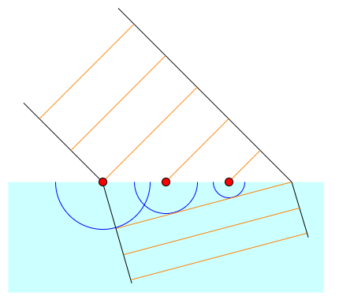

# 変分原理

## 本章で学ぶこと

ニュートン力学では、ニュートンの運動方程式が出発点であり、「その運動方程式はどこから来たか」に答えることができなかった。しかし、解析力学では、最小作用の原理から運動方程式を導く。これにより、運動方程式よりも一歩引いた立場から運動を記述、理解できるようになる。最小作用の原理は、変分原理と呼ばれるものの一種である。以下では、変分原理の例としてスネルの法則、最速降下曲線、懸垂線について紹介し、これらを一般的に扱うために汎関数微分を導入する。特に、関数の微分を含む汎関数の汎関数微分が解析力学のキモとなるので、しっかり理解して欲しい。

## 変分問題

我々は、何らかの制約のなかで、何かを最小化したり最大化したりしたいことがよくある。例えばレストランでご飯を注文する際、許される予算、およびカロリー上限の中で、もっとも食べたいものを選ぶであろう。このような問題を最適化問題と呼ぶ。最適化問題には様々なものがあるが、その中に「選べる選択肢が連続的な場合」がある。山を登る時、山の入口から山頂まで様々な道がある。傾きがきつい道ほど疲れやすいが登山時間は短くて済み、傾きが緩い道は楽だが登山時間が長くなる。この時、もっとも疲れずに登るためのルートはどのように決めれば良いか、といった問題が典型例である。この時、我々は「疲労度」という実数値を最小化するように「登山ルート」という連続的な経路を決める必要がある。このように連続的な自由度についての最適化問題を変分問題、変分問題を解く方法を変分法と呼ぶ。以下では、変分問題とその解法について説明する。

### スネルの法則

まずは簡単な例からはじめよう。A地点からB地点まで行きたいとする。ただし、A地点付近は草原で歩きやすく、B地点は歩きにくい沼地の中にある。草原と沼地が直線で接しており、A地点、$B$地点から境界までの距離はそれぞれ$h_A$、$h_B$、A地点とB地点の横方向の距離は$L$であるとする。A地点からB地点まで最短で到達できる経路はどのようになるか？

草原の中、沼地の中など、歩きやすさが同じところでは、経路は直線となるであろう。従って、草原と沼地の境界にX地点をとり、その最適な場所を探すことを考える。なるべく草原を多く歩いたほうが得なのでAXを長くとりたいが、AXを長く取りすぎると全体としての経路が伸びてしまうために時間もかかる。どこかにちょうどよい点があるはずである。

この問題を考えるため、直線AXの長さを$l_A$、XBの長さを$l_B$とする。草原を歩く時の速度を$v_A$、沼地を歩く時の速度を$v_B$とする($v_A>v_B$)。A地点からX地点までの水平方向の距離を$x$とすると、X地点からB地点までの水平方向の距離は$L-x$となる。また、A地点、B地点から境界までの最短距離をそれぞれ$h_A$、$h_B$としよう。

全体を歩くのにかかる時間$T(x)$は

$$
T(x) = \frac{l_A}{v_A} + \frac{l_B}{v_B}
$$

ただし、

$$
\begin{aligned}
l_A(x) &= \sqrt{h_A^2 + x^2} \\
l_B(x) &= \sqrt{h_B^2 + (L-x)^2} \\
\end{aligned}
$$

$T(x)$を最小化する$x$は$T'(x) = 0$を満たすはずであるから、

$$
\begin{aligned}
l_A'(x) &= \frac{x}{\sqrt{h_A^2 + x^2}} = \frac{x}{l_A} \\
l_B'(x) &= \frac{-x}{\sqrt{h_B^2 + (L-x)^2}} = -\frac{L-x}{l_B}\\
\end{aligned}
$$

に注意すると、

$$
T'(x) = \frac{x}{l_A v_A} - \frac{L-x}{l_B v_B} = 0
$$

ここで、境界の法線に対して直線AX、XBのなす角をそれぞれ$\theta_A$、$\theta_B$とすると、三角関数の定義から、

$$
\begin{aligned}
\sin \theta_A &= \frac{x}{l_A} \\
\sin \theta_B &= \frac{L-x}{l_B} \\
\end{aligned}
$$

これを用いて先程の式を書き直すと、

$$
\frac{\sin \theta_A}{v_A} = \frac{\sin \theta_B}{v_B}
$$

これは、光線が平面に入射した場合、入射角と出射角(屈折角)と、その媒質中における光速との関係を表すスネルの法則にほかならない。

スネルの法則は、ホイヘンスの原理によっても説明できる。ホイヘンスの原理は、波の波面から二次波とよばれる新しい波が生じ、それらが強めあうところが次の波面となる、というもので、こちらはミクロな立場から屈折を説明する。

一方、我々が求めたのは、「始点と終点が指定されている時、最も到達時間が短くなる経路」であり、これは変分問題の最も簡単な例となっている。光の場合、到達時間ではなく光路長を考えるのが一般的である。媒質中の光は真空中よりも速度が遅くなる。そこで、真空中での光速を媒質中の光速で割ったものを、その媒質の屈折率と呼ぶ。真空中での光速を$c$とすると、屈折率$n_A$を持つ媒質Aの中での速度$v_A$は、屈折率の定義から

$$
v_A = \frac{c}{n_A}
$$

となる。これを用いると、A地点からB地点への光の到達時間$T$は

$$
T = \frac{n_A l_A + n_B l_B}{c}
$$

となる。すなわち、実際の長さ$l_A$に対して、光が感じる実効的な長さは$n_A l_A$となっている。屈折率が大きい媒質であるほど光の速度は遅くなるため、光にとってその媒質は「進みにくい」物質となる。つまり、屈折率が大きいほど、光は実際の長さよりも長く感じることになる。この、実際の長さに屈折率をかけたものを光路長と呼び、光は光路長の総和を最小(停留)にするような経路を進む。これをフェルマーの原理と呼ぶ。

もちろん光には意思はないため、異なる媒質に入射する前に「なるべく光路長を短くする経路を選ぼう」などとは思っていない。しかし、最終的に光が通った経路を見ると、それは始点と終点を決めた時に、もっとも光路長が短くなるように選ばれている。これを原理として採用し、何かの総和が最も小さくなるように運動の経路が決まると主張するのが **変分原理(variational principle)** である。フェルマーの原理は変分原理の一種である。

ホイヘンスの原理が、ある瞬間の光の振る舞いに着目し、次の瞬間の光の位置を逐次的に決めていく、いわば局所的な原理であるのに対して、フェルマーの原理は全体を見渡し、光の経路を一度に決めてしまう大域的な原理である。このように、変分原理は全体を俯瞰する立場から振る舞いを決定する見方を与える。

## 最速降下曲線

変分原理の有名な例として、最速降下曲線を考えよう。斜面に質点をそっと置いて離し、重力により滑らせる。ただし、摩擦は無視できるものとする。質点は斜面から離れることなく、なめらかに滑るとしよう。スタート地点とゴール地点を固定する時、もっとも早くゴールするような斜面はどのような形状であるか求めよ、というものが最速降下曲線の問題である。この問題はベルヌーイが解いて、数学者への挑戦という形で出題された。しばらく誰も解くことができなかったが、ニュートンがこれを一晩で解いて返送し、ベルヌーイが悔しがった、というのは有名な話である。

問題を解くため、まず座標軸を設定しよう。質点を置く場所を原点にとる。最速降下曲線は下に落下していく問題だが、重力の働く方向を$y$軸の正の向きにとる。

さて、最速降下「曲線」というくらいだから答えは曲線となるのだが、これを折れ線で近似しよう。

運動の始点を原点にとり、終点を$(L, H)$の場所に取ろう。$L$を$N$等分し、左から$k$番目の場所を$x_k$とする。位置$x_k$から$x_{k+1}$までは速度が一定であると近似し、その速度を$v_k$としよう。

位置$x_k$における斜面の位置を$y_k$とすると、エネルギー保存則より

$$
\frac{1}{2} m{v_k}^2 = mgy_k
$$

が成り立つ。従って、

$$
v(x_k) = \sqrt{2gy_k}
$$

また、位置$x_k$から$x+\Delta x$における曲線の長さ$l(x_k)$は

$$
\begin{aligned}
l(x_k) &=\sqrt{\Delta x^2 + (y_{k+1} - y_k)^2} \\
&\sim \Delta x \sqrt{1 + (y'_k)^2} \\
\end{aligned}
$$

ただし、$y_{k+1} - y_k = y(x_k+\Delta x) - y(x_k) = y'_k \Delta x + O(\Delta x^2)$を用いた。

かかる時間の総和は

$$
T = \sum_{k=0}^{N-1} \frac{l(x_k)}{v(x_k)} \Delta x
$$

であるから、$N$に関して連続極限をとれば、

$$
\begin{aligned}
T &= \int_0^L \frac{l(x)}{v(x)} dx \\
&= \int_0^L \frac{\sqrt{1+y'^2}}{\sqrt{2gy}} dx
\end{aligned}
$$

関数$y(x)$は、スカラー量を入力とし、スカラー量を返すものであった。先程の$T$は関数$y(x)$を入力とし、出力としてスカラー量が決まるため、「関数の関数」とみなすことができる。それを表現して$T[y]$と書くことがある。境界条件のもとで$T[y]$を最小とするような関数$y(x)$を見つけよ、というのが最速降下曲線問題である。

この問題を、汎関数微分を用いて解くというのが本章の目的だが、まずは物理的な考察で解いてみよう。曲線を折れ線で近似した状態を考える。$x_{k-1}$から$x_k$までの領域の速度は$v_{k-1}$であり、$x_k$から$x_{k+1}$までの速度が$v_k$であるから、入射角$\theta_{k-1}$と出射角$\theta_k$を定義するとスネルの法則と同じ議論により

$$
\frac{\sin \theta_{k-1}}{v_{k-1}} = \frac{\sin \theta_k}{v_k}
$$

連続極限をとると、

$$
\frac{\sin \theta}{v} = C
$$

が場所に依らず成り立つ。ただし$C$は定数である。傾きと三角関数の定義から

$$
\begin{aligned}
\frac{dy}{dx} &= \tan\left(\frac{\pi}{2} - \theta \right) \\
&= - \frac{\cos \theta}{\sin \theta} \\
&= - \frac{\sqrt{1-\sin^2 \theta}}{\sin \theta}
\end{aligned}
$$

$\sin \theta = v C = C \sqrt{2gy}$を代入して整理すると、

$$
\frac{dy}{dx} = - \sqrt{\frac{2a - y}{y}}
$$

となる。ただし$a = 1/(4gC^2)$である。これを真面目に解いてみよう。

$y = 2au$と変数変換すると、

$$
\frac{du}{dx} = - \frac{1}{2a} \sqrt{\frac{1-u}{u}}
$$

さらに

$$
\tan \frac{s}{2} = \sqrt{\frac{u}{1-u}}
$$

と変数変換すると、半角公式

$$
\tan^2 \frac{s}{2} = \frac{1 - \cos s}{1  + \cos s}
$$

を用いて、ただちに

$$
u = \frac{1 + \cos s}{2}
$$

と求まる。両辺を微分すると

$$
\begin{aligned}
du &= - \frac{\sin s}{2} ds \\
&= - \sin \frac{s}{2} \cos \frac{s}{2} ds
\end{aligned}
$$

$$
du = - \frac{1}{2a} \frac{\cos \frac{s}{2}}{\sin \frac{s}{2}} dx
$$

であったから、$du$を消去して、

$$
\begin{aligned}
dx &= 2a \sin^2 \frac{s}{2} ds \\
&= a (1 - \cos s) ds
\end{aligned}
$$

両辺積分すると、

$$
x = a (x-\sin s)
$$

$y$と合わせて、以下の媒介変数表示での解を得る。

$$
\begin{aligned}
x &= a (s-\cos s) \\
y &= a (1 + \cos s) \\
\end{aligned}
$$

これはサイクロイド曲線を表現している。

## 汎関数微分

ある関数$f(x)$を考える。引数である$x$は複素数でもベクトルでもよいが、簡単のためスカラーで実数であるものとする。関数$f(x)$とは、実数$x$を入力すると、対応する実数$f(x)$を返してくれるものだ。すなわち、実数に実数を対応付ける写像になっている。一方、関数に実数を対応づける写像を **汎関数(functional)** と呼ぶ。様々な汎関数があり得るが、力学においては以下のような定積分として現れる。

$$
I[f] = \int_a^b f(x) dx
$$

積分範囲 $(a,b)$ を固定すると、$F$は関数に実数を対応付けるため汎関数になっていることがわかる。例えば引数として$f(x) = x$を代入すると

$$
\begin{aligned}
I[x] &= \int_a^b x dx\\
&= \left[\frac{x^2}{2}\right]_a^b\\
&= \frac{b^2-a^2}{2}
\end{aligned}
$$

となるし、$f(x) = \exp(x)$とすると、

$$
\begin{aligned}
I[\exp(x)] &= \int_a^b \mathrm{e}^x dx\\
&= \left[ \mathrm{e}^x \right]_a^b \\
&= \mathrm{e}^b - \mathrm{e}^a
\end{aligned}
$$

となる。このように汎関数とは、何かしら関数を放り込むと、対応する実数を返してくれるものだ。

さて、関数では、引数である実数が変化すると値が変化するのであった。汎関数では、関数の形が変わると値が変わる。関数の形がほんの少しだけ変化したとき、値がどのように変化するかを調べるのが汎関数微分である。

まず、通常の微分について考えよう。関数$f(x)$が、微小量$\varepsilon$を用いて

$$
f(x+\varepsilon) = f(x) + \frac{df}{dx} \varepsilon + O(\varepsilon^2)
$$

のように表すことができる時、$df/dx$を$f(x)$の微分と呼ぶのであった。

同様に、汎関数の微分について考えよう。関数$f(x)$に対して、何か適当な関数$\phi(x)$を考える。ただし関数$\phi(x)$は、積分の端点でゼロ、すなわち$\phi(a) = \phi(b) = 0$を満たすように選ぶ。その理由は後に説明する。$\varepsilon$を微小量として

$$
I[f+\varepsilon \phi] = I[f] +  \varepsilon \int_a^b \frac{\delta I}{\delta f}  \phi(x) dx  + O(\varepsilon^2)
$$

と表せる時、$\delta I/\delta f$を、$I$の **汎関数微分(functional derivative)** 、もしくは第一変分と呼ぶ。

解析力学では、汎関数の積分の中に関数の関数、すなわち合成関数が入ることが多い。そこで、以下のような式を考える。

$$
I[f] = \int_a^b F(f(x)) dx
$$

$F(x)$は普通の関数である。例えば $F(x) = x^2$であるならば、$I[f]$は、「関数$f(x)$の自乗を$a < x < b$で積分した値を返しなさい」という意味になる。ここで、関数 $f(x)$を微小量$\varepsilon$ を用いて $f(x) + \varepsilon \phi(x)$と変化させた時、$I$がどのように変化するか見てみよう。

$$
I[f + \varepsilon \phi] = \int_a^b F(f(x)+ \varepsilon \phi(x) ) dx
$$

ここで、ある$x$を固定すると、$f(x)$や$\phi(x)$は単なる値になるから $\varepsilon \phi(x)$をまとめて微小量とみなして良い。そこで

$$
F(f(x) + \varepsilon \phi(x)) = F(f(x)) + F'(f(x)) \varepsilon \phi(x) + O(\varepsilon^2)
$$

とできる。元の積分に代入すると、

$$
\begin{aligned}
I[f + \varepsilon \phi] &= \int_a^b F(f(x)+ \varepsilon \phi(x) ) dx \\
&= \underbrace{\int_a^b F[f(x)] dx}_{I[f]} + \varepsilon \int_a^b F'[f(x)]\phi(x) dx +O(\varepsilon^2) \\
&= I[f] + \varepsilon \int_a^b F'[f(x)]\phi(x) dx +O(\varepsilon^2)
\end{aligned}
$$

汎関数微分の定義から、

$$
\frac{\delta I}{\delta f} = F'[f(x)]
$$

となる。$\varepsilon \phi(x)$を、改めて $\delta f(x)$と表記しよう。ここで、これは$\delta$と$f(x)$の積ではなく、$\delta f$という一つの関数であることに注意。すると、

$$
\underbrace{I[f + \delta f]  - I[f]}_{\delta I} = \int_a^b F'[f(x)]\delta f dx + O(\varepsilon^2)
$$

ここで左辺を$\delta I$と書いて、$\varepsilon^2$のオーダーの項を無視すると、以下のように表記できる。

$$
\delta I = \int_a^b F'[f(x)]\delta f dx
$$

これは、関数の全微分

$$
df = f' dx
$$

の汎関数版である。

要するに汎関数微分とは、積分の中の合成関数$F[f]$を、$f$を変数とみなして微分しろ、ということである。

さて、解析力学では汎関数の中の積分の合成関数$F$が、関数$f(x)$と、その微分$f'(x)$に依存することが多い。すなわち、

$$
I[f] = \int_a^b F(f(x), f'(x)) dx
$$

という形を考えることが多い。その場合に汎関数微分がどうなるかを見ておこう。解析力学は変分原理に立脚しており、その変分原理の心臓部分が関数の微分を含む汎関数の微分であるため、ここが解析力学で最も重要なパートである。しっかりついてきて欲しい。

まず、二変数関数$F(f,g)$を考える。関数$Fの全微分は

$$
dF = \frac{\partial F}{\partial f} df +\frac{\partial F}{\partial g} dg
$$

で与えられる。

さて、この引数$f$、$g$がそれぞれ$x$の関数であるとしよう。この関数$F$を$a < x < b$の範囲で積分した量を$I$とすると

$$
I = \int_a^b F(f(x), g(x)) dx
$$

である。ここで、汎関数微分を行おう。$f \rightarrow f + \delta f$、$g \rightarrow g + \delta g$と変化した時、$I \rightarrow I + \delta I$と変化したならば、

$$
\delta I = \int_a^b \left(\frac{\partial F}{\partial f} \delta f(x) +  \frac{\partial F}{\partial g} \delta g(x)   \right) dx
$$

ここまでは、二変数関数$F(f, g)$における汎関数微分の一般論である。さて、ここで$f$と$g$が常に

$$
\frac{d f}{dx} = g
$$

という関係を満たすことを要請しよう。この関係を満たしつつ、$f \rightarrow f + \delta f$と変化し、その結果$g \rightarrow g + \delta g$と変化したとする。ただし、それぞれ積分範囲の端点でゼロ、すなわち$\delta f(a) =\delta f(b) = \delta g(a) = \delta g(b)=0$を満たすように変化させる。変化後も微分の関係を満たさなければならないのだから、

$$
\frac{d}{dx} (f + \delta f) = g + \delta g
$$

もともと$g(x) = f'(x)$であったから、両辺から引くと

$$
\frac{d}{dx} (\delta f) = \delta g
$$

となる。これを先程の汎関数微分の式に代入すると

$$
\begin{aligned}
\delta I &= \int_a^b \left(\frac{\partial F}{\partial f} \delta f +  \frac{\partial F}{\partial g} \frac{d}{dx}(\delta f)   \right) dx \\
&= \int_a^b \frac{\partial F}{\partial f} \delta f dx
+ \left[\frac{\partial F}{\partial g} \delta f \right]_a^b
- \int_a^b \frac{d}{dx}\left(\frac{\partial F}{\partial g}\right) \delta f dx\\
&= \int_a^b \left( \frac{\partial F}{\partial f} - \frac{d}{dx} \left(\frac{\partial F}{\partial g} \right)\right) \delta f dx
\end{aligned}
$$

最後に、$g=f'$であるから、$g$での偏微分を$f'$での偏微分で表すと

$$
\delta I = \int_a^b \left( \frac{\partial F}{\partial f} - \frac{d}{dx} \left(\frac{\partial F}{\partial f'} \right)\right) \delta f dx
$$

これが、関数と関数の導関数に依存する汎関数

$$
I[f] = \int_a^b F(f(x), f'(x)) dx
$$

の汎関数微分となる。後の便利のために

$$
\delta F \equiv  \frac{\partial F}{\partial f} - \frac{d}{dx} \left(\frac{\partial F}{\partial f'} \right)
$$

と表記すると、

$$
\delta I = \int_a^b \delta F \delta x
$$

と表すことができる。

## 変分法

### 最速降下曲線再び

汎関数微分の導入が終わったので、これを用いて最速降下曲線の問題をもう一度考えよう。我々は、関数$y(x)$を与えると、通過時間$T$を与える以下の関係式を得たのであった。

$$
T[y] = \int_0^L \frac{\sqrt{1+y'^2}}{\sqrt{2gy}} dx
$$

積分の中身を、$y(x)$と$y'(x)$の関数$F(y, y')$とみなすと、

$$
T[y] = \int_0^L F(y,y') dx
$$

と書くことができる。この時、

$$
F(y,y') = \frac{\sqrt{1+y'^2}}{\sqrt{2gy}}
$$

である。

この$T$を最小化するような$y(x)$を求めなさい、というのが変分問題である。これは汎関数の問題であるが、まずは関数で考えてみよう。

ある関数$y(x)$があり、その最小値を与えるような$x_0$を探したいとする。もしそのような$x_0$を見つけたならば、そこからどのようにずれても$f(x)$の値は増えるはずだ。従って、関数$f(x)$は$x=x_0$で極値を取る。いま、$x_0$から少しずれた値$x_0 + \delta x$に変化させた場合、$f(x)$の値が$\delta f$だけ変化したとすると、

$$
\begin{aligned}
\delta f &\equiv f(x_0+\delta x) - f(x_0) \\
&= \frac{df}{dx} \delta x  + O(\delta x^2)
\end{aligned}
$$

$f(x)$は$x=x_0$で極値を取るのであるから、$df/dx=0$でなくてはならない。これは、どのような微小量$\delta x$をとってきても、その一次のオーダーで$f(x)$の値が変わらないことを意味する。

同様な議論を汎関数微分で考えよう。いま、$T$を最小にするような$y(x)$が選ばれたとしよう。すると、そこからどのように$y(x)$を変化させても、$T$は増えるはずだ。すなわち、$y \rightarrow y + \delta y$という変化に対して、$T \rightarrow T+ \delta T$と変化するなら、

$$
\delta T = \int_0^a \delta F \delta y  + O(\delta y^2)
$$

どのような$\delta y$に対しても一次のオーダーで$T$が変わらない、すなわち$\delta T =0$になるのであるから、

$$
\delta F = 0
$$

が成り立たなければならない。$F$が$y$と$y'$の関数である時、

$$
\delta F \equiv \frac{\partial F}{\partial y} - \frac{d}{dx} \left(\frac{\partial F}{\partial y'} \right)
$$

が成り立つのであるから、$F(y,y') = \sqrt{1+y'^2}/\sqrt{2gy}$ を代入して整理すると、計算は面倒だが最終的に幾何学的な考察から得られた微分方程式、

$$
\frac{dy}{dx} = - \sqrt{\frac{2a - y}{y}}
$$

を得る。あとは同じである。

以下は覚える必要はないが、参考のために導出方法を記載しておく。

TODO:ベルトラミの公式を使う

### 停留条件

いま、静止している物体に働く力が釣り合っているとする。すなわち、その物体の位置$x$において、力$F(x)=0$である。この時、物体の位置$x$を少しずらした時にどうなるかは、$x$まわりの$F(x)$の関数系による。

TODO: 磁石の絵

例えば、磁石のS極とN極の間に、小さな磁石があり、力が釣り合っているとしよう。

TODO: 関数の図解

$ 0 \le x \le 1$で定義された以下の関数を考える。

$$
f(x) = 6 x^3 - 9x^2 + 4x
$$

この関数は以下の点において最大値、最小値、極大値、極小値を取る。

* $x=0$ において最小値 $f(0)=0$
* $x=1/3$ において極大値 $f(1/3)=5/9$
* $x=2/3$ において極小値 $f(2/3)=4/9$
* $x=1$ において最大値 $f(1)=0$

このうち、$f'(x) = 0$となるのは、極小値と極大値を取る点のみである。

## 変分原理

## 懸垂線

変分原理の題材のもう一つの例として、懸垂線を挙げよう。一様な重力下で紐の両端を持ち、少し緩める。この時、紐はどのような形になるであろうか。

TODO: 力の釣り合い

これは電信柱の間の電線が作る形状でもある。

## オイラー・ラグランジュ方程式
