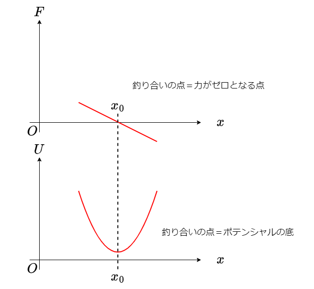

# 仮想仕事の原理

ここまで長い間準備をしてきたが、いよいよ解析力学に入る。解析力学の目的は、同じ現象を異なる観点から記述することだ。その第一歩が仮想仕事の原理である。ニュートン力学では、力という直接目に見えるものを、ポテンシャルという目に見えないものから導出されるものとして記述した。仮想仕事の原理では、力の釣り合いという静力学を仮想仕事という観点から記述する。これは後にダランベールの原理を用いて動力学へ拡張され、変分原理によりラグランジュ形式の力学へと繋がっていく。また、拘束力について学び、実際の空間の自由度と運動の自由度が一致しないこと、

## 仕事

仮想仕事について学ぶ前に、仕事について復習しておこう。物体に力$F$が働き、力と同じ方向に距離$x$だけ移動したとする。この時、その積$W=Fx$を **仕事(work)** と呼ぶ。物体は、受けた仕事の分だけエネルギーを得る。以下ではそれを見てみよう。

保存力のみが働いている系では、エネルギーが保存しているのであった。今、保存力$F$の他に、外部からの力$F_\mathrm{ex}$が働いているとする。運動方程式は以下のように書ける。

$$
m\frac{dx^2}{dt^2} = F + F_\mathrm{ex}.
$$

保存力だけ左辺に移項しよう。

$$
m\frac{dx^2}{dt^2} -F = F_\mathrm{ex}.
$$

$F$は保存力であるから、あるポテンシャル関数$U(x)$が存在し、$F=-U'(x)$と表現できる。

$$
m\frac{dx^2}{dt^2} + U'(x) = F_\mathrm{ex}.
$$

両辺を$x$で積分する。積分範囲は$x_\mathrm{i}$から$x_\mathrm{f}$までとしよう。

$$
\int_{x_\mathrm{i}}^{x_\mathrm{f}} \left(m\frac{dx^2}{dt^2}\right)dx + \int_{x_\mathrm{i}}^{x_\mathrm{f}} U'(x)dx = \int_{x_\mathrm{i}}^{x_\mathrm{f}}F_\mathrm{ex} dx.
$$

ここで

$$
\begin{aligned}
m \frac{dx^2}{dt^2} &= m \frac{dv}{dt} \\
&= m \frac{dv}{dx} \underbrace{\frac{dx}{dt}}_{v} \\
&= m v \frac{dv}{dx} \\
&= \frac{d}{dx}\left( \frac{1}{2}mv^2\right)
\end{aligned}
$$

従って、全エネルギーを

$$
E(x) = \frac{1}{2}mv^2 + U
$$

により定義すると、

$$
\int_{x_\mathrm{i}}^{x_\mathrm{f}} \frac{dE}{dx} dx = \int_{x_\mathrm{i}}^{x_\mathrm{f}}F_\mathrm{ex} dx
$$

つまり、

$$
\Delta E \equiv E(x_\mathrm{f}) - E(x_\mathrm{i}) = \int_{x_\mathrm{i}}^{x_\mathrm{f}}F_\mathrm{ex} dx
$$

となった。左辺は、物体のエネルギーの変化を表している。ここで、右辺の量を

$$
W \equiv \int_{x_\mathrm{i}}^{x_\mathrm{f}}F_\mathrm{ex} dx
$$

と定義すると

$$
\Delta E = W.
$$

つまり、物体のエネルギーの変化$\Delta E$は、物体にかかる外力の距離に関する積分$W$だけ変化する。この$W$を仕事と呼ぶ。

いくつか簡単な例を挙げよう。

まず、物体が平面上に静止した状態から、一定の力$F_\mathrm{ex}$をかけ続けて距離$l$だけ運動させた結果、速度が$V$になったとしよう。運動方程式は

$$
m \frac{d^2 x}{dt^2} = F_\mathrm{ex}
$$

両辺を$x$で積分すると、

$$
\int_0^l m \frac{d^2 x}{dt^2}dx = F_\mathrm{ex} l
$$

左辺は

$$
\begin{aligned}
\int_0^l m \frac{d^2 x}{dt^2}dx &= \int_0^l \frac{d}{dx} \left(\frac{1}{2}mv^2 \right) dx \\
&= \left[ \frac{1}{2}mv^2 \right]_0^l\\
&= \frac{1}{2}mV^2
\end{aligned}
$$

つまり、

$$
F_\mathrm{ex} l = \frac{1}{2}mV^2
$$

であり、外からした仕事が運動エネルギーに変換されたことがわかる。

TODO:図解

次に、バネ定数$k$のバネにつながれた物体を、釣り合いの位置で静止した状態から距離$l$だけ正の方向に引っ張り、最後に静止させるような操作を考える。運動方程式は以下で与えられる。

$$
m \frac{d^2 x}{dt^2} = -kx + F_\mathrm{ex}.
$$

両辺を$0$から$l$まで$x$で積分すると、

$$
\left[\frac{1}{2}mv^2 + \frac{1}{2}kx^2 \right]_0^l = \int_0^l F_\mathrm{ex} dx \equiv W
$$

物体は最初と最後は静止していたのであるから$v=0$なので

$$
\frac{1}{2}kx^2 = W.
$$

要するに、与えられた仕事が位置エネルギーに変換されたことがわかる。ここで、物体をひっぱっている途中がどういう運動であったかを全く議論していないことに注意してほしい。早くひっぱろうが、ゆっくりひっぱろうが、最初と最後に物体が静止しているのであれば、蓄えられたエネルギーも、物体になされた仕事も同じである。

ここまで当たり前だと思うかもしれないが、実はこれは非自明なことである。運動方程式は微分方程式であり、ある瞬間の運動を記述している。運動方程式を積分することで、次の瞬間の運動が決まり、その時の運動方程式によりさらにその次の運動が……と、微分方程式とは逐次的な性質を持っている。にもかかわらず、微分方程式をうまく積分してやることで、運動の途中は全く無視して、最初と最後の状態だけから運動を記述することができている。今後、解析力学ではこのような考え方を押し進めていく。また、運動方程式は一般にベクトルを扱う必要があるが、エネルギーや仕事はスカラー量であるために、より扱いやすいという利点もある。

最後に、力が仕事をしない例を挙げて置こう。摩擦が無視できる平面上のある点に、長さ$l$の紐の一方を固定し、もう一方の紐を質量$m$の質点につける。紐がたるまないようにした状態で、質点に紐と直交する向きに初速$v$を与えよう。すると、質点は円運動を行うであろう。運動の第一法則から、物体は力が加わっていないのであれば等速直線運動をするのであった。この質点には紐による張力が働いているため、質点には常に紐にひっぱられる方向に加速度が働いている。その張力$T$の大きさは遠心力と同じであり、

$$
T = m\frac{v^2}{l}
$$

で与えられる。運動中、質点には張力がかかり続けている。しかし、その力は常に運動の方向と直交しているため、張力は仕事をせず、質点の運動エネルギーは変化しない。この張力は「質点と運動の中心の距離を$l$に保つ」という運動の制約を実現するために働いていると考えることができる。このような制約を実現する力を拘束力と呼び、力学で扱う拘束力は仕事をしないことが多い。

## 仮想仕事の原理

物体に働く力が釣り合っている状態を考える。物体に力の総和が位置の関数$F(x)$として与えられているとしよう。例えば、バネにぶら下げられた物体において、バネによる上向きの力と重力による下向きの力が釣り合っている状態などである。この釣り合いの位置を$x_0$すると、

$$
F(x_0) = 0
$$

である。この力を表すポテンシャル関数を$U(x)$としよう。ポテンシャル関数を微分し、負符号をつけたものが力であった。

$$
F(x) = -U'(x)
$$

釣り合いの位置近傍において、ポテンシャル関数をテイラー展開しよう。

$$
U(x_0+\delta x) = U(x_0) + U'(x_0)\delta x +U''(x)\frac{\delta x^2}{2} + O(\delta x^3)
$$

釣り合いの位置では力がゼロであるから、

$$
U'(x_0)\delta x = -F(x_0) \delta x = 0
$$

となる。ここで、$F(x_0) \delta x$は力と距離の積であるから、仕事の次元を持っている。そこで、

$$
W = F(x_0) \delta x
$$

とし、$W$を **仮想仕事(virtual work)** 、$\delta x$を **仮想変位(virtual displacement** と呼ぶ。定義から、力の釣り合いの近傍では仮想変位によりなされる仕事はゼロとなる。これを **仮想仕事の原理 (principle of virtual work)** と呼ぶ。

力の釣り合いの点$x_0$とは、その位置において力の総和がゼロとなるような点、すなわち$F(x_0)=0$が満たされる点のことである。仮想仕事の原理では、力の代わりにポテンシャル関数を考え、釣り合いの点とはポテンシャルの極値を与えるような点であるとみなす。これは、静力学を、釣り合いの点だけを考えている立場から、もう少し広い立場で考えていることに対応する。

例えば、光が屈折率の異なる媒質に入射すると屈折するという観測事実がスネルの法則である。この法則をミクロな立場から、波面の重ね合わせで説明するのがホイヘンスの原理である。しかし、光線の始点と終点を与えた時、光線は最も光路長が短くなる経路を選ぶという説明がフェルマーの原理である。どちらも同じ現象を説明する原理であるが、後者は、まるで光がこれから進もうとする世界を全て知った上で計画的に経路を選んでいるかのように解釈する。

仮想仕事の原理も同様であり、力という量に対して、それを位置で積分したポテンシャルという量を考え、「釣り合いの位置にいる」という条件を「力がゼロであるような位置にいる」という条件から「ポテンシャルを最小にするような位置にいる」という条件に読み替える。すると、物体が感じているのはその場における力だけであるにも関わらず、位置の関数であるポテンシャルをより広い範囲で「知って」おり、その極小値を取るような場所を選んでいるかのように扱う。この立場をさらに発展させ、動力学に拡張したのが次回で学ぶハミルトンの原理である。

## 拘束条件と一般化座標

仮想仕事の原理を考える理由は大きく分けて二つある。一つはダランベールの原理を通じて動力学へと拡張され、ラグランジュ形式、ハミルトン形式の力学へとつながる道を拓くことである。もう一つは、条件が複雑である場合に計算が楽になることだ。仕事はスカラー量であるから、ベクトル量である力を考えるよりも計算が楽になることは既に述べた。さらに、系に拘束条件がある場合、仮想仕事の原理を用いると定式化がすっきりする。以下では、拘束条件がある場合について考えよう。

3次元空間中に$N$個の質点がある時、この質点の場所は$3N$個の座標で記述できる。また、2次元空間に剛体がある場合、座標と向き、合わせて$3$つの座標で記述できる。このように系の位置や姿勢をまとめて **配位(configuraiton)** と呼ぶ。そして、系の配置を一意に指定できる変数の数を **自由度(degree of freedom)** と呼ぶ。3次元空間中のN個の質点の座標が独立であれば、この系の自由度は$3N$である。一方、座標が独立ではなく、その関係になんらかの制約がある場合も多い。例えば、二次元空間上に質点が一つあれば、その座標は$(x,y)$の二つで表現できるから自由度は2である。しかし、この質点が空間中の一点と長さ$l$の硬い棒で繋がっており、硬い棒は自由に回転できる状態であるとする(剛体振り子)。固定されている点を原点にとると、常に

$$
x^2 + y^2 = l^2
$$

が成立した状態でしか運動ができない。すると、自由度が一つ減るために、この系の自由度は$2-1=1$となる。このように、系の配位を表す変数間に課される制約を **拘束条件(constraints)** もしくは束縛条件と呼ぶ。

一般に、$N$個の座標 $(x^1,x^2, \cdots, x^N)$ で記述される系を考えよう。この座標間の拘束条件が

$$
g(x^1,x^2, \cdots, x^N) = 0
$$

のように、座標間の関係のみで表される時、これを **ホロノミックな拘束(holonomic constraints)** と呼ぶ。先程の剛体振り子の例では

$$
g(x,y) = x^2 + y^2 - l^2
$$

である。拘束は複数あっても良い。例えば、長さ$l$の剛体振り子の先に、もう一つ同じ長さ$l$の剛体振り子を繋げた二重振り子を考えよう。最初の質点の座標を$(x,y)$、2つ目の質点の座標を$(X, Y)$とすると、

$$
\begin{aligned}
x^2 + y^2 &=l^2 \\
(x-X)^2 + (y-Y)^2 &=l^2
\end{aligned}
$$

という二つの拘束条件が課せられる。もともと2次元に2つの質点があったから自由度は4であったが、拘束条件が2つあるから実質的な自由度は$4-2=2$となる。一般に、$N$個の座標で表現される系に、
$$
g_k(x^1,x^2, \cdots, x^N) = 0 \qquad (k=1,2,\cdots, f)
$$

のように$f$個の拘束条件が課された場合、この系の自由度は$N-f$で与えられる。

さて、力学で運動方程式と拘束条件を同時に考えるのは一般に煩雑である。そこで、最初から拘束条件を満たすような変数を使えば、扱う式が簡単になることが予想される。

実際、剛体振り子では、極座標

$$
\begin{aligned}
x &= l \cos \theta \\
y &= l \sin \theta \\
\end{aligned}
$$

とすることで、拘束条件$x^2+y^2 = l^2$が自動的に満たされている。すると、系の配位は$\theta$一つとなり、運動方程式は$\theta$に関する二回微分方程式となる。

同様に、多重振り子の場合も、二つの角度$\theta, \phi$で配位を決めることができるため、その変数だけで運動を記述したくなる。このように、系の配位を決めることができるパラメータを **一般化座標 (generalized coordinates)** と呼び、解析力学では$q^i$で表すことが多い。一般化座標は、必ずしも長さの次元を持たないことに注意したい。例えば振り子の$\theta$は一般化座標であるが、無次元量である。さらに、一般化座標は異なる次元を持つものが混ざることがある。例えば二次元空間内の剛体の棒の状態は中心座標$(x,y)$と向き$\theta$で決まるが、これらをまとめて $q^1, q^2, q^3$と書くと、$q^1$と$q^2$は長さの次元を持つが、$q^3$は無次元量である。

また、一般化座標$q^i$の時間微分$\dot{q}^i$を **一般化速度 (generalized velocity)** と呼ぶ。座標の場合と同様に、必ずしも速度の次元を持つとは限らない。

一般化座標が張る空間を **配位空間(configuraiton space)** と呼ぶ。一般に配位空間は、ユークリッド空間とならない。例えば剛体振り子の場合、一般化座標は$\theta$であり、$\theta$と$\theta + 2\pi$は同じ配位を示すから、$\theta$の住む空間は一次元トーラス、すなわち円である。円は、局所的に見れば直線とみなすことができ、一つのパラメータ、例えば$\theta$で一意に場所を指定できる。このように、局所的にユークリッド空間とみなすことができるような空間を **多様体(manifold)** と呼ぶ。一般に力学において配位空間は多様体となるが、通常の高次元ユークリッド空間に制約を加えることで得られることが多い。

一方、関係が不等式で与えられたり、速度や加速度など一般化座標の(高次)時間微分を含む場合を **非ホロノミックな拘束(nonholonomic constraints)** と呼ぶ。例えば自動車の運動などが典型的な非ホロノミック拘束である。自動車は地面に張り付いているため、二次元空間を移動する。また、向きの自由度もあるため、車の状態を一意に決めるためには、座標$(x,y)$と車の向きを表す角度$\theta$を指定する必要があるため、車の配位空間の次元、すなわち自由度は$3$である。一方、車は真横に動くことができず、その場で向きを変えることもできないなど、運動になんらかの制約がある。実際、車はほぼ一次元的にしか動くことができない。しかし、切り返しなどを駆使することで、車は配位空間の任意の状態を取ることができる。このように、拘束条件があるにも関わらず、自由度が減らないことがあるのが非ホロノミック拘束の特徴である。非ホロノミック拘束は興味深い話題が多いが、本書ではホロノミック拘束のみ扱う。

## 拘束力

系に拘束条件がある場合を考える。例えば、摩擦のない斜面にバネでぶら下がって静止している質量$m$の物体を考えよう。この物体に働く力は、バネからの力$F$、重力$mg$、そして斜面からの抗力$N$である。抗力$N$は、物体を斜面上に制限するように働くため、束縛力の一種である。

この物体に働く力の関係を、まずは仮想仕事を使わずに求めてみよう。斜面の角度を$\theta$とし、鉛直方向を$y$軸、水平方向を$x$軸にとると、運動方程式は

$$
\begin{aligned}
m\ddot{x} &= F \cos \theta - N\sin \theta \\
m\ddot{y} &= F \sin \theta + N \cos \theta - mg
\end{aligned}
$$

静止状態であれば$\ddot{x} = \ddot{y} = 0$である。これらの式から$N$を消去すると、

$$
F = mg \sin \theta
$$

という関係式が求まる。

次に、この式を仮想変位の観点から考えてみよう。物体は斜面をすべることしかできないから、その方向に$x$軸をとる。系は一次元的に運動するから、$y$軸は考える必要はない。

いま、物体を釣り合いの状態から斜面を登る方向に$\delta x$だけ仮想的に動かしたとする。すると、バネが物体にする仕事が$F\delta x$、重力の方向に下るため、重力が物体にする仕事は$-mg \sin \theta \delta x$。従って、この物体にされる仮想仕事$W$は

$$
\begin{aligned}
W &= F \delta x - mg \sin \theta \delta x \\
&= (F - mg \sin \theta) \delta x
\end{aligned}
$$

これがゼロであることから、ただちに

$$
F = mg \sin \theta
$$

という関係式が求まった。先程の運動方程式を経由する方法に比べて、抗力$N$が全く現れなかったことに注意したい。一般に、束縛力は仕事をしない。そして仮想変位は束縛条件を破らない方向にとるため、その向きは必ず束縛力と直交する。これにより、仮想仕事について考えれば、どうせ後で消去する束縛力を考慮せずに済む。

以上の話を一般化しよう。三次元空間中にある質点に力$\boldsymbol{F}_\mathrm{all}$が働いている。この質点の運動には何らかの拘束条件があるものとする。質点の位置を$\boldsymbol{r}$とすると、運動方程式は以下のように書ける。

$$
m \ddot{\boldsymbol{r}} = \boldsymbol{F}_\mathrm{all}
$$

今、力を拘束力$\boldsymbol{N}$と、それ以外の力$\boldsymbol{F}$に分けることができたとしよう。すると、

$$
m \ddot{\boldsymbol{r}} = \boldsymbol{F}+ \boldsymbol{N}
$$

さて、物体が静止しているとしよう。すると、力は釣り合っていなければならないから、

$$
\boldsymbol{F}+ \boldsymbol{N} = 0
$$

いま、拘束を破らないような仮想変位$\delta \boldsymbol{r}$を考え、両辺内積を取る。

$$
\boldsymbol{F} \cdot \delta \boldsymbol{r} + \boldsymbol{N} \cdot \delta \boldsymbol{r} = 0
$$

拘束力$N$は、拘束条件を破らないように働く力であるから、拘束条件を満たすように選ばれた仮想変位$\delta \boldsymbol{r}$とは直交している。すなわち、

$$
\boldsymbol{N} \cdot \delta \boldsymbol{r} = 0
$$

である。以上から、

$$
\boldsymbol{F} \cdot \delta \boldsymbol{r} = 0
$$

が成り立つ。この式は「静止している質点系において、拘束条件を破らないような変位(仮想変位)を考えた時、その変位に対する仕事(仮想仕事)はゼロとなる」ことを主張する。また逆に、仮想変位に伴う仮想仕事がゼロである時、この質点系に働く力は釣り合ってる。ここで、条件式に拘束力が登場しないことに注意したい。拘束条件を破らない限り拘束力は仕事をしないため、拘束力を陽に考えなくても良い。これが拘束条件のある系における仮想仕事の原理である。

## 仮想仕事の例

仮想仕事の原理を用いる例をいくつか挙げよう。

簡単な例の一つはてこである。今、重さが無視できる棒の左端に質量$M$、右端に質量$m$の質点がぶら下げられている。支点は、左端から$a$、右端から$b$の距離にある。重力加速度を$g$として、この系が釣り合う条件を求めたい。

まずはモーメントの定義から、ただちに

$$
Mga = mgb
$$

したがって、$Ma = mb$ が求める条件である。これを仮想仕事の原理で求めよう。そのためには、拘束条件を満たすような変位を考えなくてはならない。この系における拘束条件とは、てこが支点に支えられており、そこを中心に回転することしかできない、という制約である。そこで、その回転角を $\delta \theta$ としよう。回転を反時計回りの方向を正に取ると、左端の質点は$a \delta \theta$ だけ下がるため、$-Mg a \delta \theta$ だけ仕事をされる。重力と同じ向きに動いたからポテンシャルエネルギーが下がり、結果として仕事が負になっている。逆に、右端の質点は重力に逆らって $mg\delta \theta$ だけ上がるから、$mg b\delta \theta$ だけ仕事をされる。

系が釣り合っているのであれば、仮想仕事はゼロでなければならないので、

$$
W = -Mg a \delta \theta + mg\delta \theta = 0
$$

ここから先程と同じ条件式 $Ma = mb$が結論される。

てこの原理は簡単過ぎたので、拘束力を消去する例として動滑車を考えよう。図のように動滑車と定滑車を組み合わせ、動滑車に質量$M$、定滑車に質量$m$のおもりが吊り下げられいる。滑車や紐の重さを無視できる時、釣り合いの条件を求めたい。

この系における拘束条件は紐の長さが変わらないことであり、拘束力は紐の張力$T$である。それぞれの重りについての力の釣り合いを考えると、

$$
\begin{aligned}
2T &= Mg\\
T &= mg
\end{aligned}
$$

以上から、$M = 2m$ が結論される。仮想仕事の原理を用いると、 $m$ の重りを$\delta l$だけ引っ張ると、$M$ の重りが $\delta l /2$だけ上に動く。ここで、ひっぱることで紐の長さを変えない、すなわち拘束条件を破らないように仮想変位を選んでいることに注意。仮想仕事がゼロであることから

$$
W = Mg \frac{\delta l}{2} - mg \delta l = 0
$$

ここからやはり $M=2m$ が結論される。ここで、式に$T$が現れなかったことに注意したい。拘束力は仕事をしないので、拘束条件を満たすような変位を考えれば、拘束力は現れない。滑車やてこが複雑に組み合わされたような系では、張力を考えると計算が極めて面倒になる。最初から仮想仕事の原理を考えた方が早い。なお、中学受験などで、滑車の問題で横に線をひいて、横切った紐の数を数える方法を教わった人もいるであろう。実はこれは仮想仕事の原理を使っている。中学や高校で「そういうものだ」と教わった事実やテクニックの裏付けが、大学でようやくなされることが多い。

もう少し非自明な例として、壁に立てかけられた棒の釣り合いを考えよう。摩擦が無視できる壁に、質量 $m$ 、長さ $L$ の一様な剛体の棒が床からの角度$\theta$ で立てかけられている。この棒の下端を力 $F$ で水平に押すことで倒れないように支える時、$F$の大きさを求めたい。

棒が床に接している座標を $(x,0)$、壁に接している座標を$(0, y)$としよう。拘束条件は

$$
L^2 = x^2 + y^2
$$

で与えられる。両辺微分すると、

$$
L \delta L = x \delta x + y \delta y
$$

ここで、棒の長さは変わらないので$\delta L = 0$であるから

$$
\delta y = - \frac{x}{y}\delta x
$$

いま、力$F$で$\delta x$だけ棒を押すと、その分だけ$x$は減り、$y$は $\delta y$だけ増える。棒の中心は $(x/2, y/2)$であるから、これにより棒の重心は重力に逆らって $\delta y/2$だけ上に動く。棒になされる仕事全体は

$$
W = - F \delta x + mg \frac{\delta y}{2}
$$

$\delta x$と$\delta y$の関係式用いて$\delta y$を消去すると

$$
W = \left(-F + mg \frac{x}{2y} \right) \delta x
$$

これがゼロとなるのであるから

$$
F = \frac{mgx}{2y}
$$

$\theta$ を用いると、

$$
F = \frac{mg}{2 \tan \theta}
$$

これが求めたい関係式であった。ここでは仮想仕事の原理を用いたが、力の釣り合いだけで計算しようとすると、床や壁からの抗力を考える必要がある。これらの力は最終的に消去するのであるから、最初から現れない形で計算したほうが楽である。

最後に、この系の自由度について考察しておこう。剛体の棒の配置を一意に決めるには、中心座標 $(x,y)$ と棒の向き $\theta$ を決めれば良いため、この系の自由度は3、すなわち配位空間の次元は3となる。しかし、棒が床と壁に接しているという2つの拘束条件が課されているため、この系の自由度は $3-2=1$、すなわち1自由度系となっている。従って、この系の状態を一意に決めるのに、床からの角度$\theta$ただ一つで十分である。

## まとめ

仮想仕事の原理とは、言ってしまえばエネルギーの保存則に過ぎない。力が釣り合っているのであれば、釣り合いの位置から少し動いた時、それぞれの力がする仕事はキャンセルする。仮想仕事の原理を用いるメリットは、力はベクトルであるのに対して仕事はスカラー量であるから計算が楽になること、拘束力が陽に現れないことである。仮想仕事の原理は、複雑な拘束を扱う構造力学において特に威力を発揮する。

しかし、本書では仮想仕事の原理の計算上のメリットよりも、その意義を重視する。仮想仕事の原理は、「力が釣り合う点が釣り合いの点である」という局所的な視点から、「ポテンシャル関数の底を与えるような点が釣り合いの点である」という大域的な視点へ、物の見方を変えている。

もちろん物体は、予めポテンシャル関数の概形を見て「ここがポテンシャルの底だから、その場所にいよう」と考えて釣り合いの位置に移動しているわけではない。しかし、解析力学では、物体があたかもそのような意思をもって釣り合いの位置を探しているかのような考え方をする。この考え方は、後にダランベールの原理を通じて動力学へと拡張され、変分原理へと繋がっていく。

## 余談：雑草の名前

「世の中に雑草という名の草はない」という言葉がある。NHK朝の連続ドラマ「らんまん」のモデルとなった植物学者、牧野富太郎の言葉とされる。歩いてると、ふと道端にある雑草が目に止まったとしよう。普段気にもかけていなかったが、小さく可愛らしい青い花が気になり、スマートフォンで画像検索し、それが「オオイヌノフグリ」という名前の外来種であることを知る。牧野富太郎が、在来種のイヌノフグリに似ており、より大きいことから名付けた和名だそうだ。そして、「イヌノフグリ」が「犬の陰嚢」であることを知って、なんでこんな可愛らしい花にそんな名前をつけたのか、と思うかもしれない。さらに調べてみると、そもそもイヌノフグリは江戸時代の植物図鑑「草木図説」に記載がある、由緒正しい名前である。このように、道端の草一つとっても、そこにはストーリーがある。別に全ての雑草の名前を知る必要はない。ただ、オオイヌノフグリを知ったことで、他の雑草にも名前があり、それぞれになんらかの由来があるということが想像できるであろう。

「三角関数なんて日常生活では使わないのだから学んでも無駄だ」という話題を定期的に見かける。数学でサインやコサインを習った時、加法定理や倍角、半角公式といった大量の公式に辟易した人は多いであろう。ほとんどの人にとってそんな公式を日常使うことなどないのだから、なぜこんなものを学ばなければならないのか疑問に思うのも当然である。もちろん、三角関数は様々なところに顔を出す、非常に重要な概念であるから学ぶのであるが、それ以外にも学問には「世界を広げる」という重要な役割がある。

ニュートン力学で用は足りるのだから、解析力学を学ぶ必要などない。技術者でもなければ、電磁気学を学ぶ必要もないだろう。しかし、解析力学を学ぶと、バネにつながった質点が振動している様子を見て円運動を思い浮かべることができる。電磁気学を学ぶと、電子レンジ中ので飛び交う電磁波に思いを馳せたり、なぜ釣り人が偏光サングラスをしているのかが理解できたりする。それらを学ぶ前に比べて少しだけ世界が違って見える。多くの学問は日常生活に直結しないが、学んだあなたに、少しだけ異なる世界の見方を提供する。それはあなたの生活を少しだけ豊かにしてくれることであろう。
